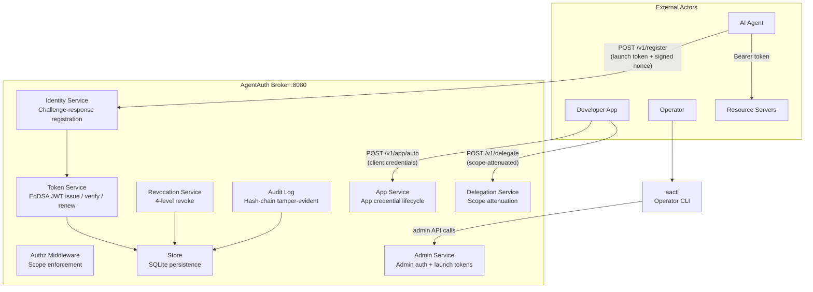

# AgentAuth

[](https://pkg.go.dev/github.com/devonartis/agentauth)
[](https://goreportcard.com/report/github.com/devonartis/agentauth)
[](https://www.gnu.org/licenses/agpl-3.0)
[](https://go.dev/)
[](https://docs.docker.com/compose/)
[](SECURITY.md)
[](https://ed25519.cr.yp.to/)
[](https://spiffe.io/)

**Ephemeral agent credentialing for AI systems.**

AgentAuth is a credential broker that issues short-lived, scope-attenuated tokens to AI agents. Each agent gets a unique [SPIFFE](https://spiffe.io/)-format identity and operates with only the permissions its task requires. Tokens are signed with Ed25519 (EdDSA), expire in minutes, and are revocable at four levels (token, agent, task, delegation chain). Every credential event is recorded in a tamper-evident audit trail.

AgentAuth implements the [Ephemeral Agent Credentialing](https://github.com/devonartis/AI-Security-Blueprints/blob/main/patterns/ephemeral-agent-credentialing/versions/v1.3.md) security pattern — an 8-component architecture purpose-built for autonomous AI agents.

---

## Why AgentAuth

Traditional identity systems (OAuth, AWS IAM, service accounts) were designed for long-lived services with persistent identities. AI agents break those assumptions: they are ephemeral, non-deterministic, and require task-specific permissions at runtime. Giving an agent a static API key means it has every permission the key grants for as long as the key exists. AgentAuth replaces that model: agents get short-lived tokens scoped to exactly one task, and those tokens are revoked the moment the task completes.

Read more: [Concepts: Why AgentAuth Exists](docs/concepts.md)

---

## Release Status

**Current release:** v2.0.0 — MVP Prototype (pattern validation release)

This release validates that AgentAuth is a working implementation of the target security pattern, ready for controlled demos, integration testing, and production hardening.

---

## Quick Start

Prerequisites: [Go 1.24+](https://go.dev/dl/), [Docker](https://docs.docker.com/get-docker/), and [Docker Compose](https://docs.docker.com/compose/install/).

### Option A: Docker Compose (recommended)

```bash
# 1. Clone and enter the repo
git clone https://github.com/devonartis/agentauth.git
cd agentauth

# 2. Set the admin secret (required — broker exits without it)
export AA_ADMIN_SECRET="$(openssl rand -base64 32)"

# 3. Start the broker
./scripts/stack_up.sh

# 4. Verify the broker is healthy
curl -s http://localhost:8080/v1/health | jq .
# {"status":"ok","version":"2.0.0","uptime":5,"db_connected":true,"audit_events_count":0}

# 5. Authenticate as admin and get a token
curl -s -X POST http://localhost:8080/v1/admin/auth \
  -H "Content-Type: application/json" \
  -d "{\"secret\":\"$AA_ADMIN_SECRET\"}" | jq .
# {"access_token":"eyJ...","expires_in":300,"token_type":"Bearer"}
```

### Option B: Build from source

```bash
# 1. Build the broker and operator CLI
go build -o bin/broker ./cmd/broker/
go build -o bin/aactl  ./cmd/aactl/

# 2. Generate a config file with a secure admin secret
./bin/aactl init --config-path /tmp/agentauth/config

# 3. Start the broker
AA_CONFIG_PATH=/tmp/agentauth/config \
AA_DB_PATH=/tmp/agentauth/agentauth.db \
AA_SIGNING_KEY_PATH=/tmp/agentauth/signing.key \
  ./bin/broker

# 4. In a new terminal, verify health
curl -s http://127.0.0.1:8080/v1/health | jq .
```

### What just happened?

The broker started an HTTP server on port 8080 with an Ed25519 signing key, a SQLite database for audit events and revocations, and a bcrypt-hashed admin secret. You authenticated with the admin secret and received a short-lived JWT. That token can now be used to register apps, create launch tokens, query the audit trail, or revoke credentials.

### Next steps

The typical workflow after setup is: create an app, issue a launch token for that app, then have your agent use the launch token to register and get its own scoped credential. See [Getting Started](docs/getting-started-user.md) for the full walkthrough.

---

## Architecture

AgentAuth is a single broker binary. Operators manage it with the `aactl` CLI. Developers and agents interact with it over HTTP.



### Components

| Component | Package | What it does |
|-----------|---------|-------------|
| **Identity Service** | `internal/identity` | Challenge-response agent registration. Issues SPIFFE IDs, verifies Ed25519 signatures against nonces. |
| **Token Service** | `internal/token` | Issues, verifies, and renews EdDSA JWTs. Enforces algorithm (EdDSA only), key ID matching, MaxTTL ceiling, and revocation checks. |
| **Authz Middleware** | `internal/authz` | Validates Bearer tokens and enforces scope requirements on every protected route. |
| **Revocation Service** | `internal/revoke` | Revokes credentials at four levels: single token, all tokens for an agent, all tokens for a task, or an entire delegation chain. |
| **Audit Log** | `internal/audit` | Records every credential event in a hash-chain (each entry includes a SHA-256 hash of the previous entry). Tamper-evident by design. |
| **Delegation Service** | `internal/deleg` | Creates scope-attenuated delegation tokens. A delegated token can never have more permissions than its parent. |
| **App Service** | `internal/app` | Manages application registrations (client_id/client_secret) and app-level authentication. |
| **Admin Service** | `internal/admin` | Admin secret authentication (bcrypt), launch token creation. |
| **Observability** | `internal/obs` | Structured logging with configurable verbosity, Prometheus metrics endpoint. |
| **Store** | `internal/store` | SQLite persistence for agents, apps, audit events, revocations, and nonces. |

See [Architecture](docs/architecture.md) for component diagrams, data flow diagrams, and design decisions.

---

## API Endpoints

### Public (no authentication required)

| Method | Path | Description |
|--------|------|-------------|
| `GET` | `/v1/health` | Health check — returns status, version, uptime, DB state |
| `GET` | `/v1/metrics` | Prometheus metrics |
| `GET` | `/v1/challenge` | Obtain a cryptographic nonce for agent registration (30s TTL) |
| `POST` | `/v1/token/validate` | Verify a token and return decoded claims |

### Agent and app authentication

| Method | Path | Auth | Description |
|--------|------|------|-------------|
| `POST` | `/v1/admin/auth` | None (rate-limited: 5/s) | Authenticate operator with admin secret. Returns `access_token`. |
| `POST` | `/v1/app/auth` | None (rate-limited: 10/min per client_id) | App credential exchange. Returns `access_token` with app scopes. |
| `POST` | `/v1/register` | Launch token | Register agent with signed nonce + public key. Returns `agent_id` and `access_token`. |

### Token operations (require Bearer token)

| Method | Path | Scope required | Description |
|--------|------|----------------|-------------|
| `POST` | `/v1/token/renew` | Any valid token | Renew token — old token is revoked, new token issued |
| `POST` | `/v1/token/release` | Any valid token | Self-revocation — agent signals task completion (returns 204) |
| `POST` | `/v1/delegate` | Any scope | Create scope-attenuated delegation token |

### Admin operations (require Bearer + admin scope)

| Method | Path | Scope required | Description |
|--------|------|----------------|-------------|
| `POST` | `/v1/admin/launch-tokens` | `admin:launch-tokens:*` | Create a launch token for agent registration |
| `POST` | `/v1/admin/apps` | `admin:launch-tokens:*` | Register a new app |
| `GET` | `/v1/admin/apps` | `admin:launch-tokens:*` | List all registered apps |
| `GET` | `/v1/admin/apps/{id}` | `admin:launch-tokens:*` | Get app details |
| `PUT` | `/v1/admin/apps/{id}` | `admin:launch-tokens:*` | Update app scopes or TTL |
| `DELETE` | `/v1/admin/apps/{id}` | `admin:launch-tokens:*` | Deregister an app |
| `POST` | `/v1/revoke` | `admin:revoke:*` | Revoke tokens (4 levels: token, agent, task, chain) |
| `GET` | `/v1/audit/events` | `admin:audit:*` | Query the audit trail |

All error responses use [RFC 7807](https://tools.ietf.org/html/rfc7807) `application/problem+json`. See the [API Reference](docs/api.md) for complete request/response schemas and examples.

---

## Configuration

All broker environment variables use the `AA_` prefix. The broker also reads config files generated by `aactl init` (see [Getting Started: Operator](docs/getting-started-operator.md)).

### Required

| Variable | Description |
|----------|-------------|
| `AA_ADMIN_SECRET` | Shared secret for admin authentication. Broker exits if unset. Use `aactl init` to generate one securely. |

### Broker settings

| Variable | Default | Description |
|----------|---------|-------------|
| `AA_PORT` | `8080` | HTTP listen port |
| `AA_BIND_ADDRESS` | `127.0.0.1` | Bind address. Set to `0.0.0.0` for Docker containers. |
| `AA_LOG_LEVEL` | `verbose` | Logging verbosity: `quiet`, `standard`, `verbose`, `trace` |
| `AA_TRUST_DOMAIN` | `agentauth.local` | SPIFFE trust domain for agent identity URIs |
| `AA_AUDIENCE` | `agentauth` | Expected JWT audience claim. Set empty to skip validation. |
| `AA_SEED_TOKENS` | `false` | Print seed tokens on startup (dev/demo only) |

### Token lifetimes

| Variable | Default | Description |
|----------|---------|-------------|
| `AA_DEFAULT_TTL` | `300` | Default token lifetime in seconds (5 minutes) |
| `AA_APP_TOKEN_TTL` | `1800` | App JWT lifetime in seconds (30 minutes) |
| `AA_MAX_TTL` | `86400` | Maximum token lifetime ceiling (24 hours). Set to `0` to disable. |

If `AA_DEFAULT_TTL` exceeds `AA_MAX_TTL`, the broker logs a warning at startup and clamps all issued tokens to the MaxTTL ceiling.

### Persistence

| Variable | Default | Description |
|----------|---------|-------------|
| `AA_DB_PATH` | `./agentauth.db` | SQLite database path (audit events, revocations, agents, apps) |
| `AA_SIGNING_KEY_PATH` | `./signing.key` | Ed25519 signing key path. Auto-generated on first startup. |
| `AA_CONFIG_PATH` | *(none)* | Path to config file from `aactl init`. Optional — env vars override config file values. |

### TLS / mTLS

| Variable | Default | Description |
|----------|---------|-------------|
| `AA_TLS_MODE` | `none` | Transport security: `none`, `tls`, or `mtls` |
| `AA_TLS_CERT` | *(none)* | TLS certificate PEM path (required for `tls` and `mtls`) |
| `AA_TLS_KEY` | *(none)* | TLS private key PEM path (required for `tls` and `mtls`) |
| `AA_TLS_CLIENT_CA` | *(none)* | Client CA certificate PEM path (required for `mtls` only) |

### Operator CLI environment

| Variable | Description |
|----------|-------------|
| `AACTL_BROKER_URL` | Broker base URL (e.g., `http://localhost:8080`) |
| `AACTL_ADMIN_SECRET` | Admin secret for aactl authentication |

---

## Running Tests

```bash
# All tests
go test ./...

# Unit tests only (skip integration)
go test ./... -short

# Single package
go test ./internal/token/... -v

# Quality gates (build + lint + unit tests + security scan)
./scripts/gates.sh task

# Full gates (+ integration + Docker E2E)
./scripts/gates.sh module
```

---

## Docker Deployment

```bash
# Start the broker
export AA_ADMIN_SECRET="$(openssl rand -base64 32)"
./scripts/stack_up.sh

# Verify it's running
curl -s http://localhost:8080/v1/health | jq .

# Tear down (removes volumes)
./scripts/stack_down.sh
```

The Docker Compose stack runs the broker on port 8080 (override with `AA_HOST_PORT`), persists data to a named volume (`broker-data`), and binds to `0.0.0.0` inside the container for port forwarding.

---

## Operator CLI (aactl)

`aactl` is the operator's command-line tool for managing the AgentAuth broker. It auto-authenticates with the broker using `AACTL_BROKER_URL` and `AACTL_ADMIN_SECRET`.

```bash
# Build
go build -o bin/aactl ./cmd/aactl/

# Configure
export AACTL_BROKER_URL=http://localhost:8080
export AACTL_ADMIN_SECRET="your-admin-secret-here"
```

### Config generation

```bash
aactl init                                    # Dev mode (plaintext secret in config)
aactl init --mode=prod                        # Prod mode (bcrypt hash in config, plaintext shown once)
aactl init --force --config-path /etc/aa/cfg  # Force overwrite at custom path
```

### App management

```bash
aactl app register --name my-pipeline --scopes "read:data:*,write:logs:*"
aactl app list
aactl app get <app-id>
aactl app update --id <app-id> --scopes "read:data:*"
aactl app remove --id <app-id>
```

### Revocation and audit

```bash
aactl revoke --level token --target <jti>       # Revoke a single token
aactl revoke --level agent --target <agent-id>  # Revoke all tokens for an agent
aactl audit events                              # Full audit trail
aactl audit events --outcome denied --limit 20  # Filter for denied events
```

### Token operations

```bash
aactl token release --token <jwt>               # Self-revoke a token
```

All commands support `--json` for machine-readable output. See [aactl CLI Reference](docs/aactl-reference.md) for the complete command reference.

---

## Production Deployment

### TLS

```bash
export AA_TLS_MODE=tls
export AA_TLS_CERT=/path/to/cert.pem
export AA_TLS_KEY=/path/to/key.pem
```

### Mutual TLS (recommended for production)

```bash
export AA_TLS_MODE=mtls
export AA_TLS_CERT=/path/to/cert.pem
export AA_TLS_KEY=/path/to/key.pem
export AA_TLS_CLIENT_CA=/path/to/ca.pem
```

### Reverse proxy (TLS termination handled externally)

If your infrastructure handles TLS at the load balancer or reverse proxy, run the broker in `AA_TLS_MODE=none` behind nginx, Envoy, or Caddy:

```nginx
server {
    listen 443 ssl;
    server_name agentauth.example.com;
    ssl_certificate     /etc/ssl/certs/agentauth.pem;
    ssl_certificate_key /etc/ssl/private/agentauth-key.pem;
    location / {
        proxy_pass http://127.0.0.1:8080;
        proxy_set_header Host $host;
        proxy_set_header X-Real-IP $remote_addr;
        proxy_set_header X-Forwarded-For $proxy_add_x_forwarded_for;
    }
}
```

---

## Documentation

### Getting Started

| Guide | Audience | Description |
|-------|----------|-------------|
| [Getting Started](docs/getting-started-user.md) | Everyone | Installation, your first token, end-to-end walkthrough |
| [Getting Started: Developer](docs/getting-started-developer.md) | Developers | Python/TypeScript agent integration, token renewal patterns |
| [Getting Started: Operator](docs/getting-started-operator.md) | Operators | Broker deployment, config management, monitoring |

### Reference

| Document | Description |
|----------|-------------|
| [API Reference](docs/api.md) | Complete endpoint docs with request/response schemas and examples |
| [OpenAPI Spec](docs/api/openapi.yaml) | Machine-readable API contract (OpenAPI 3.0.3) |
| [Architecture](docs/architecture.md) | Component diagrams, data flows, middleware stack, design decisions |
| [Concepts](docs/concepts.md) | Security pattern, threat model, 8-component breakdown |
| [Common Tasks](docs/common-tasks.md) | Step-by-step workflows for developers and operators |
| [Troubleshooting](docs/troubleshooting.md) | Error messages, diagnostic flowchart, fixes by role |

### Guides

| Document | Description |
|----------|-------------|
| [Integration Patterns](docs/integration-patterns.md) | Real-world patterns with Python examples: multi-agent pipelines, delegation chains, token release, emergency revocation |
| [aactl CLI Reference](docs/aactl-reference.md) | Complete operator CLI reference: all commands, flags, examples |

### Project

| Document | Description |
|----------|-------------|
| [Contributing](CONTRIBUTING.md) | Development setup, coding conventions, PR process |
| [Code of Conduct](CODE_OF_CONDUCT.md) | Community standards for contributors |
| [Security Policy](SECURITY.md) | Vulnerability reporting, security design principles |
| [Changelog](CHANGELOG.md) | Release history |

---

## License

AgentAuth is licensed under the **GNU Affero General Public License v3.0 (AGPL-3.0)**. See [LICENSE](LICENSE) for the full text.

Substantial contributions require accepting the [Contributor License Agreement](CLA.md). See [CONTRIBUTING.md](CONTRIBUTING.md) for details.

For commercial licensing (embedding in proprietary products, hosted/managed services without AGPL obligations), see [ENTERPRISE_LICENSE.md](ENTERPRISE_LICENSE.md).
