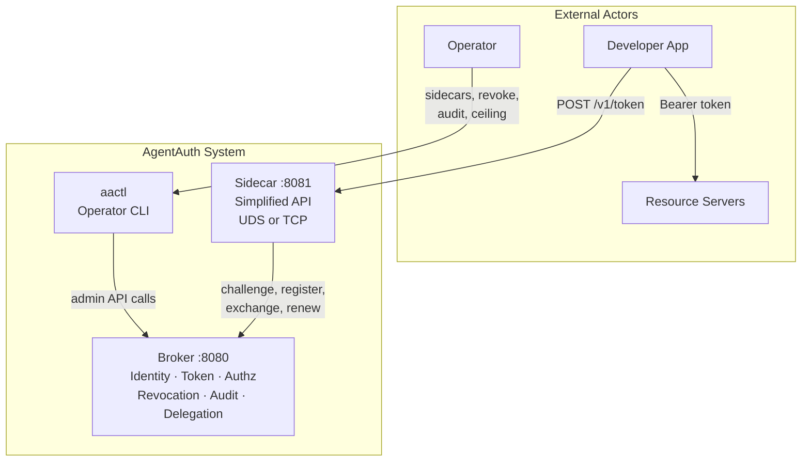

# AgentAuth

[](https://pkg.go.dev/github.com/divineartis/agentauth)
[](https://goreportcard.com/report/github.com/divineartis/agentauth)
[](https://opensource.org/licenses/Apache-2.0)
[](https://go.dev/)
[](https://docs.docker.com/compose/)
[](SECURITY.md)
[](https://ed25519.cr.yp.to/)
[](https://spiffe.io/)

**Ephemeral agent credentialing for AI systems.**

AgentAuth is a credential broker that issues short-lived, scope-attenuated tokens to AI agents through Ed25519 challenge-response identity verification. Each agent instance receives a unique [SPIFFE](https://spiffe.io/)-format identity and operates with only the permissions its task requires. Tokens expire in minutes — not hours — eliminating the credential exposure window that plagues traditional IAM approaches to AI agent security.

---

## Why AgentAuth

Traditional identity systems (OAuth, AWS IAM, service accounts) were designed for long-lived services with persistent identities. AI agents break those assumptions: they are ephemeral, non-deterministic, and require task-specific permissions at runtime. AgentAuth implements the **Ephemeral Agent Credentialing** pattern — a 7-component security architecture purpose-built for autonomous AI agents.

Read more: [Concepts: Why AgentAuth Exists](docs/concepts.md)

---

## Release Status

**Current release:** v2.0.0 — MVP Prototype (pattern validation release)

This release validates that AgentAuth is a working implementation of the target security pattern, ready for controlled demos, integration testing, and production hardening.

---

## Quick Start

```bash
# 1. Set the admin secret (required — broker exits without it)
export AA_ADMIN_SECRET="$(openssl rand -hex 32)"

# 2. Start broker + sidecar with Docker Compose
./scripts/stack_up.sh

# 3. Verify broker health
curl http://localhost:8080/v1/health
# {"status":"ok","version":"2.0.0","uptime":5,"db_connected":true}

# 4. Verify sidecar health
curl http://localhost:8081/v1/health
# {"status":"ok","broker_connected":true,"healthy":true}

# 5. Get a token (one call via sidecar)
curl -X POST http://localhost:8081/v1/token \
  -H "Content-Type: application/json" \
  -d '{"agent_name":"my-agent","task_id":"task-001","scope":["read:data:*"]}'
```

The broker listens on port `8080` (override with `AA_PORT`). The sidecar listens on port `8081` (override with `AA_SIDECAR_PORT`).

---

## Architecture



| Component | Package | Purpose |
|-----------|---------|---------|
| Identity Service | `internal/identity` | Challenge-response registration, SPIFFE ID generation, Ed25519 key management |
| Token Service | `internal/token` | EdDSA JWT issuance, verification, and renewal |
| Authz Middleware | `internal/authz` | Bearer token validation, scope enforcement on every request |
| Revocation Service | `internal/revoke` | 4-level revocation (token, agent, task, delegation chain) |
| Audit Log | `internal/audit` | Hash-chain tamper-evident audit trail with PII sanitization |
| Delegation Service | `internal/deleg` | Scope-attenuated delegation with chain verification |
| Admin Service | `internal/admin` | Admin authentication, launch token lifecycle, sidecar activation |
| Observability | `internal/obs` | Structured logging, Prometheus metrics |
| Store | `internal/store` | SQLite-backed persistence for audit events, revocations, and sidecar registrations |

See [Architecture](docs/architecture.md) for detailed component diagrams, data flow diagrams, and the package dependency graph.

---

## API Endpoints

| Method | Path | Auth | Description |
|--------|------|------|-------------|
| `GET` | `/v1/challenge` | None | Obtain a cryptographic nonce (30s TTL) |
| `POST` | `/v1/register` | Launch token | Register agent with signed nonce and public key |
| `POST` | `/v1/token/validate` | None | Verify a token and return decoded claims |
| `POST` | `/v1/token/renew` | Bearer | Renew a token with fresh timestamps |
| `POST` | `/v1/delegate` | Bearer | Create scope-attenuated delegation token |
| `POST` | `/v1/token/release` | Bearer | Agent self-revocation (task completion signal) |
| `POST` | `/v1/revoke` | Bearer + `admin:revoke:*` | Revoke tokens at 4 levels |
| `GET` | `/v1/audit/events` | Bearer + `admin:audit:*` | Query the audit trail |
| `POST` | `/v1/admin/auth` | None (rate-limited) | Authenticate admin with shared secret |
| `POST` | `/v1/admin/launch-tokens` | Bearer + `admin:launch-tokens:*` | Create launch tokens |
| `POST` | `/v1/admin/sidecar-activations` | Bearer + `admin:launch-tokens:*` | Create sidecar activation token |
| `GET` | `/v1/admin/sidecars` | Bearer + `admin:launch-tokens:*` | List registered sidecars |
| `POST` | `/v1/sidecar/activate` | Activation token | Exchange activation for sidecar Bearer token |
| `POST` | `/v1/token/exchange` | Bearer + `sidecar:manage:*` | Sidecar-mediated token issuance |
| `GET` | `/v1/health` | None | Health check (status, version, uptime) |
| `GET` | `/v1/metrics` | None | Prometheus metrics |

All error responses use [RFC 7807](https://tools.ietf.org/html/rfc7807) `application/problem+json`. See the [API Reference](docs/api.md) for complete endpoint documentation with request/response schemas.

---

## Configuration

All environment variables use the `AA_` prefix:

| Variable | Default | Description |
|----------|---------|-------------|
| `AA_ADMIN_SECRET` | **(required)** | Shared secret for admin authentication. Broker exits if unset. |
| `AA_PORT` | `8080` | Broker HTTP listen port |
| `AA_LOG_LEVEL` | `verbose` | Logging: `quiet`, `standard`, `verbose`, `trace` |
| `AA_TRUST_DOMAIN` | `agentauth.local` | SPIFFE trust domain for agent IDs |
| `AA_DEFAULT_TTL` | `300` | Default token TTL in seconds |
| `AA_DB_PATH` | `./agentauth.db` | SQLite path for audit persistence (set `""` to disable) |
| `AA_SEED_TOKENS` | `false` | Print seed tokens on startup (dev only) |
| `AA_AUDIENCE` | `agentauth` | JWT audience claim. Set empty to disable validation. |
| `AA_TLS_MODE` | `none` | Transport security: `none`, `tls`, or `mtls` |
| `AA_TLS_CERT` | -- | TLS certificate path (required for `tls`/`mtls` modes) |
| `AA_TLS_KEY` | -- | TLS private key path (required for `tls`/`mtls` modes) |
| `AA_TLS_CLIENT_CA` | -- | Client CA cert path (required for `mtls` mode) |

Sidecar configuration: `AA_SIDECAR_SCOPE_CEILING`, `AA_BROKER_URL`, `AA_SIDECAR_PORT`, `AA_SOCKET_PATH` (UDS mode), `AA_SIDECAR_CA_CERT`/`AA_SIDECAR_TLS_CERT`/`AA_SIDECAR_TLS_KEY` (TLS client), and circuit breaker tuning (`AA_SIDECAR_CB_*`). See [Getting Started: Operator](docs/getting-started-operator.md) for full sidecar configuration.

---

## Running Tests

```bash
go test ./...                     # all tests
go test ./... -short              # unit tests only (skip integration)
go test ./internal/token/...      # single package
./scripts/gates.sh task           # quality gates: build + lint + unit tests
./scripts/gates.sh module         # full gates: + integration + live tests
```

---

## Docker Deployment

```bash
# Start broker + sidecar
./scripts/stack_up.sh

# Tear down
./scripts/stack_down.sh

# Run live E2E tests (deploys compose stack first)
./scripts/live_test.sh --docker
```

---

## Operator CLI (aactl)

`aactl` provides operator tooling for the AgentAuth broker. It auto-authenticates via environment variables and supports table and JSON output.

```bash
# Build
go build -o aactl ./cmd/aactl/

# Configure
export AACTL_BROKER_URL=http://localhost:8080
export AACTL_ADMIN_SECRET=change-me-in-production

# Commands
aactl sidecars list                     # List all sidecars
aactl sidecars ceiling get <id>         # Get scope ceiling
aactl sidecars ceiling set <id> --scopes read:data:*
aactl revoke --level token --target <jti>
aactl audit events --outcome denied     # Filter audit trail
aactl token release --token <jwt>       # Release (self-revoke) a token
```

See [Getting Started: Operator](docs/getting-started-operator.md) for full documentation.

---

## Production Deployment

AgentAuth supports native TLS and mutual TLS (mTLS) for encrypted broker communication:

```bash
# One-way TLS
export AA_TLS_MODE=tls
export AA_TLS_CERT=/path/to/cert.pem
export AA_TLS_KEY=/path/to/key.pem

# Mutual TLS (recommended for production)
export AA_TLS_MODE=mtls
export AA_TLS_CERT=/path/to/cert.pem
export AA_TLS_KEY=/path/to/key.pem
export AA_TLS_CLIENT_CA=/path/to/ca.pem
```

For environments where TLS termination is handled externally, use a reverse proxy (nginx, Envoy, Caddy):

```nginx
server {
    listen 443 ssl;
    server_name agentauth.example.com;
    ssl_certificate     /etc/ssl/certs/agentauth.pem;
    ssl_certificate_key /etc/ssl/private/agentauth-key.pem;
    location / {
        proxy_pass http://127.0.0.1:8080;
        proxy_set_header Host $host;
        proxy_set_header X-Real-IP $remote_addr;
        proxy_set_header X-Forwarded-For $proxy_add_x_forwarded_for;
    }
}
```

The sidecar supports UDS listeners for production deployments where network exposure is unacceptable:

```bash
export AA_SOCKET_PATH=/var/run/agentauth/sidecar.sock
```

---

## Documentation

### Getting Started

| Guide | Audience | Description |
|-------|----------|-------------|
| [Getting Started](docs/getting-started-user.md) | Everyone | Installation, first token in 5 steps |
| [Getting Started: Developer](docs/getting-started-developer.md) | Developers | Python/TypeScript agent integration |
| [Getting Started: Operator](docs/getting-started-operator.md) | Operators | Broker deployment, sidecar configuration, monitoring |

### Reference

| Document | Description |
|----------|-------------|
| [API Reference](docs/api.md) | Complete endpoint documentation with schemas and examples |
| [OpenAPI Spec](docs/api/openapi.yaml) | Machine-readable API contract (OpenAPI 3.0.3) |
| [Architecture](docs/architecture.md) | Component diagrams, data flows, middleware stack, design decisions |
| [Concepts](docs/concepts.md) | Security pattern, threat model, 7-component breakdown, CVE case study |
| [Common Tasks](docs/common-tasks.md) | Step-by-step workflows for developers and operators |
| [Troubleshooting](docs/troubleshooting.md) | Error messages, diagnostic flowchart, fixes by role |

### Guides

| Document | Description |
|----------|-------------|
| [Integration Patterns](docs/integration-patterns.md) | 6 real-world patterns with Python examples: multi-agent pipelines, delegation chains, BYOK, token release, emergency revocation |
| [Sidecar Deployment](docs/sidecar-deployment.md) | Docker Compose and systemd deployment, trust boundary sizing, operational procedures |
| [aactl CLI Reference](docs/aactl-reference.md) | Complete operator CLI reference: all commands, flags, examples, and common workflows |

### Project

| Document | Description |
|----------|-------------|
| [Contributing](CONTRIBUTING.md) | Development setup, coding conventions, PR process |
| [Security Policy](SECURITY.md) | Vulnerability reporting, security design principles |
| [Changelog](CHANGELOG.md) | Release history |

---

## License

See [LICENSE](LICENSE) for details.
