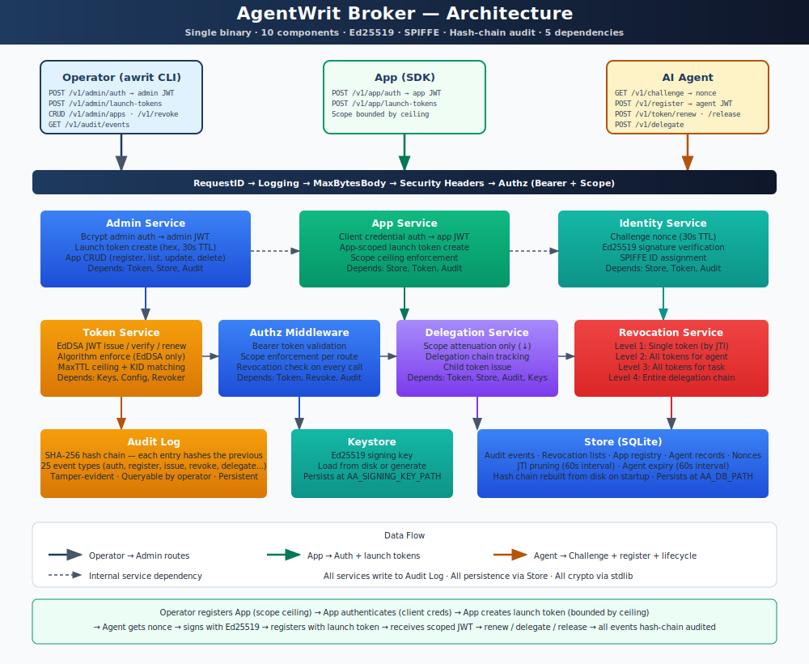

# AgentWrit

[](https://github.com/devonartis/agentwrit/actions/workflows/ci.yml)
[](https://github.com/devonartis/agentwrit/actions/workflows/codeql.yml)
[](https://securityscorecards.dev/viewer/?uri=github.com/devonartis/agentwrit)
[](https://pkg.go.dev/github.com/devonartis/agentwrit)
[](https://goreportcard.com/report/github.com/devonartis/agentwrit)
[](https://www.gnu.org/licenses/agpl-3.0)
[](https://go.dev/)
[](https://docs.docker.com/compose/)
[](SECURITY.md)
[](https://ed25519.cr.yp.to/)
[](https://spiffe.io/)

> [!IMPORTANT]
> **Building in public — pre-1.0.** The broker core is stable and we use it daily, but the Python SDK and demo app are still landing. Feel free to try it as we build in the open. For anything non-lab, pin to a versioned tag like `v2.0.0` or a commit-pinned digest like `main-899e4ca3` — `:latest` moves with every `main` commit and will change without notice. Issues are welcome; external PRs are paused until the contribution workflow is ready. See [CHANGELOG.md](CHANGELOG.md) for what shipped recently.

---

## What is AgentWrit?

**AgentWrit gives AI agents temporary, task-scoped credentials instead of long-lived API keys.**

When an AI agent needs to do something — read a customer record, call a vendor API, run a query — it asks the AgentWrit broker for a token. The token works for that specific task, expires in minutes, and can be yanked at four different levels the moment anything feels wrong. The agent never touches your long-lived credentials at all.

Think of it as an issuer of legal **writs** for software: narrow authority, time-limited, revocable at the source.

### Why this matters

| Without AgentWrit | With AgentWrit |
|---|---|
| Agent gets a long-lived API key | Agent requests a token per task |
| Key works for everything, forever | Token works for one task, expires in minutes |
| Leaked key = full blast radius | Leaked token = one task, already expiring |
| Revocation is slow and manual | Revocation is instant at 4 levels |
| No record of what was issued | Every credential event is audited in a tamper-evident hash chain |

> **What the audit trail covers:** The broker logs credential lifecycle events — issue, renew, revoke, delegate, release, auth failures, and scope violations. It does not see what the agent does with the token at the resource server.

**Want the full security model?** → [Concepts & threat model](docs/concepts.md)

---

## Quick Start

**Prerequisites:** [Docker](https://docs.docker.com/get-docker/). Five minutes to your first agent token.

```bash
# 1. Set a strong admin secret (broker exits without it)
export AA_ADMIN_SECRET="$(openssl rand -base64 32)"

# 2. Start the broker
docker run -d --name agentwrit \
  -p 8080:8080 \
  -e AA_ADMIN_SECRET \
  -e AA_BIND_ADDRESS=0.0.0.0 \
  -e AA_DB_PATH=/data/data.db \
  -e AA_SIGNING_KEY_PATH=/data/signing.key \
  -v agentwrit-data:/data \
  devonartis/agentwrit:latest

# 3. Confirm it's up
curl -s http://localhost:8080/v1/health | jq .

# 4. Authenticate as admin
ADMIN_TOKEN=$(curl -s -X POST http://localhost:8080/v1/admin/auth \
  -H "Content-Type: application/json" \
  -d "{\"secret\":\"$AA_ADMIN_SECRET\"}" | jq -r '.access_token')

# 5. Create a launch token (one-time agent registration credential)
LAUNCH_TOKEN=$(curl -s -X POST http://localhost:8080/v1/admin/launch-tokens \
  -H "Authorization: Bearer $ADMIN_TOKEN" \
  -H "Content-Type: application/json" \
  -d '{
    "agent_name": "demo-agent",
    "orch_id": "quickstart",
    "allowed_scope": ["read:data:*"],
    "ttl_seconds": 300
  }' | jq -r '.launch_token')

echo "Launch token: ${LAUNCH_TOKEN:0:20}..."
```

You now have a launch token. The agent presents this once to register and get its own scoped JWT.

**Next steps from here:**

| I want to... | Go to |
|---|---|
| Register an agent with this launch token (Python SDK) | [Python SDK →](docs/python-sdk.md) |
| See the raw HTTP registration flow (curl + openssl) | [Getting Started walkthrough →](docs/getting-started-user.md) |
| Build from source or use Docker Compose instead | [Other install options →](#other-install-options) |
| Understand what just happened (auth model, SPIFFE IDs, scopes) | [Concepts →](docs/concepts.md) |

---

## How it works

AgentWrit implements the [Ephemeral Agent Credentialing v1.3](https://github.com/devonartis/AI-Security-Blueprints/blob/main/patterns/ephemeral-agent-credentialing/versions/v1.3.md) security pattern — an 8-component architecture purpose-built for autonomous AI agents. The pattern was developed as part of the [AI Security Blueprints](https://github.com/devonartis/AI-Security-Blueprints) project and AgentWrit is its reference implementation.

<p align="center">
  
</p>

> **Detailed diagrams:** [Token Lifecycle](docs/diagrams/token-lifecycle.svg) · [Security Topology](docs/diagrams/security-topology.svg)

1. **Operator** creates a launch token with an allowed scope ceiling
2. **App** hands the launch token to the agent for a specific task
3. **Agent** registers with the broker (Ed25519 challenge-response), gets a short-lived JWT
4. **Agent** uses the JWT as a Bearer token against resource servers
5. **Agent** releases the token when done — or the broker revokes it at any of 4 levels

**10 components, one binary.** The broker handles identity, tokens, scopes, revocation, delegation, audit, app management, admin auth, observability, and persistence — all in a single Go binary with 5 direct dependencies.

| Component | What it does | Package |
|-----------|-------------|---------|
| Identity | Challenge-response registration, SPIFFE IDs | [`internal/identity`](internal/identity) |
| Token | EdDSA JWT issue / verify / renew, MaxTTL ceiling | [`internal/token`](internal/token) |
| Authz | Scope enforcement on every protected route | [`internal/authz`](internal/authz) |
| Revocation | 4-level revoke: token, agent, task, chain | [`internal/revoke`](internal/revoke) |
| Audit | Tamper-evident hash-chain event log | [`internal/audit`](internal/audit) |
| Delegation | Scope-attenuated child tokens | [`internal/deleg`](internal/deleg) |
| App | App registration and client credentials | [`internal/app`](internal/app) |
| Admin | Admin auth (bcrypt), launch tokens | [`internal/admin`](internal/admin) |
| Observability | Structured logging, Prometheus `/v1/metrics` | [`internal/obs`](internal/obs) |
| Store | SQLite persistence | [`internal/store`](internal/store) |

**Deep dive:** [Architecture diagrams & data flows →](docs/architecture.md)

---

## See it in action — MedAssist AI Demo

The Python SDK includes **MedAssist AI**: a FastAPI web app where a local LLM dynamically creates broker agents with per-patient scoped credentials. You see scope enforcement, cross-patient denial, delegation, and audit — all in a real-time trace.

| What you'll see | What it proves |
|---|---|
| Agents spawn on demand per LLM tool call | Dynamic agent creation works |
| Each agent scoped to one patient ID | Per-resource scope isolation |
| LLM asks for wrong patient → `scope_denied` | Scope enforcement catches cross-boundary access |
| Clinical agent delegates to prescription agent | Delegation with scope attenuation |
| Tokens renew and release at end of encounter | Full lifecycle management |

**Run it:** [MedAssist AI demo →](docs/demos.md) · [Beginner's guide →](docs/demos.md) · [Presenter's guide →](docs/demos.md)

---

## SDKs

| Language | Repo | Install | Status |
|----------|------|---------|--------|
| **Python** | [agentwrit-python](docs/python-sdk.md) | `pip install agentauth` *(PyPI rename pending)* | v0.3.0 — 15 acceptance tests passing |
| **TypeScript** | Coming soon | — | Planned |

```python
from agentauth import AgentAuthApp

# The SDK hides the Ed25519 challenge-response flow
agent = AgentAuthApp(broker_url="http://localhost:8080").register(
    launch_token=LAUNCH_TOKEN,
    task_id="read-customer-42",
    requested_scope=["read:data:customers:42"],
)

# Use the token at your resource server
response = httpx.get(url, headers=agent.bearer_header)

# Done — release the credential
agent.release()
```

**Full SDK docs:** [Python SDK →](docs/python-sdk.md)

---

## API at a glance

19 endpoints. Full schemas and examples in the [API Reference →](docs/api.md).

| | Method | Path | Who uses it |
|---|---|---|---|
| **Public** | `GET` | `/v1/health` | Anyone — health check |
| | `GET` | `/v1/metrics` | Monitoring — Prometheus |
| | `GET` | `/v1/challenge` | Agent — get registration nonce |
| | `POST` | `/v1/token/validate` | Resource server — verify a token |
| **Auth** | `POST` | `/v1/admin/auth` | Operator — get admin JWT |
| | `POST` | `/v1/app/auth` | App — client credential exchange |
| | `POST` | `/v1/register` | Agent — register with launch token |
| **Token** | `POST` | `/v1/token/renew` | Agent/App — renew before expiry |
| | `POST` | `/v1/token/release` | Agent — signal task completion |
| | `POST` | `/v1/delegate` | Agent/App — scope-attenuated child token |
| **Admin** | `POST` | `/v1/admin/launch-tokens` | Operator — create agent launch tokens |
| | `POST` | `/v1/admin/apps` | Operator — register an app |
| | `GET` | `/v1/admin/apps` | Operator — list apps |
| | `GET` | `/v1/admin/apps/{id}` | Operator — get app details |
| | `PUT` | `/v1/admin/apps/{id}` | Operator — update app scopes/TTL |
| | `DELETE` | `/v1/admin/apps/{id}` | Operator — deregister app |
| | `POST` | `/v1/revoke` | Operator — revoke at 4 levels |
| | `GET` | `/v1/audit/events` | Operator — query audit trail |

All errors return [RFC 7807](https://tools.ietf.org/html/rfc7807) `application/problem+json`.

---

## Other install options

### Docker Compose (clone + build locally)

```bash
git clone https://github.com/devonartis/agentwrit.git && cd agentwrit
export AA_ADMIN_SECRET="$(openssl rand -base64 32)"
./scripts/stack_up.sh
curl -s http://localhost:8080/v1/health | jq .
```

Tear down: `./scripts/stack_down.sh`

### Build from source (Go 1.24+)

```bash
go build -o bin/broker ./cmd/broker/
go build -o bin/awrit  ./cmd/awrit/
./bin/awrit init --config-path /tmp/agentwrit/config
AA_CONFIG_PATH=/tmp/agentwrit/config ./bin/broker
```

### Pre-built Docker image tags

| Tag | Moves? | Use for |
|---|---|---|
| `v2.0.0` | No | **Production** — pinned semver |
| `main-<sha>` | No | Reproducible deploys — pinned to a commit |
| `latest` | Every `main` push | Lab and evaluation only |

**Verify the image** (optional, recommended):

```bash
cosign verify devonartis/agentwrit:latest \
  --certificate-identity-regexp='^https://github.com/devonartis/agentwrit/\.github/workflows/release\.yml@' \
  --certificate-oidc-issuer=https://token.actions.githubusercontent.com
```

---

## Configuration

All env vars use the `AA_` prefix. Only `AA_ADMIN_SECRET` is required — the broker exits without it.

| Variable | Default | What it does |
|----------|---------|-------------|
| `AA_ADMIN_SECRET` | *(required)* | Root credential — treat like a root password |
| `AA_PORT` | `8080` | HTTP listen port |
| `AA_BIND_ADDRESS` | `127.0.0.1` | Bind address (`0.0.0.0` for Docker) |
| `AA_DEFAULT_TTL` | `300` | Token lifetime in seconds (5 min) |
| `AA_MAX_TTL` | `86400` | Maximum token lifetime ceiling (24h) |
| `AA_DB_PATH` | `./data.db` | SQLite database path |
| `AA_SIGNING_KEY_PATH` | `./signing.key` | Ed25519 key path (auto-generated) |
| `AA_TLS_MODE` | `none` | `none`, `tls`, or `mtls` |
| `AA_LOG_LEVEL` | `verbose` | `quiet`, `standard`, `verbose`, `trace` |

**Full config reference** (all env vars, TLS/mTLS setup, config files, operator CLI): [Operator guide →](docs/getting-started-operator.md)

---

## Operator CLI (`awrit`)

```bash
go build -o bin/awrit ./cmd/awrit/
export AACTL_BROKER_URL=http://localhost:8080
export AACTL_ADMIN_SECRET="your-secret"

awrit init                                         # Generate broker config
awrit app register --name my-pipeline --scopes "read:data:*"  # Register an app
awrit revoke --level agent --target <agent-id>     # Revoke all agent tokens
awrit audit events --outcome denied --limit 20     # Query audit trail
```

**Full CLI reference:** [awrit commands & flags →](docs/awrit-reference.md)

---

## Running tests

```bash
go test ./...              # All tests
go test ./... -short       # Unit tests only
./scripts/gates.sh task    # Build + lint + unit + security scan
./scripts/gates.sh module  # Full gates including Docker E2E
```

---

## Documentation

| I want to... | Go to |
|---|---|
| Get started from zero | [Getting Started →](docs/getting-started-user.md) |
| Integrate my app with the broker | [Developer guide →](docs/getting-started-developer.md) |
| Deploy and operate the broker | [Operator guide →](docs/getting-started-operator.md) |
| See all API endpoints and schemas | [API Reference →](docs/api.md) |
| Understand the security model | [Concepts & threat model →](docs/concepts.md) |
| See architecture diagrams | [Architecture →](docs/architecture.md) |
| Follow common workflows | [Common Tasks →](docs/common-tasks.md) |
| Debug an issue | [Troubleshooting →](docs/troubleshooting.md) |
| See real-world integration patterns | [Integration Patterns →](docs/integration-patterns.md) |
| Use the Python SDK | [Python SDK →](docs/python-sdk.md) |
| Run the MedAssist demo | [MedAssist AI →](docs/demos.md) |
| Report a security vulnerability | [Security Policy →](SECURITY.md) |
| Read the changelog | [CHANGELOG →](CHANGELOG.md) |

---

## License

AgentWrit is licensed under **AGPL-3.0**. Anyone offering modified AgentWrit as a network service must make source available. Self-hosting and internal use are unrestricted. See [LICENSE](LICENSE).
