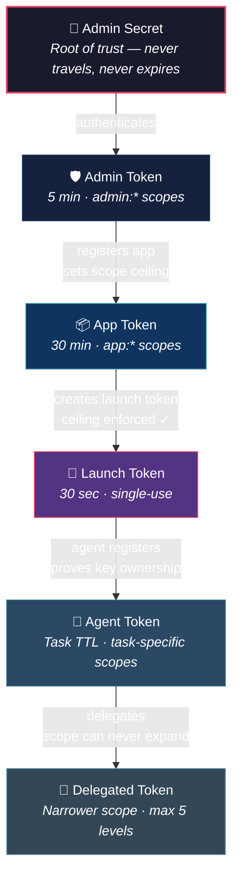

# What Is AgentWrit?

AgentWrit is a credential broker for AI agents. It issues short-lived, task-scoped tokens so agents operate with only the permissions their task requires — nothing more, nothing longer.

---

## The Problem: Credentials That Don't Match the Work

AI agents are different from the services that traditional credentials were designed for. Some agents spin up in seconds, finish a task in two minutes, and die. Others run for hours processing a batch pipeline. Some are one-shot — do a thing and exit. Others are long-running orchestrators that spawn sub-agents throughout the day.

What they have in common: **their credential lifetime has no relationship to their task lifetime.** A two-minute agent holds a permanent API key. A four-hour pipeline holds the same permanent API key. Neither agent needs access after its work is done, but the credential doesn't know that — it stays valid indefinitely.

Now multiply that by fifty agents, all sharing the same key. You can't tell which agent did what. You can't revoke one without killing all fifty. And when one is compromised, you can't surgically remove it — you have to rotate the shared key, which means every service and agent that depends on it stops working until you reconfigure all of them. That's not rotating a credential. That's an outage.

The root problem isn't carelessness. It's a mismatch: traditional credentials assume long-lived services with predictable, stable identities. AI agents — whether they run for minutes or hours — break that assumption because they're dynamic, task-specific, and numerous. The credential model needs to match the work model.

---

## The Solution: Ephemeral, Scoped Tokens

AgentWrit replaces long-lived keys with short-lived, task-scoped tokens. Each token expires on a configurable TTL (five minutes by default, adjustable up to 24 hours for longer pipelines), carries only the permissions its task requires, and can be revoked individually — the revocation takes effect on the very next request any resource server validates against the broker.

Think of it like a building access system — not the master key kind, but the kind where every contractor gets a badge programmed for specific floors, specific doors, and a specific time window. The badge expires when the job is done. If one contractor's badge is compromised, security deactivates that badge without reprogramming every other contractor in the building.

AgentWrit works the same way for AI agents:

| Traditional API Keys | AgentWrit Tokens |
|---------------------|-----------------|
| Permanent until rotated | Expire on a configurable TTL (default: 5 min) |
| Shared across agents | Unique per agent instance |
| Broad permissions | Scoped to specific actions on specific resources |
| Revoke one = rotate the shared key = outage | Revoke one agent, others keep working |
| "service-account-prod did something" | "agent `spiffe://acme.co/agent/orch-456/task-789/a1b2c3d4` read `customers`" |

---

## The Three Core Concepts

Everything in AgentWrit builds on three ideas:

| Concept | What It Is | Think of It Like |
|---------|-----------|-----------------|
| **Scopes** | Permission strings in the format `action:resource:identifier` that say exactly what a token holder can do | A badge that reads "Floor 3 only, read-only access" |
| **Launch Tokens** | Single-use, 30-second registration passes that authorize one agent to join the system | A one-time visitor pass at the lobby desk |
| **The Attenuation Chain** | Each credential in the system can never *exceed* the one that created it — same scope or narrower, never wider | Each person can hand out keys to the same rooms they have access to or fewer, never more |

Here's how they connect — the **attenuation chain**:

At every step, authority can never expand. The admin defines what apps can do. Apps define what agents can do. Agents define what sub-agents can do. A delegate can receive the same scope as its delegator or less — but never more.

---

## How It Works in Practice

The full flow from zero to a working agent takes six steps:

```mermaid
sequenceDiagram
    actor Operator
    participant Broker
    participant App as App (Software)
    participant Agent as AI Agent
    participant RS as Resource Server

    rect rgb(30, 40, 60)
        Note over Operator,Broker: Phase 1: Bootstrap (one-time setup)
        Operator->>Broker: 1. POST /v1/admin/auth {secret}
        Broker-->>Operator: Admin JWT (5 min)
        Operator->>Broker: 2. POST /v1/admin/apps {ceiling: ["read:data:*"]}
        Broker-->>Operator: client_id + client_secret
    end

    rect rgb(20, 50, 50)
        Note over App,Broker: Phase 2: Production (automated)
        App->>Broker: 3. POST /v1/app/auth {client_id, secret}
        Broker-->>App: App JWT (30 min)
        App->>Broker: 4. POST /v1/app/launch-tokens {scope}
        Note right of Broker: Ceiling check ✓
        Broker-->>App: Launch token (30s, single-use)
    end

    rect rgb(40, 30, 60)
        Note over Agent,RS: Phase 3: Agent work
        App-->>Agent: Deliver launch token
        Agent->>Broker: 5. GET /v1/challenge → sign nonce → POST /v1/register
        Broker-->>Agent: Agent JWT (task TTL)
        Agent->>RS: 6. Bearer token → do work
        RS->>Broker: POST /v1/token/validate
        Broker-->>RS: Valid ✓ scopes: ["read:data:*"]
    end
```

The admin token appears at steps 1 and 2 — then it expires and leaves the picture. From step 3 onward, the app manages its own agents autonomously. The admin's decision at step 2 — the scope ceiling — controls what is possible from that point forward.

---

## What AgentWrit Is NOT

Before you go further, a few things AgentWrit explicitly does not do:

**Not an OAuth provider.** OAuth is designed for user-delegated access ("let this app access my Google Drive"). AgentWrit handles machine-to-machine credentialing with no user in the loop.

**Not a secrets manager.** AgentWrit issues credentials. It doesn't store your database passwords or API keys. It gives agents a scoped identity so downstream services can verify them.

**Not a service mesh.** No sidecars, no proxies. AgentWrit is a standalone broker that issues and validates tokens over HTTP.

---

## Frequently Asked Questions

**"How is this different from API keys?"**
API keys are permanent, usually over-permissioned, and shared across multiple agents — so when one leaks, you rotate the key and take down every agent that depends on it. AgentWrit tokens expire on a configurable TTL, are scoped to a specific task, and can be revoked individually. The revocation takes effect on the next request. No rotation, no collateral damage.

**"What if an agent is compromised?"**
The operator revokes it. One API call cancels the specific token, the specific agent, all agents on a task, or an entire delegation chain — four levels of surgical revocation, matched to the blast radius. Every subsequent validation request for the revoked credential is rejected. No key rotation, no downtime for other agents.

**"Can a developer give an agent more access than they should?"**
No. The platform team sets the scope ceiling when registering the application. When the developer's code requests a launch token, the broker checks every requested scope against that ceiling. If any scope exceeds it, the request is rejected before the launch token is created.

---

## What's Next?

Ready to see it in action? Start here:

**[Your First Five Minutes →](getting-started-user.md)**
Run a local setup with Docker, walk through the registration flow, and get your first agent token.

**[Live Demos →](https://github.com/devonartis/agentwrit-python)**
See AgentWrit in real applications — a healthcare multi-agent pipeline and a support ticket zero-trust demo, both running against a live broker with LLM-driven agents.

Or jump to the topic that matches your interest:

| If you want to... | Read this |
|-------------------|-----------|
| Understand what tokens actually are and how JWTs work | [Foundations](foundations.md) |
| See who holds which token and why | [The Three Actors](roles.md) |
| Learn the permission system | [Scopes and Permissions](scope-model.md) |
| Integrate AgentWrit into your agent code | [Getting Started: Developer](getting-started-developer.md) |
| Deploy AgentWrit in production | [Getting Started: Operator](getting-started-operator.md) |

---

*Previous: [Documentation Home](README.md) · Next: [Your First Five Minutes](getting-started-user.md)*
