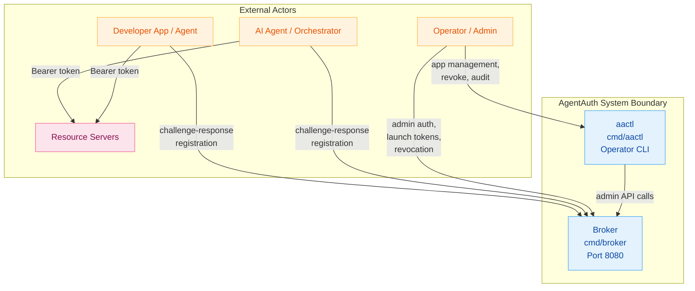
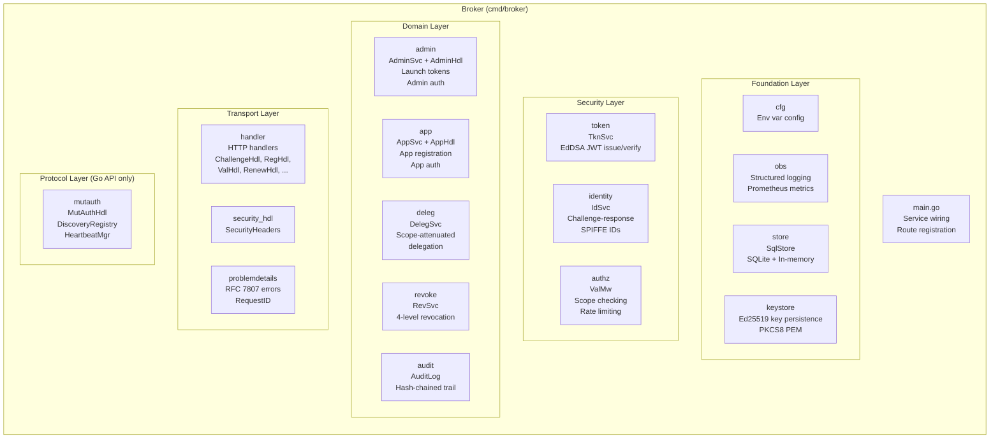
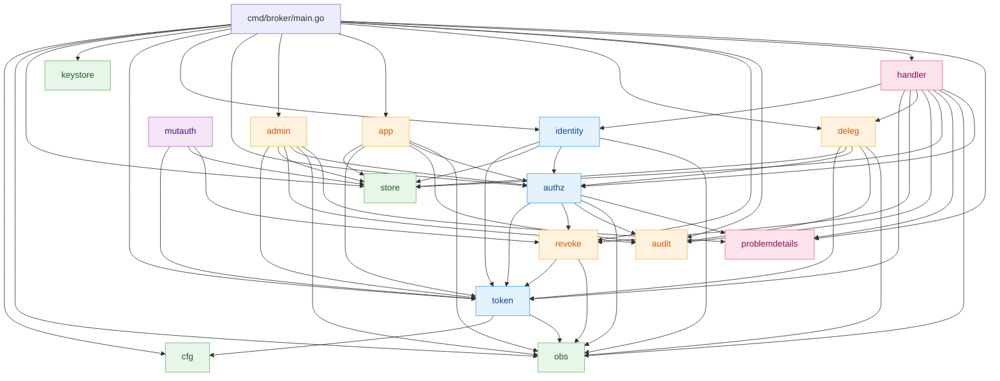
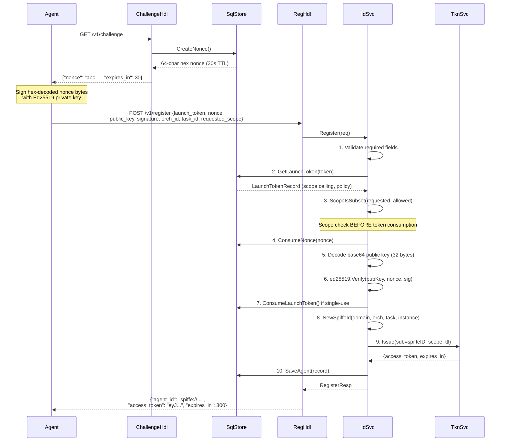
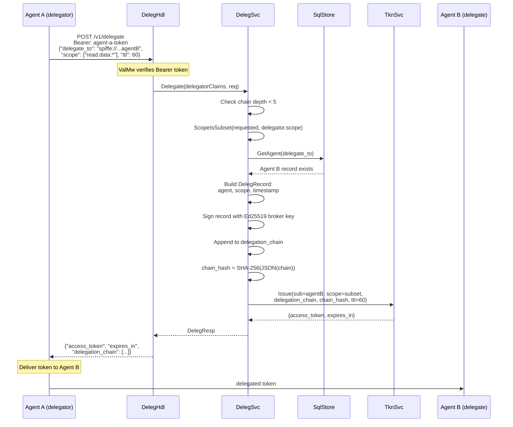
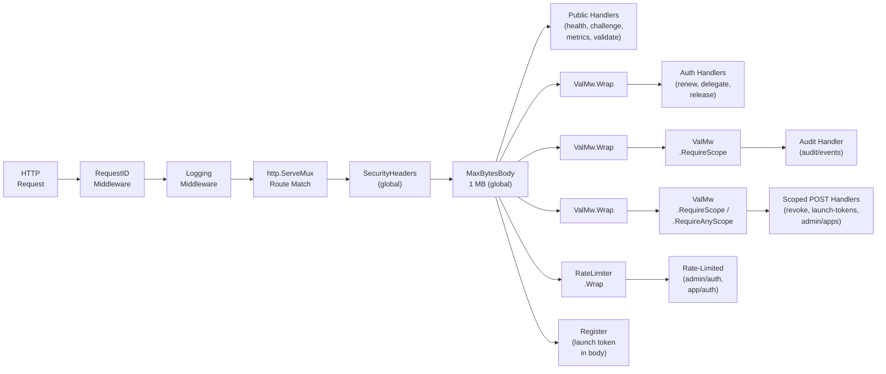

# Architecture

> **Document Version:** 3.0 | **Last Updated:** March 2026 | **Status:** Current
>
> **Audience:** Contributors, security reviewers, and operators who want to understand how AgentAuth works internally.
>
> **Prerequisites:** [Concepts](concepts.md) for the security pattern overview.
>
> **Next steps:** [API Reference](api.md) | [Contributing](../CONTRIBUTING.md) | [Getting Started: Operator](getting-started-operator.md)

---

## System Overview

AgentAuth sits between AI agents and the resources they need to access, providing ephemeral, scoped credentials through a challenge-response identity flow.



**Broker** (`cmd/broker`) -- The central authority. Loads or generates a persistent Ed25519 signing key (`internal/keystore`), issues EdDSA-signed JWTs, validates challenge-response registrations, manages scope attenuation, delegation, revocation, and maintains a hash-chained audit trail. All endpoints use `application/json` with RFC 7807 error responses.

**App Service** (`internal/app`) -- Manages application registrations and app-level authentication. Operators register apps with `aactl app register`, which generates a client_id and client_secret. Apps authenticate with `POST /v1/app/auth` using those credentials to get scoped tokens.

**aactl** (`cmd/aactl`) -- The operator CLI. Reads `AACTL_BROKER_URL` and `AACTL_ADMIN_SECRET` from environment variables and auto-authenticates. Provides table and JSON output for app management, token revocation, and audit trail queries. Intended for operators who prefer a CLI over hand-crafting curl + JWT.

---

## Component Architecture



---

## Directory Layout

```
agentauth/
|-- cmd/
|   |-- broker/
|   |   +-- main.go              # Service wiring, route registration, startup
|   |-- aactl/                   # Operator CLI (aactl binary)
|   |   |-- main.go              # Cobra root command, env var config
|   |   |-- client.go            # HTTP client with auto-auth
|   |   |-- apps.go              # app register / list
|   |   |-- revoke.go            # revoke --level --target
|   |   |-- audit.go             # audit events with filters
|   |   |-- token.go              # token release command
|   |   +-- output.go            # Table and JSON output helpers
|   +-- smoketest/               # Container smoke test binary
|-- internal/
|   |-- admin/                   # Admin auth, launch tokens
|   |-- app/                     # App registration, app auth
|   |-- audit/                   # Hash-chained audit trail
|   |-- authz/                   # Bearer middleware, scope checking, rate limiter
|   |-- cfg/                     # Broker configuration from AA_* env vars
|   |-- deleg/                   # Scope-attenuated delegation with chain signing
|   |-- handler/                 # HTTP handlers for all broker endpoints + security_hdl.go (SecurityHeaders)
|   |-- identity/                # Challenge-response registration, SPIFFE IDs
|   |-- keystore/                # Ed25519 signing key persistence (PKCS8 PEM)
|   |-- mutauth/                 # Mutual authentication (Go API only)
|   |-- obs/                     # Structured logging and Prometheus metrics
|   |-- problemdetails/          # RFC 7807 errors, request ID, body limits
|   |-- revoke/                  # Four-level token revocation
|   |-- store/                   # SQLite-backed persistence + in-memory maps
|   +-- token/                   # EdDSA JWT issuance, verification, renewal
|-- scripts/                     # Gate checks, Docker helpers, E2E test scripts
|-- docs/                        # Documentation
|-- docker-compose.yml           # Broker on bridge network
+-- Dockerfile                   # Multi-stage build (builder, broker)
```

---

## Package Dependency Graph



**Legend:** Green = Foundation, Blue = Security, Orange = Domain, Pink = Transport, Purple = Protocol (Go API only)

---

## Pattern Components Mapped to Code

The 8-component Ephemeral Agent Credentialing pattern maps directly to Go packages:

| Pattern Component | Go Packages | Key Types | Key Functions |
|---|---|---|---|
| **Foundation** | | | |
| Store | `store` | `SqlStore`, `LaunchTokenRecord`, `AgentRecord`, `AppRecord`, `RevocationEntry` | `CreateNonce()`, `SaveAgent()`, `SaveApp()`, `SaveRevocation()`, `LoadAllAuditEvents()`, `LoadAllRevocations()` |
| Keystore | `keystore` | — | `LoadOrGenerate()` — persistent Ed25519 key management (PKCS8 PEM, 0600 permissions) |
| **Pattern Components** | | | |
| 1. Ephemeral Identity Issuance | `identity`, `store`, `handler` | `IdSvc`, `RegHdl`, `ChallengeHdl`, `SqlStore` | `IdSvc.Register()`, `NewSpiffeId()` |
| 2. Short-Lived Task-Scoped Tokens | `token`, `authz` | `TknSvc`, `TknClaims`, `IssueReq`, `Revoker` | `TknSvc.Issue()`, `TknSvc.Verify()`, `TknSvc.Renew()`, `TknSvc.SetRevoker()` |
| 3. Zero-Trust Enforcement | `authz`, `handler` | `ValMw`, `RateLimiter` | `ValMw.Wrap()`, `ValMw.RequireScope()`, `ValMw.RequireAnyScope()`, `ScopeIsSubset()` |
| 4. Automatic Expiration & Revocation | `revoke`, `token`, `handler` | `RevSvc`, `Revoker`, `RevokeHdl`, `ReleaseHdl` | `RevSvc.Revoke()`, `RevSvc.RevokeByJTI()`, `RevSvc.IsRevoked()`, `RevSvc.LoadFromEntries()` |
| 5. Immutable Audit Logging | `audit`, `handler` | `AuditLog`, `AuditEvent`, `AuditHdl`, `RecordOption` | `AuditLog.Record()`, `AuditLog.Query()`, `WithOutcome()`, `WithResource()` |
| 6. Agent-to-Agent Mutual Auth | `mutauth` | `MutAuthHdl`, `DiscoveryRegistry`, `HeartbeatMgr` | `InitiateHandshake()`, `RespondToHandshake()`, `CompleteHandshake()` |
| 7. Delegation Chain Verification | `deleg`, `handler` | `DelegSvc`, `DelegHdl`, `DelegRecord` | `DelegSvc.Delegate()` |

---

## Request Lifecycle

Every HTTP request passes through the same middleware stack before reaching a handler:

```mermaid
sequenceDiagram
    participant C as Client
    participant RID as RequestIDMiddleware
    participant LOG as LoggingMiddleware
    participant MUX as http.ServeMux
    participant SEC as SecurityHeaders
    participant MB as MaxBytesBody
    participant VAL as ValMw.Wrap
    participant SC as ValMw.RequireScope
    participant H as Handler

    C->>RID: HTTP Request
    RID->>RID: Generate/propagate X-Request-ID
    RID->>LOG: Request + context
    LOG->>LOG: Record start time
    LOG->>MUX: Route to handler
    MUX->>SEC: SecurityHeaders
    SEC->>SEC: Set X-Content-Type-Options, Cache-Control, X-Frame-Options; HSTS if TLS
    SEC->>MB: All requests
    MB->>MB: Limit body to 1 MB
    MB->>VAL: (if auth required)
    VAL->>VAL: Extract Bearer token
    VAL->>VAL: TknSvc.Verify(token)
    VAL->>VAL: RevSvc.IsRevoked(claims)
    VAL->>VAL: Inject claims into context
    VAL->>SC: (if scope required)
    SC->>SC: ScopeIsSubset check
    SC->>H: Authenticated + authorized request
    H->>H: Business logic
    H-->>C: JSON response
    LOG-->>LOG: Log method, path, status, latency, request_id
```

Not all routes use every middleware. Public endpoints (health, challenge, metrics) skip `ValMw` and `ValMw.RequireScope`. `SecurityHeaders` (`internal/handler/security_hdl.go`) and `MaxBytesBody` (`internal/problemdetails/problemdetails.go`) are global middleware applied to ALL requests. Execution order on an incoming request: `RequestID → Logging → MaxBytesBody → SecurityHeaders → route handler`. `SecurityHeaders` sets `X-Content-Type-Options: nosniff`, `Cache-Control: no-store`, and `X-Frame-Options: DENY` on every response, and adds `Strict-Transport-Security` (HSTS) when `AA_TLS_MODE` is `tls` or `mtls`. `MaxBytesBody` enforces a 1 MB request body limit — oversized requests get HTTP 413 before reaching any handler.

---

## Data Flow Diagrams

### Agent Registration Flow

The 10-step registration is the core identity issuance flow:



### Delegation Flow

Agent A delegates a narrower-scoped token to Agent B:



---

## Middleware Stack

The broker applies two layers of middleware: global middleware on all requests, and per-route middleware on specific endpoints.



**Route-to-middleware mapping from `cmd/broker/main.go`:**

| Route | Middleware Chain |
|---|---|
| `GET /v1/challenge` | RequestID -> Logging -> MaxBytesBody -> SecurityHeaders -> Handler |
| `GET /v1/health` | RequestID -> Logging -> MaxBytesBody -> SecurityHeaders -> Handler |
| `GET /v1/metrics` | RequestID -> Logging -> MaxBytesBody -> SecurityHeaders -> Handler |
| `POST /v1/token/validate` | RequestID -> Logging -> MaxBytesBody -> SecurityHeaders -> Handler |
| `POST /v1/register` | RequestID -> Logging -> MaxBytesBody -> SecurityHeaders -> Handler |
| `POST /v1/token/renew` | RequestID -> Logging -> MaxBytesBody -> SecurityHeaders -> ValMw -> Handler |
| `POST /v1/delegate` | RequestID -> Logging -> MaxBytesBody -> SecurityHeaders -> ValMw -> Handler |
| `POST /v1/token/release` | RequestID -> Logging -> MaxBytesBody -> SecurityHeaders -> ValMw -> Handler |
| `POST /v1/revoke` | RequestID -> Logging -> MaxBytesBody -> SecurityHeaders -> ValMw -> ValMw.RequireScope(`admin:revoke:*`) -> Handler |
| `GET /v1/audit/events` | RequestID -> Logging -> MaxBytesBody -> SecurityHeaders -> ValMw -> ValMw.RequireScope(`admin:audit:*`) -> Handler |
| `POST /v1/admin/auth` | RequestID -> Logging -> MaxBytesBody -> SecurityHeaders -> RateLimiter(5/s, burst 10) -> Handler |
| `POST /v1/admin/launch-tokens` | RequestID -> Logging -> MaxBytesBody -> SecurityHeaders -> ValMw -> ValMw.RequireScope(`admin:launch-tokens:*`) -> Handler |
| `POST /v1/app/launch-tokens` | RequestID -> Logging -> MaxBytesBody -> SecurityHeaders -> ValMw -> ValMw.RequireScope(`app:launch-tokens:*`) -> Handler |
| `POST /v1/admin/apps` | RequestID -> Logging -> MaxBytesBody -> SecurityHeaders -> ValMw -> ValMw.RequireScope(`admin:launch-tokens:*`) -> Handler |
| `GET /v1/admin/apps` | RequestID -> Logging -> MaxBytesBody -> SecurityHeaders -> ValMw -> ValMw.RequireScope(`admin:launch-tokens:*`) -> Handler |
| `GET /v1/admin/apps/{id}` | RequestID -> Logging -> MaxBytesBody -> SecurityHeaders -> ValMw -> ValMw.RequireScope(`admin:launch-tokens:*`) -> Handler |
| `PUT /v1/admin/apps/{id}` | RequestID -> Logging -> MaxBytesBody -> SecurityHeaders -> ValMw -> ValMw.RequireScope(`admin:launch-tokens:*`) -> Handler |
| `DELETE /v1/admin/apps/{id}` | RequestID -> Logging -> MaxBytesBody -> SecurityHeaders -> ValMw -> ValMw.RequireScope(`admin:launch-tokens:*`) -> Handler |
| `POST /v1/app/auth` | RequestID -> Logging -> MaxBytesBody -> SecurityHeaders -> RateLimiter(10/min per client_id, burst 3) -> Handler |
---

## Key Design Decisions

1. **Hybrid persistence.** Critical state (audit events, revocations, app registrations) is persisted to SQLite via write-through from in-memory structures. Transient state (nonces, agent records, launch tokens) lives in memory behind `sync.RWMutex` and is cleared on restart. This design ensures the audit trail and revocation list survive broker restarts while keeping the hot path fast.

2. **Persistent Ed25519 signing key.** On first startup, the broker generates an Ed25519 key pair via `crypto/rand` and writes it to `AA_SIGNING_KEY_PATH` (default `./signing.key`) in PKCS8 PEM format with `0600` permissions. On subsequent startups, the existing key is loaded from disk. Tokens remain valid across restarts as long as the key file persists. Delete the key file to force key rotation (all previously issued tokens become unverifiable). See `internal/keystore` for implementation.

3. **Scope attenuation is one-way.** Scopes can only narrow, never expand. Enforced at registration (requested scope vs. launch token ceiling), delegation (delegated vs. delegator scope), and app-authenticated launch-token creation (requested `allowed_scope` vs. app ceiling).

4. **Scope check before launch token consumption.** At registration, `ScopeIsSubset` is called before `ConsumeLaunchToken`. A scope violation returns an error without wasting a single-use token.

5. **Bcrypt secret comparison.** Admin authentication uses `bcrypt.CompareHashAndPassword` (cost 12) to prevent timing attacks on `AA_ADMIN_SECRET`. The plaintext secret is bcrypt-hashed at startup in `cfg.Load()` and the hash is stored in `Cfg.AdminSecretHash`. The plaintext is wiped from memory after hashing.

6. **Apps as first-class entities.** Developer applications are registered with the broker via `aactl` and authenticate directly using client credentials (`POST /v1/app/auth`). Each app has its own scope ceiling and configurable JWT TTL (bounded by broker-wide min/max).

7. **Mutual auth not HTTP-exposed.** `MutAuthHdl` in `internal/mutauth` provides a 3-step mutual authentication handshake, but it is not registered on any HTTP mux. It exists as a Go API only, tested in unit tests, intended for future HTTP exposure.

---

## Security Assumptions

These are explicit trust boundaries and limitations of the current implementation:

- **X-Forwarded-For trusted unconditionally.** The `clientIP()` function in `internal/authz/rate_mw.go` trusts the first entry in `X-Forwarded-For` without validation. In production, the broker must sit behind a trusted reverse proxy that sets this header correctly. Without a trusted proxy, rate limiting can be bypassed via header spoofing.

- **Persistent and transient state split.** Audit events, revocations, and app registrations are persisted to SQLite and reloaded on startup. Nonces, agent records, and launch tokens are transient (memory only). All previously issued tokens become unverifiable after restart (new signing keys). The split is intentional — audit and revocation are security-critical; nonces and agent records are ephemeral by design.

- **Single broker instance.** There is no replication, consensus, or shared state mechanism. The broker is a single process. Running multiple instances would result in split-brain token verification (each instance has its own signing key).

- **Nonce window is 30 seconds.** Nonces expire after 30 seconds. Agents must complete the challenge-response flow within this window. Clock skew between agent and broker can cause failures.

- **Admin secret is the root of trust.** `AA_ADMIN_SECRET` is the single shared secret that bootstraps the entire system. If compromised, an attacker can issue arbitrary launch tokens and app credentials.

---

## External Dependencies

| Dependency | Version | Purpose |
|---|---|---|
| `github.com/prometheus/client_golang` | v1.23.2 | Prometheus metrics exposition |
| `github.com/prometheus/client_model` | v0.6.2 | Prometheus data model |
| `github.com/spiffe/go-spiffe/v2` | v2.6.0 | SPIFFE ID validation |
| `modernc.org/sqlite` | v1.35.0 | Pure-Go SQLite driver for audit event persistence (zero CGo) |
| Go stdlib `crypto/ed25519` | -- | Token signing and nonce signature verification |
| Go stdlib `crypto/sha256` | -- | Audit hash chain, delegation chain hash |
| Go stdlib `net/http` | -- | HTTP server (Go 1.22+ method routing) |
| `golang.org/x/crypto/bcrypt` | v0.48.0 | Admin secret hash verification |
