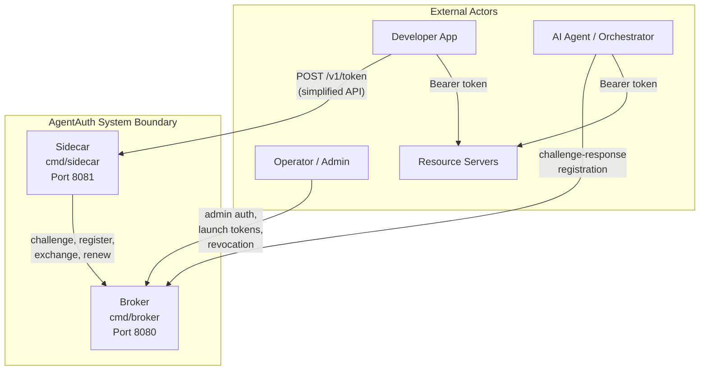
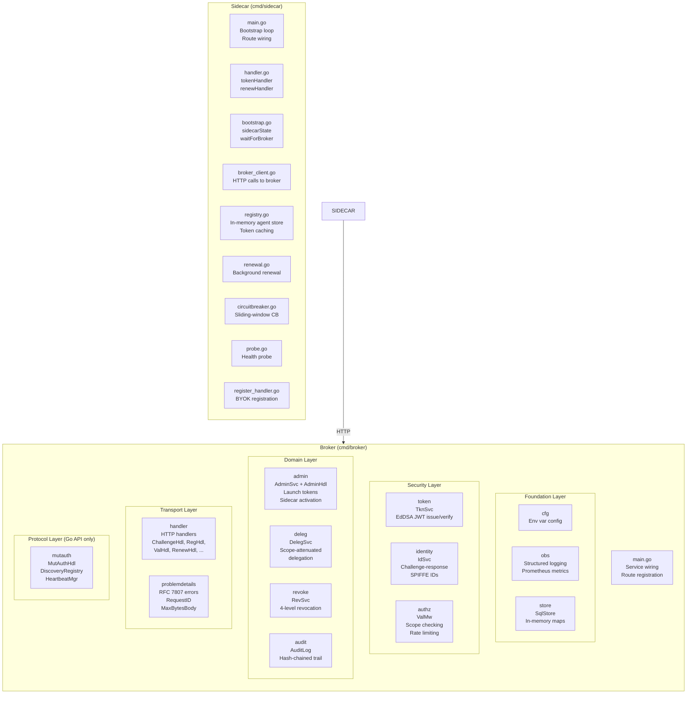
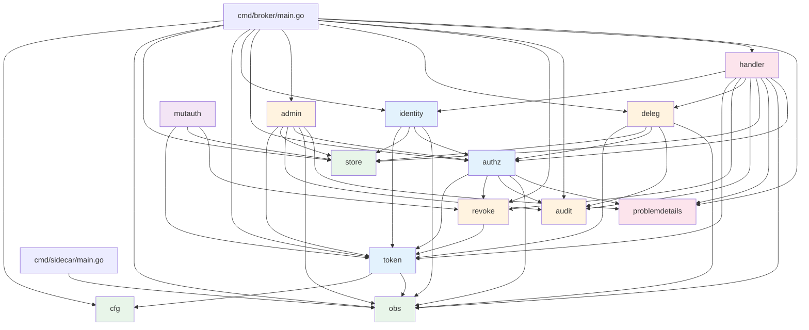
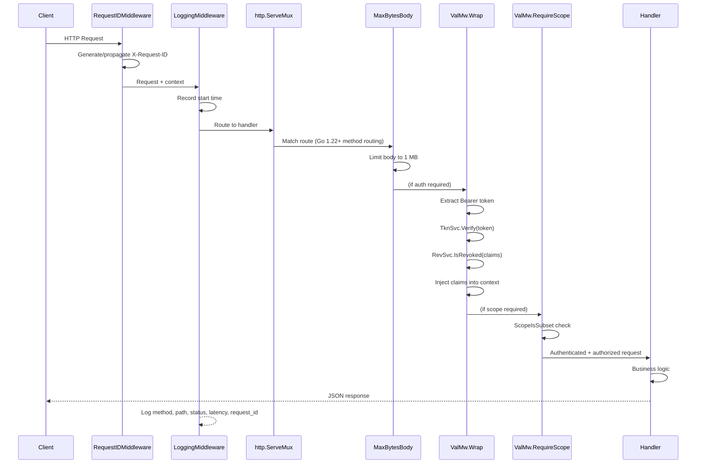
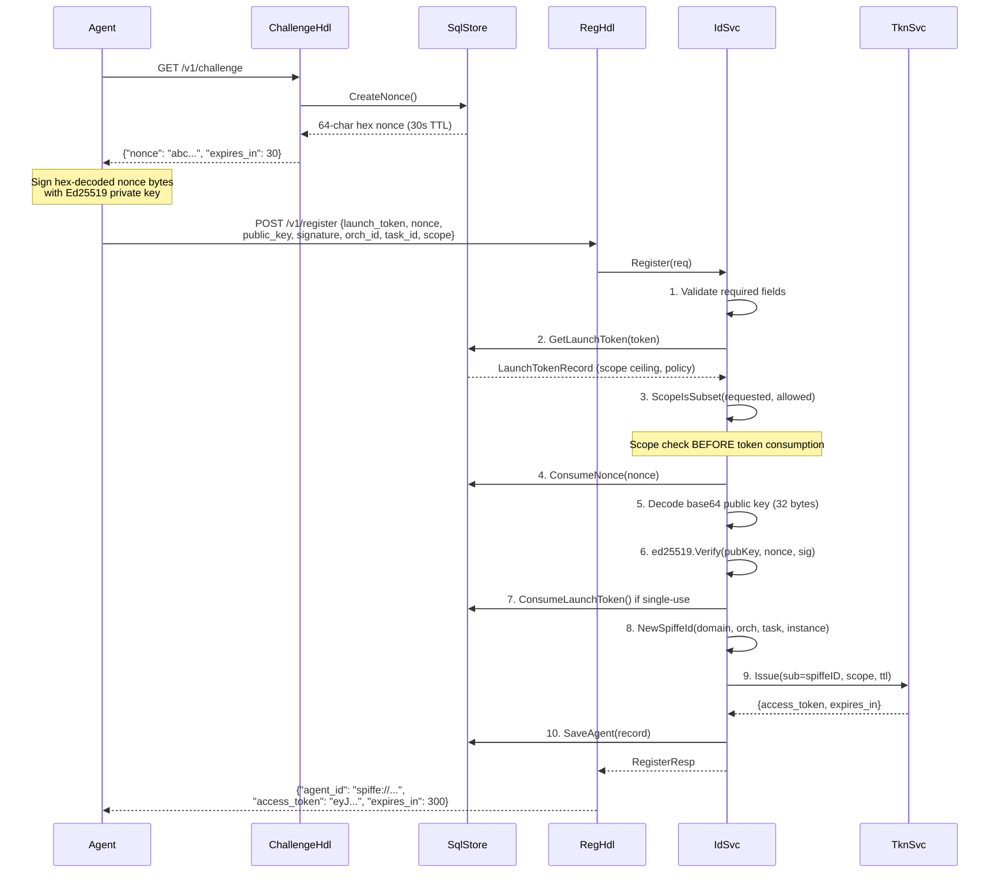
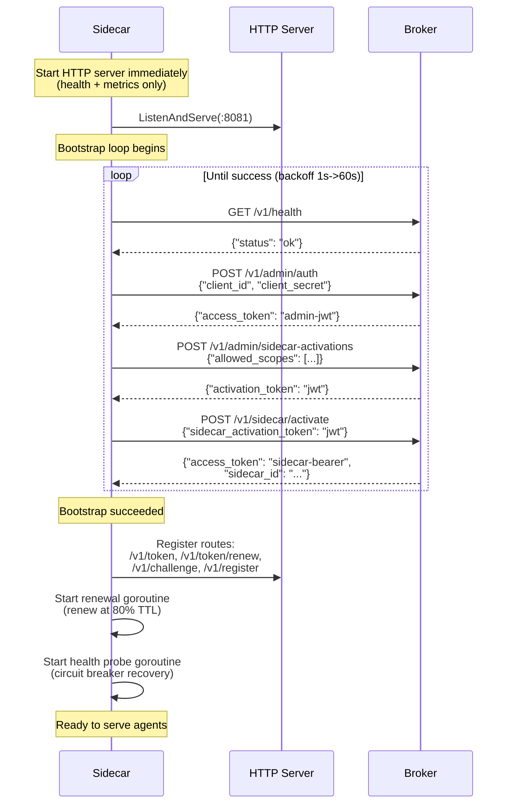
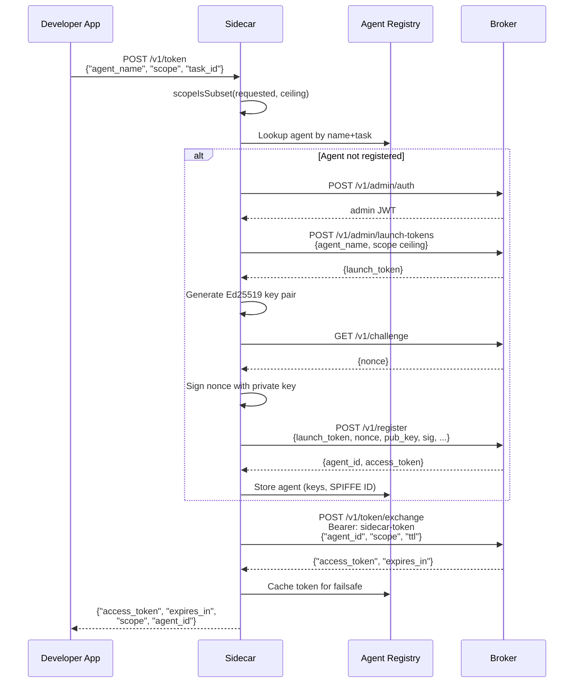
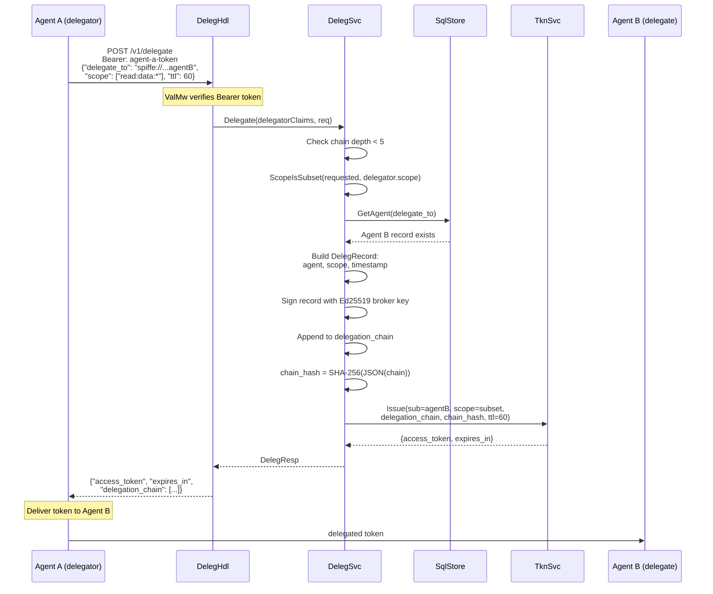
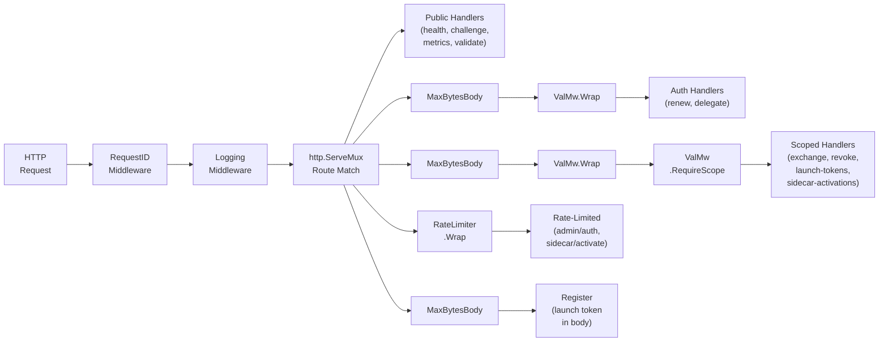

# Architecture

> **Document Version:** 2.0 | **Last Updated:** February 2026 | **Status:** Current
>
> **Audience:** Contributors, security reviewers, and operators who want to understand how AgentAuth works internally.
>
> **Prerequisites:** [Concepts](concepts.md) for the security pattern overview.
>
> **Next steps:** [API Reference](api.md) | [Contributing](../CONTRIBUTING.md) | [Getting Started: Operator](getting-started-operator.md)

---

## System Overview

AgentAuth sits between AI agents and the resources they need to access, providing ephemeral, scoped credentials through a challenge-response identity flow.



**Broker** (`cmd/broker`) -- The central authority. Generates Ed25519 key pairs on startup, issues EdDSA-signed JWTs, validates challenge-response registrations, manages scope attenuation, delegation, revocation, and maintains a hash-chained audit trail. All endpoints use `application/json` with RFC 7807 error responses.

**Sidecar** (`cmd/sidecar`) -- A developer-facing proxy. Bootstraps itself with the broker using admin auth and a single-use activation token, then exposes a simplified API. Developers call `POST /v1/token` with an agent name and scope; the sidecar handles key generation, challenge-response registration, and token exchange transparently. Includes circuit breaker resilience and cached token fallback.

---

## Component Architecture



---

## Directory Layout

```
agentauth/
|-- cmd/
|   |-- broker/
|   |   +-- main.go              # Service wiring, route registration, startup
|   |-- sidecar/
|   |   |-- main.go              # Bootstrap loop, route registration, shutdown
|   |   |-- config.go            # Environment variable parsing
|   |   |-- handler.go           # tokenHandler, renewHandler, healthHandler
|   |   |-- bootstrap.go         # sidecarState, bootstrap(), waitForBroker()
|   |   |-- broker_client.go     # HTTP client for all broker interactions
|   |   |-- registry.go          # In-memory agent store with per-agent locking
|   |   |-- renewal.go           # Background token renewal goroutine
|   |   |-- register_handler.go  # BYOK challenge proxy and registration
|   |   |-- circuitbreaker.go    # Sliding-window circuit breaker
|   |   |-- probe.go             # Background health probe for circuit recovery
|   |   +-- metrics.go           # 9 Prometheus metrics
|   +-- smoketest/               # Container smoke test binary
|-- internal/
|   |-- admin/                   # Admin auth, launch tokens, sidecar activation
|   |-- audit/                   # Hash-chained audit trail
|   |-- authz/                   # Bearer middleware, scope checking, rate limiter
|   |-- cfg/                     # Broker configuration from AA_* env vars
|   |-- deleg/                   # Scope-attenuated delegation with chain signing
|   |-- handler/                 # HTTP handlers for all broker endpoints
|   |-- identity/                # Challenge-response registration, SPIFFE IDs
|   |-- mutauth/                 # Mutual authentication (Go API only)
|   |-- obs/                     # Structured logging and Prometheus metrics
|   |-- problemdetails/          # RFC 7807 errors, request ID, body limits
|   |-- revoke/                  # Four-level token revocation
|   |-- store/                   # In-memory storage (nonces, agents, launch tokens)
|   +-- token/                   # EdDSA JWT issuance, verification, renewal
|-- scripts/                     # Gate checks, Docker helpers, E2E test scripts
|-- docs/                        # Documentation
|-- docker-compose.yml           # Broker + Sidecar on bridge network
+-- Dockerfile                   # Multi-stage build (builder, broker, sidecar)
```

---

## Package Dependency Graph



**Legend:** Green = Foundation, Blue = Security, Orange = Domain, Pink = Transport, Purple = Protocol (Go API only)

---

## Pattern Components Mapped to Code

The 7-component Ephemeral Agent Credentialing pattern maps directly to Go packages:

| Pattern Component | Go Packages | Key Types | Key Functions |
|---|---|---|---|
| 1. Ephemeral Identity Issuance | `identity`, `store`, `handler` | `IdSvc`, `RegHdl`, `ChallengeHdl`, `SqlStore` | `IdSvc.Register()`, `NewSpiffeId()` |
| 2. Short-Lived Task-Scoped Tokens | `token`, `authz` | `TknSvc`, `TknClaims`, `IssueReq` | `TknSvc.Issue()`, `TknSvc.Renew()` |
| 3. Zero-Trust Enforcement | `authz`, `handler` | `ValMw`, `RateLimiter` | `ValMw.Wrap()`, `ValMw.RequireScope()`, `ScopeIsSubset()` |
| 4. Automatic Expiration & Revocation | `revoke`, `handler` | `RevSvc`, `RevokeHdl` | `RevSvc.Revoke()`, `RevSvc.IsRevoked()` |
| 5. Immutable Audit Logging | `audit`, `handler` | `AuditLog`, `AuditEvent`, `AuditHdl` | `AuditLog.Record()`, `AuditLog.Query()` |
| 6. Agent-to-Agent Mutual Auth | `mutauth` | `MutAuthHdl`, `DiscoveryRegistry`, `HeartbeatMgr` | `InitiateHandshake()`, `RespondToHandshake()`, `CompleteHandshake()` |
| 7. Delegation Chain Verification | `deleg`, `handler` | `DelegSvc`, `DelegHdl`, `DelegRecord` | `DelegSvc.Delegate()` |

---

## Request Lifecycle

Every HTTP request passes through the same middleware stack before reaching a handler:



Not all routes use every middleware. Public endpoints (health, challenge, metrics) skip `ValMw` and `ValMw.RequireScope`. The `MaxBytesBody` wrapper is applied per-route to POST endpoints only.

---

## Data Flow Diagrams

### Agent Registration Flow

The 10-step registration is the core identity issuance flow:



### Sidecar Bootstrap Flow

The sidecar bootstraps with exponential backoff (1s to 60s cap):



### Token Exchange Flow

When a developer requests a token via the sidecar:



### Delegation Flow

Agent A delegates a narrower-scoped token to Agent B:



---

## Middleware Stack

The broker applies two layers of middleware: global middleware on all requests, and per-route middleware on specific endpoints.



**Route-to-middleware mapping from `cmd/broker/main.go`:**

| Route | Middleware Chain |
|---|---|
| `GET /v1/challenge` | RequestID -> Logging -> Handler |
| `GET /v1/health` | RequestID -> Logging -> Handler |
| `GET /v1/metrics` | RequestID -> Logging -> Handler |
| `POST /v1/token/validate` | RequestID -> Logging -> MaxBytesBody -> Handler |
| `POST /v1/register` | RequestID -> Logging -> MaxBytesBody -> Handler |
| `POST /v1/token/renew` | RequestID -> Logging -> MaxBytesBody -> ValMw -> Handler |
| `POST /v1/delegate` | RequestID -> Logging -> MaxBytesBody -> ValMw -> Handler |
| `POST /v1/token/exchange` | RequestID -> Logging -> MaxBytesBody -> ValMw -> ValMw.RequireScope(`sidecar:manage:*`) -> Handler |
| `POST /v1/revoke` | RequestID -> Logging -> MaxBytesBody -> ValMw -> ValMw.RequireScope(`admin:revoke:*`) -> Handler |
| `GET /v1/audit/events` | RequestID -> Logging -> ValMw -> ValMw.RequireScope(`admin:audit:*`) -> Handler |
| `POST /v1/admin/auth` | RequestID -> Logging -> RateLimiter(5/s, burst 10) -> Handler |
| `POST /v1/admin/launch-tokens` | RequestID -> Logging -> ValMw -> ValMw.RequireScope(`admin:launch-tokens:*`) -> Handler |
| `POST /v1/admin/sidecar-activations` | RequestID -> Logging -> ValMw -> ValMw.RequireScope(`admin:launch-tokens:*`) -> Handler |
| `POST /v1/sidecar/activate` | RequestID -> Logging -> RateLimiter(5/s, burst 10) -> Handler |

---

## Key Design Decisions

1. **In-memory storage.** All state (nonces, agents, launch tokens, revocations, audit events) lives in memory behind `sync.RWMutex`. The type is named `SqlStore` as a placeholder for a planned SQL migration. Restarting the broker clears all state.

2. **Fresh Ed25519 keys every startup.** The broker generates a new signing key pair on each start via `crypto/rand`. All previously issued tokens become unverifiable. This is intentional -- long-lived tokens are an anti-pattern for ephemeral credentialing.

3. **Scope attenuation is one-way.** Scopes can only narrow, never expand. Enforced at registration (requested vs. launch token ceiling), delegation (delegated vs. delegator scope), and token exchange (requested vs. sidecar ceiling entries).

4. **Scope check before launch token consumption.** At registration, `ScopeIsSubset` is called before `ConsumeLaunchToken`. A scope violation returns an error without wasting a single-use token.

5. **Constant-time secret comparison.** Admin authentication uses `subtle.ConstantTimeCompare` to prevent timing attacks on `AA_ADMIN_SECRET`.

6. **Sidecar anti-spoof.** The `sidecar_id` field in token exchange is always derived from the authenticated caller token's `sid` claim. Client-supplied values are ignored.

7. **Mutual auth not HTTP-exposed.** `MutAuthHdl` in `internal/mutauth` provides a 3-step mutual authentication handshake, but it is not registered on any HTTP mux. It exists as a Go API only, tested in unit tests, intended for future HTTP exposure.

8. **Circuit breaker pattern.** The sidecar implements a sliding-window circuit breaker with three states (Closed -> Open -> Probing) for broker connectivity. Failure rate threshold and window duration are configurable via `AA_SIDECAR_CB_*` env vars.

9. **Token caching for failsafe fallback.** The sidecar caches the last-issued token per agent. When the circuit breaker is open and the broker is unreachable, cached tokens are served with an `X-AgentAuth-Cached: true` response header.

10. **BYOK support.** The sidecar supports "Bring Your Own Key" registration where developers provide their own Ed25519 key pairs through `POST /v1/register`, instead of relying on sidecar-managed keys.

---

## Security Assumptions

These are explicit trust boundaries and limitations of the current implementation:

- **X-Forwarded-For trusted unconditionally.** The `clientIP()` function in `internal/authz/rate_mw.go` trusts the first entry in `X-Forwarded-For` without validation. In production, the broker must sit behind a trusted reverse proxy that sets this header correctly. Without a trusted proxy, rate limiting can be bypassed via header spoofing.

- **In-memory state is mostly not persistent.** A broker restart clears nonces, agent records, launch tokens, and revocation entries. All previously issued tokens become unverifiable (new signing keys). **Exception:** Audit events are now persisted to SQLite when `AA_DB_PATH` is configured. On startup, the broker reloads all audit events from SQLite and rebuilds the in-memory hash chain. This means the audit trail survives restarts, but all other operational state is lost.

- **Single broker instance.** There is no replication, consensus, or shared state mechanism. The broker is a single process. Running multiple instances would result in split-brain token verification (each instance has its own signing key).

- **Nonce window is 30 seconds.** Nonces expire after 30 seconds. Agents must complete the challenge-response flow within this window. Clock skew between agent and broker can cause failures.

- **Admin secret is the root of trust.** `AA_ADMIN_SECRET` is the single shared secret that bootstraps the entire system. If compromised, an attacker can issue arbitrary launch tokens and sidecar activations.

---

## External Dependencies

| Dependency | Version | Purpose |
|---|---|---|
| `github.com/prometheus/client_golang` | v1.23.2 | Prometheus metrics exposition |
| `github.com/prometheus/client_model` | v0.6.2 | Prometheus data model |
| `github.com/spiffe/go-spiffe/v2` | v2.6.0 | SPIFFE ID validation |
| `modernc.org/sqlite` | v1.35.0 | Pure-Go SQLite driver for audit event persistence (zero CGo) |
| Go stdlib `crypto/ed25519` | -- | Token signing and nonce signature verification |
| Go stdlib `crypto/sha256` | -- | Audit hash chain, delegation chain hash |
| Go stdlib `net/http` | -- | HTTP server (Go 1.22+ method routing) |
| Go stdlib `crypto/subtle` | -- | Constant-time admin secret comparison |
