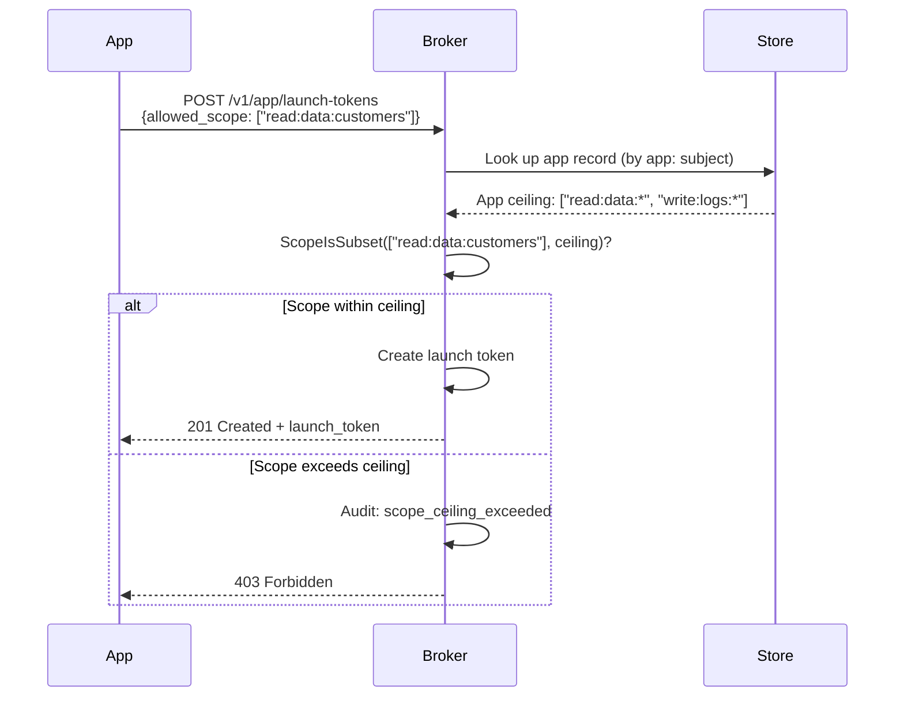
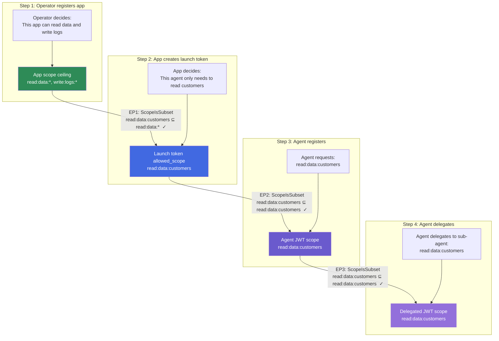

# AgentAuth Scope Model — From First Principles

## What Is a Scope?

A scope is a permission statement. It says: **this credential holder is allowed to perform this action on this resource.**

Every credential in AgentAuth carries a list of scopes. Every protected endpoint checks that the caller's scopes cover what the endpoint requires. If they don't, the request is denied with a 403.

### Format: `action:resource:identifier`

Every scope has exactly three parts, separated by colons:

```
action   : resource   : identifier
───────    ─────────    ──────────
read     : data       : customers
write    : logs       : *
admin    : revoke     : *
app      : launch-tokens : *
```

- **action** — what you're doing: `read`, `write`, `admin`, `app`
- **resource** — what you're acting on: `data`, `logs`, `revoke`, `launch-tokens`
- **identifier** — which specific instance: `customers`, `project-42`, or `*` (all)

The `*` wildcard in the identifier position means "any instance of this resource." So `read:data:*` covers `read:data:customers`, `read:data:orders`, `read:data:anything`.

The wildcard only works in the identifier position. `*:*:*` is technically valid but grants everything — that's the scope you'd see on a dev/testing launch token, never in production.

### What Makes a Scope Valid?

A scope string is valid if it has exactly three non-empty colon-separated parts. That's it. The broker doesn't maintain a registry of "known" scopes — any three-part string is accepted. This means:

- `read:data:customers` — valid
- `write:logs:project-42` — valid
- `custom:anything:you-want` — valid
- `read:data` — invalid (only two parts)
- `read::customers` — invalid (empty resource)

The broker doesn't know what `read:data:customers` means to your application. It only knows whether one scope covers another. Your application decides what the scope actually grants access to.

---

## Coverage: When Does One Scope Cover Another?

This is the core operation. Everything in the permission model reduces to this question: **does scope B cover scope A?**

B covers A when:
1. Same action (`read` == `read`)
2. Same resource (`data` == `data`)
3. Same identifier, OR B's identifier is `*`

```
Does read:data:* cover read:data:customers?
  action: read == read     ✓
  resource: data == data   ✓
  identifier: * covers customers  ✓
  → YES

Does read:data:customers cover read:data:orders?
  action: read == read     ✓
  resource: data == data   ✓
  identifier: customers ≠ orders, and customers is not *  ✗
  → NO

Does admin:revoke:* cover read:data:customers?
  action: admin ≠ read     ✗
  → NO (fails on first check)
```

### Subset Check: `ScopeIsSubset`

When we check a whole set of scopes (not just one), we ask: **is every requested scope covered by at least one scope in the allowed set?**

```
Allowed:   [read:data:*, write:logs:*]
Requested: [read:data:customers, write:logs:app-1]
  read:data:customers  → covered by read:data:*    ✓
  write:logs:app-1     → covered by write:logs:*    ✓
  → ALL COVERED → ALLOWED

Allowed:   [read:data:*]
Requested: [read:data:customers, write:logs:app-1]
  read:data:customers  → covered by read:data:*    ✓
  write:logs:app-1     → not covered by anything    ✗
  → NOT ALL COVERED → DENIED
```

This is `authz.ScopeIsSubset(requested, allowed)` — it runs at every trust boundary in the system.

---

## The Three Scope Families

Scopes in AgentAuth fall into three families. Each family belongs to a different role, and the families don't overlap.

### Admin Scopes (`admin:*:*`)

Carried by: **Admin JWT** (issued when operator authenticates with admin secret)

| Scope | What it unlocks |
|-------|----------------|
| `admin:launch-tokens:*` | Create launch tokens, register/list/update/deregister apps |
| `admin:revoke:*` | Revoke credentials at 4 levels (token, agent, task, chain) |
| `admin:audit:*` | Query the audit trail |

These are fixed — every Admin JWT gets all three. The admin is the operator; they get full system management.

### App Scopes (`app:*:*`)

Carried by: **App JWT** (issued when app authenticates with client_id + client_secret)

| Scope | What it unlocks |
|-------|----------------|
| `app:launch-tokens:*` | Create launch tokens for agents (within scope ceiling) |
| `app:agents:*` | Manage agents under this app (future) |
| `app:audit:read` | Read audit events for own agents (future) |

These are also fixed — every App JWT gets all three. But what the app can put INTO a launch token is constrained by the scope ceiling (see below).

### Task Scopes (everything else)

Carried by: **Agent JWT** and **Delegated JWT**

These are the actual business permissions — what the agent is allowed to do with the resources it accesses:

```
read:data:customers
write:logs:*
execute:pipeline:deploy-prod
query:database:analytics
```

Task scopes are not predefined by the broker. They're defined by the operator when they set up the app's scope ceiling, and they're meaningful to the application that the agent is working with. The broker only knows how to compare them — coverage checks, subset checks — not what they mean.

---

## Where Scopes Are Checked (The Four Enforcement Points)

This is where the design gets concrete. Scopes are checked at four distinct points, and each point enforces the attenuation invariant: permissions can only narrow.

### Enforcement Point 1: App Creates Launch Token

**Where:** `AdminHdl.handleCreateLaunchToken` (only when caller is an app)

**What's checked:** The launch token's `allowed_scope` must be a subset of the app's scope ceiling.

```
App ceiling (set at registration):  [read:data:*, write:logs:*]
Launch token requested scope:       [read:data:customers]
ScopeIsSubset check:                read:data:customers ⊆ read:data:*  → ✓ ALLOWED
```

```
App ceiling:                        [read:data:*]
Launch token requested scope:       [admin:revoke:*]
ScopeIsSubset check:                admin:revoke:* ⊄ read:data:*  → ✗ DENIED (403)
Audit event:                        scope_ceiling_exceeded
```



**What happens if the caller is admin, not an app?** The ceiling check is skipped. Admin-created launch tokens have no scope constraint. This is the TD-013 question — we'll come back to it.

### Enforcement Point 2: Agent Registers

**Where:** `IdSvc.Register`

**What's checked:** The agent's `requested_scope` must be a subset of the launch token's `allowed_scope`.

```
Launch token allowed_scope:   [read:data:customers]
Agent requested_scope:        [read:data:customers]
ScopeIsSubset check:          ✓ exact match → ALLOWED
```

```
Launch token allowed_scope:   [read:data:customers]
Agent requested_scope:        [read:data:customers, write:logs:*]
ScopeIsSubset check:          write:logs:* not covered → ✗ DENIED
Audit event:                  registration_policy_violation
```

**Critical ordering:** The scope check happens BEFORE the launch token is consumed. This way, a scope violation doesn't waste a single-use launch token — the app can fix the scope and try again with the same token.

### Enforcement Point 3: Agent Delegates

**Where:** `DelegSvc.Delegate`

**What's checked:** The delegated scope must be a subset of the delegator's scope.

```
Delegator scope:     [read:data:*, write:logs:*]
Requested for delegate: [read:data:customers]
ScopeIsSubset check:    ✓ → ALLOWED
```

```
Delegator scope:     [read:data:customers]
Requested for delegate: [read:data:*, write:logs:*]
ScopeIsSubset check:    read:data:* not covered by read:data:customers → ✗ DENIED
Audit event:            delegation_attenuation_violation
```

### Enforcement Point 4: Endpoint Access

**Where:** `ValMw.RequireScope` and `ValMw.RequireAnyScope`

**What's checked:** The token's scopes must cover the scope required by the endpoint.

```
Endpoint requires:    admin:revoke:*
Token scopes:         [admin:launch-tokens:*, admin:revoke:*, admin:audit:*]
ScopeIsSubset check:  admin:revoke:* ⊆ token scopes → ✓ ACCESS GRANTED
```

```
Endpoint requires:    admin:revoke:*
Token scopes:         [read:data:customers]
ScopeIsSubset check:  admin:revoke:* not covered → ✗ 403 FORBIDDEN
Audit event:          scope_violation
```

Some endpoints accept multiple caller types. `POST /v1/admin/launch-tokens` and `POST /v1/app/launch-tokens` both call the same handler, but with different required scopes:
- Admin route requires `admin:launch-tokens:*`
- App route requires `app:launch-tokens:*`

---

## The Attenuation Chain — How Scopes Narrow

Here's the complete flow from operator to working agent, showing how scopes narrow at each step:



At every arrow, `ScopeIsSubset` enforces that the new scope is covered by the previous scope. The chain can only narrow.

---

## Now: The Admin Launch Token Question

With the scope model understood, let's come back to the question: **why would admin need to create launch tokens?**

### The Production Path (App Creates Launch Token)

```
Operator → registers app with ceiling [read:data:*]
App      → authenticates, gets App JWT
App      → creates launch token with [read:data:customers]
           EP1 fires: read:data:customers ⊆ read:data:*  ✓
           Launch token is constrained by ceiling
Agent    → registers with launch token
           EP2 fires: requested ⊆ allowed  ✓
           Agent JWT scope ≤ launch token ≤ app ceiling
```

Every scope in the chain is audited, constrained, and traceable back to the app (via `app_id` on the launch token) and ultimately to the operator (who set the ceiling).

### The Admin Path (Admin Creates Launch Token)

```
Operator → authenticates, gets Admin JWT with admin:launch-tokens:*
Operator → creates launch token with [read:data:*, write:data:*, admin:revoke:*]
           EP1 does NOT fire — caller is admin, not app
           Launch token has NO scope ceiling check
           Launch token has NO app_id (empty)
Agent    → registers with launch token
           EP2 fires: requested ⊆ allowed  ✓
           But "allowed" was never constrained
```

What's missing:
- **No ceiling enforcement.** Admin can put any scopes in the launch token — including admin scopes, app scopes, wildcard scopes. There's no check.
- **No app traceability.** The agent has no `app_id`. In the audit trail, you can see who created the launch token (`created_by: "admin"`) but not which application context the agent belongs to.
- **No scope attenuation at EP1.** The first enforcement point is skipped entirely. The chain starts at EP2 (agent registration) instead of EP1.

### So Why Does It Exist?

The admin launch token path serves exactly two purposes:

1. **Bootstrapping.** Before any apps are registered, someone needs to test the system. The operator creates a launch token, registers a test agent, verifies the flow works. This is the "aactl init → create launch token → test" development workflow.

2. **Emergency/debugging.** If something is wrong with the app credential flow and you need to get an agent running immediately, the admin can bypass the app layer entirely.

### What It Should NOT Be Used For

Production agent credentialing. In production:
- Every agent should trace back to an app
- Every launch token should be constrained by a scope ceiling
- The audit trail should show the full chain: operator → app → launch token → agent

The admin path breaks all three of these properties.

### The Design Options (TD-013)

Now the question becomes: what do we do about it?

| Option | What changes | Trade-off |
|--------|-------------|-----------|
| **A. Remove admin launch token creation** | Delete `POST /v1/admin/launch-tokens` | Clean, but breaks the bootstrap/dev workflow. Operator would need to register a dev app first, even for basic testing |
| **B. Restrict to dev mode only** | Admin launch tokens only work when `MODE=development` | Production gets the clean model, dev keeps the convenience. Clear boundary |
| **C. Require app_id parameter** | Admin creating a launch token must specify which app it's for. Ceiling is enforced against that app's ceiling | Preserves admin convenience, adds traceability, enforces ceiling. More complex but most correct |
| **D. Separate the scope** | Split `admin:launch-tokens:*` into `admin:launch-tokens:create` and `admin:apps:*`. Admin gets app management but not launch token creation by default | Fine-grained, but adds scope complexity |

The answer depends on what matters more: developer convenience during bootstrapping, or a clean security model with no exceptions. Option B is probably the pragmatic choice — you get both, with a clear boundary between dev and production behavior.

---

## Summary

- Scopes are three-part permission strings: `action:resource:identifier`
- `*` in the identifier position is a wildcard covering all instances
- `ScopeIsSubset` is the single function that enforces all permission checks
- Scopes are checked at four enforcement points: app→launch token, launch token→agent, agent→delegate, and every endpoint access
- At every step, scope can only narrow — the attenuation invariant
- Admin scopes (`admin:*:*`), app scopes (`app:*:*`), and task scopes are three distinct families
- The admin launch token path bypasses EP1 (no ceiling check) — this is a known design question (TD-013), not a bug
