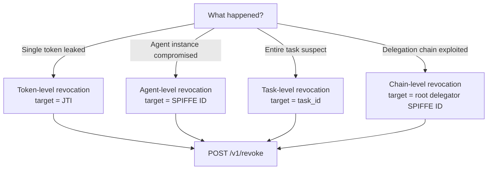

# Common Tasks

Step-by-step instructions for the most common AgentAuth workflows, split by role.

---

## Developer Tasks

> **Persona:** Developer building an AI agent in Python or TypeScript.
> You interact with the sidecar. You do not need admin credentials.
>
> **Prerequisite:** [Getting Started: Developer](getting-started-developer.md)

### Get a Token (via Sidecar)

Request a scoped, short-lived token from the sidecar. The sidecar handles all broker communication and key management transparently.

```python
import requests

SIDECAR = "http://localhost:8081"

resp = requests.post(f"{SIDECAR}/v1/token", json={
    "agent_name": "data-processor",
    "task_id": "task-analyze-q4",
    "scope": ["read:data:*"],
    "ttl": 300,
})
resp.raise_for_status()
data = resp.json()

token = data["access_token"]
agent_id = data["agent_id"]
expires_in = data["expires_in"]

print(f"Agent: {agent_id}")
print(f"Scope: {data['scope']}")
print(f"Expires in: {expires_in}s")
```

**Request fields:**

| Field | Type | Required | Description |
|-------|------|----------|-------------|
| `agent_name` | string | Yes | Identifies this agent instance |
| `task_id` | string | No | Associates the token with a specific task |
| `scope` | string[] | Yes | Requested permissions (`action:resource:identifier`) |
| `ttl` | int | No | Token lifetime in seconds (default: 300) |

**Response fields:**

| Field | Type | Description |
|-------|------|-------------|
| `access_token` | string | Signed JWT for use in `Authorization: Bearer` headers |
| `expires_in` | int | Seconds until the token expires |
| `scope` | string[] | Granted scope (matches your request if valid) |
| `agent_id` | string | Your SPIFFE identity (`spiffe://domain/agent/orch/task/instance`) |

The `scope` must be within the sidecar's configured scope ceiling. If you request a scope outside the ceiling, the sidecar returns 403. Ask your operator what scopes are available.

---

### Renew a Token

Renew before the token expires. The renewed token has fresh timestamps but keeps the same identity and scope.

```python
import requests

SIDECAR = "http://localhost:8081"

def renew_token(sidecar, token):
    """Renew a token. Returns new token data or raises on failure."""
    resp = requests.post(
        f"{sidecar}/v1/token/renew",
        headers={"Authorization": f"Bearer {token}"},
    )
    if resp.status_code == 401:
        raise RuntimeError("Token expired -- re-acquire from sidecar")
    if resp.status_code == 403:
        raise RuntimeError("Token revoked -- re-acquire from sidecar")
    resp.raise_for_status()
    return resp.json()

# Renew an existing token
token = "<your current access_token>"
try:
    data = renew_token(SIDECAR, token)
    new_token = data["access_token"]
    new_ttl = data["expires_in"]
    print(f"Renewed. New TTL: {new_ttl}s")
except RuntimeError as e:
    print(f"Renewal failed: {e}")
    # Re-acquire a fresh token via POST /v1/token
```

**When to renew:** At 80% of the TTL. For a 300-second token, renew at 240 seconds.

**When renewal fails:**

| Status | Meaning | Action |
|--------|---------|--------|
| 401 | Token expired | Re-acquire via `POST /v1/token` |
| 403 | Token revoked | Re-acquire via `POST /v1/token` |
| 502 | Broker unreachable | Retry with backoff |

---

### Validate a Token

Check whether a token is valid and inspect its claims. This endpoint does not require authentication.

```python
import requests

BROKER = "http://localhost:8080"

def validate_token(broker, token):
    """Validate a token and return its claims if valid."""
    resp = requests.post(
        f"{broker}/v1/token/validate",
        json={"token": token},
    )
    resp.raise_for_status()
    result = resp.json()

    if result["valid"]:
        return result["claims"]
    else:
        raise ValueError(f"Token invalid: {result.get('error', 'unknown')}")

token = "<token to validate>"
try:
    claims = validate_token(BROKER, token)
    print(f"Subject:  {claims['sub']}")
    print(f"Scope:    {claims['scope']}")
    print(f"Task ID:  {claims['task_id']}")
    print(f"Orch ID:  {claims['orch_id']}")
    print(f"Expires:  {claims['exp']}")
    print(f"JTI:      {claims['jti']}")
except ValueError as e:
    print(f"Validation failed: {e}")
```

The validation endpoint returns HTTP 200 in both valid and invalid cases. Always check the `valid` field.

**Claims returned when valid:**

| Claim | Type | Description |
|-------|------|-------------|
| `iss` | string | Always `"agentauth"` |
| `sub` | string | Agent SPIFFE ID |
| `exp` | int | Expiration timestamp (Unix) |
| `iat` | int | Issued-at timestamp (Unix) |
| `jti` | string | Unique token identifier (32 hex chars) |
| `scope` | string[] | Granted permissions |
| `task_id` | string | Associated task |
| `orch_id` | string | Associated orchestrator |

---

### Register with Your Own Keys (BYOK)

Use BYOK when you need to control your Ed25519 keys directly -- for audit trails, compliance, or multi-sidecar scenarios.

```python
import base64
import requests
from cryptography.hazmat.primitives.asymmetric.ed25519 import Ed25519PrivateKey
from cryptography.hazmat.primitives.serialization import Encoding, PublicFormat

SIDECAR = "http://localhost:8081"

# 1. Generate Ed25519 keypair
private_key = Ed25519PrivateKey.generate()
pub_raw = private_key.public_key().public_bytes(Encoding.Raw, PublicFormat.Raw)
pub_b64 = base64.b64encode(pub_raw).decode()

# 2. Get a challenge nonce
challenge = requests.get(f"{SIDECAR}/v1/challenge")
challenge.raise_for_status()
nonce_hex = challenge.json()["nonce"]

# 3. Sign the nonce bytes (hex-decode first)
nonce_bytes = bytes.fromhex(nonce_hex)
signature = private_key.sign(nonce_bytes)
sig_b64 = base64.b64encode(signature).decode()

# 4. Register with the sidecar
reg = requests.post(f"{SIDECAR}/v1/register", json={
    "agent_name": "byok-agent",
    "task_id": "task-secure-001",
    "public_key": pub_b64,
    "signature": sig_b64,
    "nonce": nonce_hex,
})
reg.raise_for_status()
agent_id = reg.json()["agent_id"]
print(f"BYOK registered as {agent_id}")

# 5. Get tokens through the normal sidecar endpoint
token_resp = requests.post(f"{SIDECAR}/v1/token", json={
    "agent_name": "byok-agent",
    "task_id": "task-secure-001",
    "scope": ["read:data:*"],
})
token_resp.raise_for_status()
print(f"Token acquired: {token_resp.json()['access_token'][:40]}...")
```

**BYOK registration fields:**

| Field | Type | Required | Description |
|-------|------|----------|-------------|
| `agent_name` | string | Yes | Agent identifier |
| `task_id` | string | No | Task association |
| `public_key` | string | Yes | Base64 of raw 32-byte Ed25519 public key |
| `signature` | string | Yes | Base64 of Ed25519 signature over the nonce bytes |
| `nonce` | string | Yes | Hex nonce from `GET /v1/challenge` |

After BYOK registration, use `POST /v1/token` as normal to get scoped tokens.

---

### Delegate to Another Agent

Delegation lets your agent issue a narrower-scoped token to another registered agent. Scopes can only narrow (attenuate), never expand.

```python
import requests

BROKER = "http://localhost:8080"

# Your token (the delegator)
my_token = "<your access_token with read:data:*>"

# The other agent's SPIFFE ID (the delegate)
delegate_agent_id = "spiffe://agentauth.local/agent/orch-001/task-002/abc123"

resp = requests.post(
    f"{BROKER}/v1/delegate",
    headers={"Authorization": f"Bearer {my_token}"},
    json={
        "delegate_to": delegate_agent_id,
        "scope": ["read:data:users"],  # must be subset of your scope
        "ttl": 60,
    },
)
resp.raise_for_status()
data = resp.json()

delegated_token = data["access_token"]
chain = data["delegation_chain"]

print(f"Delegated token expires in {data['expires_in']}s")
print(f"Delegation chain depth: {len(chain)}")
for entry in chain:
    print(f"  {entry['agent']} -> scope: {entry['scope']}")
```

**Delegation rules:**

- The delegated `scope` must be a subset of your token's scope.
- You cannot escalate: `read:data:*` cannot delegate `write:data:*`.
- You cannot widen resources: `read:data:users` cannot delegate `read:data:*`.
- Maximum delegation chain depth is 5.
- The `delegate_to` must be the SPIFFE ID of a registered agent.
- Default TTL is 60 seconds if not specified.
- Each chain entry is cryptographically signed. The token includes a `chain_hash` claim for integrity verification.

**Delegation request fields:**

| Field | Type | Required | Description |
|-------|------|----------|-------------|
| `delegate_to` | string | Yes | SPIFFE ID of the delegate agent |
| `scope` | string[] | Yes | Permissions to delegate (must be subset of yours) |
| `ttl` | int | No | Token lifetime in seconds (default: 60) |

---

### Handle Errors

AgentAuth uses RFC 7807 `application/problem+json` error responses from the broker. The sidecar uses a simpler JSON error format.

#### Broker Error Format (RFC 7807)

```json
{
  "type": "urn:agentauth:error:scope_violation",
  "title": "Forbidden",
  "status": 403,
  "detail": "requested scope exceeds allowed scope",
  "instance": "/v1/register",
  "error_code": "scope_violation",
  "request_id": "a1b2c3d4",
  "hint": "requested scope must be a subset of allowed scope"
}
```

#### Sidecar Error Format

```json
{
  "error": "Forbidden",
  "detail": "requested scope exceeds sidecar ceiling"
}
```

#### Status Code Reference for Developers

| Status | Error Code | What It Means | What To Do |
|--------|-----------|---------------|------------|
| 400 | `invalid_request` | Malformed JSON or missing required fields | Fix the request body |
| 401 | `unauthorized` | Token expired, invalid signature, or bad launch token | Re-acquire token via sidecar |
| 403 | `scope_violation` | Requested scope exceeds allowed scope | Request a narrower scope |
| 403 | `insufficient_scope` | Token lacks required scope for this endpoint | Check your token's scope |
| 403 | -- | Token has been revoked | Re-acquire token via sidecar |
| 404 | `not_found` | Delegate agent not found (delegation) | Verify the delegate's SPIFFE ID |
| 429 | `rate_limited` | Too many requests | Wait and retry with backoff |
| 502 | -- | Sidecar cannot reach broker | Retry with backoff |
| 503 | -- | Broker unavailable, no cached token | Wait for broker recovery |

#### Error Handling Pattern

```python
import requests
import time

SIDECAR = "http://localhost:8081"

def request_with_retry(sidecar, token, max_retries=3):
    """Make a request with automatic retry and re-bootstrap."""
    for attempt in range(max_retries):
        resp = requests.post(
            f"{sidecar}/v1/token/renew",
            headers={"Authorization": f"Bearer {token}"},
        )

        if resp.status_code == 200:
            return resp.json()

        if resp.status_code in (401, 403):
            # Token expired or revoked -- get a new one
            print("Token invalid, re-acquiring...")
            new_resp = requests.post(f"{sidecar}/v1/token", json={
                "agent_name": "my-agent",
                "task_id": "task-001",
                "scope": ["read:data:*"],
            })
            new_resp.raise_for_status()
            token = new_resp.json()["access_token"]
            continue

        if resp.status_code == 429:
            wait = int(resp.headers.get("Retry-After", 1))
            print(f"Rate limited, waiting {wait}s...")
            time.sleep(wait)
            continue

        if resp.status_code in (502, 503):
            backoff = 2 ** attempt
            print(f"Broker unavailable, retrying in {backoff}s...")
            time.sleep(backoff)
            continue

        resp.raise_for_status()

    raise RuntimeError("Max retries exceeded")
```

---

## Operator Tasks

> **Target persona:** Platform Operator
>
> These tasks cover administrative operations: authentication, launch token management, sidecar deployment, revocation, audit, and monitoring. All examples use curl.
>
> **Prerequisite:** Broker running, `AA_ADMIN_SECRET` set. See [Getting Started: Operator](getting-started-operator.md).

---

### Authenticate as Admin

Every admin operation requires a Bearer token obtained from the admin auth endpoint. Admin tokens have a 300-second TTL and include all admin scopes.

```bash
ADMIN_TOKEN=$(curl -s -X POST http://localhost:8080/v1/admin/auth \
  -H "Content-Type: application/json" \
  -d "{\"client_id\": \"admin\", \"client_secret\": \"$AA_ADMIN_SECRET\"}" \
  | python3 -c "import sys,json; print(json.load(sys.stdin)['access_token'])")
```

The response includes:

```json
{
  "access_token": "eyJhbGciOiJFZERTQSIs...",
  "expires_in": 300,
  "token_type": "Bearer"
}
```

**Admin token scopes:** `admin:launch-tokens:*`, `admin:revoke:*`, `admin:audit:*`

**Rate limit:** 5 requests/second, burst 10, per IP address. Exceeding returns 429 with `Retry-After: 1`.

Cache the admin token and reuse it within its 300-second TTL rather than re-authenticating for every operation.

---

### Create Launch Tokens

Launch tokens are the "secret zero" that bootstraps agent identity. Design them carefully -- the launch token policy defines the maximum scope and TTL that any agent using this token can receive.

```bash
curl -s -X POST http://localhost:8080/v1/admin/launch-tokens \
  -H "Content-Type: application/json" \
  -H "Authorization: Bearer $ADMIN_TOKEN" \
  -d '{
    "agent_name": "data-processor",
    "allowed_scope": ["read:data:*"],
    "max_ttl": 300,
    "single_use": true,
    "ttl": 30
  }'
```

Response (201 Created):

```json
{
  "launch_token": "a1b2c3d4...64-hex-characters",
  "expires_at": "2026-02-15T12:00:30Z",
  "policy": {
    "allowed_scope": ["read:data:*"],
    "max_ttl": 300
  }
}
```

#### Policy design guidance

| Decision | Recommendation |
|----------|---------------|
| **`single_use`** | Set `true` for one-shot agents. Set `false` for orchestrators that register multiple agents with the same token. |
| **`ttl`** (launch token lifetime) | Keep short (30s default). This is how long the token is valid for initiating registration, not the agent token lifetime. |
| **`max_ttl`** (agent token cap) | Match to expected task duration. 300s (5 min) for short tasks, up to 900s (15 min) for longer workflows. |
| **`allowed_scope`** | Principle of least privilege. A data-reader agent should get `["read:data:*"]`, not `["read:data:*", "write:data:*"]`. |

**Key distinction:** `ttl` controls how long the launch token itself is valid (default 30s). `max_ttl` caps the TTL of the agent token issued during registration (default 300s). These are independent.

---

### Revoke Credentials

AgentAuth provides four revocation levels, each with a different blast radius. Use the narrowest level that addresses the incident.



#### Token-level revocation

Revoke a single token by its JTI. Use when a specific token has been leaked but the agent itself is not compromised.

```bash
curl -s -X POST http://localhost:8080/v1/revoke \
  -H "Content-Type: application/json" \
  -H "Authorization: Bearer $ADMIN_TOKEN" \
  -d '{"level": "token", "target": "JTI_VALUE"}'
```

To find the JTI, validate the token first:

```bash
curl -s -X POST http://localhost:8080/v1/token/validate \
  -H "Content-Type: application/json" \
  -d '{"token": "THE_TOKEN_STRING"}' \
  | python3 -c "import sys,json; print(json.load(sys.stdin)['claims']['jti'])"
```

#### Agent-level revocation

Revoke all tokens for a specific agent. Use when an agent instance is compromised.

```bash
curl -s -X POST http://localhost:8080/v1/revoke \
  -H "Content-Type: application/json" \
  -H "Authorization: Bearer $ADMIN_TOKEN" \
  -d '{"level": "agent", "target": "spiffe://agentauth.local/agent/orch/task/instance"}'
```

#### Task-level revocation

Revoke all tokens associated with a task ID. Use for task-wide incidents where multiple agents under one task may be compromised.

```bash
curl -s -X POST http://localhost:8080/v1/revoke \
  -H "Content-Type: application/json" \
  -H "Authorization: Bearer $ADMIN_TOKEN" \
  -d '{"level": "task", "target": "task-001"}'
```

#### Chain-level revocation

Revoke all tokens in a delegation chain. Use when the root delegator is compromised and all downstream delegated tokens must be invalidated.

```bash
curl -s -X POST http://localhost:8080/v1/revoke \
  -H "Content-Type: application/json" \
  -H "Authorization: Bearer $ADMIN_TOKEN" \
  -d '{"level": "chain", "target": "spiffe://agentauth.local/agent/orch/task/instance"}'
```

The `target` is the SPIFFE ID of the root delegator (the first entry in the `delegation_chain`).

All revocation responses follow the same format:

```json
{"revoked": true, "level": "token", "target": "...", "count": 1}
```

Revoked tokens are rejected by the bearer validation middleware on subsequent requests with a 403 status.

---

### Query the Audit Trail

The audit trail is an append-only, hash-chained log of every significant operation. Use it for forensics, compliance, and incident investigation.

```bash
# All events (default: last 100)
curl -s "http://localhost:8080/v1/audit/events" \
  -H "Authorization: Bearer $ADMIN_TOKEN"

# Filter by agent
curl -s "http://localhost:8080/v1/audit/events?agent_id=spiffe://agentauth.local/agent/orch/task/instance" \
  -H "Authorization: Bearer $ADMIN_TOKEN"

# Filter by event type
curl -s "http://localhost:8080/v1/audit/events?event_type=token_revoked" \
  -H "Authorization: Bearer $ADMIN_TOKEN"

# Filter by time range
curl -s "http://localhost:8080/v1/audit/events?since=2026-02-15T00:00:00Z&until=2026-02-15T23:59:59Z" \
  -H "Authorization: Bearer $ADMIN_TOKEN"

# Filter by task
curl -s "http://localhost:8080/v1/audit/events?task_id=task-001" \
  -H "Authorization: Bearer $ADMIN_TOKEN"

# Paginate through results
curl -s "http://localhost:8080/v1/audit/events?limit=50&offset=100" \
  -H "Authorization: Bearer $ADMIN_TOKEN"
```

**Available filters:**

| Parameter | Type | Description |
|-----------|------|-------------|
| `agent_id` | string | Filter by agent SPIFFE ID |
| `task_id` | string | Filter by task ID |
| `event_type` | string | Filter by event type |
| `since` | string | Start time (RFC 3339) |
| `until` | string | End time (RFC 3339) |
| `limit` | int | Max results (default 100, max 1000) |
| `offset` | int | Skip N results for pagination |

**Hash chain verification:** Each event has a `hash` and `prev_hash` field. The first event's `prev_hash` is 64 zeros (genesis). To verify integrity, re-compute `SHA256(prev_hash|id|timestamp|event_type|agent_id|task_id|orch_id|detail)` for each event and confirm it matches the recorded `hash`.

---

### Deploy and Manage Sidecars

The sidecar auto-bootstraps with the broker on startup. As an operator, you configure environment variables and let the sidecar handle the rest.

**Required sidecar environment variables:**

```bash
export AA_ADMIN_SECRET="..."                                # Must match broker
export AA_SIDECAR_SCOPE_CEILING="read:data:*,write:data:*"  # Maximum scopes
export AA_BROKER_URL="http://localhost:8080"                 # Broker address
```

**Activation flow:** On startup the sidecar automatically:
1. Waits for the broker health endpoint.
2. Authenticates as admin using `AA_ADMIN_SECRET`.
3. Creates a sidecar activation token.
4. Exchanges the activation token for a sidecar bearer (single-use, TTL 900s).
5. Registers developer-facing routes (`/v1/token`, `/v1/token/renew`, `/v1/challenge`, `/v1/register`).
6. Starts a background renewal goroutine at 80% TTL (configurable via `AA_SIDECAR_RENEWAL_BUFFER`).

**Verify sidecar status:**

```bash
curl -s http://localhost:8081/v1/health | python3 -m json.tool
```

Check these fields:
- `broker_connected`: `true` means the sidecar has a valid broker bearer token.
- `healthy`: `true` means fully operational.
- `agents_registered`: count of agents currently in sidecar memory.
- `scope_ceiling`: the configured scope ceiling.

---

### Monitor the System

#### Key metrics to watch

| What to monitor | Metric | Alert when |
|-----------------|--------|------------|
| Broker availability | `agentauth_sidecar_circuit_state` | Value > 0 (open or probing) |
| Failed admin auth attempts | `agentauth_admin_auth_total{status="failure"}` | Sustained increase |
| Revocation activity | `agentauth_tokens_revoked_total` | Unexpected spike |
| Bootstrap failures | `agentauth_sidecar_bootstrap_total{status="failure"}` | Any increase after initial startup |
| Cached token usage | `agentauth_sidecar_cached_tokens_served_total` | Sustained increase indicates broker issues |
| Registration failures | `agentauth_registrations_total{status="failure"}` | Unexpected failures |
| Request latency | `agentauth_request_duration_seconds` | p99 exceeds acceptable threshold |

#### Prometheus scrape configuration

```yaml
scrape_configs:
  - job_name: 'agentauth-broker'
    static_configs:
      - targets: ['localhost:8080']
    metrics_path: /v1/metrics

  - job_name: 'agentauth-sidecar'
    static_configs:
      - targets: ['localhost:8081']
    metrics_path: /v1/metrics
```

#### Health check integration

For Docker health checks, the broker uses `wget --spider` and the sidecar can use `curl`:

```yaml
healthcheck:
  test: ["CMD", "wget", "--spider", "-q", "http://localhost:8080/v1/health"]
  interval: 2s
  timeout: 3s
  retries: 10
```

For Kubernetes liveness/readiness probes, point them at `GET /v1/health` on each service's port.
