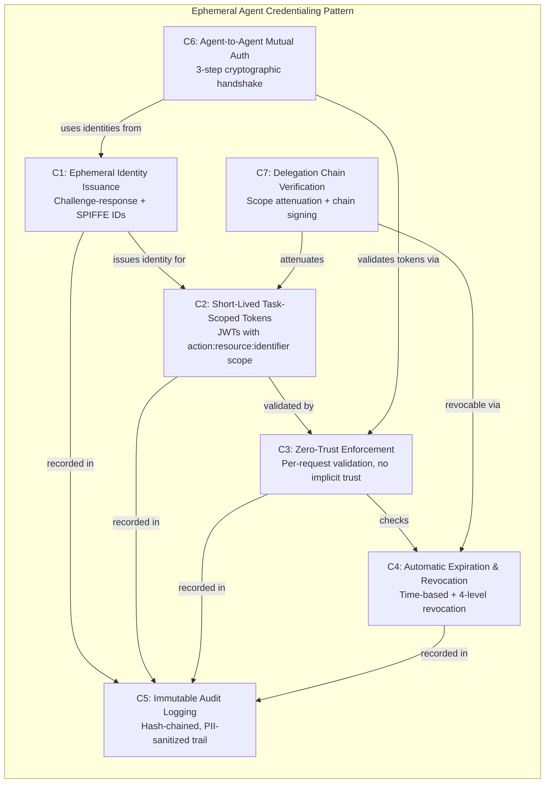
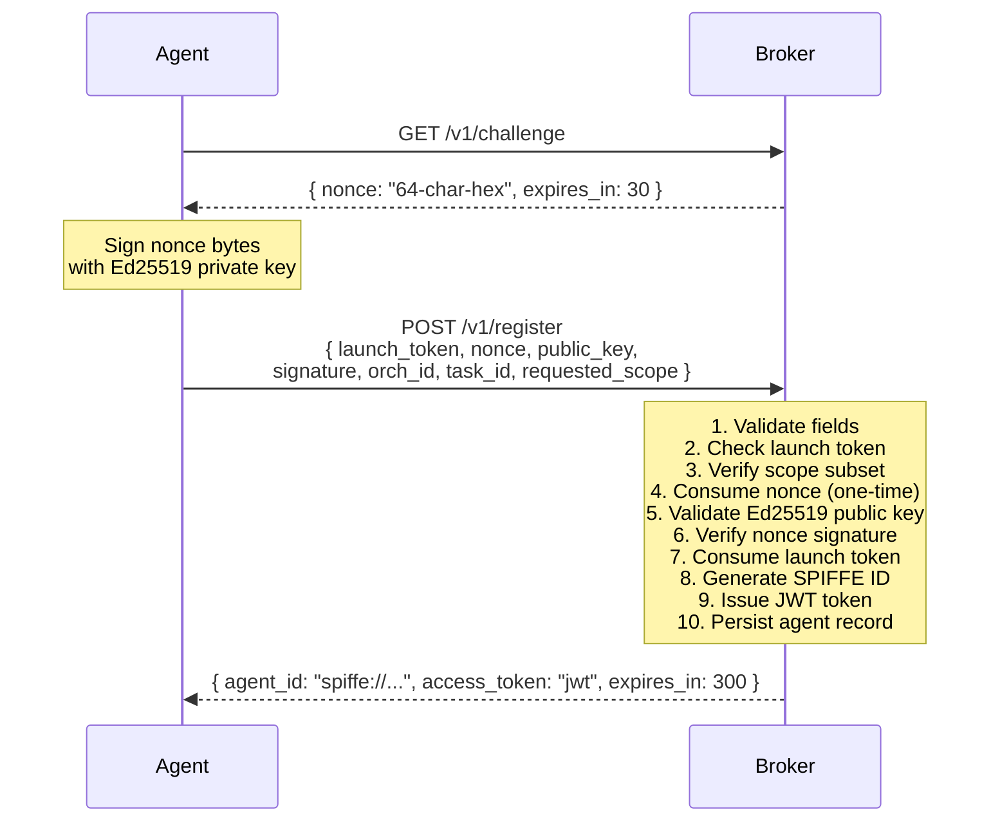
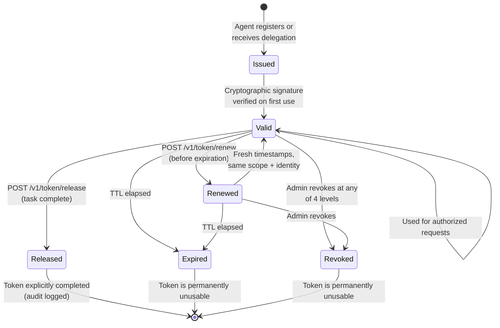
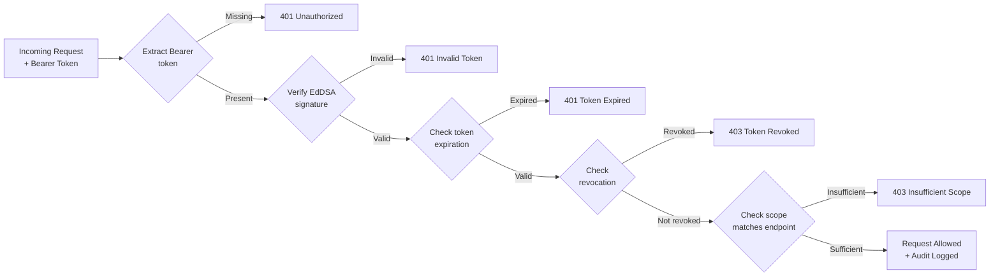
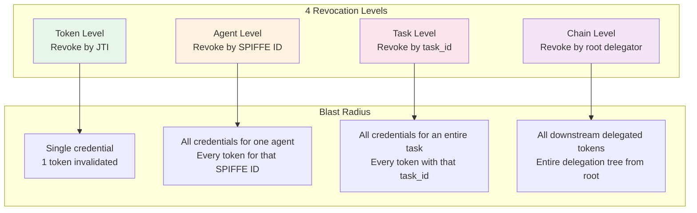
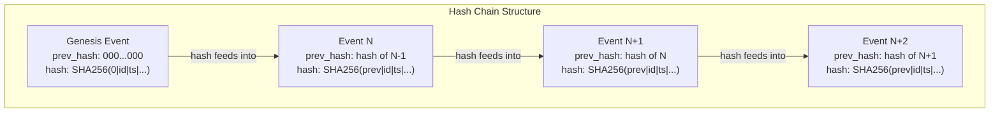
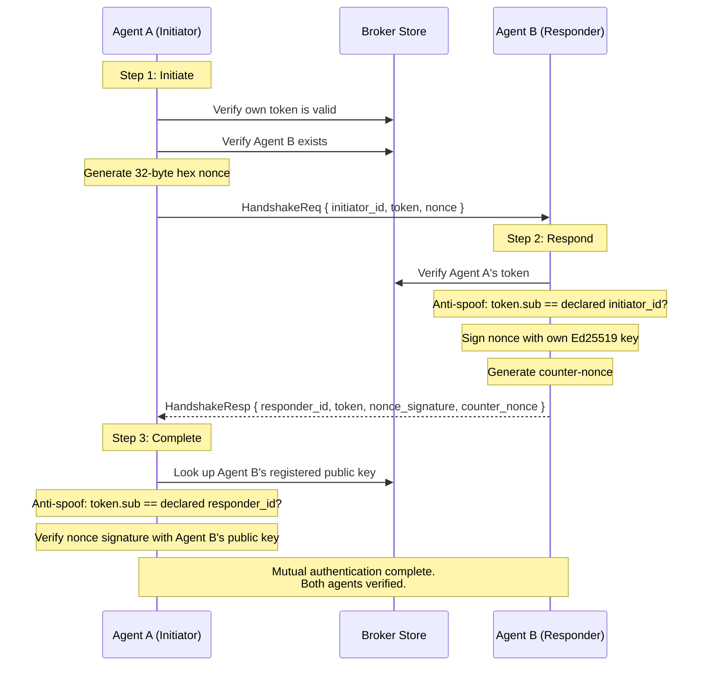
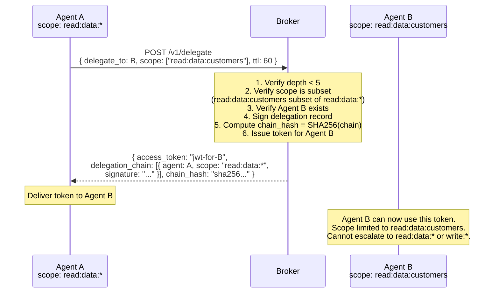
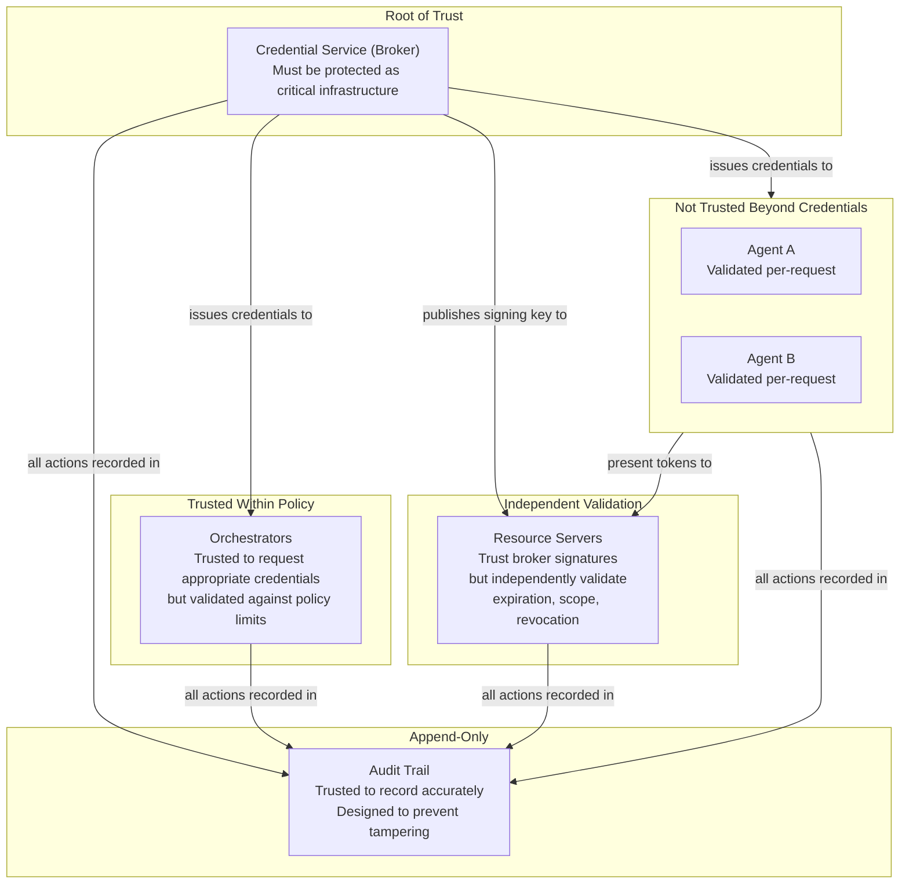
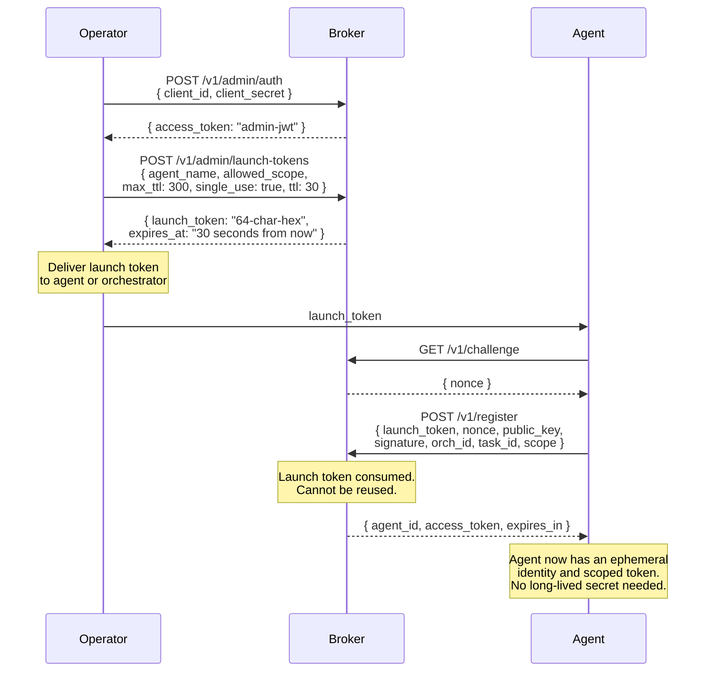

# Concepts: Why AgentAuth Exists

> **Document Version:** 2.0 | **Last Updated:** February 2026 | **Status:** Current
>
> **Audience:** Developers, Operators, and Security Reviewers
>
> **Prerequisites:** None — this is the starting point for understanding AgentAuth.
>
> **Purpose:** Understand the problem AgentAuth solves, the security pattern behind it, and how all 7 components work together.
>
> **Next steps:** [Getting Started](getting-started-user.md) | [Architecture](architecture.md) | [API Reference](api.md)

---

## The AI Agent Credential Crisis

Modern AI systems deploy autonomous agents that complete tasks in minutes: analyzing customer data, processing transactions, orchestrating multi-step workflows, and accessing sensitive resources. These agents spawn dynamically, operate independently, and terminate upon task completion.

Traditional identity and access management (IAM) systems -- OAuth, AWS IAM, service accounts -- were designed for a different world:

- **Long-lived services** with persistent identities
- **Deterministic workloads** with predictable behavior
- **Permissions defined at deploy time**, not at task time
- **Human-in-the-loop oversight** for sensitive operations
- **Services that never need to verify each other's** identity directly

AI agents break every one of these assumptions:

- **Ephemeral instances** with lifetimes measured in minutes
- **Non-deterministic behavior** driven by LLM decisions
- **Task-specific permissions** needed at runtime, not deploy time
- **Autonomous operation** without human review of each action
- **Multi-agent systems** where agents must authenticate to each other
- **Delegation chains** where agents spawn or invoke other agents

### The Scale of the Problem

Recent industry research quantifies the severity:

- **97% of non-human identities have excessive privileges** (Entro Security 2025)
- **80% of IT professionals have seen AI agents act unexpectedly** or perform unauthorized actions (SailPoint 2025)
- **Machine identities now outnumber humans 45:1 to 92:1** in enterprise environments
- **Only 20% of organizations have formal processes** for offboarding and revoking API keys
- **40% of non-human identities are unused but remain enabled** (OWASP NHI Top 10)

### Industry Recognition

The AI agent identity crisis is now formally recognized across major standards bodies:

- **OWASP Top 10 for Agentic Applications (2026)** identifies ASI03 (Identity and Privilege Abuse) and ASI07 (Insecure Inter-Agent Communication) as critical risks
- **Cloud Security Alliance** published "Agentic AI Identity and Access Management: A New Approach" (August 2025) declaring traditional IAM "fundamentally inadequate"
- **NIST IR 8596 (Cyber AI Profile)** explicitly calls for "issuing AI systems unique identities and credentials"
- **IETF WIMSE Working Group** is standardizing workload identity specifically addressing AI agent scenarios

### Quantifying the Risk

Consider a multi-agent orchestration system with 100 concurrent agents, each completing tasks in 2 minutes but holding standard 15-minute OAuth tokens:

| Metric | Value |
|--------|-------|
| Unnecessary credential lifetime per agent | 13 minutes (15 min token - 2 min task) |
| Total unnecessary exposure per cycle | 1,300 agent-minutes |
| Daily exposure across 1,000 cycles | 21,666 agent-hours of unnecessary credential exposure |

This represents a massive attack surface where stolen credentials remain valid long after legitimate work completes. Every minute a credential exists beyond its task is a minute an attacker can use it.

---

## The Ephemeral Agent Credentialing Pattern

AgentAuth implements the **Ephemeral Agent Credentialing** pattern, a security architecture built on six principles:

1. **Identity Ephemeral by Default** -- Every agent instance receives a unique, non-reusable identity
2. **Task-Scoped Authorization** -- Credentials grant access only to resources required for the specific task
3. **Zero-Trust Enforcement** -- Every request is authenticated and authorized independently
4. **Automatic Expiration** -- Credentials expire with the task, not on a fixed schedule
5. **Immutable Accountability** -- All agent actions are logged in tamper-proof audit trails
6. **Delegation Chain Integrity** -- Multi-agent workflows maintain cryptographic proof of authorization lineage

These principles manifest as **seven concrete components** that work together to eliminate the credential exposure problem:



---

## The 7 Components

Each component follows the same structure: the **problem** it solves, the **solution** it provides, a **diagram** of the flow, and what **AgentAuth implements** concretely.

---

### Component 1: Ephemeral Identity Issuance

**Problem:** How does an AI agent prove who it is? Traditional systems use long-lived credentials like API keys or service account passwords. But an agent that exists for 2 minutes should not carry credentials that last for months. And if 100 agents share one service account, you cannot tell which agent did what.

**Solution:** Each agent instance receives a unique, cryptographically-bound identity through a challenge-response flow. The agent proves it holds a private key by signing a nonce (a one-time random challenge). The broker then assigns a SPIFFE-format identity that encodes the agent's orchestration context, task context, and instance identity.

The SPIFFE ID format:

```
spiffe://{trust_domain}/agent/{orchestration_id}/{task_id}/{instance_id}
```

For example: `spiffe://agentauth.local/agent/orch-456/task-789/a1b2c3d4`

This identity is globally unique per agent instance, includes task context and orchestration lineage, is cryptographically bound to the agent's Ed25519 key pair, and cannot be forged or transferred between agents.



**What AgentAuth implements:**
- `GET /v1/challenge` returns a 64-character hex nonce with a 30-second TTL
- `POST /v1/register` performs the full 10-step registration flow
- Ed25519 signatures verify agent identity cryptographically
- SPIFFE IDs follow the standard format using the `go-spiffe/v2` library for validation
- Nonces are single-use and expire after 30 seconds, preventing replay attacks

---

### Component 2: Short-Lived Task-Scoped Tokens

**Problem:** How do you limit what an agent can access? A customer-analysis agent should read customer records for one specific customer -- not have write access to the entire database. And its credentials should last only as long as the task, not a minute longer.

**Solution:** AgentAuth issues JWT tokens with narrow scope limited to specific resources and actions. The scope format is `action:resource:identifier` (for example, `read:customers:12345`). Token TTL defaults to 5 minutes -- long enough for a task, short enough to limit exposure.

Scope attenuation is a one-way operation: permissions can only be narrowed, never expanded. When an agent registers, its requested scope must be a subset of what the launch token allows. This ensures least-privilege access at every step.



**What AgentAuth implements:**
- JWTs signed with EdDSA (Ed25519), containing claims: `sub` (SPIFFE ID), `scope`, `task_id`, `orch_id`, `delegation_chain`, `chain_hash`, `jti`, `exp`, `iat`
- Scope format: `action:resource:identifier` with wildcard `*` support in the identifier position
- Default TTL of 300 seconds (5 minutes), configurable via `AA_DEFAULT_TTL`
- Scope attenuation enforced at registration, delegation, and token exchange
- Token renewal via `POST /v1/token/renew` issues fresh timestamps while preserving identity and scope
- Token release via `POST /v1/token/release` signals task completion (optional but recommended for audit clarity)

---

### Component 3: Zero-Trust Enforcement

**Problem:** How do you verify every request? In traditional systems, once a client authenticates, subsequent requests may ride on session state or network-level trust. But an agent operating autonomously cannot be trusted based on where it sits on the network or what it did previously.

**Solution:** Every single request is authenticated and authorized independently. There is no session state, no cookie-based trust, and no network-location trust. The validation pipeline checks the full chain: signature validity, token expiration, scope match, and revocation status.



**What AgentAuth implements:**
- `ValMw` (validation middleware) wraps every protected endpoint, performing the full pipeline on every request
- `ValMw.RequireScope` checks that the token's scope covers the endpoint's requirement
- No session caching -- tokens are verified from scratch on each request
- Revocation is checked against all 4 levels (token, agent, task, chain) on every validation
- All access attempts (success and failure) are recorded in the audit trail

---

### Component 4: Automatic Expiration and Revocation

**Problem:** How do you stop a compromised agent? If an agent is hijacked through prompt injection or a runtime exploit, its credentials must be invalidated immediately -- not after a 15-minute OAuth timer runs out. And different incidents require different blast radii: sometimes you revoke one token, sometimes every token in a task.

**Solution:** Two complementary mechanisms work together. Time-based expiration ensures tokens die automatically when their TTL elapses. Active revocation provides four levels of granularity for immediate credential invalidation, each with a different blast radius.



| Level | When to Use | Target |
|-------|-------------|--------|
| **Token** | Single credential stolen or leaked | The token's JTI |
| **Agent** | Agent instance compromised (prompt injection, exploit) | The agent's SPIFFE ID |
| **Task** | Entire task is suspect (data poisoning, wrong inputs) | The task_id |
| **Chain** | Delegation chain exploited (privilege escalation) | The root delegator's agent ID |

**What AgentAuth implements:**
- `RevSvc` maintains revocation lists at all 4 levels, persisted to SQLite for durability across broker restarts
- `POST /v1/revoke` requires admin scope (`admin:revoke:*`)
- Every token validation checks all 4 revocation levels via `RevSvc.IsRevoked()`
- Time-based expiration is enforced during signature verification -- expired tokens are rejected regardless of revocation state
- Revocation events are recorded in the audit trail

---

### Component 5: Immutable Audit Logging

**Problem:** How do you know what happened? When an incident occurs, you need to reconstruct exactly which agents accessed which resources, in what order, and whether any actions were unauthorized. Logs that can be modified after the fact are worthless for forensics.

**Solution:** An append-only, hash-chained audit trail records every significant operation. Each event includes a SHA-256 hash of the previous event, creating a tamper-evident chain. If any event is modified or deleted, the chain breaks and the tampering is detectable. PII is automatically sanitized before storage.



Each hash is computed over: `prev_hash | event_id | timestamp | event_type | agent_id | task_id | orch_id | detail`. The genesis event uses 64 zeros as its previous hash. If an attacker modifies any event, every subsequent hash becomes invalid.

**What AgentAuth implements:**
- `AuditLog` provides append-only storage with automatic hash chaining using SHA-256
- Audit events persist to SQLite (configured via `AA_DB_PATH`); if no database path is set, events are stored in memory only
- 17 event types covering the full lifecycle: `admin_auth`, `agent_registered`, `token_issued`, `token_revoked`, `token_renewed`, `delegation_created`, `token_released`, and more
- Structured audit fields include: `resource` (resource being accessed), `outcome` (success/failure/completed), `deleg_depth` (delegation chain depth), `deleg_chain_hash` (chain integrity hash), `bytes_transferred` (data size)
- PII sanitization automatically redacts values associated with `secret`, `password`, `token_value`, and `private_key`
- `GET /v1/audit/events` supports filtering by `agent_id`, `task_id`, `event_type`, `outcome`, `since`, `until`, with pagination via `limit` and `offset`
- Every event includes the hash chain fields, enabling verification of trail integrity

---

### Component 6: Agent-to-Agent Mutual Authentication

**Problem:** How do agents verify each other? In multi-agent workflows, Agent A may need to request data from Agent B. Without mutual authentication, a rogue agent could impersonate Agent B and intercept sensitive data, or impersonate Agent A to trick Agent B into performing unauthorized actions.

**Solution:** A 3-step cryptographic handshake where both agents present and validate each other's credentials. The initiating agent generates a challenge nonce. The responding agent signs it with its Ed25519 key. The initiator verifies the signature against the responder's registered public key. Anti-spoofing checks ensure that the agent presenting credentials is the same agent the token was issued to.



**What AgentAuth implements:**
- `MutAuthHdl` provides the 3-step handshake as a Go API (`InitiateHandshake`, `RespondToHandshake`, `CompleteHandshake`)
- `DiscoveryRegistry` maps agent IDs to network endpoints, enabling agents to find each other
- `HeartbeatMgr` tracks agent liveness with configurable intervals (default 30s) and auto-revokes agents that miss 3 consecutive heartbeats
- Anti-spoofing checks verify that declared agent identity matches the token's `sub` claim at every step
- Note: Mutual auth is currently a Go API only, not exposed as HTTP endpoints

---

### Component 7: Delegation Chain Verification

**Problem:** How do you prevent privilege escalation in multi-agent workflows? When Agent A delegates work to Agent B, which delegates to Agent C, how do you ensure that Agent C only has the permissions it legitimately needs? Without verification, a malicious agent could forge delegation claims to access resources it was never authorized to touch.

**Solution:** A cryptographically signed delegation chain where permissions can only be narrowed (never expanded) at each hop. Each delegation step creates a signed record that is appended to the chain. A chain hash (SHA-256 of the serialized chain) is embedded in the token, making the chain tamper-evident. Maximum delegation depth is limited to 5 hops.



Scope attenuation rules at each delegation hop:

| Delegator Scope | Valid Delegation | Invalid Delegation |
|-----------------|------------------|-------------------|
| `read:data:*` | `read:data:customers` | `write:data:*` (different action) |
| `read:data:customers` | `read:data:customers` | `read:data:*` (broader identifier) |
| `read:data:*` and `write:data:*` | `read:data:customers` | Adding `admin:*` (new scope) |

**What AgentAuth implements:**
- `DelegSvc` manages the delegation flow with scope attenuation enforcement
- Maximum delegation depth of 5 hops, enforced before processing
- Each delegation record is signed with the broker's Ed25519 key
- Chain hash is SHA-256 of the JSON-serialized delegation chain, embedded in the `chain_hash` JWT claim
- Chain-level revocation (`POST /v1/revoke` with `level: "chain"`) invalidates all tokens in a delegation tree
- Default delegation token TTL is 60 seconds

---

## Threat Model Summary

Understanding what AgentAuth defends against -- and what it does not -- is essential for proper deployment.

### What We Defend Against

| Threat | How AgentAuth Mitigates |
|--------|------------------------|
| **Credential theft** | Short-lived tokens (minutes, not hours). Stolen credentials become useless quickly. |
| **Compromised agents** | Task-scoped credentials limit blast radius. Unique identity per instance prevents cross-agent access. Revocation enables immediate invalidation. |
| **Lateral movement** | Scope boundaries prevent accessing resources outside the task. Zero-trust validation on every request. |
| **Agent impersonation** | Mutual authentication verifies both sides. Anti-spoofing checks match token identity to declared identity. |
| **Delegation exploitation** | Scope attenuation is one-way (narrow only). Chain signing prevents forgery. Depth limit (5) prevents unbounded chains. |
| **Malicious insiders** | Immutable audit trail creates accountability. Scope enforcement limits what even authorized users can issue. |
| **Rogue/misbehaving agents** | Credentials expire automatically regardless of agent behavior. Anomaly detection can trigger revocation. |

### What We Do NOT Defend Against

| Threat | Why It Is Out of Scope |
|--------|----------------------|
| **Credential service compromise** | If the broker itself is compromised, all guarantees fail. The broker is the root of trust and must be protected as critical infrastructure. |
| **LLM-level attacks** | Prompt injection may cause agents to misuse legitimate credentials. AgentAuth limits the blast radius but cannot prevent the attack itself. Requires LLM guardrails as a complementary control. |
| **Data poisoning** | Corrupted training data affects agent decisions at a layer below credential management. |
| **Physical access** | An attacker with physical access can extract signing keys. Physical security is a separate concern. |
| **Cryptographic breaks** | The pattern assumes Ed25519, SHA-256, and TLS remain secure. |
| **Denial of service** | A determined attacker could disrupt credential issuance. Requires infrastructure-level mitigations. |

### Trust Boundaries



---

## How AgentAuth Compares

| Capability | Shared Service Accounts | OAuth 2.0 (15-min tokens) | Cloud IAM (AWS/Azure/GCP) | AgentAuth |
|------------|------------------------|---------------------------|---------------------------|-----------|
| Unique identity per agent | No -- all agents share one identity | Possible but not default | Possible with workload identity | Yes -- every instance gets a SPIFFE ID |
| Task-scoped credentials | No -- broad permissions | Token scope exists but rarely task-specific | IAM conditions can scope | Yes -- `action:resource:identifier` per task |
| Credential lifetime | Months or years | 15-60 minutes | 1-12 hours | 1-15 minutes (default 5) |
| Immediate revocation | Rotate shared secret (breaks everything) | Token revocation (not always supported) | IAM policy change (propagation delay) | 4-level revocation (token, agent, task, chain) |
| Per-agent audit trail | No (shared identity, no attribution) | Partial (if tokens are unique) | Yes (via CloudTrail/Activity Log) | Yes -- hash-chained, per-agent, tamper-evident |
| Delegation verification | No | No standard mechanism | No (trust is binary) | Yes -- signed chain with scope attenuation |
| Mutual agent authentication | No | No | No | Yes -- 3-step handshake |
| Designed for AI agents | No | No | No (designed for services) | Yes -- built for ephemeral, autonomous agents |

**When to use AgentAuth:** Multi-agent AI systems where agents need privileged access, lifetimes are measured in minutes, compliance requires least-privilege controls, and you need delegation chain integrity.

**When NOT to use AgentAuth:** Agents that run for hours or days (use credential rotation instead), fully offline environments, agents that only access public non-sensitive resources, or environments where dynamic credential issuance infrastructure is unavailable.

---

## The Bootstrap Problem (Secret Zero)

A fundamental challenge in any identity system: how does an agent get its first credential before it has any credentials? This is the "secret zero" problem.

Traditional approaches provision a long-lived API key or certificate that agents use to request short-lived credentials. But this initial secret becomes a single point of failure -- if it leaks, attackers can request credentials for arbitrary agents.

AgentAuth solves this with **single-use launch tokens**:

1. An operator authenticates with the broker using `AA_ADMIN_SECRET`
2. The operator creates a launch token with a specific scope ceiling and short TTL
3. The launch token is delivered to the agent (or its orchestrator)
4. The agent uses the launch token exactly once during registration
5. The launch token is consumed and can never be reused



The launch token has several properties that limit risk:

- **Short TTL** (default 30 seconds) -- the window for theft is tiny
- **Single-use** -- even if intercepted, it can only be used once
- **Scope ceiling** -- the launch token limits what scope the agent can request
- **Operator-controlled** -- launch tokens are created on demand, not pre-provisioned

For sidecar deployments, the bootstrap is even more controlled: the sidecar uses a sidecar activation token (also single-use) to establish its own identity, then handles all agent registration transparently.

---

## Case Study: CVE-2025-68664 (LangGrinch)

In December 2025, CVE-2025-68664 (CVSS 9.3, Critical) was disclosed in langchain-core. A serialization injection flaw in LangChain's `dumps()`/`dumpd()` functions allowed attackers to craft inputs masquerading as legitimate LangChain objects through the `lc` marker key.

**The attack chain:**

1. Attacker injects malicious content via user input or compromised data source
2. The injected prompt steers the AI agent to generate output containing malicious serialization
3. When the output is deserialized, the payload executes
4. The payload accesses environment variables containing cloud credentials, database connection strings, and API keys

**How ephemeral credentialing limits the blast radius:**

| Without Ephemeral Credentialing | With Ephemeral Credentialing |
|--------------------------------|------------------------------|
| Static API keys in environment variables | No credentials stored in agent environment -- obtained at runtime |
| Cloud credentials with broad permissions | Task-scoped credentials: only access to current task's resources |
| Credentials valid indefinitely | Credentials expire in minutes -- exfiltrated tokens become useless |
| Single compromise exposes all resources | Compromise limited to current task scope |
| No visibility into credential usage | Full audit trail detects anomalous access patterns |

The core lesson: agents should never hold long-lived secrets in their environment. With ephemeral credentialing, even a successful exploitation of CVE-2025-68664 would yield credentials that expire in minutes and only grant access to a narrow slice of resources.

---

## Next Steps

- **Developers:** Read [Getting Started: Developer](getting-started-developer.md) to integrate an agent with AgentAuth in 15 lines of Python
- **Operators:** Read [Getting Started: Operator](getting-started-operator.md) to deploy the broker, configure sidecars, and create launch tokens
