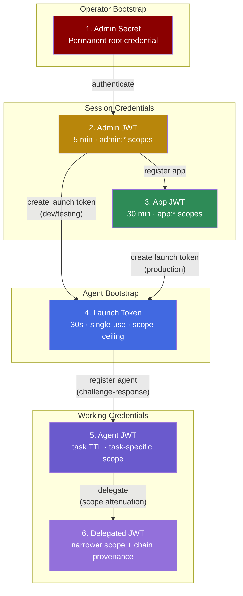
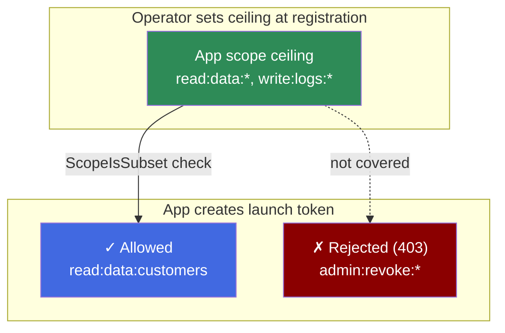
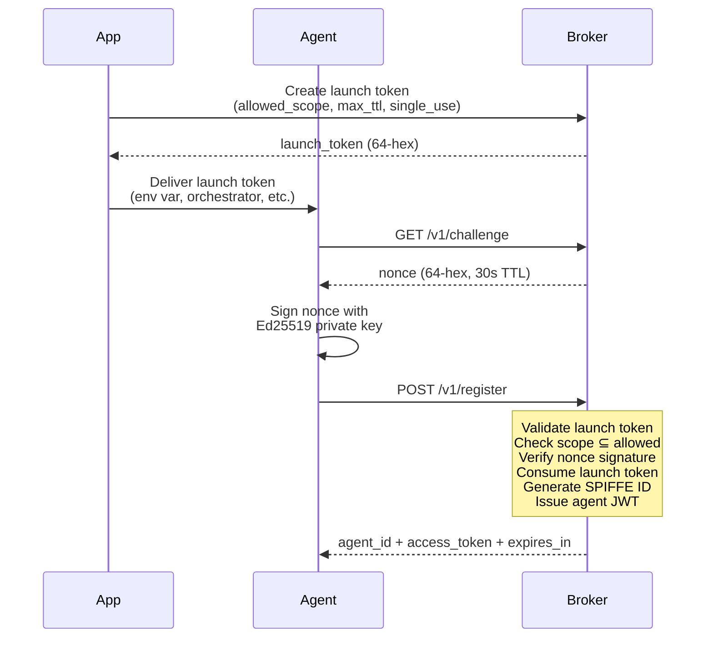
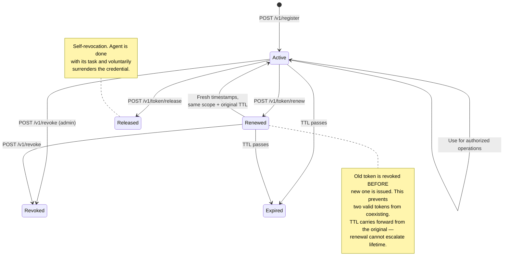
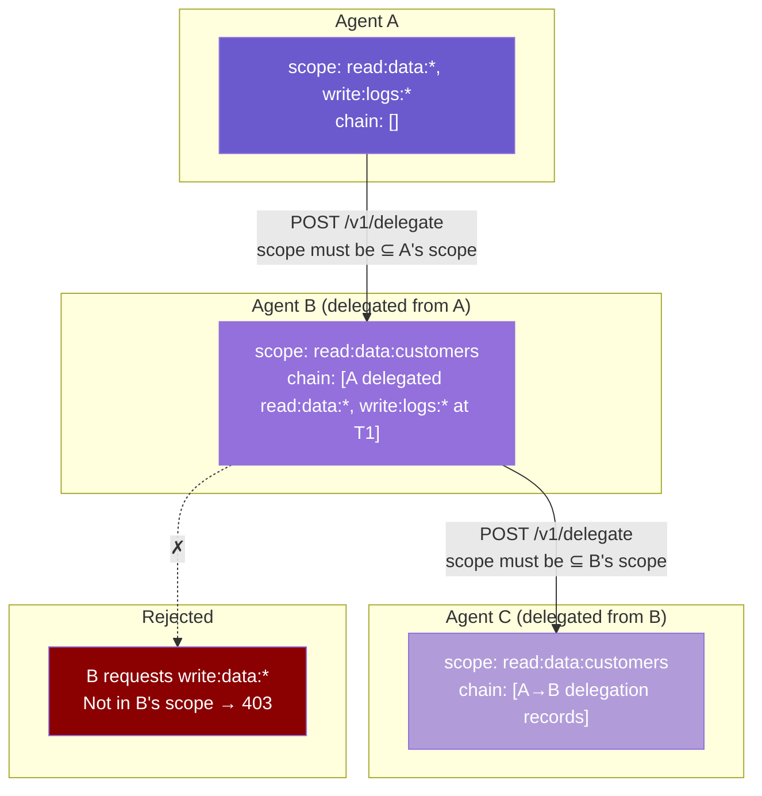
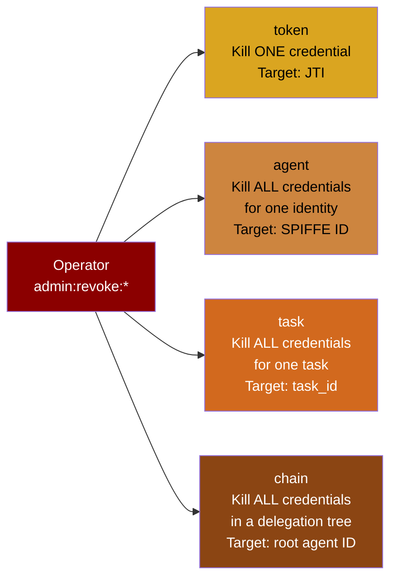

# AgentWrit Credential Model — From First Principles

## The Core Guarantee

**Permissions can only narrow as they flow through the system. No credential can ever grant more than the credential that created it.**

This is the invariant that every design decision in AgentWrit traces back to. An operator sets up an app with a permission ceiling. The app creates launch tokens within that ceiling. Agents register with launch tokens and get scoped credentials. Agents delegate to other agents with even narrower scope. At every step, the scope can only shrink — never expand.

If an agent is compromised, the blast radius is provably contained to whatever scope it was granted. And the operator can kill it instantly at four levels of granularity.

---

## The Problem This Solves

AI agents need credentials to access resources — databases, APIs, other services. The standard approach is to give them API keys or service account tokens.

That creates three security failures:

1. **Over-permissioned.** The API key has access to everything the service account can do. An agent that only needs to read one customer record is holding credentials that can read all customer records, modify them, delete them, and access every other resource the service account touches.

2. **Long-lived.** The API key doesn't expire. An agent that finishes its 2-minute task is still holding valid credentials 24 hours later. If those credentials leak — via logs, a compromised orchestrator, or an agent that gets hijacked — the attacker has a permanent key.

3. **Unattributable.** Twenty agents sharing one API key means you can't tell which agent did what. The audit trail shows "service-account-prod accessed customer-data" but not which task, which orchestrator, or which delegation chain led to that access.

AgentWrit eliminates all three by issuing short-lived, scope-attenuated, individually-identifiable credentials with a tamper-evident audit trail.

---

## Scopes: The Permission Model

Before looking at credentials, you need to understand scopes — they're the permission system that every credential carries.

### Format

Every scope follows the pattern **`action:resource:identifier`**:

```
read:data:customers       — read the customers resource
write:logs:*              — write to any log resource
admin:revoke:*            — admin revocation on any target
app:launch-tokens:*       — app-level launch token operations
```

The `*` wildcard matches any identifier for that action:resource pair.

### Attenuation Rule

A set of requested scopes is valid only when **every scope is covered** by at least one scope in the allowed set. Coverage means: same action, same resource, and either the same identifier or the allowed identifier is `*`.

```
Allowed:    ["read:data:*", "write:logs:*"]
Requested:  ["read:data:customers"]           → ✓ covered by read:data:*
Requested:  ["read:data:customers", "admin:revoke:*"] → ✗ admin:revoke:* not covered
```

This check (`authz.ScopeIsSubset`) runs at every trust boundary in the system:
- When an app creates a launch token (requested scope vs app's ceiling)
- When an agent registers (requested scope vs launch token's allowed scope)
- When an agent delegates (delegated scope vs delegator's scope)
- When a request hits a protected endpoint (required scope vs token's scope)

### The Scopes in the System

| Scope pattern | Carried by | Purpose |
|--------------|-----------|---------|
| `admin:launch-tokens:*` | Admin JWT | Manage apps, create launch tokens (dev/test) |
| `admin:revoke:*` | Admin JWT | Revoke credentials at any of 4 levels |
| `admin:audit:*` | Admin JWT | Query the audit trail |
| `app:launch-tokens:*` | App JWT | Create launch tokens for agents (within ceiling) |
| `app:agents:*` | App JWT | Manage agents under this app |
| `app:audit:read` | App JWT | Read audit events for own agents |
| `read:data:*`, `write:logs:*`, etc. | Agent JWT | Task-specific permissions — whatever the launch token allows |

Admin and app scopes are fixed at issuance. Agent scopes are dynamic — they're whatever the launch token's `allowed_scope` permits, further constrained by what the agent requests at registration.

---

## The Six Credentials

The system has six distinct credentials. Each one exists because the previous one can't do something that's needed — they build on each other.



---

### 1. Admin Secret

**What it is:** A shared secret configured at broker startup. Either plaintext (hashed to bcrypt on load) or a pre-computed bcrypt hash in the config file.

**Why it exists:** The system needs a root of trust. Someone must be able to bootstrap the broker — register the first app, create the first launch token, set up the permission structure. The admin secret is that starting point.

**What it can do:** One thing only — exchange itself for an Admin JWT via `POST /v1/admin/auth`. It cannot directly create tokens, revoke anything, or touch any other endpoint.

**How it's protected:**
- Rejected at startup if empty or matches the weak secret denylist (`"change-me-in-production"`)
- Plaintext is wiped from the config struct after hashing
- Compared using bcrypt (constant-time, resistant to brute force)
- The auth endpoint is rate-limited to prevent credential stuffing

**How it dies:** It doesn't. Rotation requires restarting the broker with a new secret.

---

### 2. Admin JWT

**Why the admin secret isn't enough:** You don't want to send the root secret on every request. The Admin JWT is a short-lived, scoped, auditable session credential. Authenticate once, then use the JWT for all admin operations until it expires.

**What it is:** An EdDSA-signed JWT, `sub: "admin"`, carrying the full admin scope set.

**Scopes granted:** `admin:launch-tokens:*`, `admin:revoke:*`, `admin:audit:*`

**What these scopes unlock:**

| Scope | Endpoints | What you can do |
|-------|-----------|----------------|
| `admin:launch-tokens:*` | `POST /v1/admin/launch-tokens` | Create launch tokens (no scope ceiling — this is the TD-013 design question) |
| `admin:launch-tokens:*` | `POST/GET/PUT/DELETE /v1/admin/apps/*` | Full app lifecycle — register, list, inspect, update ceiling, deregister |
| `admin:revoke:*` | `POST /v1/revoke` | Kill switch at 4 levels: token, agent, task, chain |
| `admin:audit:*` | `GET /v1/audit/events` | Query the tamper-evident audit trail with filters |

**Lifetime:** 5 minutes default, operator-configurable via `AA_ADMIN_TOKEN_TTL` (env var, seconds). Not renewable. Authenticate again when it expires. (TD-010 resolved 2026-04-10 — the value was previously hardcoded as `adminTTL = 300`.)

**How it dies:** Expiry, or explicit revocation by another admin session.

> **TD-013 — Open design question:** `admin:launch-tokens:*` currently lets admin create launch tokens with ANY scopes and no ceiling. In production, apps create launch tokens (with ceiling enforcement). Admin creation bypasses this — useful for dev/testing, potentially a privilege gap in production. Options: remove admin creation, restrict to dev mode, or require an app_id parameter.

---

### 3. App JWT

**Why the Admin JWT isn't enough:** In production, apps manage their own agents. You don't want every orchestrator or CI pipeline to hold the admin secret. Apps need their own identity and their own credentials, constrained by a permission ceiling the operator set.

**What it is:** An EdDSA-signed JWT, `sub: "app:{appID}"`, carrying app-level scopes.

**How an app gets created:**
1. Operator authenticates → gets Admin JWT
2. Operator calls `POST /v1/admin/apps` with the app's name, scope ceiling, and optional per-app TTL
3. Broker returns `client_id`, `client_secret` (shown once, never stored in plaintext), and the registered scope ceiling

**How the app authenticates:**
1. App calls `POST /v1/app/auth` with `client_id` + `client_secret`
2. Broker verifies via bcrypt, returns App JWT
3. This endpoint is rate-limited per client_id to prevent credential stuffing

**Scopes granted:** `app:launch-tokens:*`, `app:agents:*`, `app:audit:read`

**The scope ceiling — this is the critical constraint:**

When the operator registers an app, they set a **scope ceiling** — the maximum permissions that app can ever delegate to its agents. The app cannot create a launch token with scopes outside its ceiling.



This is enforced in `AdminHdl.handleCreateLaunchToken` — when the caller's subject starts with `app:`, the handler looks up the app record and checks `authz.ScopeIsSubset(requested, appRec.ScopeCeiling)`. If it fails, the request is denied and an audit event (`scope_ceiling_exceeded`) is recorded.

**Lifetime:** Per-app TTL (default 1800s / 30 min, configurable between 60s and 24h at registration). Not renewable. If the app is deregistered, its credentials stop working immediately.

---

### 4. Launch Token

**Why the App JWT isn't enough:** The agent needs its *own* credential — not the app's. But the agent has nothing yet. It can't authenticate because it hasn't been registered. The launch token bridges this gap: it's a pre-authorized, one-time entry pass that the agent trades for its own JWT.

**What it is:** An opaque 64-character hex string. Not a JWT — no signature, no claims embedded in the token itself. It's a random secret that maps to a policy record stored in the broker.

**The policy record:**

| Field | Purpose |
|-------|---------|
| `agent_name` | Human-readable label for the agent this token authorizes |
| `allowed_scope` | Scope ceiling — agent's requested scope must be a subset |
| `max_ttl` | Maximum JWT lifetime the agent can get (seconds) |
| `single_use` | If true, consumed after one successful registration |
| `expires_at` | When this token becomes invalid (default: 30 seconds from creation) |
| `created_by` | JWT subject of whoever created it (`admin` or `app:{id}`) |
| `app_id` | Originating app's ID (empty for admin-created tokens) |

**Who creates it:**
- **Production path:** An authenticated app via `POST /v1/app/launch-tokens` — scope ceiling enforced
- **Dev/testing path:** An admin via `POST /v1/admin/launch-tokens` — no ceiling (TD-013)

**How the agent uses it:**



**The challenge-response step matters:** The agent proves it holds an Ed25519 private key by signing a nonce. This cryptographically binds the agent's identity to a key pair — the agent can't impersonate another agent, and the broker can verify the agent's identity in future mutual-auth handshakes.

**How it dies:** Consumed on first use (if single-use), or expired after its TTL (default 30 seconds). If the agent never registers, the token simply expires.

---

### 5. Agent JWT

**Why the launch token isn't enough:** The launch token is a one-time bootstrap credential. The agent needs an ongoing credential to prove its identity on every request — to renew its session, to delegate to sub-agents, to release its credential when done.

**What it is:** An EdDSA-signed JWT with a SPIFFE-format subject identifying the specific agent instance, carrying task-specific scopes.

**Key claims:**

| Claim | What it carries | Why it matters |
|-------|----------------|---------------|
| `sub` | `spiffe://{domain}/agent/{orchID}/{taskID}/{instanceID}` | Globally unique identity — encodes orchestrator, task, and instance |
| `scope` | `["read:data:customers"]` | Exactly what this agent is allowed to do — subset of launch token's ceiling |
| `task_id` | `"task-789"` | Which task this agent was created for — revocation target |
| `orch_id` | `"orch-456"` | Which orchestrator launched this agent — traceability |
| `jti` | `"a1b2c3d4..."` | Unique token ID — revocation target, prevents replay |
| `exp` | Unix timestamp | When this token becomes invalid (set by launch token's max_ttl, clamped by global MaxTTL) |
| `delegation_chain` | `[]` | Empty for directly-issued tokens. Populated when delegated |
| `chain_hash` | `""` | SHA-256 of the delegation chain. Empty when no delegation |

**What the agent can do with this token:**



| Action | Endpoint | What happens |
|--------|----------|-------------|
| **Validate** | `POST /v1/token/validate` | External apps submit this token to check if it's valid before granting resource access. Public endpoint — no auth required on the endpoint itself |
| **Renew** | `POST /v1/token/renew` | Agent extends its session. Old token revoked first, new token issued with same scope and original TTL. Prevents TTL escalation (SEC-A1) |
| **Release** | `POST /v1/token/release` | Agent self-revokes. Task is done, surrender the credential. Idempotent |
| **Delegate** | `POST /v1/delegate` | Create a narrower-scope token for another registered agent (see Credential 6) |

**How it dies:** Expiry, self-release, admin revocation (at 4 levels), or superseded by renewal (old token revoked before new one issued).

---

### 6. Delegated JWT

**Why the agent JWT isn't enough:** Multi-agent workflows require agents to hand off work to other agents. Agent A has `read:data:*` but only needs Agent B to read customer records. Delegation creates a new JWT for Agent B with only `read:data:customers` — narrower scope, full provenance chain.

**What it is:** Structurally the same as an Agent JWT, but with a non-empty `delegation_chain` and `chain_hash`. It has its own JTI, its own SPIFFE subject (the delegate's identity), and its own expiry. It's a distinct credential.

**How delegation works:**



**Each delegation records who did what:**

| Field | Value |
|-------|-------|
| `agent` | Delegator's SPIFFE ID |
| `scope` | Scope the delegator held at time of delegation |
| `delegated_at` | UTC timestamp |
| `signature` | Ed25519 signature by the broker's key (tamper-proof) |

The complete chain is hashed (SHA-256) into the `chain_hash` claim. If anyone tampers with the chain, the hash won't match.

**Constraints:**
- Scope can only narrow — `authz.ScopeIsSubset(delegated, delegator)` enforced
- Maximum chain depth: **5 levels** — prevents unbounded delegation
- Delegate must be a registered agent in the store — no delegation to unknown identities

---

## Revocation: The Kill Switch

When something goes wrong — compromised agent, runaway task, poisoned delegation chain — the operator needs to shut it down. AgentWrit provides four revocation levels, each targeting a different blast radius:



| Level | Target | When to use it |
|-------|--------|---------------|
| `token` | JTI string | One specific credential is compromised. Kill it, leave everything else running |
| `agent` | SPIFFE ID | The agent itself is compromised. Kill every credential it holds |
| `task` | task_id | A task has gone wrong. Kill all agents working on it, across all orchestrators |
| `chain` | Root delegator agent ID | A delegation chain is poisoned. Kill every credential that traces back to the compromised root |

Revocation is checked on every authenticated request (`ValMw.Wrap` → `revSvc.IsRevoked`). A revoked token gets a 403 immediately. Revocation entries are persisted to SQLite and rebuilt from disk on broker restart.

---

## The Complete Trust Chain

```
Admin Secret (permanent, root of trust)
  └─→ Admin JWT (5 min, admin:* scopes)
       ├─→ App Registration (one-time, sets scope ceiling)
       │    └─→ App JWT (30 min, app:* scopes, ceiling-constrained)
       │         └─→ Launch Token (30s, single-use, scope ≤ ceiling)
       │              └─→ Agent JWT (task TTL, scope ≤ launch token)
       │                   └─→ Delegated JWT (scope ≤ delegator, max depth 5)
       └─→ Launch Token (dev/testing, NO ceiling — TD-013)
            └─→ Agent JWT (no app traceability)
```

At every arrow, the scope can only narrow. Every credential is audited, every credential has a defined lifetime, and every credential can be killed by the operator. That's the design.

---

## Endpoint Reference — What Credential Opens What Door

**Public (no credential required):**

| Endpoint | Purpose |
|----------|---------|
| `GET /v1/challenge` | Get a nonce for agent registration |
| `POST /v1/register` | Agent registration (requires launch token + signed nonce in body) |
| `POST /v1/token/validate` | Check if an agent token is valid (token submitted in body) |
| `POST /v1/admin/auth` | Operator authenticates with admin secret |
| `POST /v1/app/auth` | App authenticates with client_id + client_secret |
| `GET /v1/health` | Broker liveness check |
| `GET /v1/metrics` | Prometheus metrics scrape |

**Agent JWT required (Bearer auth):**

| Endpoint | Purpose |
|----------|---------|
| `POST /v1/token/renew` | Extend session (same scope, same original TTL) |
| `POST /v1/token/release` | Self-revoke when done |
| `POST /v1/delegate` | Create narrower-scope token for another agent |

**Admin JWT required (Bearer + scope check):**

| Endpoint | Required scope | Purpose |
|----------|---------------|---------|
| `POST /v1/admin/launch-tokens` | `admin:launch-tokens:*` | Create launch tokens (dev/testing) |
| `POST/GET/PUT/DELETE /v1/admin/apps/*` | `admin:launch-tokens:*` | Full app lifecycle |
| `POST /v1/revoke` | `admin:revoke:*` | Revoke at 4 levels |
| `GET /v1/audit/events` | `admin:audit:*` | Query audit trail |

**App JWT required (Bearer + scope check):**

| Endpoint | Required scope | Purpose |
|----------|---------------|---------|
| `POST /v1/app/launch-tokens` | `app:launch-tokens:*` | Create launch tokens (ceiling-constrained) |
