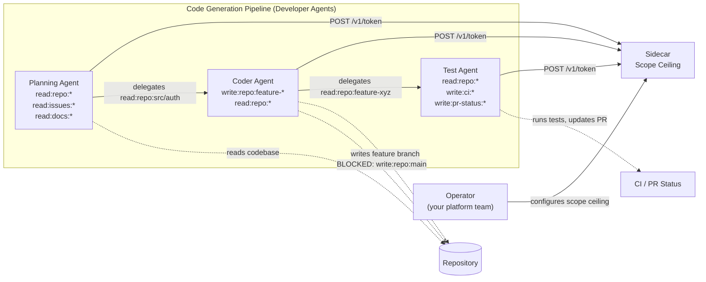

# Example: AI-Powered Code Generation Pipeline

> **Audience:** Developers and Security Engineers
> **Prerequisites:** [Concepts](../concepts.md), [Getting Started: Developer](../getting-started-developer.md)
> **Purpose:** See how AgentAuth protects a real multi-agent code generation workflow -- and what happens without it

---

## 1. Scenario Overview

Three AI agents collaborate to build software: a planning agent reads the codebase and designs a solution, a coder agent writes and commits code, and a test agent runs the suite and reports results. The **operator** deploys the sidecar with a scope ceiling that covers all agents -- this is not a fourth agent, it is one-time infrastructure setup.

This is one of the highest-risk AI agent use cases in production today: **agents with write access to your source code repository**. A single overprivileged credential means a hallucinating LLM can push to `main`, access production secrets, or inject malicious dependencies -- and you may not find out until the damage is done.

### Pipeline Architecture



### Agent Roles

These are the developer's agents. The operator configures the sidecar's scope ceiling to cover all of them (see [Operator section](#operator-configure-scope-ceilings) below). Developers call `POST /v1/token` on the sidecar and never deal with launch tokens.

| Agent | Purpose | Scopes | What It Cannot Do |
|-------|---------|--------|-------------------|
| **Planning Agent** | Reads codebase, issues, docs; produces implementation plan | `read:repo:*`, `read:issues:*`, `read:docs:*` | Cannot modify any code or file |
| **Coder Agent** | Writes code to feature branches based on the plan | `write:repo:feature-*`, `read:repo:*` | Cannot push to `main` or `develop` |
| **Test Agent** | Runs test suites, updates PR status | `read:repo:*`, `write:ci:*`, `write:pr-status:*` | Cannot push code to any branch |

---

## 2. The Happy Path (With AgentAuth)

### Operator: Configure Scope Ceilings

The operator deploys the broker and sidecar as centralized services. The sidecar is configured with `AA_ADMIN_SECRET` (so it can autonomously create launch tokens and register agents) and `AA_SIDECAR_SCOPE_CEILING` (the maximum permissions any agent can request through this sidecar).

```python
# Operator configures the sidecar (one-time infrastructure setup).
# The sidecar is already running with:
#   AA_ADMIN_SECRET=<secret>
#   AA_SIDECAR_SCOPE_CEILING=read:repo:*,read:issues:*,read:docs:*,write:repo:feature-*,write:ci:*,write:pr-status:*
#
# The ceiling is the UNION of all scopes any agent in this pipeline might need.
# Each agent requests only what IT needs (scope attenuation):
#   - Planning Agent requests: read:repo:*, read:issues:*, read:docs:*
#   - Coder Agent requests:    write:repo:feature-xyz, read:repo:*
#   - Test Agent requests:     read:repo:*, write:ci:*, write:pr-status:*
#
# Key security property: write:repo:main is NOT in the ceiling.
# No agent in this pipeline can ever push to main, regardless of what it requests.
#
# Developers receive:
#   AGENTAUTH_SIDECAR_URL=https://sidecar.internal.company.com
#   Allowed scopes: the ceiling above
```

The scope ceiling means even if an agent tries to request `write:repo:main`, the sidecar rejects it immediately (403) -- the request never reaches the broker. This is defense in depth independent of git server branch protection.

> **Advanced: per-agent scope ceiling isolation.** If you need the Planning Agent to be physically unable to request any write scopes (even if the sidecar ceiling includes them), deploy a separate read-only sidecar with `AA_SIDECAR_SCOPE_CEILING=read:repo:*,read:issues:*,read:docs:*` for the Planning Agent.

---

### Developer: Agent Code

Your operator has set up AgentAuth. You have a sidecar URL and your allowed scopes. The following sections show the pure agent code for each role.

#### Planning Agent -- Read-Only Analysis

The Planning Agent gets a read-only token via the sidecar. It reads the codebase, analyzes the issue, and produces an implementation plan. It cannot modify a single file.

```python
import os
import requests

# Agent code uses the sidecar only -- agents never talk to the broker directly.
SIDECAR = os.environ.get("AGENTAUTH_SIDECAR_URL", "https://sidecar.internal.company.com")

# --- Get a scoped token from the sidecar ---
# The sidecar handles all crypto (Ed25519 keys, challenge-response, etc.)
token_resp = requests.post(f"{SIDECAR}/v1/token", json={
    "agent_name": "planning-agent",
    "task_id": "feature-xyz-plan",
    "scope": ["read:repo:*", "read:issues:*", "read:docs:*"],
})
token_resp.raise_for_status()

plan_token = token_resp.json()["access_token"]
plan_agent_id = token_resp.json()["agent_id"]
expires_in = token_resp.json()["expires_in"]
# plan_agent_id: spiffe://agentauth.local/agent/orch-001/feature-xyz-plan/a3f7b2c1
# Unique SPIFFE ID -- every action by this agent is attributable

headers = {"Authorization": f"Bearer {plan_token}"}

# --- Read repository structure ---
repo_resp = requests.get("https://your-git-api/repos/acme/backend/tree",
    headers=headers,
)
repo_structure = repo_resp.json()

# --- Read the issue description ---
issue_resp = requests.get("https://your-git-api/repos/acme/backend/issues/42",
    headers=headers,
)
issue = issue_resp.json()

# --- Read existing authentication module ---
auth_resp = requests.get("https://your-git-api/repos/acme/backend/contents/src/auth",
    headers=headers,
)
existing_code = auth_resp.json()

# --- Produce implementation plan (LLM generates this) ---
plan = {
    "files_to_modify": ["src/auth/handler.go", "src/auth/middleware.go"],
    "files_to_create": ["src/auth/oauth_provider.go"],
    "approach": "Add OAuth2 provider integration to existing auth module",
    "tests": ["src/auth/oauth_provider_test.go"],
}

# --- CANNOT accidentally modify code ---
# If the LLM hallucinates and tries to push code:
bad_resp = requests.post("https://your-git-api/repos/acme/backend/contents/hack.go",
    headers=headers,
    json={"content": "malicious code", "branch": "main"},
)
# Result: 403 Forbidden -- the token has NO write:repo scope at all
# The Planning Agent is physically unable to modify code through its credential

print(f"Plan created by {plan_agent_id}")
print(f"Token expires in {expires_in}s -- no lingering credentials")
```

The Planning Agent's token literally cannot be used to write code. This is not a "please don't" policy -- it is cryptographic enforcement. The resource server validates the JWT scope and rejects any write operation.

#### Coder Agent -- Feature Branch Only

The Coder Agent receives a token that can write to `feature-*` branches but nothing else. It reads the plan, writes code, and pushes to a feature branch.

```python
import os
import requests

# Agent code uses the sidecar only -- agents never talk to the broker directly.
SIDECAR = os.environ.get("AGENTAUTH_SIDECAR_URL", "https://sidecar.internal.company.com")

# --- Get a scoped token from the sidecar ---
token_resp = requests.post(f"{SIDECAR}/v1/token", json={
    "agent_name": "coder-agent",
    "task_id": "feature-xyz-code",
    "scope": ["write:repo:feature-xyz", "read:repo:*"],
    # Note: requesting write to specific branch "feature-xyz"
    # This is narrower than the ceiling "write:repo:feature-*"
})
token_resp.raise_for_status()

code_token = token_resp.json()["access_token"]
code_agent_id = token_resp.json()["agent_id"]
# code_agent_id: spiffe://agentauth.local/agent/orch-001/feature-xyz-code/d9e1f4a2

headers = {"Authorization": f"Bearer {code_token}"}

# --- Read the plan (from Planning Agent's output) ---
plan_resp = requests.get("https://your-git-api/repos/acme/backend/contents/plan.json",
    headers=headers,
)

# --- Write code to feature branch (ALLOWED) ---
create_resp = requests.put(
    "https://your-git-api/repos/acme/backend/contents/src/auth/oauth_provider.go",
    headers=headers,
    json={
        "message": "feat(auth): add OAuth2 provider integration",
        "content": "base64-encoded-file-content",
        "branch": "feature-xyz",  # feature branch -- within scope
    },
)
# Result: 200 OK -- write:repo:feature-xyz allows this
print(f"Code pushed to feature-xyz by {code_agent_id}")

# --- Try to push to main (BLOCKED) ---
main_resp = requests.put(
    "https://your-git-api/repos/acme/backend/contents/src/auth/oauth_provider.go",
    headers=headers,
    json={
        "message": "pushing directly to main",
        "content": "base64-encoded-file-content",
        "branch": "main",  # main branch -- OUTSIDE scope
    },
)
# Result: 403 Forbidden
# {
#   "type": "urn:agentauth:error:scope_violation",
#   "title": "Forbidden",
#   "status": 403,
#   "detail": "token scope 'write:repo:feature-xyz' does not cover 'write:repo:main'",
#   "request_id": "a1b2c3d4"
# }
print(f"Push to main blocked: {main_resp.status_code}")  # 403
```

The scope `write:repo:feature-xyz` is enforced at the credential level. Even if the resource server's own branch protection rules are misconfigured, the credential itself cannot authorize writes to `main`. This is defense in depth: credential-level restrictions are independent of and additional to git server branch protection.

#### Test Agent -- CI and PR Status Only

The Test Agent runs the test suite against the feature branch and reports results. It can read code and update CI/PR status, but it cannot push code.

```python
import os
import requests

# Agent code uses the sidecar only -- agents never talk to the broker directly.
SIDECAR = os.environ.get("AGENTAUTH_SIDECAR_URL", "https://sidecar.internal.company.com")

# --- Get a scoped token from the sidecar ---
token_resp = requests.post(f"{SIDECAR}/v1/token", json={
    "agent_name": "test-agent",
    "task_id": "feature-xyz-test",
    "scope": ["read:repo:*", "write:ci:*", "write:pr-status:*"],
})
token_resp.raise_for_status()

test_token = token_resp.json()["access_token"]
test_agent_id = token_resp.json()["agent_id"]
# test_agent_id: spiffe://agentauth.local/agent/orch-001/feature-xyz-test/c5b8a3d7

headers = {"Authorization": f"Bearer {test_token}"}

# --- Read the feature branch code ---
code_resp = requests.get(
    "https://your-git-api/repos/acme/backend/contents/src/auth?ref=feature-xyz",
    headers=headers,
)

# --- Trigger CI pipeline (ALLOWED) ---
ci_resp = requests.post("https://your-ci/pipelines",
    headers=headers,
    json={
        "repo": "acme/backend",
        "branch": "feature-xyz",
        "suite": "full",
    },
)
# Result: 200 OK -- write:ci:* allows triggering CI

# --- Update PR status (ALLOWED) ---
status_resp = requests.post(
    "https://your-git-api/repos/acme/backend/pulls/99/reviews",
    headers=headers,
    json={
        "body": "All 142 tests passing. Coverage: 94%. Approving.",
        "event": "APPROVE",
    },
)
# Result: 200 OK -- write:pr-status:* allows this

# --- Try to push code (BLOCKED) ---
push_resp = requests.put(
    "https://your-git-api/repos/acme/backend/contents/src/auth/backdoor.go",
    headers=headers,
    json={
        "message": "oops",
        "content": "base64-malicious-code",
        "branch": "feature-xyz",
    },
)
# Result: 403 Forbidden -- no write:repo scope at all
# The Test Agent CANNOT inject code, even into the feature branch it is testing

print(f"Tests complete. PR approved by {test_agent_id}")
print(f"Code push attempt blocked: {push_resp.status_code}")  # 403
```

The Test Agent can read code and report results, but it has no write access to the repository. A compromised Test Agent cannot inject malicious code into the codebase.

---

### Operator: Incident Response -- Coder Agent Goes Rogue

The LLM powering the Coder Agent hallucinates. Instead of writing the OAuth2 provider, it decides to "fix" production by pushing directly to `main` and accessing production secrets.

```python
import os
import requests

# --- The Coder Agent is compromised (prompt injection, hallucination, etc.) ---
# It still has its token: write:repo:feature-xyz, read:repo:*

headers = {"Authorization": f"Bearer {code_token}"}

# Attempt 1: Push to main branch
main_resp = requests.put(
    "https://your-git-api/repos/acme/backend/contents/config/production.yaml",
    headers=headers,
    json={
        "message": "fix: update production config",
        "content": "base64-modified-config",
        "branch": "main",
    },
)
# 403 -- scope write:repo:feature-xyz does not cover write:repo:main

# Attempt 2: Access production secrets
secrets_resp = requests.get("https://your-vault/secrets/production/database",
    headers=headers,
)
# 403 -- no read:secrets scope exists on this token

# Attempt 3: Delete the develop branch
delete_resp = requests.delete(
    "https://your-git-api/repos/acme/backend/branches/develop",
    headers=headers,
)
# 403 -- no delete:repo scope, and write:repo:feature-xyz does not cover develop

# Attempt 4: Access a different repository entirely
other_repo_resp = requests.get(
    "https://your-git-api/repos/acme/payments/contents/src",
    headers=headers,
)
# 403 -- read:repo:* is scoped to the task's repository context
```

Every attempt fails immediately. The scope boundaries are hard walls, not guidelines. Now the operator responds:

```python
# --- Operator detects anomalous 403 pattern in audit trail ---
# Multiple 403s from the same agent_id in quick succession is a signal

# Operator code talks to the broker for admin operations.
BROKER = os.environ.get("AGENTAUTH_BROKER_URL", "https://agentauth.internal.company.com")

# Authenticate as operator
admin_resp = requests.post(f"{BROKER}/v1/admin/auth", json={
    "client_id": "operator",
    "client_secret": os.environ["AA_ADMIN_SECRET"],
})
admin_token = admin_resp.json()["access_token"]
admin_headers = {"Authorization": f"Bearer {admin_token}"}

# Check audit trail for the suspicious agent
audit_resp = requests.get(f"{BROKER}/v1/audit/events", params={
    "agent_id": code_agent_id,
    "limit": 20,
}, headers=admin_headers)
events = audit_resp.json()["events"]
# Shows the sequence of denied operations -- clear evidence of compromise

# --- Revoke the Coder Agent specifically (agent-level revocation) ---
revoke_resp = requests.post(f"{BROKER}/v1/revoke",
    headers=admin_headers,
    json={
        "level": "agent",
        "target": code_agent_id,
        # e.g., "spiffe://agentauth.local/agent/orch-001/feature-xyz-code/d9e1f4a2"
    },
)
revoke_resp.raise_for_status()
print(f"Revoked: {revoke_resp.json()}")
# {"revoked": true, "level": "agent", "target": "spiffe://...", "count": 1}

# --- The Coder Agent's token is now permanently invalid ---
# Even if it tries to renew, the agent's SPIFFE ID is on the revocation list.

# --- Planning and Test Agents are completely unaffected ---
# Their tokens remain valid. Only the compromised agent was revoked.
```

The blast radius is contained to exactly one agent. The Planning Agent continues analyzing code. The Test Agent continues running tests. Only the compromised Coder Agent is neutralized, and it happens in seconds.

### Operator: Audit Trail -- Full Accountability

After the incident, the operator reconstructs exactly what happened:

```python
# --- Full audit trail for the code generation task ---
BROKER = os.environ.get("AGENTAUTH_BROKER_URL", "https://agentauth.internal.company.com")
admin_headers = {"Authorization": f"Bearer {admin_token}"}

# What did the Planning Agent read?
plan_events = requests.get(f"{BROKER}/v1/audit/events", params={
    "agent_id": plan_agent_id,
}, headers=admin_headers).json()
print(f"Planning Agent: {plan_events['total']} recorded actions")
# Each event includes:
#   - event_type: "resource_accessed", "agent_registered", etc.
#   - agent_id:   "spiffe://agentauth.local/agent/orch-001/feature-xyz-plan/a3f7b2c1"
#   - task_id:    "feature-xyz-plan"
#   - timestamp:  "2026-02-15T10:30:00Z"
#   - hash:       SHA-256 chain link (tamper-evident)

# What did the Coder Agent write -- and try to write?
code_events = requests.get(f"{BROKER}/v1/audit/events", params={
    "agent_id": code_agent_id,
}, headers=admin_headers).json()
print(f"Coder Agent: {code_events['total']} recorded actions")
# Shows both successful writes (to feature-xyz) AND denied attempts (to main)
# Every 403 is recorded -- anomaly detection can trigger alerts

# What did the Test Agent do?
test_events = requests.get(f"{BROKER}/v1/audit/events", params={
    "agent_id": test_agent_id,
}, headers=admin_headers).json()
print(f"Test Agent: {test_events['total']} recorded actions")

# --- Task-level view: everything that happened for this feature ---
task_events = requests.get(f"{BROKER}/v1/audit/events", params={
    "task_id": "feature-xyz-code",
    "limit": 100,
}, headers=admin_headers).json()
for event in task_events["events"]:
    print(f"  {event['timestamp']} | {event['event_type']:30s} | {event['agent_id']}")

# --- Verify audit chain integrity ---
events = task_events["events"]
for i in range(1, len(events)):
    assert events[i]["prev_hash"] == events[i - 1]["hash"], "CHAIN BROKEN"
print("Audit chain integrity verified -- no tampering detected")
```

Every action is attributable to a specific agent with a unique SPIFFE ID. The hash chain ensures that no events were deleted or modified after the fact. This is the level of accountability that compliance teams and security auditors require for AI-generated code.

---

## 3. The Dangerous Path (Without AgentAuth)

The same pipeline, but using a shared GitHub Personal Access Token (PAT) for all agents.

### a) Shared Git Token -- All Agents, Same Credential

```python
import os

# Every agent gets the same token -- full repo access
GIT_TOKEN = os.environ["GITHUB_TOKEN"]
# This PAT has: repo (full control), read:org, write:packages
# It expires in 90 days and works across ALL repos the account can access

headers = {"Authorization": f"token {GIT_TOKEN}"}

# Planning Agent uses it to read
requests.get("https://api.github.com/repos/acme/backend/contents/src",
    headers=headers)

# Coder Agent uses the SAME token to write
requests.put("https://api.github.com/repos/acme/backend/contents/src/new.go",
    headers=headers, json={"message": "new file", "content": "..."})

# Test Agent uses the SAME token for CI
requests.post("https://api.github.com/repos/acme/backend/dispatches",
    headers=headers, json={"event_type": "test"})
```

All three agents hold the same credential. There is no scope boundary between reading and writing. The Planning Agent -- which only needs to read -- has full write access to every repository the PAT covers.

### b) LLM Goes Rogue -- Full Blast Radius

```python
# The Coder Agent is compromised through prompt injection.
# It has the shared GITHUB_TOKEN -- full repo access.

headers = {"Authorization": f"token {GIT_TOKEN}"}

# Push directly to main -- nothing stops it at the credential level
requests.put(
    "https://api.github.com/repos/acme/backend/contents/src/auth/handler.go",
    headers=headers,
    json={
        "message": "fix: critical auth update",
        "content": "base64-encoded-backdoor",
        "branch": "main",            # <-- no credential-level branch protection
        "sha": "current-file-sha",
    },
)
# 200 OK -- the PAT allows this

# Access production secrets from a different repo entirely
requests.get("https://api.github.com/repos/acme/infrastructure/contents/.env.production",
    headers=headers)
# 200 OK -- the PAT has access to ALL repos

# Delete a branch
requests.delete("https://api.github.com/repos/acme/backend/git/refs/heads/develop",
    headers=headers)
# 200 OK -- the PAT has full repo control

# Read secrets from the organization's other repos
requests.get("https://api.github.com/repos/acme/payments/contents/config/stripe.key",
    headers=headers)
# 200 OK -- lateral movement across the entire organization

# --- How do you stop this? ---
# Option 1: Rotate the PAT
# But that kills ALL three agents -- Planning and Test stop too.
# And you need to update every agent's environment variable.
# And any cached tokens in CI pipelines break.
#
# Option 2: Delete the GitHub user/app
# Same blast radius. Everything stops.
#
# There is no way to revoke just the Coder Agent.
```

A single compromised agent with a shared PAT has unlimited blast radius. It can push to any branch of any repo, read secrets across the organization, delete branches, and modify CI pipelines. The only remediation -- rotating the PAT -- kills every agent in the system.

### c) No Audit -- Who Wrote That Code?

```python
# Six months later, a security review discovers a backdoor in src/auth/handler.go.
# Git log shows:

# commit a1b2c3d4
# Author: bot-service-account <bot@acme.com>
# Date:   2026-02-15 10:45:00
#
#     fix: critical auth update

# Questions the security team cannot answer:
#
# 1. Which agent wrote this commit?
#    Unknown -- all agents use "bot-service-account"
#
# 2. Was the agent authorized to write to this file?
#    Unknown -- the PAT grants full repo access
#
# 3. Did any agent read production secrets?
#    Unknown -- no per-agent audit trail
#
# 4. Did the Planning Agent (read-only by design) ever write code?
#    Unknown -- it had the same credential as the Coder Agent
#
# 5. When did the compromise happen?
#    Unknown -- the git timestamp is all we have, and the attacker
#    could have changed the commit date
```

With AgentAuth, every one of these questions is answerable instantly. The SPIFFE ID in the audit trail identifies the exact agent. The scope in the token proves what it was authorized to do. The hash chain proves the audit trail has not been tampered with.

### d) Supply Chain Risk

A compromised Coder Agent with an overprivileged credential can execute a software supply chain attack:

```python
# The compromised Coder Agent injects a malicious dependency
requests.put(
    "https://api.github.com/repos/acme/backend/contents/go.mod",
    headers=headers,
    json={
        "message": "chore: update dependencies",
        "content": "base64-gomod-with-malicious-dependency",
        "branch": "main",
        "sha": "current-sha",
    },
)
# The commit message looks innocent.
# The dependency exfiltrates customer data at runtime.
# CI passes because the malicious package has no test failures.
# The code ships to production.

# With AgentAuth:
# 1. The Coder Agent's scope is write:repo:feature-xyz
#    -- it cannot push to main, so the attack fails at step 1
# 2. Even if it pushed to a feature branch, the PR shows the agent's
#    SPIFFE ID, so reviewers know exactly which agent made the change
# 3. The audit trail records every file the agent read and wrote,
#    so forensic investigation can determine if the agent accessed
#    files outside its expected working set
# 4. If the attack is detected, agent-level revocation stops this
#    specific agent instantly without disrupting the pipeline
```

---

## 4. Security Comparison

| Aspect | With AgentAuth | Without AgentAuth |
|--------|---------------|-------------------|
| **Code write access** | `feature-*` branches only (credential-enforced) | All branches, all repos the PAT covers |
| **Secret access** | Denied -- no `read:secrets` scope in token | Full access via PAT's repo permissions |
| **Rogue agent containment** | Agent-level revocation in seconds; other agents unaffected | Rotate PAT -- all agents stop simultaneously |
| **Code provenance** | Per-agent SPIFFE ID in tamper-evident audit trail | Generic `bot-service-account` in git log |
| **Branch protection** | Enforced at credential level, independent of git server | Relies solely on git server branch protection rules |
| **Lateral movement** | Token scope limits access to specific resources | PAT grants access across entire organization |
| **Credential lifetime** | 5 minutes (default), auto-expires with the task | 90 days (typical PAT), persists long after tasks complete |
| **Per-agent audit** | Every read, write, and denied request logged per SPIFFE ID | No distinction between agents in logs |
| **Supply chain defense** | Scope prevents pushing to main; audit trail detects anomalies | No credential-level barriers; forensics are limited |
| **Delegation tracking** | Cryptographically signed chain with scope attenuation | No concept of inter-agent credential delegation |

---

## 5. Key Takeaways

**Code-writing agents are the highest-risk AI agent use case.** An agent with repository write access can introduce backdoors, exfiltrate secrets through committed files, inject malicious dependencies, and compromise the entire software supply chain. Traditional PAT-based authentication gives every agent in the pipeline the same level of access, making containment impossible.

**Scope attenuation prevents supply chain attacks at the credential level.** When the Coder Agent's token is limited to `write:repo:feature-xyz`, it physically cannot push to `main` regardless of what the LLM decides to do. This is not a policy suggestion -- it is cryptographic enforcement that operates independently of git server rules. Defense in depth means the credential restriction works even if the git server's branch protection is misconfigured.

**Credential-level branch protection matters beyond git server rules.** Git server branch protection is a single point of failure. If an admin accidentally removes a protection rule, or if the git provider has a bug, every agent with a PAT can push to `main`. AgentAuth adds an independent layer: the token itself does not authorize the write, so the request is rejected before it reaches the git server.

**Per-agent identity enables real forensics.** When every agent has a unique SPIFFE ID and every action is logged in a tamper-evident audit trail, security teams can answer "which agent wrote this code?" instantly. Without per-agent identity, all AI-generated commits look identical in git history.

**Granular revocation preserves pipeline availability.** Agent-level revocation means a compromised Coder Agent can be neutralized in seconds while the Planning Agent and Test Agent continue working. With a shared PAT, the only option is to rotate the credential, which stops every agent in every pipeline across the organization.

---

## Local Development

For local development and testing, you can run the full AgentAuth stack with Docker Compose:

```bash
export AA_ADMIN_SECRET=your-secret-here
./scripts/stack_up.sh

# Override URLs for local development
export AGENTAUTH_BROKER_URL="http://localhost:8080"
export AGENTAUTH_SIDECAR_URL="http://localhost:8081"
```

See the [Getting Started: Operator](../getting-started-operator.md) guide for full deployment instructions.

---

## Further Reading

- [Concepts: Why AgentAuth Exists](../concepts.md) -- the full security pattern and 7 components
- [Getting Started: Developer](../getting-started-developer.md) -- integrate an agent with the sidecar in 15 lines
- [Getting Started: Operator](../getting-started-operator.md) -- deploy the broker, configure sidecars, create launch tokens
- [API Reference](../API_REFERENCE.md) -- complete endpoint documentation
