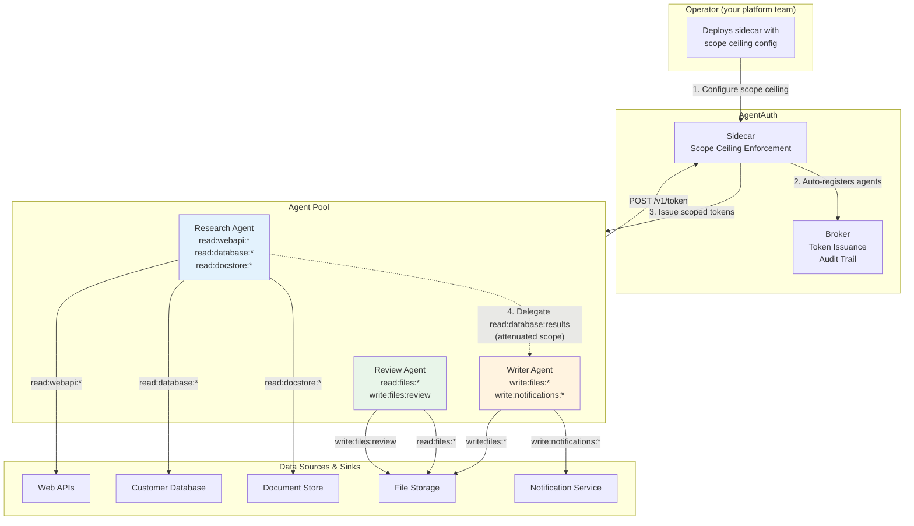

# Real-World Example: Multi-Agent Data Pipeline

> **Audience:** Developers and Architects evaluating AgentAuth for multi-agent systems
> **Prerequisites:** Familiarity with Python, REST APIs, and basic cryptography concepts
> **Time to read:** 20 minutes

---

## 1. Scenario Overview

A data analytics company runs an automated research pipeline. When a customer requests a market analysis report, the system spins up three AI agents that work concurrently: a **Research Agent** that gathers data from web APIs, databases, and document stores; a **Writer Agent** that synthesizes findings into a polished report; and a **Review Agent** that quality-checks the output before delivery. The **operator** (your platform team) deploys the sidecar with a scope ceiling that covers all agents -- this is not a fourth agent, it is one-time infrastructure setup.

Each agent is ephemeral -- it starts when the task begins, runs for a few minutes, and terminates when its work is done. The agents access sensitive data sources (customer databases, proprietary document stores) and produce deliverables stored in shared file storage. The pipeline runs hundreds of times per day across different customers.

The question this example answers: **How do you give each agent exactly the access it needs, for exactly the time it needs it, with full accountability and instant containment if something goes wrong?**



### Agent Role Table

| Agent | Purpose | Required Scopes | Lifetime |
|-------|---------|----------------|----------|
| **Research Agent** | Search web APIs, databases, and document stores for market data | `read:webapi:*`, `read:database:*`, `read:docstore:*` | 3-5 minutes |
| **Writer Agent** | Synthesize research into reports, send completion notifications | `write:files:*`, `write:notifications:*` | 1-2 minutes |
| **Review Agent** | Quality-check writer output, approve or request rewrites | `read:files:*`, `write:files:review` | 1 minute |

> **Note:** The operator configures the sidecar's scope ceiling to cover all these agents. The operator is not an agent -- see the [Operator section](#operator-deploy-sidecar-with-scope-ceiling) below. Developers call `POST /v1/token` on the sidecar and never deal with launch tokens.

---

## 2. The Happy Path (With AgentAuth)

### Operator: Deploy Sidecar with Scope Ceiling

The operator deploys the broker and sidecar as centralized services. The sidecar is configured with `AA_ADMIN_SECRET` (so it can autonomously create launch tokens and register agents) and `AA_SIDECAR_SCOPE_CEILING` (the maximum permissions any agent can request through this sidecar).

```python
# Operator configures the sidecar (one-time infrastructure setup).
# The sidecar is already running with:
#   AA_ADMIN_SECRET=<secret>
#   AA_SIDECAR_SCOPE_CEILING=read:webapi:*,read:database:*,read:docstore:*,write:files:*,write:notifications:*,read:files:*,write:files:review
#
# The ceiling is the UNION of all scopes any agent in this pipeline might need.
# Each agent requests only what IT needs (scope attenuation):
#   - Research Agent requests: read:webapi:*, read:database:*, read:docstore:*
#   - Writer Agent requests:   write:files:*, write:notifications:*
#   - Review Agent requests:   read:files:*, write:files:review
#
# Developers receive:
#   AGENTAUTH_SIDECAR_URL=https://sidecar.internal.company.com
#   Allowed scopes: the ceiling above
#
# The sidecar handles everything else transparently:
#   1. Admin auth with the broker (using AA_ADMIN_SECRET)
#   2. Launch token creation per agent
#   3. Ed25519 key generation
#   4. Challenge-response registration
#   5. Token exchange
#
# Think of it like AWS IAM:
#   - Operator creates IAM role with permission boundary = deploys sidecar with scope ceiling
#   - Developer assumes role and gets temporary STS credentials = calls POST /v1/token
#   - Developer never sees root credentials = AA_ADMIN_SECRET stays on the sidecar
```

No agent ever sees the `AA_ADMIN_SECRET`. The sidecar enforces the scope ceiling on every request -- if an agent requests a scope outside the ceiling, the sidecar rejects it immediately (403) without contacting the broker.

> **Advanced: per-agent scope ceiling isolation.** If different groups of agents need isolated ceilings (e.g., PII-handling agents must be separated from non-PII agents), deploy multiple sidecars with different `AA_SIDECAR_SCOPE_CEILING` values. Each developer group receives the URL of the sidecar appropriate to their agents.

---

### Developer: Agent Code

Your operator has set up AgentAuth. You have a sidecar URL and your allowed scopes. The following sections show the pure agent code for each role in the pipeline.

#### Research Agent

The Research Agent gets a scoped token via the sidecar, searches three data sources in parallel, renews its token mid-task, and delegates a narrow read scope to the Writer Agent.

This example also shows the BYOK (Bring Your Own Key) registration flow as a secondary option for agents that need to manage their own Ed25519 keys. Most agents should use the simpler sidecar path shown first.

```python
import os
import requests
from concurrent.futures import ThreadPoolExecutor, as_completed

# Agent code uses the sidecar only -- agents never talk to the broker directly.
SIDECAR = os.environ.get("AGENTAUTH_SIDECAR_URL", "https://sidecar.internal.company.com")
TASK_ID = "pipeline-market-analysis-2026-0215"

# ── Get token via sidecar (recommended path) ──────────────────────

# One API call. The sidecar handles admin auth, launch token creation,
# Ed25519 key generation, challenge-response, and token exchange --
# all transparently behind this single POST.
token_resp = requests.post(f"{SIDECAR}/v1/token", json={
    "agent_name": "research-agent",
    "task_id": TASK_ID,
    "scope": [
        "read:webapi:*",
        "read:database:*",
        "read:docstore:*",
    ],
    "ttl": 300,
})

assert token_resp.status_code == 200, f"Token request failed: {token_resp.text}"
agent_id = token_resp.json()["agent_id"]
access_token = token_resp.json()["access_token"]
expires_in = token_resp.json()["expires_in"]

print(f"Research Agent ready!")
print(f"  SPIFFE ID: {agent_id}")
print(f"  Token expires in: {expires_in}s")
# Output:
#   SPIFFE ID: spiffe://agentauth.local/agent/orch-data-pipeline-001/pipeline-market-analysis-2026-0215/a1b2c3d4
#   Token expires in: 300s

# The sidecar enforced that these scopes are within its scope ceiling.
# If we requested admin:revoke:*, it would return 403 immediately.


# ── Search three data sources in parallel ──────────────────────────

def search_source(source_url, source_name):
    """Each request carries the agent's Bearer token."""
    resp = requests.get(
        source_url,
        headers={"Authorization": f"Bearer {access_token}"},
        params={"q": "market analysis semiconductors 2026"},
        timeout=30,
    )
    return source_name, resp.status_code, resp.json()

sources = {
    "Web API":        "https://data-api.example.com/v1/search",
    "Customer DB":    "https://db-gateway.example.com/v1/query",
    "Document Store": "https://docs.example.com/v1/search",
}

results = {}
with ThreadPoolExecutor(max_workers=3) as pool:
    futures = {
        pool.submit(search_source, url, name): name
        for name, url in sources.items()
    }
    for future in as_completed(futures):
        name, status, data = future.result()
        results[name] = data
        print(f"  [{name}] -> HTTP {status}, {len(data.get('results', []))} results")

# Each data source validates the Bearer token independently.
# If the Research Agent tried to access write:files:*, the token's scope
# would not cover it and the request would be rejected (403).


# ── Renew token mid-task (long research) ──────────────────────────

# After a few minutes of research, the token is nearing expiry.
# Renew it to get fresh timestamps with the same identity and scope.
renew_resp = requests.post(
    f"{SIDECAR}/v1/token/renew",
    headers={"Authorization": f"Bearer {access_token}"},
)
assert renew_resp.status_code == 200, f"Renewal failed: {renew_resp.text}"

access_token = renew_resp.json()["access_token"]  # updated token
print(f"Token renewed. New expiry in {renew_resp.json()['expires_in']}s")


# ── Delegate narrow read access to Writer Agent ───────────────────

# The Writer Agent needs to read the research results from the database
# to understand context. Delegate ONLY read:database:results -- not
# the full read:database:* that the Research Agent holds.

# writer_agent_id is the Writer Agent's SPIFFE ID, obtained from the
# orchestrator or a shared coordination channel.
writer_agent_id = "spiffe://agentauth.local/agent/orch-data-pipeline-001/pipeline-market-analysis-2026-0215/writer-instance-id"

delegate_resp = requests.post(
    f"{SIDECAR}/v1/delegate",
    headers={"Authorization": f"Bearer {access_token}"},
    json={
        "delegate_to": writer_agent_id,
        "scope": ["read:database:results"],  # narrowed from read:database:*
        "ttl": 60,  # short-lived delegation token
    },
)

if delegate_resp.status_code == 200:
    delegated_token = delegate_resp.json()["access_token"]
    delegation_chain = delegate_resp.json()["delegation_chain"]
    print(f"Delegated read:database:results to Writer Agent")
    print(f"  Delegation chain depth: {len(delegation_chain)}")
    print(f"  Chain entry: agent={delegation_chain[0]['agent']}")
    print(f"  Delegated token TTL: {delegate_resp.json()['expires_in']}s")
    # Deliver delegated_token to Writer Agent via coordination channel
else:
    print(f"Delegation failed: {delegate_resp.status_code} {delegate_resp.text}")
```

Key security properties demonstrated:
- The sidecar generated an Ed25519 key pair and performed challenge-response registration transparently
- The developer never handled launch tokens, admin secrets, or broker URLs
- The sidecar's scope ceiling prevented any scope escalation beyond the operator's configured ceiling
- Each data source request carried the scoped Bearer token
- The delegation to the Writer Agent narrowed `read:database:*` down to `read:database:results`

#### Writer Agent

The Writer Agent uses the sidecar for simplified token management. The sidecar handles key generation, challenge-response registration, and token exchange transparently.

```python
import os
import requests

# Agent code uses the sidecar only -- agents never talk to the broker directly.
SIDECAR = os.environ.get("AGENTAUTH_SIDECAR_URL", "https://sidecar.internal.company.com")
TASK_ID = "pipeline-market-analysis-2026-0215"

# ── Get token via sidecar (simplified path) ────────────────────────

# The sidecar handles registration + key management automatically.
# One API call instead of the 3-step challenge-response flow.
token_resp = requests.post(f"{SIDECAR}/v1/token", json={
    "agent_name": "writer-agent",
    "task_id": TASK_ID,
    "scope": ["write:files:*", "write:notifications:*"],
    "ttl": 300,
})

assert token_resp.status_code == 200, f"Sidecar token failed: {token_resp.text}"
writer_token = token_resp.json()["access_token"]
writer_agent_id = token_resp.json()["agent_id"]
print(f"Writer Agent ready: {writer_agent_id}")
print(f"  Scopes: {token_resp.json()['scope']}")

# The sidecar enforced that write:files:* and write:notifications:*
# are within its scope ceiling. If we requested admin:revoke:*, it
# would return 403 immediately -- never even reaching the broker.


# ── Use delegated token from Research Agent ────────────────────────

# The Research Agent delegated read:database:results to us.
# We use that token (received via coordination channel) to read context.
delegated_token = "..."  # received from Research Agent

context_resp = requests.get(
    "https://db-gateway.example.com/v1/results",
    headers={"Authorization": f"Bearer {delegated_token}"},
    params={"task_id": TASK_ID},
)
research_context = context_resp.json()
print(f"Read research context: {len(research_context.get('results', []))} items")

# This delegated token ONLY allows read:database:results.
# Trying to read:database:customers would fail (scope violation).
# Trying to write anything would fail (no write scope in delegation).


# ── Write report to file storage ──────────────────────────────────

report = {
    "title": "Semiconductor Market Analysis Q1 2026",
    "body": "...",  # synthesized from research results
    "metadata": {
        "task_id": TASK_ID,
        "author_agent": writer_agent_id,
        "sources": list(research_context.get("results", [])),
    },
}

write_resp = requests.post(
    "https://files.example.com/v1/reports",
    headers={"Authorization": f"Bearer {writer_token}"},
    json=report,
)
report_id = write_resp.json().get("id", "report-001")
print(f"Report written: {report_id}")


# ── Send completion notification ──────────────────────────────────

notify_resp = requests.post(
    "https://notifications.example.com/v1/send",
    headers={"Authorization": f"Bearer {writer_token}"},
    json={
        "channel": "pipeline-alerts",
        "message": f"Report {report_id} ready for review",
        "task_id": TASK_ID,
    },
)
print(f"Notification sent: HTTP {notify_resp.status_code}")

# Writer Agent's work is done. The token expires naturally after 300s.
# No cleanup needed -- the credential simply ceases to be valid.
```

#### Review Agent

The Review Agent has intentionally restricted scope: it can read any file but can only write to the `review` path. It cannot modify the report itself, only attach a review.

```python
import os
import requests

# Agent code uses the sidecar only -- agents never talk to the broker directly.
SIDECAR = os.environ.get("AGENTAUTH_SIDECAR_URL", "https://sidecar.internal.company.com")
TASK_ID = "pipeline-market-analysis-2026-0215"

# ── Get token via sidecar ──────────────────────────────────────────

token_resp = requests.post(f"{SIDECAR}/v1/token", json={
    "agent_name": "review-agent",
    "task_id": TASK_ID,
    "scope": ["read:files:*", "write:files:review"],
    "ttl": 120,  # shorter TTL -- review is quick
})

assert token_resp.status_code == 200
review_token = token_resp.json()["access_token"]
reviewer_id = token_resp.json()["agent_id"]
print(f"Review Agent ready: {reviewer_id}")


# ── Read the writer's output ──────────────────────────────────────

report_resp = requests.get(
    f"https://files.example.com/v1/reports/{report_id}",
    headers={"Authorization": f"Bearer {review_token}"},
)
report_content = report_resp.json()
print(f"Read report: {report_content.get('title')}")


# ── Post review (approve or reject) ───────────────────────────────

review_resp = requests.post(
    "https://files.example.com/v1/reviews",
    headers={"Authorization": f"Bearer {review_token}"},
    json={
        "report_id": report_id,
        "verdict": "approved",
        "comments": "Data sources verified. Findings consistent.",
        "reviewer_agent": reviewer_id,
    },
)
print(f"Review posted: {review_resp.json().get('verdict', 'unknown')}")


# ── What the Review Agent CANNOT do ───────────────────────────────

# Try to overwrite the report itself (write:files:reports -- not in scope)
overwrite_resp = requests.put(
    f"https://files.example.com/v1/reports/{report_id}",
    headers={"Authorization": f"Bearer {review_token}"},
    json={"body": "Rewritten by review agent"},
)
# The resource server validates the token's scope.
# write:files:review does NOT cover write:files:reports.
# Result: 403 Forbidden.
print(f"Overwrite attempt: HTTP {overwrite_resp.status_code}")  # 403

# Try to send a notification (write:notifications:* -- not in scope at all)
notify_resp = requests.post(
    "https://notifications.example.com/v1/send",
    headers={"Authorization": f"Bearer {review_token}"},
    json={"message": "Unauthorized notification"},
)
# Result: 403 Forbidden. The review token has no notification scope.
print(f"Notification attempt: HTTP {notify_resp.status_code}")  # 403
```

---

### Operator: Incident Response

Midway through a pipeline run, the monitoring system detects that the Research Agent is making unexpected requests -- possibly compromised via prompt injection. The operator responds in milliseconds.

```python
import os
import requests

# Operator code talks to the broker for admin operations.
BROKER = os.environ.get("AGENTAUTH_BROKER_URL", "https://agentauth.internal.company.com")

# ── Operator: Revoke the Research Agent at agent level ─────────────

# The operator already has an admin token from orchestrator setup.
# research_agent_id is the SPIFFE ID from registration.
research_agent_id = "spiffe://agentauth.local/agent/orch-data-pipeline-001/pipeline-market-analysis-2026-0215/a1b2c3d4"

revoke_resp = requests.post(
    f"{BROKER}/v1/revoke",
    headers={"Authorization": f"Bearer {admin_token}"},
    json={
        "level": "agent",
        "target": research_agent_id,
    },
)

print(f"Revocation: HTTP {revoke_resp.status_code}")
print(f"  revoked: {revoke_resp.json()['revoked']}")
print(f"  level: {revoke_resp.json()['level']}")
# Output:
#   Revocation: HTTP 200
#   revoked: True
#   level: agent

# ── Research Agent's next request is immediately rejected ──────────

# The Research Agent tries to renew its token or access any resource:
# Result: 403. The token is rejected because the agent's SPIFFE ID
# is on the revocation list. Every validation checks all 4 revocation levels.

# ── Other agents are UNAFFECTED ───────────────────────────────────

# The Writer Agent continues working normally.
# The Review Agent continues working normally.
# The blast radius is contained to a single agent's scope.
# No shared credentials were rotated. No other agents were disrupted.
```

If the threat extends beyond one agent (for example, the entire task input was poisoned), the operator can escalate to task-level revocation:

```bash
# Revoke ALL agents working on this task -- nuclear option for the pipeline
curl -X POST "${AGENTAUTH_BROKER_URL}/v1/revoke" \
  -H "Authorization: Bearer ${ADMIN_TOKEN}" \
  -H "Content-Type: application/json" \
  -d '{
    "level": "task",
    "target": "pipeline-market-analysis-2026-0215"
  }'
# Response: {"revoked": true, "level": "task", "target": "pipeline-market-analysis-2026-0215", "count": 1}
# Every token with task_id "pipeline-market-analysis-2026-0215" is now invalid.
```

### Operator: Audit Review

After the incident, the operator queries the audit trail to understand exactly what happened.

```python
import os
import requests

# Operator code talks to the broker for admin operations.
BROKER = os.environ.get("AGENTAUTH_BROKER_URL", "https://agentauth.internal.company.com")

# ── Filter audit events by task_id ─────────────────────────────────

audit_resp = requests.get(
    f"{BROKER}/v1/audit/events",
    headers={"Authorization": f"Bearer {admin_token}"},
    params={
        "task_id": "pipeline-market-analysis-2026-0215",
        "limit": 100,
    },
)

events = audit_resp.json()["events"]
total = audit_resp.json()["total"]
print(f"Audit trail: {total} events for this pipeline run\n")

for evt in events:
    print(f"  [{evt['timestamp']}] {evt['event_type']:30s} agent={evt.get('agent_id', 'n/a')[:50]}")
    print(f"    detail: {evt['detail'][:80]}")

# Example output:
#   [2026-02-15T10:00:01Z] launch_token_issued             agent=n/a
#     detail: agent_name=research-agent, scope=read:webapi:*,read:database:*,read:docs
#   [2026-02-15T10:00:02Z] agent_registered                agent=spiffe://agentauth.local/agent/orch-data-pipel
#     detail: scope=read:webapi:*,read:database:*,read:docstore:*
#   [2026-02-15T10:00:05Z] token_renewed                   agent=spiffe://agentauth.local/agent/orch-data-pipel
#     detail: renewed token for research-agent
#   [2026-02-15T10:00:06Z] delegation_created              agent=spiffe://agentauth.local/agent/orch-data-pipel
#     detail: delegated read:database:results to writer-agent
#   [2026-02-15T10:00:10Z] agent_registered                agent=spiffe://agentauth.local/agent/orch-data-pipel
#     detail: scope=write:files:*,write:notifications:*
#   [2026-02-15T10:00:15Z] token_revoked                   agent=spiffe://agentauth.local/agent/orch-data-pipel
#     detail: level=agent, target=research-agent SPIFFE ID


# ── Verify hash chain integrity ────────────────────────────────────

chain_valid = True
for i in range(1, len(events)):
    if events[i]["prev_hash"] != events[i - 1]["hash"]:
        chain_valid = False
        print(f"  CHAIN BREAK at event {events[i]['id']}")
        break

if chain_valid:
    print(f"\nHash chain integrity: VERIFIED ({len(events)} events)")
    print(f"  Genesis prev_hash: {events[0]['prev_hash'][:20]}... (all zeros)")
    print(f"  Latest hash:       {events[-1]['hash'][:20]}...")
else:
    print("\nHash chain integrity: BROKEN -- possible tampering detected!")


# ── Filter by specific agent to see what the compromised agent did ─

research_events = requests.get(
    f"{BROKER}/v1/audit/events",
    headers={"Authorization": f"Bearer {admin_token}"},
    params={
        "agent_id": research_agent_id,
        "limit": 50,
    },
).json()["events"]

print(f"\nResearch Agent activity: {len(research_events)} events")
for evt in research_events:
    print(f"  [{evt['timestamp']}] {evt['event_type']}: {evt['detail'][:60]}")

# Complete accountability: every registration, renewal, delegation,
# and revocation is recorded with the agent's SPIFFE ID.
# The hash chain makes it tamper-evident -- altering any event
# invalidates every subsequent hash.
```

---

## 3. The Dangerous Path (Without AgentAuth)

The same pipeline, built the way most teams do it today: shared API keys, no agent identity, no scoped credentials. Each subsection shows the code and then explains what goes wrong.

### 3a. Shared API Key

All three agents share the same credential. There are no boundaries between them.

```python
import os

# The "standard" approach: one API key for the whole pipeline
API_KEY = os.environ["DATA_PIPELINE_API_KEY"]  # shared across ALL agents

# Research Agent uses it to read:
requests.get("https://db-gateway.example.com/v1/query",
    headers={"Authorization": f"Bearer {API_KEY}"},
    params={"q": "market data"},
)

# Writer Agent uses the SAME key to write:
requests.post("https://files.example.com/v1/reports",
    headers={"Authorization": f"Bearer {API_KEY}"},
    json={"body": "report content"},
)

# Review Agent uses the SAME key:
requests.get("https://files.example.com/v1/reports/123",
    headers={"Authorization": f"Bearer {API_KEY}"},
)
```

**What goes wrong:**

- The Research Agent has the same key as the Writer Agent. If the Research Agent is compromised via prompt injection, the attacker can **write** files, **send** notifications, and **delete** reports -- none of which the Research Agent should be able to do.
- The Review Agent can modify any file, not just post reviews. The `API_KEY` grants full access.
- If the key is exfiltrated from any single agent, the attacker has access to **every** resource in the pipeline.
- The key was provisioned months ago. It will remain valid for months more. Every minute of that window is attack surface.

### 3b. No Identity

With a shared credential, agents are indistinguishable in logs.

```python
# All three agents show up as the same identity:
#   2026-02-15 10:00:01 [INFO] service-account accessed /v1/query
#   2026-02-15 10:00:02 [INFO] service-account accessed /v1/query
#   2026-02-15 10:00:03 [INFO] service-account wrote /v1/reports
#   2026-02-15 10:00:04 [INFO] service-account accessed /v1/reports/123
#   2026-02-15 10:00:05 [INFO] service-account accessed /v1/query  <-- anomalous?

# Question: Which agent made the anomalous request at 10:00:05?
# Answer: Unknown. All agents present the same "service-account" identity.
# There is no SPIFFE ID, no agent-specific token, no way to tell them apart.
```

When an incident occurs, the investigation begins with: "Something accessed the database at 10:00:05 in a way we did not expect." But **which** agent? The Research Agent doing its job? The Writer Agent exceeding its role? A compromised agent exfiltrating data? With shared credentials, there is no way to know.

### 3c. No Revocation

The Research Agent starts behaving unexpectedly. The operator needs to stop it. With shared credentials, there are only bad options.

```python
# Option 1: Rotate the shared API key
# Problem: ALL three agents immediately lose access.
# The Writer Agent stops mid-report. The Review Agent loses access.
# Mean time to restore: 10-30 minutes to generate new key, redeploy all agents.

# Option 2: Kill the Research Agent's process
# Problem: If the attacker extracted the API key, they can use it from
# anywhere. Killing the process does not invalidate the credential.

# Option 3: Block the Research Agent's IP at the network level
# Problem: The attacker may be using a different IP. And IP-based
# blocking is coarse -- it may block legitimate traffic.

# There is no surgical response.
# You cannot revoke one agent's access without affecting all agents.
# Mean time to contain: HOURS, not milliseconds.
```

Compare this to AgentAuth's agent-level revocation, which invalidates one agent's credentials in a single API call and takes effect on the next request -- without touching any other agent.

### 3d. No Audit Trail

After the incident, the compliance team asks: "Prove which agent accessed customer PII during this pipeline run."

```python
# What you have: application-level HTTP logs
#   10:00:01 GET /v1/query?q=customer+data from 10.0.0.5 -> 200
#   10:00:02 GET /v1/query?q=market+data from 10.0.0.5 -> 200
#   10:00:03 POST /v1/reports from 10.0.0.5 -> 201
#   10:00:05 GET /v1/query?q=customer+SSN from 10.0.0.5 -> 200  <-- the breach

# What you need to answer:
#   1. Which agent made the request at 10:00:05?     -> Unknown (shared credential)
#   2. Was this agent authorized to read customer SSNs? -> Unknown (no scope model)
#   3. What else did this agent access?               -> Unknown (no agent identity)
#   4. Has this log been tampered with?               -> Unknown (no hash chain)
#   5. Can we prove chain of custody for the audit?   -> No

# Compliance outcome: FAIL.
# You cannot prove which agent accessed PII because there is no per-agent
# identity, no scope enforcement, and no tamper-evident audit trail.
```

With AgentAuth, the same questions are answered immediately: the audit trail records every action with the agent's SPIFFE ID, the scope that was used, and a hash chain that proves the trail has not been modified.

### 3e. No Delegation Control

The Research Agent needs to share some results with the Writer Agent. Without a delegation model, there is only one way to do it.

```python
# Research Agent shares its credential with Writer Agent:
writer_api_key = API_KEY  # it is the SAME key -- there is nothing else to share

# Or, slightly "better": Research Agent shares a resource-specific token
# But without scope attenuation, the Writer Agent now has:
#   - read:webapi:*        (Research Agent's scope)
#   - read:database:*      (Research Agent's scope)
#   - read:docstore:*      (Research Agent's scope)
#   - write:files:*        (Writer Agent's own scope)
#   - write:notifications:* (Writer Agent's own scope)
#
# The Writer Agent now has READ access to ALL data sources.
# It only needed read:database:results.

# Over time, this privilege creep compounds:
#   - Agent C gets Agent B's key, which includes Agent A's scope
#   - Agent D gets Agent C's key, which now includes A + B + C scopes
#   - Eventually every agent has access to everything
```

With AgentAuth's delegation, scope can only narrow at each hop. The Research Agent can delegate `read:database:results` (a subset of its `read:database:*`) and the Writer Agent receives a token that grants exactly that -- nothing more.

---

## 4. Security Comparison Table

| Aspect | With AgentAuth | Without AgentAuth |
|--------|---------------|-------------------|
| **Identity** | Unique SPIFFE ID per agent instance (`spiffe://domain/agent/orch/task/instance`) | Shared service account (`service-account-pipeline`) |
| **Scope** | Task-specific (`read:database:*`, `write:files:review`) | Full access to everything the API key permits |
| **Credential lifetime** | 5 minutes (default), configurable down to seconds | Months or years until manual rotation |
| **Bootstrap** | Sidecar-managed: one `POST /v1/token` call; sidecar handles launch tokens internally | Long-lived API key in environment variable |
| **Revocation granularity** | 4 levels: token, agent, task, chain -- millisecond response | Rotate shared key (all agents stop) or block IP (coarse, unreliable) |
| **Revocation speed** | Next request (milliseconds) | Minutes to hours for key rotation and redeployment |
| **Audit trail** | Per-agent, hash-chained, PII-sanitized, filterable by agent/task/event type | Generic HTTP access logs with no agent attribution |
| **Tamper evidence** | SHA-256 hash chain -- altering any event breaks the chain | None -- logs can be silently modified |
| **Delegation** | Scope-attenuated, cryptographically signed chain, max depth 5 | Pass the shared key -- full privilege transfer |
| **Blast radius of compromise** | Single agent's scope for the remaining token lifetime (minutes) | Entire system, indefinitely |
| **Compliance posture** | Per-agent accountability, chain of custody, least-privilege enforcement | "We have HTTP logs" -- insufficient for most compliance frameworks |

---

## 5. Key Takeaways

- **Least privilege is enforced at every layer.** Launch token scope ceilings, registration scope attenuation, delegation scope narrowing, and per-request scope validation create defense in depth. No single failure bypasses all layers.

- **Ephemeral credentials eliminate the "credential exposure window" problem.** A 5-minute token stolen from the Research Agent is useless 5 minutes later. A shared API key stolen from the same agent is usable for months.

- **Surgical incident response replaces all-or-nothing shutdowns.** Agent-level revocation stops one compromised agent in milliseconds without disrupting the other two agents in the pipeline. Task-level and chain-level revocation provide escalation paths for broader incidents.

- **Per-agent audit trails make compliance achievable.** When a regulator asks "which agent accessed customer PII and was it authorized to do so," the answer is immediately available -- filterable by agent SPIFFE ID, task ID, or event type, with hash chain integrity verification proving the trail has not been tampered with.

---

## Local Development

For local development and testing, you can run the full AgentAuth stack with Docker Compose:

```bash
export AA_ADMIN_SECRET=your-secret-here
./scripts/stack_up.sh

# Override URLs for local development
export AGENTAUTH_BROKER_URL="http://localhost:8080"
export AGENTAUTH_SIDECAR_URL="http://localhost:8081"
```

See the [Getting Started: Operator](../getting-started-operator.md) guide for full deployment instructions.
