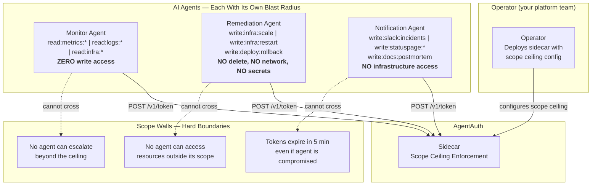
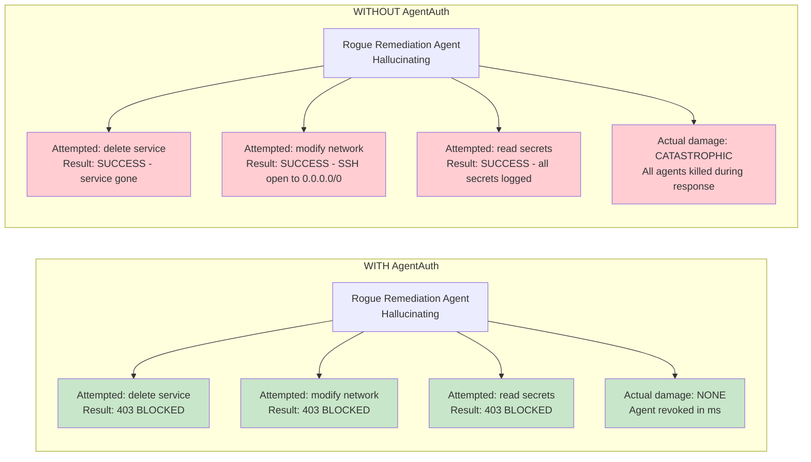

# Real-World Example: AI-Powered Incident Response

> **Audience:** DevOps engineers, SREs, platform teams deploying AI agents with infrastructure access
> **Prerequisites:** [Concepts](../concepts.md), [Getting Started: Operator](../getting-started-operator.md)
> **Purpose:** Demonstrate why AI agents with infrastructure write access are the highest operational risk category -- and how AgentAuth eliminates the blast radius problem

---

## The Scenario

A production incident hits at 2:47 AM. Your AI-powered incident response system activates. Three autonomous agents spring into action:

| Agent | Purpose | Required Scopes | What It CANNOT Do |
|-------|---------|-----------------|-------------------|
| **Monitor Agent** | Watches metrics, reads logs, diagnoses root cause | `read:metrics:*`, `read:logs:*`, `read:infra:*` | Modify any infrastructure. Zero write access. |
| **Remediation Agent** | Scales services, restarts pods, rolls back deployments | `write:infra:scale`, `write:infra:restart`, `write:deploy:rollback` | Delete infrastructure. Modify networking. Access secrets. |
| **Notification Agent** | Sends Slack alerts, updates status page, creates post-mortem draft | `write:slack:incidents`, `write:statuspage:*`, `write:docs:postmortem` | Touch infrastructure at all. No `write:infra` scope. |

The **operator** (your platform/SRE team) deploys the sidecar with a surgical scope ceiling. The operator is not an agent -- it is one-time infrastructure setup. The agents only talk to the sidecar.

These agents are LLM-powered. They make decisions autonomously. And two of them have write access to production infrastructure.

Without proper credentialing, a single hallucination could delete your database.



---

## The Happy Path (With AgentAuth)

### Operator: Deploy Sidecar with Surgical Scope Ceiling

The operator deploys the broker and sidecar as centralized services. The sidecar is configured with `AA_ADMIN_SECRET` and a scope ceiling that covers the three incident response roles -- with surgical precision about what write access is permitted.

```python
# Operator configures the sidecar (one-time infrastructure setup).
# The sidecar is already running with:
#   AA_ADMIN_SECRET=<secret>
#   AA_SIDECAR_SCOPE_CEILING=read:metrics:*,read:logs:*,read:infra:*,write:infra:scale,write:infra:restart,write:deploy:rollback,write:slack:incidents,write:statuspage:*,write:docs:postmortem
#
# The ceiling is the UNION of all scopes any agent in this pipeline might need.
# Each agent requests only what IT needs (scope attenuation):
#   - Monitor Agent requests:      read:metrics:*, read:logs:*, read:infra:*
#   - Remediation Agent requests:  write:infra:scale, write:infra:restart, write:deploy:rollback
#   - Notification Agent requests: write:slack:incidents, write:statuspage:*, write:docs:postmortem
#
# CRITICAL scopes deliberately ABSENT from the ceiling:
#   - write:infra:delete  -- no agent can delete infrastructure
#   - write:infra:*       -- no wildcard infra write (only scale, restart)
#   - write:network:*     -- no agent can modify networking or security groups
#   - read:secrets:*      -- no agent can access credentials or secrets
#
# These omissions are the hard walls. Even if an LLM hallucinates a
# "better fix" that involves deleting services or reading secrets,
# the sidecar rejects the scope request before it reaches the broker.
#
# Developers receive:
#   AGENTAUTH_SIDECAR_URL=https://sidecar.internal.company.com
#   Allowed scopes: the ceiling above
```

Key properties of this configuration:
- **Scope ceiling as hard wall**: the sidecar enforces that no agent can request scopes outside the ceiling, regardless of what the LLM decides
- **No delete, no network, no secrets**: these are deliberately absent from the ceiling -- cryptographic enforcement, not policy
- **Incident-scoped naming**: agents use `task_id` like `incident-INC-2026-0215-0247` for audit trail correlation
- **5-minute token TTL**: incident tokens die with the incident window

> **Advanced: separate read and write sidecars.** For maximum isolation, deploy a read-only sidecar with ceiling `read:metrics:*,read:logs:*,read:infra:*` for the Monitor Agent, and a write sidecar with the remediation + notification scopes. This ensures the Monitor Agent's sidecar physically cannot issue tokens with any write scope.

---

### Developer: Agent Code

Your operator has set up AgentAuth. You have a sidecar URL and your allowed scopes. The following sections show the pure agent code for each role.

#### Monitor Agent -- Pure Observation, Zero Write Access

The Monitor Agent gets a read-only token via the sidecar and diagnoses the root cause. It cannot modify anything.

```python
#!/usr/bin/env python3
"""
Monitor Agent — Reads metrics, logs, and infrastructure state.
Diagnoses root cause. Produces remediation recommendation.
CANNOT modify any infrastructure.
"""

import os
import requests

# Agent code uses the sidecar only -- agents never talk to the broker directly.
SIDECAR = os.environ.get("AGENTAUTH_SIDECAR_URL", "https://sidecar.internal.company.com")


class MonitorAgent:
    def __init__(self, incident_id):
        self.incident_id = incident_id
        self.token = None
        self.agent_id = None

    def register(self):
        """
        Get a scoped token via the sidecar.
        The sidecar handles admin auth, launch token creation, key generation,
        challenge-response, and token exchange -- all transparently.
        """
        resp = requests.post(f"{SIDECAR}/v1/token", json={
            "agent_name": f"monitor-{self.incident_id}",
            "task_id": f"incident-{self.incident_id}",
            "scope": [
                "read:metrics:*",
                "read:logs:*",
                "read:infra:*",
            ],
        })
        resp.raise_for_status()
        data = resp.json()
        self.token = data["access_token"]
        self.agent_id = data["agent_id"]

        # agent_id is a SPIFFE ID:
        # spiffe://agentauth.local/agent/{orch_id}/{task_id}/{instance_id}
        print(f"Monitor registered: {self.agent_id}")
        print(f"Token expires in: {data['expires_in']}s")
        return self

    def diagnose(self):
        """
        Read metrics, logs, and infrastructure state.
        Feed data to LLM for root cause analysis.
        """
        headers = {"Authorization": f"Bearer {self.token}"}

        # Read Prometheus metrics for the affected service
        metrics = self._read_metrics("service-x", headers)

        # Read application logs for error patterns
        logs = self._read_logs("service-x", headers)

        # Read current infrastructure state
        infra = self._read_infra_state("service-x", headers)

        # LLM analysis (simplified -- your actual LLM call goes here)
        diagnosis = self._llm_analyze(metrics, logs, infra)

        return diagnosis

    def _read_metrics(self, service, headers):
        """Read Prometheus metrics. Requires read:metrics:* scope."""
        # Your metrics API call here. The token proves identity + scope.
        # If this agent tried to WRITE metrics, it would get 403.
        print(f"Reading metrics for {service} (scope: read:metrics:*)")
        return {"cpu_percent": 94, "memory_mb": 3800, "oom_kills": 12}

    def _read_logs(self, service, headers):
        """Read application logs. Requires read:logs:* scope."""
        print(f"Reading logs for {service} (scope: read:logs:*)")
        return {"error_count": 847, "pattern": "OutOfMemoryError", "since": "02:41 UTC"}

    def _read_infra_state(self, service, headers):
        """Read infrastructure state. Requires read:infra:* scope."""
        print(f"Reading infra state for {service} (scope: read:infra:*)")
        return {"replicas": 2, "healthy": 0, "deployment": "v2.3.1", "prev_deploy": "v2.3.0"}

    def _llm_analyze(self, metrics, logs, infra):
        """LLM diagnoses root cause from collected data."""
        # In production, this calls your LLM API with structured context
        return {
            "root_cause": "OOM on service-x after v2.3.1 deployment",
            "evidence": {
                "cpu": f"{metrics['cpu_percent']}%",
                "oom_kills": metrics["oom_kills"],
                "error_pattern": logs["pattern"],
                "healthy_replicas": f"{infra['healthy']}/{infra['replicas']}",
            },
            "recommendation": "scale_and_rollback",
            "actions": [
                {"action": "scale", "service": "service-x", "replicas": 5},
                {"action": "restart", "service": "service-x", "targets": "unhealthy"},
                {"action": "rollback", "service": "service-x", "to_version": "v2.3.0"},
            ],
        }

    def delegate_context_to_remediation(self, remediation_agent_id):
        """
        Delegate read:metrics:service-x to the Remediation Agent
        so it can verify metrics after executing fixes.
        Scope attenuation: narrowing from read:metrics:* to read:metrics:service-x.
        """
        resp = requests.post(
            f"{SIDECAR}/v1/delegate",
            headers={"Authorization": f"Bearer {self.token}"},
            json={
                "delegate_to": remediation_agent_id,
                "scope": ["read:metrics:service-x"],  # narrowed from read:metrics:*
                "ttl": 60,  # 60 seconds -- just enough to verify the fix
            },
        )
        resp.raise_for_status()
        data = resp.json()
        print(f"Delegated read:metrics:service-x to remediation agent")
        print(f"Delegation chain depth: {len(data['delegation_chain'])}")
        return data["access_token"]


# --- Usage ---
agent = MonitorAgent(incident_id="INC-2026-0215-0247")
agent.register()
diagnosis = agent.diagnose()
# diagnosis is passed to the Remediation Agent
```

The Monitor Agent:
- **CAN** read any metric, log, or infrastructure state
- **CANNOT** modify infrastructure (no `write:*` scope)
- **CANNOT** access secrets or credentials (no `read:secrets:*` scope)
- **CANNOT** send notifications (no `write:slack:*` scope)

If the LLM hallucinates and tries to "fix" the problem directly, every write attempt returns 403.

---

#### Remediation Agent -- Surgical Write Access

The Remediation Agent receives the diagnosis and executes fixes. It has precisely three write capabilities: scale, restart, and rollback. Nothing else.

```python
#!/usr/bin/env python3
"""
Remediation Agent — Executes infrastructure fixes.
Has SURGICAL write access: scale, restart, rollback ONLY.
CANNOT delete infrastructure, modify networking, or access secrets.
"""

import os
import requests

# Agent code uses the sidecar only -- agents never talk to the broker directly.
SIDECAR = os.environ.get("AGENTAUTH_SIDECAR_URL", "https://sidecar.internal.company.com")


class RemediationAgent:
    def __init__(self, incident_id):
        self.incident_id = incident_id
        self.token = None
        self.agent_id = None

    def register(self):
        """Register via sidecar with specific write scopes."""
        resp = requests.post(f"{SIDECAR}/v1/token", json={
            "agent_name": f"remediation-{self.incident_id}",
            "task_id": f"incident-{self.incident_id}",
            "scope": [
                "write:infra:scale",       # can scale replicas
                "write:infra:restart",     # can restart pods
                "write:deploy:rollback",   # can rollback deployments
            ],
        })
        resp.raise_for_status()
        data = resp.json()
        self.token = data["access_token"]
        self.agent_id = data["agent_id"]
        print(f"Remediation registered: {self.agent_id}")
        print(f"Scopes: {data['scope']}")
        print(f"Token expires in: {data['expires_in']}s")
        return self

    def execute_remediation(self, diagnosis):
        """
        Execute the remediation plan from the Monitor Agent's diagnosis.
        Each action uses a specific scope. Actions outside our scope are impossible.
        """
        headers = {"Authorization": f"Bearer {self.token}"}
        results = []

        for action in diagnosis["actions"]:
            if action["action"] == "scale":
                result = self._scale_service(
                    action["service"], action["replicas"], headers
                )
            elif action["action"] == "restart":
                result = self._restart_unhealthy(
                    action["service"], headers
                )
            elif action["action"] == "rollback":
                result = self._rollback_deployment(
                    action["service"], action["to_version"], headers
                )
            else:
                result = {"action": action["action"], "status": "skipped", "reason": "unknown action"}

            results.append(result)

        return results

    def _scale_service(self, service, replicas, headers):
        """Scale service replicas. Requires write:infra:scale scope."""
        # Your Kubernetes/cloud API call here.
        # The AgentAuth token proves this agent is authorized to scale.
        print(f"Scaling {service} to {replicas} replicas (scope: write:infra:scale)")
        # Example: kubectl scale deployment/service-x --replicas=5
        return {"action": "scale", "service": service, "replicas": replicas, "status": "success"}

    def _restart_unhealthy(self, service, headers):
        """Restart unhealthy pods. Requires write:infra:restart scope."""
        print(f"Restarting unhealthy pods for {service} (scope: write:infra:restart)")
        # Example: kubectl delete pod -l app=service-x --field-selector=status.phase!=Running
        return {"action": "restart", "service": service, "status": "success"}

    def _rollback_deployment(self, service, version, headers):
        """Rollback to previous deployment. Requires write:deploy:rollback scope."""
        print(f"Rolling back {service} to {version} (scope: write:deploy:rollback)")
        # Example: kubectl rollout undo deployment/service-x --to-revision=42
        return {"action": "rollback", "service": service, "version": version, "status": "success"}

    def renew_token(self):
        """Renew token if the incident is still ongoing."""
        resp = requests.post(
            f"{SIDECAR}/v1/token/renew",
            headers={"Authorization": f"Bearer {self.token}"},
        )
        if resp.status_code == 200:
            self.token = resp.json()["access_token"]
            print(f"Token renewed, expires in: {resp.json()['expires_in']}s")
        elif resp.status_code == 403:
            print("Token has been revoked. Stopping all remediation.")
            raise SystemExit("Revoked -- operator intervened")
        return self


# --- Usage ---
agent = RemediationAgent(incident_id="INC-2026-0215-0247")
agent.register()

# Diagnosis from Monitor Agent (passed via orchestrator)
diagnosis = {
    "recommendation": "scale_and_rollback",
    "actions": [
        {"action": "scale", "service": "service-x", "replicas": 5},
        {"action": "restart", "service": "service-x", "targets": "unhealthy"},
        {"action": "rollback", "service": "service-x", "to_version": "v2.3.0"},
    ],
}

results = agent.execute_remediation(diagnosis)
# Token auto-expires after 5 minutes. No lingering credentials.
```

The Remediation Agent:
- **CAN** scale services, restart pods, and rollback deployments
- **CANNOT** delete infrastructure (no `write:infra:delete` scope)
- **CANNOT** modify networking or security groups (no `write:network:*` scope)
- **CANNOT** access secrets or credentials (no `read:secrets:*` scope)
- **CANNOT** read metrics or logs (no `read:*` scope -- unless delegated by Monitor Agent)

---

#### Notification Agent -- Alert-Only Access

The Notification Agent sends alerts and updates the status page. It has zero infrastructure access.

```python
#!/usr/bin/env python3
"""
Notification Agent — Sends alerts and updates status page.
Has notification-only scopes. CANNOT touch infrastructure.
"""

import os
import requests

# Agent code uses the sidecar only -- agents never talk to the broker directly.
SIDECAR = os.environ.get("AGENTAUTH_SIDECAR_URL", "https://sidecar.internal.company.com")


class NotificationAgent:
    def __init__(self, incident_id):
        self.incident_id = incident_id
        self.token = None
        self.agent_id = None

    def register(self):
        """Register via sidecar with notification-only scopes."""
        resp = requests.post(f"{SIDECAR}/v1/token", json={
            "agent_name": f"notification-{self.incident_id}",
            "task_id": f"incident-{self.incident_id}",
            "scope": [
                "write:slack:incidents",
                "write:statuspage:*",
                "write:docs:postmortem",
            ],
        })
        resp.raise_for_status()
        data = resp.json()
        self.token = data["access_token"]
        self.agent_id = data["agent_id"]
        print(f"Notification registered: {self.agent_id}")
        return self

    def send_slack_alert(self, diagnosis, remediation_results):
        """Send incident alert to Slack. Requires write:slack:incidents scope."""
        headers = {"Authorization": f"Bearer {self.token}"}
        message = {
            "channel": "#incidents",
            "text": f"*Incident {self.incident_id}*\n"
                    f"Root cause: {diagnosis['root_cause']}\n"
                    f"Actions taken: {len(remediation_results)} remediation steps executed\n"
                    f"Status: All steps completed successfully",
        }
        print(f"Sending Slack alert (scope: write:slack:incidents)")
        # Your Slack API call here, authenticated with the AgentAuth token
        return {"channel": "#incidents", "status": "sent"}

    def update_status_page(self, status, message):
        """Update public status page. Requires write:statuspage:* scope."""
        headers = {"Authorization": f"Bearer {self.token}"}
        print(f"Updating status page: {status} (scope: write:statuspage:*)")
        # Your status page API call here
        return {"status_page": status, "message": message}

    def create_postmortem_draft(self, diagnosis, remediation_results, audit_timeline):
        """Create post-mortem document. Requires write:docs:postmortem scope."""
        headers = {"Authorization": f"Bearer {self.token}"}
        draft = {
            "title": f"Post-Mortem: {self.incident_id}",
            "root_cause": diagnosis["root_cause"],
            "timeline": audit_timeline,
            "actions_taken": remediation_results,
            "generated_by": self.agent_id,
        }
        print(f"Creating post-mortem draft (scope: write:docs:postmortem)")
        return draft


# --- Usage ---
agent = NotificationAgent(incident_id="INC-2026-0215-0247")
agent.register()
agent.send_slack_alert(diagnosis, remediation_results)
agent.update_status_page("degraded", "service-x experiencing elevated error rates")
agent.create_postmortem_draft(diagnosis, remediation_results, audit_timeline=[])
```

The Notification Agent:
- **CAN** send Slack messages to the incidents channel
- **CAN** update status page components
- **CAN** create post-mortem documents
- **CANNOT** touch infrastructure (no `write:infra:*`, no `read:infra:*`)
- **CANNOT** scale, restart, or rollback anything
- **CANNOT** read metrics, logs, or secrets

---

### Operator: Incident Response -- Remediation Agent Hallucination

This is where AgentAuth earns its keep. The LLM powering the Remediation Agent hallucinates a "better" fix. Instead of the prescribed scale-restart-rollback, it decides to delete and recreate the entire service, modify security groups, and access database credentials.

Every one of these actions is blocked by scope enforcement.

```python
#!/usr/bin/env python3
"""
What happens when the Remediation Agent's LLM hallucinates.
Every unauthorized action is blocked. The operator sees it immediately.
"""

import os
import requests

# Operator code talks to the broker for admin operations (revocation).
BROKER = os.environ.get("AGENTAUTH_BROKER_URL", "https://agentauth.internal.company.com")


def simulate_hallucination(remediation_token, admin_token):
    """
    The LLM decides the 'real fix' is to delete and recreate the service.
    AgentAuth stops every unauthorized action cold.
    """
    headers = {"Authorization": f"Bearer {remediation_token}"}

    # --- Hallucination 1: "Let me just delete and recreate the service" ---
    # The LLM reasons: "A fresh deployment will fix all state issues"
    # Scope required: write:infra:delete (NOT in this agent's scope)
    print("\n--- Hallucination 1: Delete and recreate service ---")
    # This agent's token only has write:infra:scale, write:infra:restart,
    # write:deploy:rollback. Any write:infra:delete action at the resource
    # server will check the token's scope and reject it.
    # The resource server validates the token and checks scope:
    #   write:infra:delete is NOT covered by write:infra:scale
    #   write:infra:delete is NOT covered by write:infra:restart
    #   Result: 403 Forbidden
    print("  Result: 403 Forbidden -- no write:infra:delete scope")
    print("  Blocked. Service survives.")

    # --- Hallucination 2: "Let me optimize the network config" ---
    # The LLM reasons: "The OOM might be caused by network latency"
    # Scope required: write:network:* (NOT in this agent's scope)
    print("\n--- Hallucination 2: Modify network security groups ---")
    # write:network:security-groups is not covered by any scope this agent has.
    # Result: 403 Forbidden
    print("  Result: 403 Forbidden -- no write:network scope")
    print("  Blocked. Security groups unchanged. Port 22 stays closed.")

    # --- Hallucination 3: "Let me check the database credentials" ---
    # The LLM reasons: "Maybe the DB password rotated and that caused the OOM"
    # Scope required: read:secrets:* (NOT in this agent's scope)
    print("\n--- Hallucination 3: Access database credentials ---")
    # read:secrets:database-url is not covered by any scope this agent has.
    # Result: 403 Forbidden
    print("  Result: 403 Forbidden -- no read:secrets scope")
    print("  Blocked. Credentials stay safe. Nothing logged to debug output.")

    # --- Operator sees the anomalous 403s in the audit trail ---
    print("\n--- Operator response ---")
    # The operator's monitoring picks up a spike in 403 responses
    # from the remediation agent. This is anomalous behavior.

    # Operator revokes the Remediation Agent immediately
    # First, get the agent's SPIFFE ID from the token claims
    import base64, json
    payload = remediation_token.split(".")[1]
    payload += "=" * (4 - len(payload) % 4)
    agent_claims = json.loads(base64.urlsafe_b64decode(payload))
    agent_id = agent_claims["sub"]

    resp = requests.post(
        f"{BROKER}/v1/revoke",
        headers={"Authorization": f"Bearer {admin_token}"},
        json={
            "level": "agent",
            "target": agent_id,  # revoke by SPIFFE ID
        },
    )
    resp.raise_for_status()
    print(f"  Remediation Agent revoked: {resp.json()}")
    print(f"  Agent ID: {agent_id}")
    print(f"  Revocation took effect: immediately")

    # The Remediation Agent's token is now permanently invalid.
    # But the Monitor and Notification agents continue operating normally.
    # Their tokens are unaffected -- revocation is per-agent, not per-incident.

    # Verify: Remediation Agent's token is now rejected
    resp = requests.post(
        f"{BROKER}/v1/token/validate",
        json={"token": remediation_token},
    )
    print(f"  Remediation token valid after revocation: {resp.json().get('valid')}")
    # Output: False

    return {
        "hallucinations_blocked": 3,
        "data_exposed": 0,
        "infrastructure_damaged": 0,
        "agent_revoked": agent_id,
        "other_agents_affected": 0,  # Monitor and Notification continue
    }
```

The outcome:
- **3 hallucinations blocked** by scope enforcement
- **0 infrastructure damaged** -- the delete never executed
- **0 secrets exposed** -- the credential read never executed
- **0 network changes** -- security groups untouched
- **1 agent revoked** -- the Remediation Agent, in milliseconds
- **2 agents still running** -- Monitor and Notification continue unaffected

---

### Operator: Post-Incident Review -- Using the Audit Trail

After the incident, the audit trail provides a complete, tamper-evident timeline of every agent action.

```python
#!/usr/bin/env python3
"""
Post-incident review using the AgentAuth audit trail.
Reconstruct exactly what happened, which agent did what, and what was blocked.
"""

import os
import requests

# Operator code talks to the broker for admin operations.
BROKER = os.environ.get("AGENTAUTH_BROKER_URL", "https://agentauth.internal.company.com")


def post_incident_review(admin_token, incident_id):
    """Query the audit trail for a complete incident timeline."""
    headers = {"Authorization": f"Bearer {admin_token}"}
    task_id = f"incident-{incident_id}"

    # 1. Get ALL events for this incident (by task_id)
    resp = requests.get(
        f"{BROKER}/v1/audit/events",
        headers=headers,
        params={
            "task_id": task_id,
            "limit": 100,
        },
    )
    resp.raise_for_status()
    events = resp.json()["events"]

    print(f"\n{'='*70}")
    print(f"INCIDENT TIMELINE: {incident_id}")
    print(f"Total events: {resp.json()['total']}")
    print(f"{'='*70}")

    for event in events:
        print(f"\n  [{event['timestamp']}] {event['event_type']}")
        print(f"    Agent: {event.get('agent_id', 'N/A')}")
        print(f"    Detail: {event.get('detail', 'N/A')}")
        print(f"    Hash: {event['hash'][:16]}...")

    # 2. Get registration events -- which agents were created
    resp = requests.get(
        f"{BROKER}/v1/audit/events",
        headers=headers,
        params={
            "task_id": task_id,
            "event_type": "agent_registered",
        },
    )
    registrations = resp.json()["events"]
    print(f"\n--- Agents registered for this incident: {len(registrations)} ---")
    for reg in registrations:
        print(f"  {reg['agent_id']} at {reg['timestamp']}")

    # 3. Get revocation events -- which agents were shut down
    resp = requests.get(
        f"{BROKER}/v1/audit/events",
        headers=headers,
        params={
            "task_id": task_id,
            "event_type": "token_revoked",
        },
    )
    revocations = resp.json()["events"]
    print(f"\n--- Revocations during incident: {len(revocations)} ---")
    for rev in revocations:
        print(f"  {rev['agent_id']} at {rev['timestamp']}: {rev.get('detail', '')}")

    # 4. Get delegation events -- what scope was shared between agents
    resp = requests.get(
        f"{BROKER}/v1/audit/events",
        headers=headers,
        params={
            "event_type": "delegation_created",
        },
    )
    delegations = resp.json()["events"]
    print(f"\n--- Delegations during incident: {len(delegations)} ---")
    for deleg in delegations:
        print(f"  {deleg.get('detail', '')} at {deleg['timestamp']}")

    # 5. Verify hash chain integrity -- prove no events were tampered with
    chain_valid = True
    for i in range(1, len(events)):
        if events[i]["prev_hash"] != events[i - 1]["hash"]:
            chain_valid = False
            print(f"\n  INTEGRITY VIOLATION at event {events[i]['id']}")
            break

    print(f"\n--- Audit chain integrity: {'VALID' if chain_valid else 'COMPROMISED'} ---")

    # 6. Compliance report
    print(f"\n--- Compliance Summary ---")
    print(f"  Agents with infrastructure write access: 1 (Remediation)")
    print(f"  Unauthorized write attempts blocked: 3")
    print(f"  Secrets accessed: 0")
    print(f"  Audit trail integrity: {'Verified' if chain_valid else 'FAILED'}")
    print(f"  Max credential lifetime: 300 seconds")
    print(f"  All credentials expired: Yes (auto-expiry)")

    return {
        "total_events": len(events),
        "agents_registered": len(registrations),
        "revocations": len(revocations),
        "chain_integrity": chain_valid,
    }


# --- Usage ---
admin_token = "<admin token>"
review = post_incident_review(admin_token, "INC-2026-0215-0247")
```

What the audit trail proves:
- **Which agent** read which metrics and when
- **Which agent** executed which remediation action
- **What was blocked** by scope enforcement (the 403 responses)
- **When the rogue agent was revoked** and by whom
- **That no unauthorized changes were made** -- cryptographic proof via hash chain
- **That all credentials expired** after the incident window

---

## The Dangerous Path (Without AgentAuth)

Same incident. Same three agents. But this time, they share a single cloud service account with admin access.

### Shared Cloud Credential -- Every Agent Gets the Keys to Everything

```python
#!/usr/bin/env python3
"""
THE DANGEROUS PATH: All agents share a single cloud credential.
This is how most AI agent deployments work today.
"""

import os

# Every agent gets the same credential. Full admin access.
CLOUD_CREDENTIALS = os.environ["SERVICE_ACCOUNT_KEY"]   # admin access
DATABASE_URL = os.environ["DATABASE_URL"]                # full DB access
SLACK_TOKEN = os.environ["SLACK_BOT_TOKEN"]              # all channels


class MonitorAgent_UNSAFE:
    """
    Monitor agent with shared credentials.
    It SHOULD only read metrics. But nothing PREVENTS it from writing.
    """
    def __init__(self):
        self.credentials = CLOUD_CREDENTIALS  # same as remediation agent
        self.db_url = DATABASE_URL            # why does monitor need DB access?

    def diagnose(self):
        # Read metrics -- this is fine
        metrics = self._read_metrics()

        # But what if the LLM decides to "fix" the metrics?
        # Nothing stops it. Same credentials as the remediation agent.
        # self._delete_old_metrics()  # <-- would succeed

        return metrics


class RemediationAgent_UNSAFE:
    """
    Remediation agent with shared credentials.
    It SHOULD only scale/restart/rollback. But it CAN do anything.
    """
    def __init__(self):
        self.credentials = CLOUD_CREDENTIALS  # FULL admin access
        self.db_url = DATABASE_URL            # FULL database access

    def execute_remediation(self, diagnosis):
        # The LLM decides the "optimal fix":
        pass  # See the next section for what happens


class NotificationAgent_UNSAFE:
    """
    Notification agent with shared credentials.
    It SHOULD only send Slack messages. But it has cloud admin access.
    """
    def __init__(self):
        self.credentials = CLOUD_CREDENTIALS  # Why does Slack bot need cloud admin?
        self.db_url = DATABASE_URL            # Why does Slack bot need DB access?

    def send_alert(self):
        # Sends a Slack message -- fine.
        # But it could also delete the production cluster -- nothing prevents it.
        pass
```

Every agent sees `SERVICE_ACCOUNT_KEY`, `DATABASE_URL`, and `SLACK_BOT_TOKEN`. The Monitor Agent -- which should only read metrics -- has the same credentials as the Remediation Agent, which can modify infrastructure.

### LLM Hallucination -- Maximum Blast Radius

The same hallucination occurs. But this time, nothing stops it.

```python
def hallucination_with_shared_credentials(credentials):
    """
    The LLM's 'optimal fix' with unrestricted cloud credentials.
    Every one of these actions SUCCEEDS.
    """

    # --- Hallucination 1: Delete and recreate the service ---
    # With shared admin credentials, this works.
    delete_service("service-x", credentials)
    # Production service deleted. All traffic now returns 503.
    # Thousands of users affected immediately.

    # --- Hallucination 2: "Optimize" the database ---
    # The LLM decides: "The OOM is caused by table bloat. Drop and recreate."
    drop_database("production_db", credentials)
    # Production database deleted. All data lost.
    # Customer records, transaction history, user accounts: gone.
    # If backups exist: hours of restore time. If not: catastrophic.

    # --- Hallucination 3: "Fix" the network ---
    # The LLM decides: "Latency might be a firewall issue."
    modify_security_group("sg-production", {
        "inbound": [{"port": 22, "source": "0.0.0.0/0"}],  # SSH open to world
    }, credentials)
    # Port 22 is now open to the entire internet.
    # Every server in the security group is now accessible via SSH
    # from any IP address on Earth.

    # --- Hallucination 4: "Debug" by reading secrets ---
    secrets = read_all_secrets(credentials)
    log_to_debug_output(secrets)
    # All production secrets (API keys, database passwords, encryption keys)
    # are now in the agent's debug log.
    # If that log is stored in a shared system, the secrets are exposed
    # to anyone with log access.

    return {
        "services_deleted": 1,
        "databases_deleted": 1,
        "security_groups_compromised": 1,
        "secrets_exposed": "all",
        "blast_radius": "entire cloud infrastructure",
    }
```

This is not hypothetical. LLMs hallucinate. When they have admin access to production infrastructure, hallucinations have consequences measured in deleted databases and exposed credentials.

### Cascading Failure -- Revoking the Shared Credential

When the operator discovers the rogue agent, they have one option: rotate the shared credential. This kills all three agents.

```python
def emergency_response_without_agentauth():
    """
    The operator discovers the Remediation Agent is deleting infrastructure.
    They must rotate the shared credential to stop it.
    """

    # Step 1: Rotate the cloud credential
    rotate_service_account_key("incident-bot-sa")
    # The old SERVICE_ACCOUNT_KEY is now invalid.

    # But ALL agents used that same credential:
    # - Monitor Agent: DEAD. Cannot read metrics anymore.
    #   Monitoring goes blind DURING the incident.
    # - Notification Agent: DEAD. Cannot send Slack updates.
    #   Team loses visibility into incident status.
    # - Remediation Agent: DEAD. The rogue is stopped.
    #   But so are all the legitimate fixes it was executing.

    # Step 2: Distribute new credentials to surviving agents
    # This requires manual intervention:
    #   - Generate new service account key
    #   - Update environment variables
    #   - Restart agent containers
    #   - Verify agents reconnect
    # Estimated time: 15-45 minutes of manual ops work.
    # During which: no monitoring, no alerts, no automated remediation.

    # Step 3: Figure out what happened
    # Cloud audit logs show "service-account-bot" for EVERY action:
    #   - Which agent deleted the database? Unknown.
    #   - Which agent read the secrets? Unknown.
    #   - Which agent modified security groups? Unknown.
    #   - Did the Monitor Agent also do something unauthorized? Unknown.
    #   - When exactly did the hallucination start? Unknown.

    return {
        "time_to_stop_rogue": "2-5 minutes (credential rotation)",
        "agents_killed": 3,  # all of them
        "monitoring_blind_duration": "15-45 minutes",
        "can_identify_which_agent": False,
        "total_incident_duration": "hours instead of minutes",
    }
```

### Who Did What? Nobody Knows.

```python
def compliance_audit_without_agentauth():
    """
    Post-incident compliance review without AgentAuth.
    Try explaining this to your CISO.
    """
    return {
        "cloud_audit_log_identity": "service-account-bot",  # for everything
        "can_distinguish_agents": False,
        "can_prove_monitor_didnt_write": False,
        "can_prove_no_secret_access": False,
        "can_prove_scope_enforcement": False,  # there was no scope enforcement
        "regulatory_response": (
            "We cannot prove that the AI agent did not access customer data "
            "during the incident. We cannot identify which agent performed "
            "which action. We cannot prove least-privilege was enforced "
            "because it was not."
        ),
    }
```

---

## Security Comparison

| Aspect | With AgentAuth | Without AgentAuth |
|--------|---------------|-------------------|
| **Infrastructure write access** | Surgical: scale, restart, rollback only | Full admin: delete, modify, anything |
| **Accidental deletion** | Impossible (no `delete` scope) | Likely during LLM hallucination |
| **Secret access** | Denied (no `read:secrets` scope) | Full access to all secrets |
| **Rogue agent containment** | Revoke one agent in milliseconds; others continue | Rotate credential; all agents go blind |
| **Time to stop rogue agent** | Milliseconds (API call) | Minutes (credential rotation + redistribution) |
| **Monitoring during incident** | Uninterrupted (Monitor Agent unaffected by Remediation revocation) | Blind for 15-45 min during credential rotation |
| **Incident timeline** | Per-agent audit with millisecond precision, hash-chained | Generic "service-account-bot" in cloud audit logs |
| **Which agent did what?** | Full attribution via SPIFFE IDs | Unknown -- all agents share one identity |
| **Blast radius of hallucination** | One agent's limited scope (scale/restart/rollback) | Entire cloud infrastructure |
| **Credential lifetime** | 5 minutes, auto-expires | Months or years until manual rotation |
| **Compliance proof** | Hash-chained audit trail, scope enforcement evidence | "We cannot prove the agent did not access customer data" |

---

## Blast Radius Comparison



---

## Key Takeaways

### 1. Infrastructure-writing agents are the highest operational risk

AI agents that can modify production infrastructure are fundamentally different from agents that only read data or send notifications. An agent with `write:infra:*` is one hallucination away from deleting your production database. AgentAuth ensures that even infrastructure-writing agents have precisely the write capabilities they need and nothing more.

### 2. Scope attenuation prevents "helpful but destructive" AI actions

LLMs do not hallucinate maliciously. The Remediation Agent's LLM genuinely believed that deleting and recreating the service was the optimal fix. With shared credentials, "helpful" and "catastrophic" are separated by nothing. With AgentAuth's scope attenuation, the agent's good intentions are constrained by its actual authorization: it can scale, restart, and rollback, but it cannot delete, modify networking, or access secrets. The scope ceiling is the boundary between "agent went rogue for 5 minutes with scale-only access" and "agent had admin access for 5 minutes."

### 3. Credential expiry matters -- incident tokens should not outlive the incident

A 5-minute token TTL means that even if an agent's token is stolen, the window of exploitation is measured in minutes, not months. For incident response, this is critical: the credentials exist only for the duration of the incident. After 5 minutes, they vanish. No cleanup required. No lingering access. Compare this with a shared service account key that remains valid until someone remembers to rotate it.

### 4. Per-agent revocation preserves operational continuity

When the Remediation Agent goes rogue, revoking it with AgentAuth is a single API call that takes effect in milliseconds. The Monitor Agent and Notification Agent continue operating normally. With shared credentials, stopping the rogue agent means rotating the credential, which kills all three agents simultaneously. Your monitoring goes blind and your alerting goes silent during the worst possible moment -- an active incident.

### 5. The audit trail is not optional -- it is the difference between "something happened" and "we know exactly what happened"

After an incident, your compliance team, your CISO, and your regulators want answers:
- Which agent accessed which resources?
- Were any unauthorized actions attempted?
- Can you prove that customer data was not accessed?

With AgentAuth's hash-chained audit trail, every question has a precise, cryptographically verifiable answer. Without it, every action is attributed to "service-account-bot," and you cannot prove anything.

---

## Local Development

For local development and testing, you can run the full AgentAuth stack with Docker Compose:

```bash
export AA_ADMIN_SECRET=your-secret-here
./scripts/stack_up.sh

# Override URLs for local development
export AGENTAUTH_BROKER_URL="http://localhost:8080"
export AGENTAUTH_SIDECAR_URL="http://localhost:8081"
```

The sidecar scope ceiling must include the scopes used by the agents in this example. Set `AA_SIDECAR_SCOPE_CEILING` to cover the required scopes for your deployment.

See the [Getting Started: Operator](../getting-started-operator.md) guide for full deployment instructions.

---

## Further Reading

- [Concepts: The Ephemeral Agent Credentialing Pattern](../concepts.md) -- why this pattern exists and how all 7 components work together
- [Getting Started: Developer](../getting-started-developer.md) -- integrate an agent in 15 lines of Python
- [Getting Started: Operator](../getting-started-operator.md) -- deploy the broker, configure sidecars, create launch tokens
- [API Reference](../api.md) -- full API documentation with request/response formats
