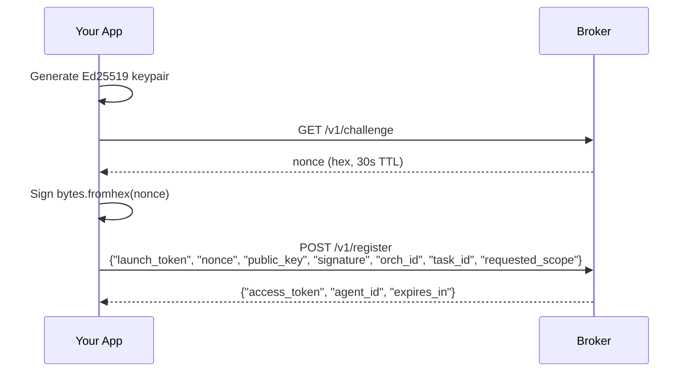
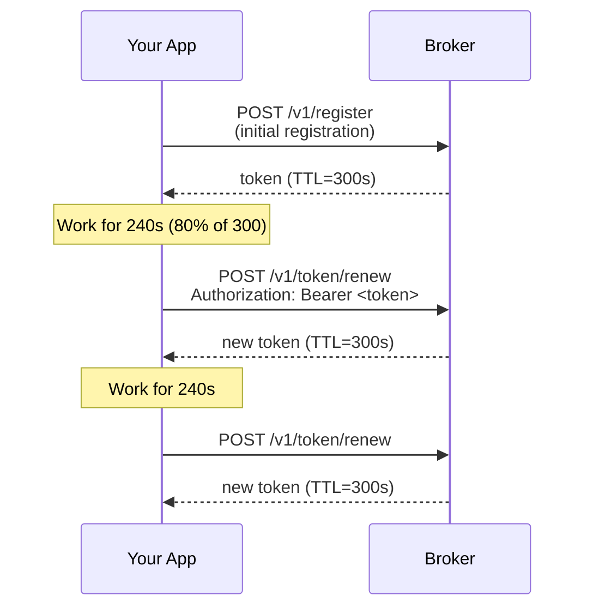

# Getting Started: Developer

> **Document Version:** 3.0 | **Last Updated:** March 2026 | **Status:** Current
>
> **Audience:** Developer building an AI agent in Python, TypeScript, or Go.
>
> **Prerequisite:** Your operator has deployed the broker and given you its URL and your allowed scopes. If you are the operator, see [Getting Started: Operator](getting-started-operator.md).
>
> **Next steps:** [Common Tasks](common-tasks.md) | [API Reference](api.md) | [Troubleshooting](troubleshooting.md)

## How It Works: The Registration Flow

Before you write any code, here is what already happened:

1. **Your operator deployed a broker** -- the security service that issues identity tokens
2. **You received the broker URL and a launch token** -- the operator gave you: "Here is the broker URL. Use this launch token to register your agent."
3. **You follow the registration flow** -- you generate keys, get a nonce, sign it, register with the broker, and exchange for a scoped JWT.

The registration flow gives you full control over your keys. You manage the cryptographic operations explicitly:
- **Operator** creates a launch token with allowed scopes
- **Developer** uses the launch token to register and get tokens
- **Developer** holds their own Ed25519 keys

## What You Need

- Broker URL from your operator (e.g., `https://broker.internal.company.com`)
- A launch token from your operator
- Your allowed scopes from your operator (e.g., `read:data:*`, `write:data:*`)
- One of:
  - Python 3.8+ with `requests` and `cryptography`
  - Go 1.24+ with the standard library

There is no AgentWrit SDK yet. Today, Go integrations should call the broker's HTTP API directly and perform the Ed25519 registration flow themselves.

You will manage your own Ed25519 keys and follow the registration flow.

---

## Agent Registration and Token Exchange

Follow these steps to register your agent and get tokens.

### Complete Working Example

```python
import base64
import os
import requests
from cryptography.hazmat.primitives.asymmetric.ed25519 import Ed25519PrivateKey
from cryptography.hazmat.primitives.serialization import Encoding, PublicFormat

BROKER = os.environ.get("AGENTWRIT_BROKER_URL", "https://broker.internal.company.com")
LAUNCH_TOKEN = os.environ.get("AGENTWRIT_LAUNCH_TOKEN")

# 1. Generate Ed25519 keypair
private_key = Ed25519PrivateKey.generate()
pub_raw = private_key.public_key().public_bytes(Encoding.Raw, PublicFormat.Raw)
pub_b64 = base64.b64encode(pub_raw).decode()

# 2. Get challenge nonce
challenge = requests.get(f"{BROKER}/v1/challenge")
challenge.raise_for_status()
nonce_hex = challenge.json()["nonce"]

# 3. Sign nonce bytes (hex-decode first)
nonce_bytes = bytes.fromhex(nonce_hex)
signature = private_key.sign(nonce_bytes)
sig_b64 = base64.b64encode(signature).decode()

# 4. Register with broker
reg = requests.post(f"{BROKER}/v1/register", json={
    "launch_token": LAUNCH_TOKEN,
    "orch_id": "orch-001",
    "task_id": "task-001",
    "public_key": pub_b64,
    "signature": sig_b64,
    "nonce": nonce_hex,
    "requested_scope": ["read:data:*"],
})
reg.raise_for_status()
data = reg.json()

token = data["access_token"]
agent_id = data["agent_id"]
expires_in = data["expires_in"]

print(f"Token acquired for {agent_id}, expires in {expires_in}s")

# 5. Use the token in downstream requests
headers = {"Authorization": f"Bearer {token}"}
# resource_resp = requests.get("https://your-api/resource", headers=headers)
```

### Go Working Example

```go
package main

import (
	"bytes"
	"crypto/ed25519"
	"crypto/rand"
	"encoding/base64"
	"encoding/hex"
	"encoding/json"
	"fmt"
	"io"
	"net/http"
	"os"
)

type challengeResp struct {
	Nonce     string `json:"nonce"`
	ExpiresIn int    `json:"expires_in"`
}

type registerResp struct {
	AccessToken string `json:"access_token"`
	AgentID     string `json:"agent_id"`
	ExpiresIn   int    `json:"expires_in"`
}

func main() {
	broker := os.Getenv("AGENTWRIT_BROKER_URL")
	if broker == "" {
		broker = "https://broker.internal.company.com"
	}
	launchToken := os.Getenv("AGENTWRIT_LAUNCH_TOKEN")
	if launchToken == "" {
		panic("AGENTWRIT_LAUNCH_TOKEN is required")
	}

	pub, priv, err := ed25519.GenerateKey(rand.Reader)
	if err != nil {
		panic(err)
	}
	pubB64 := base64.StdEncoding.EncodeToString(pub)

	challengeRes, err := http.Get(broker + "/v1/challenge")
	if err != nil {
		panic(err)
	}
	defer challengeRes.Body.Close()

	if challengeRes.StatusCode != http.StatusOK {
		body, _ := io.ReadAll(challengeRes.Body)
		panic(fmt.Sprintf("challenge failed: HTTP %d: %s", challengeRes.StatusCode, string(body)))
	}

	var challenge challengeResp
	if err := json.NewDecoder(challengeRes.Body).Decode(&challenge); err != nil {
		panic(err)
	}

	nonceBytes, err := hex.DecodeString(challenge.Nonce)
	if err != nil {
		panic(err)
	}
	sigB64 := base64.StdEncoding.EncodeToString(ed25519.Sign(priv, nonceBytes))

	payload := map[string]any{
		"launch_token":    launchToken,
		"nonce":           challenge.Nonce,
		"public_key":      pubB64,
		"signature":       sigB64,
		"orch_id":         "orch-001",
		"task_id":         "task-001",
		"requested_scope": []string{"read:data:*"},
	}
	body, err := json.Marshal(payload)
	if err != nil {
		panic(err)
	}

	regRes, err := http.Post(broker+"/v1/register", "application/json", bytes.NewReader(body))
	if err != nil {
		panic(err)
	}
	defer regRes.Body.Close()

	if regRes.StatusCode != http.StatusOK {
		body, _ := io.ReadAll(regRes.Body)
		panic(fmt.Sprintf("register failed: HTTP %d: %s", regRes.StatusCode, string(body)))
	}

	var reg registerResp
	if err := json.NewDecoder(regRes.Body).Decode(&reg); err != nil {
		panic(err)
	}

	fmt.Printf("Token acquired for %s, expires in %ds\n", reg.AgentID, reg.ExpiresIn)
	fmt.Printf("Bearer token: %s\n", reg.AccessToken)
}
```

### What Just Happened



You interact directly with the broker. The launch token authorizes registration, and the signed nonce proves you hold the private key.

---

## Using Your Token

Attach the token to every request that requires authentication:

```python
import requests

BROKER = "https://broker.internal.company.com"
token = "<your access_token from above>"

# Use the token in your requests
headers = {"Authorization": f"Bearer {token}"}
response = requests.get("https://your-api.example.com/data", headers=headers)

# Optionally validate the token against the broker
resp = requests.post(f"{BROKER}/v1/token/validate", json={"token": token})
result = resp.json()

if result["valid"]:
    claims = result["claims"]
    print(f"Agent: {claims['sub']}")
    print(f"Scope: {claims['scope']}")
    print(f"Task:  {claims['task_id']}")
else:
    print(f"Invalid: {result['error']}")
```

---

## Enforcing Scopes in Your Resource Server

> **This is interim guidance.** When the AgentWrit SDK ships, it replaces these manual checks with a single function call. But the principle never changes: **validate first, check scope second, act third.** Never skip the scope check -- a valid token does not mean the agent is authorized for this specific action.

Every resource server endpoint that accepts agent tokens must do three things, in order:

1. **Validate the token** -- call `POST /v1/token/validate` on the broker
2. **Check the scope** -- verify the token's scopes cover the action
3. **Act or deny** -- if scope doesn't cover, return 403

### Python Example

```python
import os
import requests

BROKER = os.environ.get("AGENTWRIT_BROKER_URL", "https://agentwrit.internal.company.com")


def require_scope(request, required_scope):
    """Validate token and check scope. Call this in every endpoint handler."""
    token = request.headers.get("Authorization", "").removeprefix("Bearer ")
    if not token:
        raise HTTPException(401, "missing bearer token")

    # Step 1: Validate token
    resp = requests.post(f"{BROKER}/v1/token/validate", json={"token": token})
    result = resp.json()
    if not result["valid"]:
        raise HTTPException(403, f"invalid token: {result.get('error', 'unknown')}")

    # Step 2: Check scope
    claims = result["claims"]
    if not scope_covers(claims["scope"], required_scope):
        raise HTTPException(403,
            f"scope {claims['scope']} does not cover {required_scope}")

    return claims  # Pass to handler for audit/attribution


def scope_covers(allowed_scopes, required_scope):
    """Check if any allowed scope covers the required scope.
    Uses the same action:resource:identifier matching as the broker."""
    r_parts = required_scope.split(":")
    if len(r_parts) != 3:
        return False
    for allowed in allowed_scopes:
        a_parts = allowed.split(":")
        if len(a_parts) != 3:
            continue
        if a_parts[0] == r_parts[0] and a_parts[1] == r_parts[1]:
            if a_parts[2] == "*" or a_parts[2] == r_parts[2]:
                return True
    return False
```

### Go Example

```go
func requireScope(brokerURL, token, required string) (*Claims, error) {
    // Step 1: Validate
    resp, err := http.Post(brokerURL+"/v1/token/validate",
        "application/json", tokenBody(token))
    if err != nil {
        return nil, fmt.Errorf("validation request failed: %w", err)
    }
    defer resp.Body.Close()

    var result struct {
        Valid  bool   `json:"valid"`
        Error  string `json:"error,omitempty"`
        Claims Claims `json:"claims"`
    }
    if err := json.NewDecoder(resp.Body).Decode(&result); err != nil {
        return nil, fmt.Errorf("decode response: %w", err)
    }
    if !result.Valid {
        return nil, fmt.Errorf("invalid token: %s", result.Error)
    }

    // Step 2: Check scope
    if !scopeCovers(result.Claims.Scope, required) {
        return nil, fmt.Errorf("scope %v does not cover %s", result.Claims.Scope, required)
    }

    return &result.Claims, nil
}
```

### TypeScript Example

```typescript
const BROKER = process.env.AGENTWRIT_BROKER_URL || "https://agentwrit.internal.company.com";

async function requireScope(request: Request, requiredScope: string) {
  const token = request.headers.get("Authorization")?.replace("Bearer ", "");
  if (!token) throw new Error("missing bearer token");

  // Step 1: Validate token
  const resp = await fetch(`${BROKER}/v1/token/validate`, {
    method: "POST",
    headers: { "Content-Type": "application/json" },
    body: JSON.stringify({ token }),
  });
  const result = await resp.json();
  if (!result.valid) throw new Error(`invalid token: ${result.error}`);

  // Step 2: Check scope
  const claims = result.claims;
  if (!scopeCovers(claims.scope, requiredScope)) {
    throw new Error(`scope ${claims.scope} does not cover ${requiredScope}`);
  }

  return claims;
}

function scopeCovers(allowed: string[], required: string): boolean {
  const [rAct, rRes, rId] = required.split(":");
  if (!rAct || !rRes || !rId) return false;
  return allowed.some((a) => {
    const [aAct, aRes, aId] = a.split(":");
    return aAct === rAct && aRes === rRes && (aId === "*" || aId === rId);
  });
}
```

---

## Token Renewal and Release

Tokens are short-lived (default 5 minutes). Renew before expiry to avoid interruption. When your task completes, you can optionally release the token to signal completion.

### Token Release

When your agent completes its task, call the release endpoint to signal completion. This is optional but recommended for:
- Audit trail clarity (exact completion time)
- Resource cleanup
- Billing/metering accuracy
- Compliance documentation

```python
import requests

BROKER = "https://broker.internal.company.com"

def release_token(broker, token):
    """Signal token release when task completes."""
    resp = requests.post(
        f"{broker}/v1/token/release",
        headers={"Authorization": f"Bearer {token}"}
    )

    if resp.status_code == 204:
        print("Token released successfully")
    else:
        print(f"Release failed: {resp.status_code}")

# When your task is done
release_token(BROKER, your_token)
```

Response: 204 No Content (or 401 if token is invalid/expired).

### Token Release in Go

```go
func releaseToken(brokerURL, token string) error {
	req, err := http.NewRequest(http.MethodPost, brokerURL+"/v1/token/release", nil)
	if err != nil {
		return err
	}
	req.Header.Set("Authorization", "Bearer "+token)

	resp, err := http.DefaultClient.Do(req)
	if err != nil {
		return err
	}
	defer resp.Body.Close()

	if resp.StatusCode == http.StatusNoContent {
		return nil
	}

	body, _ := io.ReadAll(resp.Body)
	return fmt.Errorf("release failed: HTTP %d: %s", resp.StatusCode, string(body))
}
```

### Token Renewal

Tokens are short-lived (default 5 minutes). Renew before expiry to avoid interruption.

```python
import os
import requests
import time

BROKER = os.environ.get("AGENTWRIT_BROKER_URL", "https://broker.internal.company.com")

def renew_token(broker, token):
    """Renew a token before it expires."""
    resp = requests.post(
        f"{broker}/v1/token/renew",
        headers={"Authorization": f"Bearer {token}"},
    )
    resp.raise_for_status()
    return resp.json()

# After initial registration (see Agent Registration section above)
token = "<your access_token>"
ttl = 300  # seconds

while True:
    # Do work with the token
    # ... your agent logic here ...

    # Sleep until 80% of TTL, then renew
    time.sleep(ttl * 0.8)

    try:
        data = renew_token(BROKER, token)
        token = data["access_token"]
        ttl = data["expires_in"]
        print(f"Renewed, new TTL: {ttl}s")
    except requests.HTTPError as e:
        if e.response.status_code in (401, 403):
            # Token expired or revoked -- re-register
            print("Token invalid, re-registering...")
            # Go back to the Agent Registration section to get a fresh token
            break
        else:
            raise
```



If renewal fails with 401 or 403, your token was either expired or revoked. Re-register to get a fresh token.

### Token Renewal in Go

```go
type renewResp struct {
	AccessToken string `json:"access_token"`
	ExpiresIn   int    `json:"expires_in"`
}

func renewToken(brokerURL, token string) (*renewResp, error) {
	req, err := http.NewRequest(http.MethodPost, brokerURL+"/v1/token/renew", nil)
	if err != nil {
		return nil, err
	}
	req.Header.Set("Authorization", "Bearer "+token)

	resp, err := http.DefaultClient.Do(req)
	if err != nil {
		return nil, err
	}
	defer resp.Body.Close()

	if resp.StatusCode != http.StatusOK {
		body, _ := io.ReadAll(resp.Body)
		return nil, fmt.Errorf("renewal failed: HTTP %d: %s", resp.StatusCode, string(body))
	}

	var out renewResp
	if err := json.NewDecoder(resp.Body).Decode(&out); err != nil {
		return nil, err
	}
	return &out, nil
}

func renewalLoop(brokerURL, token string, ttl int) error {
	currentToken := token
	currentTTL := ttl

	for {
		time.Sleep(time.Duration(float64(currentTTL) * 0.8 * float64(time.Second)))

		renewed, err := renewToken(brokerURL, currentToken)
		if err != nil {
			return err
		}

		currentToken = renewed.AccessToken
		currentTTL = renewed.ExpiresIn
	}
}
```

---

## TypeScript Examples

### Agent Registration with tweetnacl

```typescript
import nacl from "tweetnacl";

const BROKER = process.env.AGENTWRIT_BROKER_URL || "https://broker.internal.company.com";
const LAUNCH_TOKEN = process.env.AGENTWRIT_LAUNCH_TOKEN || "";

function b64(bytes: Uint8Array): string {
  return Buffer.from(bytes).toString("base64");
}

function hexToBytes(hex: string): Uint8Array {
  const out = new Uint8Array(hex.length / 2);
  for (let i = 0; i < hex.length; i += 2) {
    out[i / 2] = parseInt(hex.slice(i, i + 2), 16);
  }
  return out;
}

// 1. Generate Ed25519 keypair
const kp = nacl.sign.keyPair();
const pubB64 = b64(kp.publicKey);

// 2. Get challenge nonce
const challengeResp = await fetch(`${BROKER}/v1/challenge`);
if (!challengeResp.ok) throw new Error("Challenge failed");
const { nonce } = await challengeResp.json();

// 3. Sign nonce bytes (hex-decode first)
const nonceBytes = hexToBytes(nonce);
const sig = nacl.sign.detached(nonceBytes, kp.secretKey);
const sigB64 = b64(sig);

// 4. Register with broker
const regResp = await fetch(`${BROKER}/v1/register`, {
  method: "POST",
  headers: { "Content-Type": "application/json" },
  body: JSON.stringify({
    launch_token: LAUNCH_TOKEN,
    orch_id: "orch-001",
    task_id: "task-001",
    public_key: pubB64,
    signature: sigB64,
    nonce: nonce,
    requested_scope: ["read:data:*"],
  }),
});
if (!regResp.ok) throw new Error("Registration failed");
const { access_token, agent_id, expires_in } = await regResp.json();
console.log(`Registered as ${agent_id}, token expires in ${expires_in}s`);
```

### Token Renewal

```typescript
const BROKER = process.env.AGENTWRIT_BROKER_URL || "https://broker.internal.company.com";

async function renewToken(broker: string, token: string) {
  const resp = await fetch(`${broker}/v1/token/renew`, {
    method: "POST",
    headers: { Authorization: `Bearer ${token}` },
  });
  if (!resp.ok) throw new Error(`Renewal failed: ${resp.status}`);
  return resp.json();
}

// Renew at 80% TTL
let currentToken = "<initial token>";
let ttl = 300;

const renewalLoop = setInterval(async () => {
  try {
    const data = await renewToken(BROKER, currentToken);
    currentToken = data.access_token;
    ttl = data.expires_in;
  } catch {
    clearInterval(renewalLoop);
    // Re-register to get a fresh token
  }
}, ttl * 0.8 * 1000);
```

---

## Common Mistakes

### 1. Signing the nonce text instead of hex-decoded bytes

The nonce from `GET /v1/challenge` is a 64-character hex string representing 32 random bytes. You must hex-decode it before signing.

```python
# WRONG -- signs the ASCII text of the hex string
signature = private_key.sign(nonce_hex.encode())

# RIGHT -- signs the actual 32 bytes
signature = private_key.sign(bytes.fromhex(nonce_hex))
```

### 2. Using DER-encoded keys instead of raw 32-byte keys

The broker expects raw 32-byte Ed25519 public keys, not PEM or DER format.

```python
# WRONG -- DER encoding produces more than 32 bytes
from cryptography.hazmat.primitives.serialization import Encoding, PublicFormat
pub_der = key.public_key().public_bytes(Encoding.DER, PublicFormat.SubjectPublicKeyInfo)

# RIGHT -- raw encoding produces exactly 32 bytes
pub_raw = key.public_key().public_bytes(Encoding.Raw, PublicFormat.Raw)
```

### 3. Requesting scope broader than allowed

If your launch token specifies `allowed_scope: ["read:data:*"]` and you request `write:data:*`, the broker returns 403. Check with your operator about your allowed scopes.

```python
# This will fail if your launch token only allows ["read:data:*"]
reg = requests.post(f"{BROKER}/v1/register", json={
    "launch_token": LAUNCH_TOKEN,
    "orch_id": "orch-001",
    "task_id": "task-001",
    "public_key": pub_b64,
    "signature": sig_b64,
    "nonce": nonce_hex,
    "requested_scope": ["write:data:*"],  # not in launch token
})
# HTTP 403: "requested scope exceeds launch token policy"
```

### 4. Reusing a nonce

Each nonce is single-use and expires after 30 seconds. Always get a fresh nonce immediately before signing and registering.

---

## TLS Connections

If your operator has enabled TLS or mTLS on the broker, use `https://` URLs. For mTLS deployments, your operator will provide you with a client certificate and key — pass them on every request:

```python
import requests

# mTLS: operator provides cert and key
session = requests.Session()
session.verify = "/path/to/ca.crt"        # CA to verify broker identity
session.cert = ("/path/to/client.crt", "/path/to/client.key")  # your client cert

resp = session.post(f"{BROKER}/v1/challenge")
```

For TLS (one-way), you only need `verify`:

```python
session.verify = "/path/to/ca.crt"
```

See [Getting Started: Operator — TLS/mTLS Configuration](getting-started-operator.md#tlsmtls-configuration) for deployment details.

---

## Next Steps

- [Common Tasks](common-tasks.md) -- validation, delegation, error handling
- [Concepts](concepts.md) -- understand why this works the way it does
- [Troubleshooting](troubleshooting.md) -- exact error messages and fixes
- [API Reference](api.md) -- complete endpoint documentation
