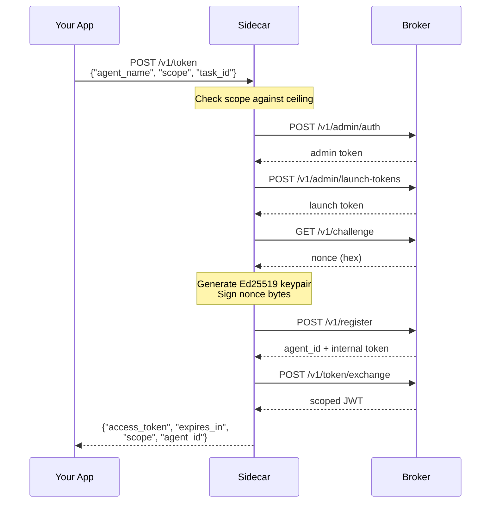
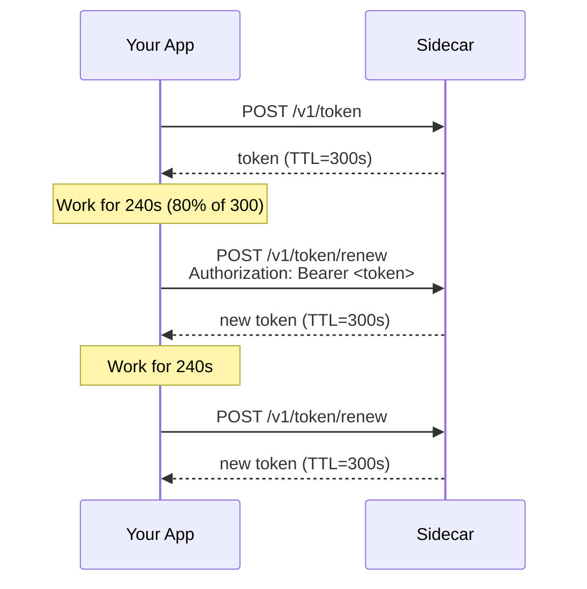
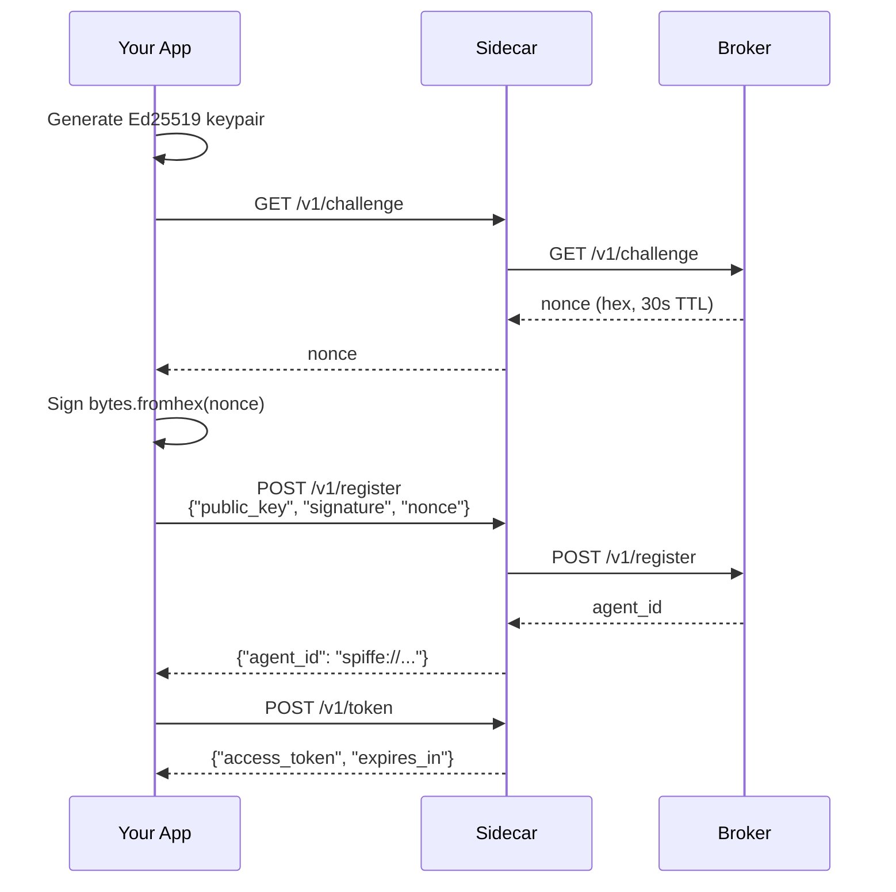

# Getting Started: Developer

> **Persona:** Developer building an AI agent in Python or TypeScript.
>
> **Prerequisite:** Your operator has deployed a sidecar and given you its URL and scope ceiling.
> If you are the operator, see [Getting Started: Operator](getting-started-operator.md).

## How It Works: The Provisioning Flow

Before you write any code, here is what already happened:

1. **Your operator deployed a sidecar** -- a lightweight service that sits between your agent and the AgentAuth broker. The sidecar is configured with `AA_ADMIN_SECRET` and a **scope ceiling** (the maximum permissions any agent can request through it).
2. **You received a sidecar URL and your allowed scopes** -- the operator told you: "Here is the sidecar URL. You can request any of these scopes."
3. **You call `POST /v1/token`** -- the sidecar handles everything else: admin auth, launch token creation, Ed25519 key generation, challenge-response registration, and token exchange. You get back a scoped JWT.

Think of it like AWS IAM:
- **Operator** creates an IAM role with a permission boundary = deploys sidecar with scope ceiling
- **Developer** assumes the role and gets temporary STS credentials = calls `POST /v1/token`
- **Developer** never sees root credentials = `AA_ADMIN_SECRET` stays on the sidecar

> **You never deal with launch tokens, admin secrets, or broker URLs.** The sidecar manages all of that transparently.

## What You Need

- Sidecar URL from your operator (e.g., `https://sidecar.internal.company.com`)
- Your allowed scopes from your operator (e.g., `read:data:*`, `write:data:*`)
- Python 3.8+ with `requests` installed (`pip install requests`)

You do not need an admin secret. You do not need to deploy anything. The sidecar handles all cryptographic operations and broker communication for you.

---

## The Simple Path: Sidecar-Managed Keys

This is the recommended path. One HTTP call gets you a scoped, short-lived token.

### Complete Working Example

```python
import os
import requests

SIDECAR = os.environ.get("AGENTAUTH_SIDECAR_URL", "https://sidecar.internal.company.com")

# Request a scoped token -- one call, no crypto needed
resp = requests.post(f"{SIDECAR}/v1/token", json={
    "agent_name": "my-agent",
    "task_id": "task-001",
    "scope": ["read:data:*"],
})
resp.raise_for_status()
data = resp.json()

token = data["access_token"]
agent_id = data["agent_id"]
expires_in = data["expires_in"]

print(f"Token acquired for {agent_id}, expires in {expires_in}s")

# Use the token in downstream requests
headers = {"Authorization": f"Bearer {token}"}
# resource_resp = requests.get("https://your-api/resource", headers=headers)
```

That is 15 lines. The sidecar generates Ed25519 keys, performs the challenge-response handshake with the broker, and returns a signed JWT -- all behind that single POST.

### What Just Happened



You never interact with the broker directly. The sidecar caches agent registrations, so subsequent token requests for the same `agent_name`/`task_id` skip re-registration.

---

## Using Your Token

Attach the token to every request that requires authentication:

```python
import requests

token = "<your access_token from above>"

headers = {"Authorization": f"Bearer {token}"}
response = requests.get("https://your-api.example.com/data", headers=headers)
```

Resource servers can verify your token against the broker:

```python
import os
import requests

BROKER = os.environ.get("AGENTAUTH_BROKER_URL", "https://agentauth.internal.company.com")

resp = requests.post(f"{BROKER}/v1/token/validate", json={"token": token})
result = resp.json()

if result["valid"]:
    claims = result["claims"]
    print(f"Agent: {claims['sub']}")
    print(f"Scope: {claims['scope']}")
    print(f"Task:  {claims['task_id']}")
else:
    print(f"Invalid: {result['error']}")
```

---

## Enforcing Scopes in Your Resource Server

> **This is interim guidance.** When the AgentAuth SDK ships, it replaces these manual checks with a single function call. But the principle never changes: **validate first, check scope second, act third.** Never skip the scope check -- a valid token does not mean the agent is authorized for this specific action.

Every resource server endpoint that accepts agent tokens must do three things, in order:

1. **Validate the token** -- call `POST /v1/token/validate` on the broker
2. **Check the scope** -- verify the token's scopes cover the action
3. **Act or deny** -- if scope doesn't cover, return 403

### Python Example

```python
import os
import requests

BROKER = os.environ.get("AGENTAUTH_BROKER_URL", "https://agentauth.internal.company.com")


def require_scope(request, required_scope):
    """Validate token and check scope. Call this in every endpoint handler."""
    token = request.headers.get("Authorization", "").removeprefix("Bearer ")
    if not token:
        raise HTTPException(401, "missing bearer token")

    # Step 1: Validate token
    resp = requests.post(f"{BROKER}/v1/token/validate", json={"token": token})
    result = resp.json()
    if not result["valid"]:
        raise HTTPException(403, f"invalid token: {result.get('error', 'unknown')}")

    # Step 2: Check scope
    claims = result["claims"]
    if not scope_covers(claims["scope"], required_scope):
        raise HTTPException(403,
            f"scope {claims['scope']} does not cover {required_scope}")

    return claims  # Pass to handler for audit/attribution


def scope_covers(allowed_scopes, required_scope):
    """Check if any allowed scope covers the required scope.
    Uses the same action:resource:identifier matching as the broker."""
    r_parts = required_scope.split(":")
    if len(r_parts) != 3:
        return False
    for allowed in allowed_scopes:
        a_parts = allowed.split(":")
        if len(a_parts) != 3:
            continue
        if a_parts[0] == r_parts[0] and a_parts[1] == r_parts[1]:
            if a_parts[2] == "*" or a_parts[2] == r_parts[2]:
                return True
    return False
```

### Go Example

```go
func requireScope(brokerURL, token, required string) (*Claims, error) {
    // Step 1: Validate
    resp, err := http.Post(brokerURL+"/v1/token/validate",
        "application/json", tokenBody(token))
    if err != nil {
        return nil, fmt.Errorf("validation request failed: %w", err)
    }
    defer resp.Body.Close()

    var result struct {
        Valid  bool   `json:"valid"`
        Error  string `json:"error,omitempty"`
        Claims Claims `json:"claims"`
    }
    if err := json.NewDecoder(resp.Body).Decode(&result); err != nil {
        return nil, fmt.Errorf("decode response: %w", err)
    }
    if !result.Valid {
        return nil, fmt.Errorf("invalid token: %s", result.Error)
    }

    // Step 2: Check scope
    if !scopeCovers(result.Claims.Scope, required) {
        return nil, fmt.Errorf("scope %v does not cover %s", result.Claims.Scope, required)
    }

    return &result.Claims, nil
}
```

### TypeScript Example

```typescript
const BROKER = process.env.AGENTAUTH_BROKER_URL || "https://agentauth.internal.company.com";

async function requireScope(request: Request, requiredScope: string) {
  const token = request.headers.get("Authorization")?.replace("Bearer ", "");
  if (!token) throw new Error("missing bearer token");

  // Step 1: Validate token
  const resp = await fetch(`${BROKER}/v1/token/validate`, {
    method: "POST",
    headers: { "Content-Type": "application/json" },
    body: JSON.stringify({ token }),
  });
  const result = await resp.json();
  if (!result.valid) throw new Error(`invalid token: ${result.error}`);

  // Step 2: Check scope
  const claims = result.claims;
  if (!scopeCovers(claims.scope, requiredScope)) {
    throw new Error(`scope ${claims.scope} does not cover ${requiredScope}`);
  }

  return claims;
}

function scopeCovers(allowed: string[], required: string): boolean {
  const [rAct, rRes, rId] = required.split(":");
  if (!rAct || !rRes || !rId) return false;
  return allowed.some((a) => {
    const [aAct, aRes, aId] = a.split(":");
    return aAct === rAct && aRes === rRes && (aId === "*" || aId === rId);
  });
}
```

---

## Token Renewal

Tokens are short-lived (default 5 minutes). Renew before expiry to avoid interruption.

### Renewal Pattern (80% TTL)

```python
import os
import requests
import time

SIDECAR = os.environ.get("AGENTAUTH_SIDECAR_URL", "https://sidecar.internal.company.com")

def get_token(sidecar, agent_name, task_id, scope):
    resp = requests.post(f"{sidecar}/v1/token", json={
        "agent_name": agent_name,
        "task_id": task_id,
        "scope": scope,
    })
    resp.raise_for_status()
    return resp.json()

def renew_token(sidecar, token):
    resp = requests.post(
        f"{sidecar}/v1/token/renew",
        headers={"Authorization": f"Bearer {token}"},
    )
    resp.raise_for_status()
    return resp.json()

# Initial token acquisition
data = get_token(SIDECAR, "my-agent", "task-001", ["read:data:*"])
token = data["access_token"]
ttl = data["expires_in"]

while True:
    # Do work with the token
    # ... your agent logic here ...

    # Sleep until 80% of TTL, then renew
    time.sleep(ttl * 0.8)

    try:
        data = renew_token(SIDECAR, token)
        token = data["access_token"]
        ttl = data["expires_in"]
        print(f"Renewed, new TTL: {ttl}s")
    except requests.HTTPError as e:
        if e.response.status_code in (401, 403):
            # Token expired or revoked -- re-bootstrap
            print("Token invalid, re-acquiring...")
            data = get_token(SIDECAR, "my-agent", "task-001", ["read:data:*"])
            token = data["access_token"]
            ttl = data["expires_in"]
        else:
            raise
```



If renewal fails with 401 or 403, your token was either expired or revoked. Re-acquire a fresh token from the sidecar.

---

## The BYOK Path: Bring Your Own Keys

If you need to control your own Ed25519 keys (for audit, compliance, or multi-sidecar scenarios), use the BYOK flow. You generate keys, sign a challenge nonce, and register through the sidecar.

### Complete BYOK Example

```python
import base64
import os
import requests
from cryptography.hazmat.primitives.asymmetric.ed25519 import Ed25519PrivateKey
from cryptography.hazmat.primitives.serialization import Encoding, PublicFormat

SIDECAR = os.environ.get("AGENTAUTH_SIDECAR_URL", "https://sidecar.internal.company.com")

# 1. Generate Ed25519 keypair
private_key = Ed25519PrivateKey.generate()
pub_raw = private_key.public_key().public_bytes(Encoding.Raw, PublicFormat.Raw)
pub_b64 = base64.b64encode(pub_raw).decode()

# 2. Get a challenge nonce from the sidecar
challenge = requests.get(f"{SIDECAR}/v1/challenge")
challenge.raise_for_status()
nonce_hex = challenge.json()["nonce"]

# 3. Sign the nonce BYTES (hex-decode first!)
nonce_bytes = bytes.fromhex(nonce_hex)
signature = private_key.sign(nonce_bytes)
sig_b64 = base64.b64encode(signature).decode()

# 4. Register with the sidecar
reg = requests.post(f"{SIDECAR}/v1/register", json={
    "agent_name": "byok-agent",
    "task_id": "task-002",
    "public_key": pub_b64,
    "signature": sig_b64,
    "nonce": nonce_hex,
})
reg.raise_for_status()
agent_id = reg.json()["agent_id"]
print(f"Registered as {agent_id}")

# 5. Now get tokens via the normal sidecar path
token_resp = requests.post(f"{SIDECAR}/v1/token", json={
    "agent_name": "byok-agent",
    "task_id": "task-002",
    "scope": ["read:data:*"],
})
token_resp.raise_for_status()
token = token_resp.json()["access_token"]
print(f"Token: {token[:40]}...")
```



After BYOK registration, you get tokens through the same `POST /v1/token` endpoint as the simple path.

---

## TypeScript Examples

### Get a Token via Sidecar

```typescript
const SIDECAR = process.env.AGENTAUTH_SIDECAR_URL || "https://sidecar.internal.company.com";

const resp = await fetch(`${SIDECAR}/v1/token`, {
  method: "POST",
  headers: { "Content-Type": "application/json" },
  body: JSON.stringify({
    agent_name: "my-agent",
    task_id: "task-001",
    scope: ["read:data:*"],
  }),
});

if (!resp.ok) throw new Error(`Token request failed: ${resp.status}`);
const data = await resp.json();

const token = data.access_token;
const agentId = data.agent_id;
console.log(`Token for ${agentId}, expires in ${data.expires_in}s`);
```

### BYOK Registration with tweetnacl

```typescript
import nacl from "tweetnacl";

const SIDECAR = process.env.AGENTAUTH_SIDECAR_URL || "https://sidecar.internal.company.com";

function b64(bytes: Uint8Array): string {
  return Buffer.from(bytes).toString("base64");
}

function hexToBytes(hex: string): Uint8Array {
  const out = new Uint8Array(hex.length / 2);
  for (let i = 0; i < hex.length; i += 2) {
    out[i / 2] = parseInt(hex.slice(i, i + 2), 16);
  }
  return out;
}

// 1. Generate Ed25519 keypair
const kp = nacl.sign.keyPair();
const pubB64 = b64(kp.publicKey);

// 2. Get challenge nonce
const challengeResp = await fetch(`${SIDECAR}/v1/challenge`);
if (!challengeResp.ok) throw new Error("Challenge failed");
const { nonce } = await challengeResp.json();

// 3. Sign nonce bytes (hex-decode first)
const nonceBytes = hexToBytes(nonce);
const sig = nacl.sign.detached(nonceBytes, kp.secretKey);
const sigB64 = b64(sig);

// 4. Register
const regResp = await fetch(`${SIDECAR}/v1/register`, {
  method: "POST",
  headers: { "Content-Type": "application/json" },
  body: JSON.stringify({
    agent_name: "byok-agent",
    task_id: "task-002",
    public_key: pubB64,
    signature: sigB64,
    nonce: nonce,
  }),
});
if (!regResp.ok) throw new Error("Registration failed");
const { agent_id } = await regResp.json();
console.log(`Registered as ${agent_id}`);
```

### Token Renewal

```typescript
const SIDECAR = process.env.AGENTAUTH_SIDECAR_URL || "https://sidecar.internal.company.com";

async function renewToken(sidecar: string, token: string) {
  const resp = await fetch(`${sidecar}/v1/token/renew`, {
    method: "POST",
    headers: { Authorization: `Bearer ${token}` },
  });
  if (!resp.ok) throw new Error(`Renewal failed: ${resp.status}`);
  return resp.json();
}

// Renew at 80% TTL
let currentToken = "<initial token>";
let ttl = 300;

const renewalLoop = setInterval(async () => {
  try {
    const data = await renewToken(SIDECAR, currentToken);
    currentToken = data.access_token;
    ttl = data.expires_in;
  } catch {
    clearInterval(renewalLoop);
    // Re-bootstrap by requesting a new token
  }
}, ttl * 0.8 * 1000);
```

---

## Common Mistakes

### 1. Signing the nonce text instead of hex-decoded bytes

The nonce from `GET /v1/challenge` is a 64-character hex string representing 32 random bytes. You must hex-decode it before signing.

```python
# WRONG -- signs the ASCII text of the hex string
signature = private_key.sign(nonce_hex.encode())

# RIGHT -- signs the actual 32 bytes
signature = private_key.sign(bytes.fromhex(nonce_hex))
```

### 2. Using DER-encoded keys instead of raw 32-byte keys

The broker expects raw 32-byte Ed25519 public keys, not PEM or DER format.

```python
# WRONG -- DER encoding produces more than 32 bytes
from cryptography.hazmat.primitives.serialization import Encoding, PublicFormat
pub_der = key.public_key().public_bytes(Encoding.DER, PublicFormat.SubjectPublicKeyInfo)

# RIGHT -- raw encoding produces exactly 32 bytes
pub_raw = key.public_key().public_bytes(Encoding.Raw, PublicFormat.Raw)
```

### 3. Requesting scope broader than the sidecar ceiling

If your operator configured the sidecar with `AA_SIDECAR_SCOPE_CEILING=read:data:*`, requesting `write:data:*` returns 403. Check with your operator about your allowed scopes.

```python
# This will fail if the sidecar ceiling is ["read:data:*"]
resp = requests.post(f"{SIDECAR}/v1/token", json={
    "agent_name": "my-agent",
    "task_id": "t1",
    "scope": ["write:data:*"],  # not covered by ceiling
})
# HTTP 403: "requested scope exceeds sidecar ceiling"
```

### 4. Reusing a nonce

Each nonce is single-use and expires after 30 seconds. Always get a fresh nonce immediately before signing and registering.

---

## Next Steps

- [Common Tasks](common-tasks.md) -- validation, delegation, error handling
- [Concepts](concepts.md) -- understand why this works the way it does
- [Troubleshooting](troubleshooting.md) -- exact error messages and fixes
- [API Reference](api.md) -- complete endpoint documentation
