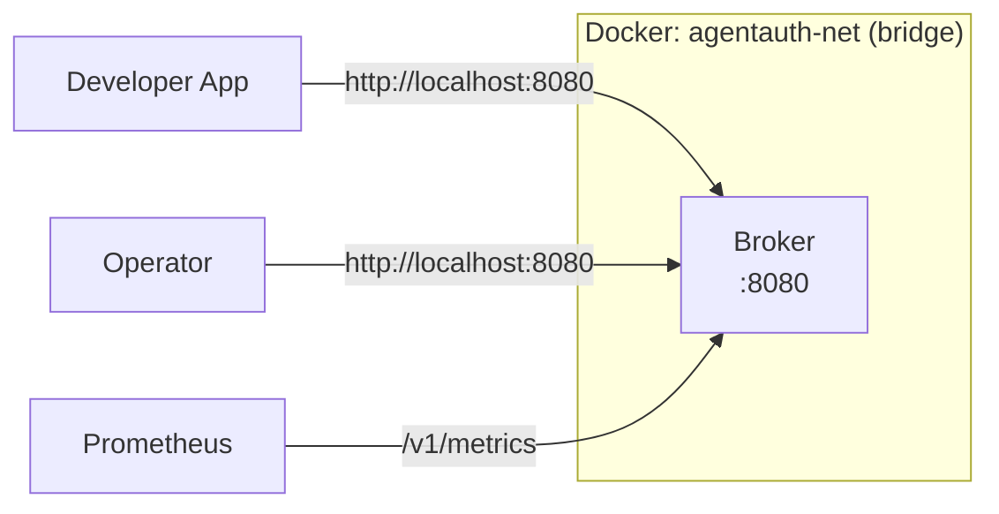
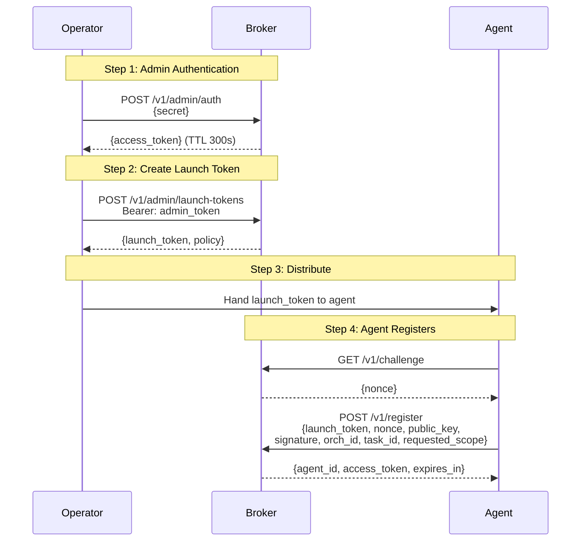

# Getting Started: Operator

> **Document Version:** 3.0 | **Last Updated:** March 2026 | **Status:** Current
>
> **Audience:** Platform Operator responsible for deploying and managing AgentAuth infrastructure.
>
> **Prerequisite:** Read [Concepts](concepts.md) to understand why AgentAuth exists and what the 7-component security pattern provides. If you are a developer integrating an agent, see [Getting Started: Developer](getting-started-developer.md).
>
> **Next steps:** [Common Tasks: Operator](common-tasks.md#operator-tasks) | [Troubleshooting](troubleshooting.md#operator-errors) | [Architecture](architecture.md)

This guide walks you through deploying the AgentAuth broker, configuring it, creating launch tokens for developers, and monitoring the system.

---

## Quick Start (Docker Compose)

Get a broker running in three commands:

```bash
# 1. Set the admin secret (required -- broker exits without it)
export AA_ADMIN_SECRET="$(openssl rand -hex 32)"

# 2. Build and start the stack
./scripts/stack_up.sh

# 3. Verify the broker is healthy
curl http://localhost:8080/v1/health
# {"status":"ok","version":"2.0.0","uptime":5,"db_connected":true,"audit_events_count":0}
```

To tear down the stack:

```bash
./scripts/stack_down.sh
```

### What Docker Compose Deploys



The `docker-compose.yml` defines the broker service on a bridge network (`agentauth-net`). The image uses a multi-stage Alpine build (golang:1.24 builder, alpine:3.18 runtime).

---

## Operator CLI (aactl)

`aactl` is the operator command-line tool for AgentAuth. It reads broker connection details from environment variables and handles authentication automatically.

### Install / build

```bash
go build -o aactl ./cmd/aactl/
```

### Initialize

Use `aactl init` to set up configuration. This creates a config file with broker URL and secret:

```bash
# Dev mode (creates ~/.agentauth/config)
aactl init --mode dev --force

# Prod mode with custom path
aactl init --mode prod --config-path /etc/agentauth/config
```

### Configure

```bash
export AACTL_BROKER_URL=http://localhost:8080
export AACTL_ADMIN_SECRET=my-secure-admin-secret-here
```

### Quick reference

```bash
# App management
aactl app register [--name NAME] [--scopes SCOPES]
aactl app list
aactl app get <app-id>
aactl app update --id <app-id> [--scopes SCOPES] [--token-ttl N]
aactl app remove --id <app-id>

# Revocation
aactl revoke --level token  --target <jti>
aactl revoke --level agent  --target spiffe://...
aactl revoke --level task   --target task-001
aactl revoke --level chain  --target spiffe://...

# Token Release
aactl token release --token <jwt>

# Audit
aactl audit events
aactl audit events --event-type token_revoked
aactl audit events --agent-id spiffe://...
aactl audit events --outcome success
aactl audit events --since 2026-03-29T00:00:00Z --limit 50
aactl audit events --json
```

---

## Broker Configuration

All broker configuration is via environment variables prefixed `AA_`. Configuration can also be loaded from a config file generated by `aactl init` (see [Operator CLI](#operator-cli-aactl) above). Environment variables always override config file values.

| Variable | Type | Default | Required | Description |
|----------|------|---------|----------|-------------|
| `AA_ADMIN_SECRET` | string | *(none)* | **Yes** | Shared secret for admin authentication. The broker exits immediately on startup if this is unset or empty. Use a strong random value (e.g., `openssl rand -hex 32`). |
| `AA_PORT` | string | `"8080"` | No | HTTP listen port. |
| `AA_LOG_LEVEL` | string | `"verbose"` | No | Log verbosity: `quiet`, `standard`, `verbose`, `trace`. Note: `verbose` currently emits the same output as `standard`. |
| `AA_TRUST_DOMAIN` | string | `"agentauth.local"` | No | SPIFFE trust domain used in agent identity URIs (e.g., `spiffe://agentauth.local/agent/...`). |
| `AA_DEFAULT_TTL` | int | `300` | No | Default token TTL in seconds (5 minutes). |
| `AA_MAX_TTL` | int | `86400` | No | Maximum token TTL ceiling in seconds (24 hours). Tokens requesting longer TTL are clamped to this value. Set to `0` to disable the ceiling entirely. |
| `AA_BIND_ADDRESS` | string | `"127.0.0.1"` | No | Bind address for the HTTP listener. Use `"0.0.0.0"` for Docker or to accept external connections. |
| `AA_SIGNING_KEY_PATH` | string | `"./signing.key"` | No | Path to Ed25519 private key for token signing. If the file does not exist, a fresh key is generated and saved to this path on startup. |
| `AA_AUDIENCE` | string | `"agentauth"` | No | Expected `aud` claim in JWTs. Set to empty string to skip audience validation. |
| `AA_APP_TOKEN_TTL` | int | `1800` | No | TTL for app JWTs in seconds (30 minutes). Controls how long app-authenticated tokens last. |
| `AA_SEED_TOKENS` | bool | `false` | No | Print seed launch and admin tokens to stdout on startup. **Development only** -- never enable in production. |
| `AA_DB_PATH` | string | `"./agentauth.db"` | No | Path to the SQLite database file for audit event persistence. The broker creates the file and table on first startup. Set to `""` to disable persistence (memory-only mode). See [Audit Persistence](#audit-persistence-aa_db_path) below. |
| `AA_TLS_MODE` | string | `"none"` | No | Transport security mode: `none` (plain HTTP), `tls` (one-way TLS), `mtls` (mutual TLS). See [TLS/mTLS Configuration](#tlsmtls-configuration) below. |
| `AA_TLS_CERT` | string | *(none)* | If TLS | Path to the broker's TLS certificate PEM file. Required when `AA_TLS_MODE` is `tls` or `mtls`. |
| `AA_TLS_KEY` | string | *(none)* | If TLS | Path to the broker's TLS private key PEM file. Required when `AA_TLS_MODE` is `tls` or `mtls`. |
| `AA_TLS_CLIENT_CA` | string | *(none)* | If mTLS | Path to the client CA certificate PEM file used to verify client certificates. Required when `AA_TLS_MODE` is `mtls`. |

### Security notes

- **`AA_ADMIN_SECRET`** is the root of trust for the entire system. Anyone who knows this value can create launch tokens, revoke credentials, and read the audit trail. Treat it like a root password.
- **`AA_SEED_TOKENS`** bypasses the normal bootstrap flow by printing tokens to stdout. This is for local development and testing only.
- The broker **persists its Ed25519 signing key** to disk at `AA_SIGNING_KEY_PATH` (default `./signing.key`). A new key is generated only on first startup. Tokens remain valid across restarts. To rotate the key, delete the file and restart — all previously issued tokens become invalid. Protect the key file as you would any private key.

---

## TLS/mTLS Configuration

By default the broker listens on plain HTTP (`AA_TLS_MODE=none`). For production deployments, enable TLS or mutual TLS to encrypt traffic and optionally require client certificates.

### Mode: tls (one-way TLS)

The broker presents a certificate. Clients verify the broker's identity but do not present their own certificate.

```bash
export AA_TLS_MODE=tls
export AA_TLS_CERT=/etc/agentauth/certs/broker.crt
export AA_TLS_KEY=/etc/agentauth/certs/broker.key
export AA_ADMIN_SECRET="$(openssl rand -hex 32)"

go run ./cmd/broker
# AgentAuth broker v2.0.0 listening on :8080 (TLS)
```

Clients connect with HTTPS:

```bash
curl --cacert /etc/agentauth/certs/ca.crt https://localhost:8080/v1/health
```

### Mode: mtls (mutual TLS)

Both broker and client present certificates. The broker verifies client certificates against the configured CA. This is the recommended mode for production — only authorized clients with valid certificates can connect.

```bash
export AA_TLS_MODE=mtls
export AA_TLS_CERT=/etc/agentauth/certs/broker.crt
export AA_TLS_KEY=/etc/agentauth/certs/broker.key
export AA_TLS_CLIENT_CA=/etc/agentauth/certs/client-ca.crt
export AA_ADMIN_SECRET="$(openssl rand -hex 32)"

go run ./cmd/broker
```

Clients must present a certificate signed by the configured client CA:

```bash
curl \
  --cacert /etc/agentauth/certs/ca.crt \
  --cert /etc/agentauth/certs/client.crt \
  --key /etc/agentauth/certs/client.key \
  https://localhost:8080/v1/health
```

Clients without a valid certificate are rejected at the TLS handshake — they never reach the HTTP layer.

### Docker Compose with TLS

Mount your certificates into the container and pass the env vars:

```yaml
broker:
  environment:
    - AA_TLS_MODE=${AA_TLS_MODE:-none}
    - AA_TLS_CERT=${AA_TLS_CERT:-}
    - AA_TLS_KEY=${AA_TLS_KEY:-}
    - AA_TLS_CLIENT_CA=${AA_TLS_CLIENT_CA:-}
  volumes:
    - /etc/agentauth/certs:/certs:ro
```

Then set env vars before bringing up the stack:

```bash
export AA_TLS_MODE=tls
export AA_TLS_CERT=/certs/broker.crt
export AA_TLS_KEY=/certs/broker.key
./scripts/stack_up.sh
```

### Generating a self-signed cert for testing

```bash
# Generate a self-signed cert valid for localhost
openssl req -x509 -newkey rsa:2048 \
  -keyout broker.key \
  -out broker.crt \
  -days 365 -nodes \
  -subj "/CN=localhost" \
  -addext "subjectAltName=IP:127.0.0.1,DNS:localhost"
```

> **Warning:** Self-signed certs are for development and testing only. Use a proper CA in production.

---

## Audit Persistence (AA_DB_PATH)

The broker persists audit events and revocations to SQLite. To configure the database path:

| Variable | Type | Default | Required | Description |
|----------|------|---------|----------|-------------|
| `AA_DB_PATH` | string | `"./agentauth.db"` | No | Path to the SQLite database file. The broker creates the file if it does not exist. The directory must be writable by the broker process. |

Set `AA_DB_PATH` to a stable location on the host:

```bash
export AA_DB_PATH="/var/lib/agentauth/agentauth.db"
AA_ADMIN_SECRET="..." go run ./cmd/broker
```

In Docker Compose, mount a volume so the database survives container replacement:

```yaml
broker:
  environment:
    - AA_DB_PATH=/data/agentauth.db
  volumes:
    - agentauth-data:/data

volumes:
  agentauth-data:
```

On startup, the broker loads all existing audit events from SQLite to rebuild the hash chain in memory. The number of events loaded is logged and exposed as the `agentauth_audit_events_loaded` Prometheus gauge.

**Note:** The broker persists its Ed25519 signing key to `AA_SIGNING_KEY_PATH`. Both audit events and signing keys survive restarts, so previously issued tokens remain valid. To force key rotation, delete the signing key file and restart.

---

## The Bootstrap Flow

Before any agent can get a token, the operator must complete the bootstrap chain: authenticate as admin, create a launch token, and hand it to the agent.



### Step 1: Authenticate as Admin

```bash
ADMIN_TOKEN=$(curl -s -X POST http://localhost:8080/v1/admin/auth \
  -H "Content-Type: application/json" \
  -d "{\"secret\": \"$AA_ADMIN_SECRET\"}" \
  | python3 -c "import sys,json; print(json.load(sys.stdin)['access_token'])")
```

The admin token has a 300-second TTL and includes three scopes: `admin:launch-tokens:*`, `admin:revoke:*`, `admin:audit:*`. Cache and reuse it within its TTL rather than re-authenticating for every operation.

The admin auth endpoint is rate-limited to 5 requests/second with a burst of 10 per IP address.

### Step 2: Create a Launch Token

```bash
curl -s -X POST http://localhost:8080/v1/admin/launch-tokens \
  -H "Content-Type: application/json" \
  -H "Authorization: Bearer $ADMIN_TOKEN" \
  -d '{
    "agent_name": "data-processor",
    "allowed_scope": ["read:data:*", "write:data:*"],
    "max_ttl": 300,
    "single_use": true,
    "ttl": 30
  }'
```

Response (201 Created):

```json
{
  "launch_token": "a1b2c3d4...64-hex-characters",
  "expires_at": "2026-02-15T12:00:30Z",
  "policy": {
    "allowed_scope": ["read:data:*", "write:data:*"],
    "max_ttl": 300
  }
}
```

Launch token fields:

| Field | Description |
|-------|-------------|
| `agent_name` | Descriptive label stored with the launch token for operator context and auditability. |
| `allowed_scope` | Maximum scopes the agent can request during registration. |
| `max_ttl` | Maximum token TTL (seconds) the agent can request. Default: 300. |
| `single_use` | If `true`, the launch token is consumed after one successful registration. If `false`, it can be reused until it expires. |
| `ttl` | Lifetime of the launch token itself (seconds). Default: 30. |

## Token Release (Task Completion Signal)

When an agent completes its task, it can optionally signal task completion by releasing its token. This triggers audit logging and allows the broker to perform cleanup operations.

```bash
# Agent releases its token when task is complete
curl -s -X POST "http://localhost:8080/v1/token/release" \
  -H "Authorization: Bearer <agent-token>"
```

Response (204 No Content):

```
HTTP/1.1 204 No Content
```

This endpoint records the token release in the audit trail and marks the token as explicitly completed. Token release is optional -- tokens are also automatically recorded as expired when their TTL elapses. Token release can be used for:

- **Task completion audit trails** -- mark exactly when a task finished
- **Cleanup operations** -- trigger resource deallocation
- **Billing/metering** -- record precise duration of task execution
- **Compliance** -- demonstrate explicit credential deactivation

---

---

## Monitoring

### Health Endpoints

| Endpoint | Port | Description |
|----------|------|-------------|
| `GET /v1/health` (broker) | 8080 | Returns `{"status":"ok","version":"2.0.0","uptime":N,"db_connected":true,"audit_events_count":N}`. Used by Docker health checks and load balancers. |
| `GET /v1/metrics` (broker) | 8080 | Prometheus metrics exposition endpoint. |

### Broker Prometheus Metrics

| Metric | Type | Labels | Description |
|--------|------|--------|-------------|
| `agentauth_tokens_issued_total` | counter | `scope` | Tokens issued, labeled by primary scope. |
| `agentauth_tokens_revoked_total` | counter | `level` | Revocation operations by level (`token`, `agent`, `task`, `chain`). |
| `agentauth_registrations_total` | counter | `status` | Agent registration attempts (`success`, `failure`). |
| `agentauth_admin_auth_total` | counter | `status` | Admin authentication attempts (`success`, `failure`). |
| `agentauth_launch_tokens_created_total` | counter | -- | Total launch tokens created. |
| `agentauth_active_agents` | gauge | -- | Currently registered agents. |
| `agentauth_request_duration_seconds` | histogram | `endpoint` | HTTP request latency by endpoint. |
| `agentauth_clock_skew_total` | counter | -- | Clock skew events detected during token validation. |


### Key metrics to alert on

- `agentauth_admin_auth_total{status="failure"}` -- repeated failures may indicate a brute-force attempt or misconfigured secret.
- `agentauth_tokens_revoked_total` spike -- potential security incident in progress.

### Log Format

All logs follow this format:

```
[AA:MODULE:LEVEL] TIMESTAMP | COMPONENT | MESSAGE | context1, context2
```

Example:

```
[AA:BROKER:OK] 2026-02-15T12:00:00Z | main | starting broker | addr=:8080, version=2.0.0
[AA:BROKER:WARN] 2026-02-15T12:00:05Z | CFG | AA_DEFAULT_TTL exceeds AA_MAX_TTL | default_ttl=600 max_ttl=300
```

- `FAIL` level logs go to stderr; all others go to stdout.
- Log levels control verbosity: `quiet` (errors only), `standard` (normal operations), `verbose` (same as standard currently), `trace` (detailed debugging).

---

## Next Steps

- [Common Tasks: Operator](common-tasks.md#operator-tasks) -- revocation, audit queries, launch token management
- [Architecture](architecture.md) -- how the broker works internally
- [Troubleshooting](troubleshooting.md#operator-errors) -- operational issues and fixes
- [API Reference](api.md) -- complete endpoint documentation
