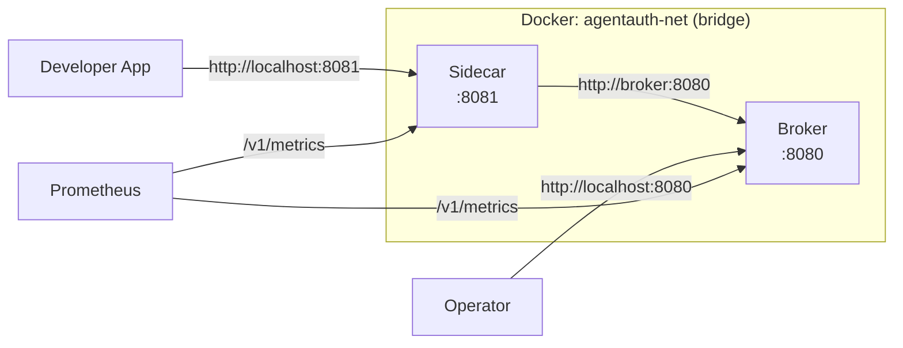
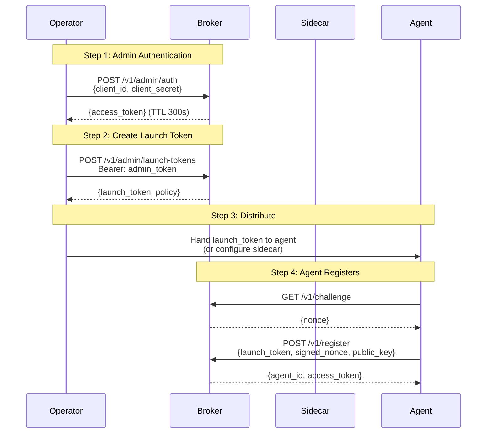
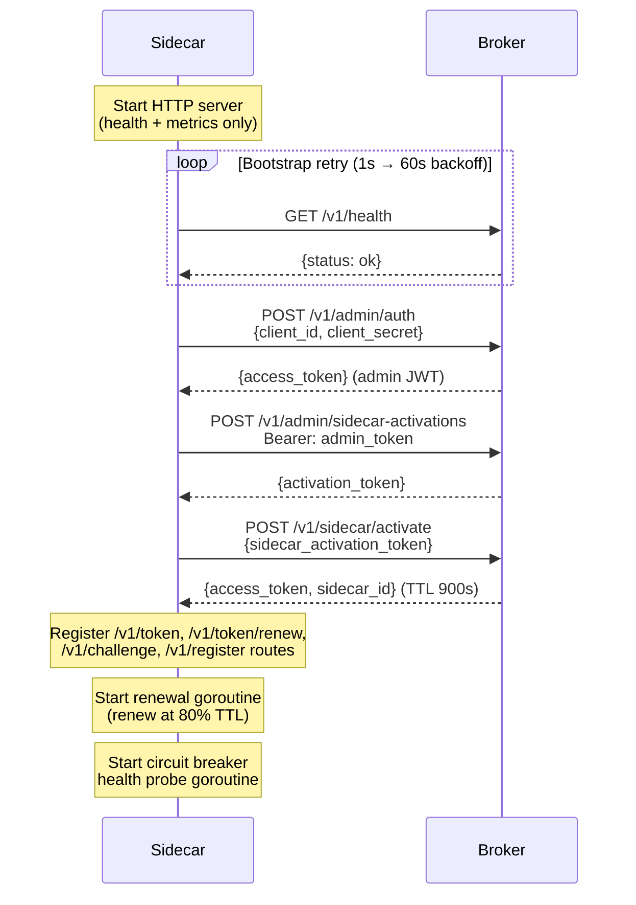

# Getting Started: Operator

> **Document Version:** 2.1 | **Last Updated:** February 2026 | **Status:** Current
>
> **Audience:** Platform Operator responsible for deploying and managing AgentAuth infrastructure.
>
> **Prerequisite:** Read [Concepts](concepts.md) to understand why AgentAuth exists and what the 7-component security pattern provides. If you are a developer integrating an agent, see [Getting Started: Developer](getting-started-developer.md).
>
> **Next steps:** [Common Tasks: Operator](common-tasks.md#operator-tasks) | [Troubleshooting](troubleshooting.md#operator-errors) | [Architecture](architecture.md)

This guide walks you through deploying the AgentAuth broker, configuring it, creating launch tokens for developers, deploying sidecars, and monitoring the system.

---

## Quick Start (Docker Compose)

Get a broker and sidecar running in four commands:

```bash
# 1. Set the admin secret (required -- broker exits without it)
export AA_ADMIN_SECRET="$(openssl rand -hex 32)"

# 2. Build and start the stack
./scripts/stack_up.sh

# 3. Verify the broker is healthy
curl http://localhost:8080/v1/health
# {"status":"ok","version":"2.0.0","uptime":5,"db_connected":true,"audit_events_count":0}

# 4. Verify the sidecar is healthy
curl http://localhost:8081/v1/health
# {"status":"ok","broker_connected":true,"healthy":true,"sidecar_id":"a2b25ecc...",...}
```

To tear down the stack:

```bash
./scripts/stack_down.sh
```

### What Docker Compose Deploys



The `docker-compose.yml` defines two services on a shared bridge network (`agentauth-net`). The sidecar depends on the broker's health check passing before it starts. Both images use multi-stage Alpine builds (golang:1.24 builder, alpine:3.18 runtime).

---

## Operator CLI (aactl)

`aactl` is the operator command-line tool for AgentAuth. It reads broker connection details from environment variables and handles authentication automatically — no manual curl or JWT required.

> **Note:** aactl is available for demo and development use. Production auth will be added in a future release.

### Install / build

```bash
go build -o aactl ./cmd/aactl/
```

### Configure

```bash
export AACTL_BROKER_URL=http://localhost:8080
export AACTL_ADMIN_SECRET=change-me-in-production
```

### Quick reference

```bash
# Sidecars
aactl sidecars list                                                    # List all sidecars (table)
aactl sidecars list --json                                             # Raw JSON
aactl sidecars ceiling get <sidecar-id>                                # Get scope ceiling
aactl sidecars ceiling set <sidecar-id> --scopes read:data:*,write:data:*  # Set scope ceiling

# Revocation
aactl revoke --level token  --target <jti>
aactl revoke --level agent  --target spiffe://...
aactl revoke --level task   --target task-001
aactl revoke --level chain  --target spiffe://...

# Audit
aactl audit events
aactl audit events --event-type token_revoked
aactl audit events --agent-id spiffe://...
aactl audit events --since 2026-02-19T00:00:00Z --limit 50
aactl audit events --json
```

---

## Broker Configuration

All broker configuration is via environment variables prefixed `AA_`. There are no CLI flags or config files.

| Variable | Type | Default | Required | Description |
|----------|------|---------|----------|-------------|
| `AA_ADMIN_SECRET` | string | *(none)* | **Yes** | Shared secret for admin authentication. The broker exits immediately on startup if this is unset or empty. Use a strong random value (e.g., `openssl rand -hex 32`). |
| `AA_PORT` | string | `"8080"` | No | HTTP listen port. |
| `AA_LOG_LEVEL` | string | `"verbose"` | No | Log verbosity: `quiet`, `standard`, `verbose`, `trace`. Note: `verbose` currently emits the same output as `standard`. |
| `AA_TRUST_DOMAIN` | string | `"agentauth.local"` | No | SPIFFE trust domain used in agent identity URIs (e.g., `spiffe://agentauth.local/agent/...`). |
| `AA_DEFAULT_TTL` | int | `300` | No | Default token TTL in seconds (5 minutes). |
| `AA_SEED_TOKENS` | bool | `false` | No | Print seed launch and admin tokens to stdout on startup. **Development only** -- never enable in production. |
| `AA_DB_PATH` | string | `"./agentauth.db"` | No | Path to the SQLite database file for audit event persistence. The broker creates the file and table on first startup. Set to `""` to disable persistence (memory-only mode). See [Audit Persistence](#audit-persistence-aa_db_path) below. |
| `AA_TLS_MODE` | string | `"none"` | No | Transport security mode: `none` (plain HTTP), `tls` (one-way TLS), `mtls` (mutual TLS). See [TLS/mTLS Configuration](#tlsmtls-configuration) below. |
| `AA_TLS_CERT` | string | *(none)* | If TLS | Path to the broker's TLS certificate PEM file. Required when `AA_TLS_MODE` is `tls` or `mtls`. |
| `AA_TLS_KEY` | string | *(none)* | If TLS | Path to the broker's TLS private key PEM file. Required when `AA_TLS_MODE` is `tls` or `mtls`. |
| `AA_TLS_CLIENT_CA` | string | *(none)* | If mTLS | Path to the client CA certificate PEM file used to verify client certificates. Required when `AA_TLS_MODE` is `mtls`. |

### Security notes

- **`AA_ADMIN_SECRET`** is the root of trust for the entire system. Anyone who knows this value can create launch tokens, revoke credentials, and read the audit trail. Treat it like a root password.
- **`AA_SEED_TOKENS`** bypasses the normal bootstrap flow by printing tokens to stdout. This is for local development and testing only.
- The broker generates a **fresh Ed25519 signing key pair on every startup**. This means all previously issued tokens become invalid after a broker restart. This is by design -- there is no persistent key material to protect.

---

## TLS/mTLS Configuration

By default the broker listens on plain HTTP (`AA_TLS_MODE=none`). For production deployments, enable TLS or mutual TLS to encrypt traffic and optionally require client certificates.

### Mode: tls (one-way TLS)

The broker presents a certificate. Clients verify the broker's identity but do not present their own certificate.

```bash
export AA_TLS_MODE=tls
export AA_TLS_CERT=/etc/agentauth/certs/broker.crt
export AA_TLS_KEY=/etc/agentauth/certs/broker.key
export AA_ADMIN_SECRET="$(openssl rand -hex 32)"

go run ./cmd/broker
# AgentAuth broker v2.0.0 listening on :8080 (TLS)
```

Clients connect with HTTPS:

```bash
curl --cacert /etc/agentauth/certs/ca.crt https://localhost:8080/v1/health
```

### Mode: mtls (mutual TLS)

Both broker and client present certificates. The broker verifies client certificates against the configured CA. This is the recommended mode for production — only authorized clients with valid certificates can connect.

```bash
export AA_TLS_MODE=mtls
export AA_TLS_CERT=/etc/agentauth/certs/broker.crt
export AA_TLS_KEY=/etc/agentauth/certs/broker.key
export AA_TLS_CLIENT_CA=/etc/agentauth/certs/client-ca.crt
export AA_ADMIN_SECRET="$(openssl rand -hex 32)"

go run ./cmd/broker
```

Clients must present a certificate signed by the configured client CA:

```bash
curl \
  --cacert /etc/agentauth/certs/ca.crt \
  --cert /etc/agentauth/certs/client.crt \
  --key /etc/agentauth/certs/client.key \
  https://localhost:8080/v1/health
```

Clients without a valid certificate are rejected at the TLS handshake — they never reach the HTTP layer.

### Docker Compose with TLS

Mount your certificates into the container and pass the env vars:

```yaml
broker:
  environment:
    - AA_TLS_MODE=${AA_TLS_MODE:-none}
    - AA_TLS_CERT=${AA_TLS_CERT:-}
    - AA_TLS_KEY=${AA_TLS_KEY:-}
    - AA_TLS_CLIENT_CA=${AA_TLS_CLIENT_CA:-}
  volumes:
    - /etc/agentauth/certs:/certs:ro
```

Then set env vars before bringing up the stack:

```bash
export AA_TLS_MODE=tls
export AA_TLS_CERT=/certs/broker.crt
export AA_TLS_KEY=/certs/broker.key
./scripts/stack_up.sh
```

> **Note:** When TLS is enabled, update the sidecar's `AA_BROKER_URL` from `http://` to `https://` and ensure the sidecar container has access to the CA certificate to verify the broker's identity.

### Generating a self-signed cert for testing

```bash
# Generate a self-signed cert valid for localhost
openssl req -x509 -newkey rsa:2048 \
  -keyout broker.key \
  -out broker.crt \
  -days 365 -nodes \
  -subj "/CN=localhost" \
  -addext "subjectAltName=IP:127.0.0.1,DNS:localhost"
```

> **Warning:** Self-signed certs are for development and testing only. Use a proper CA in production.

---

## Sidecar Configuration

The sidecar is a developer-facing proxy that auto-bootstraps with the broker. It handles Ed25519 key generation, challenge-response registration, and token renewal transparently.

| Variable | Type | Default | Required | Description |
|----------|------|---------|----------|-------------|
| `AA_ADMIN_SECRET` | string | *(none)* | **Yes** | Must match the broker's `AA_ADMIN_SECRET`. The sidecar exits on startup if unset. |
| `AA_SIDECAR_SCOPE_CEILING` | string | *(none)* | **Yes** | Comma-separated list of maximum scopes this sidecar can issue (e.g., `"read:data:*,write:data:*"`). The sidecar exits on startup if unset. |
| `AA_BROKER_URL` | string | `"http://localhost:8080"` | No | Broker base URL. In Docker Compose, set to `http://broker:8080` (the Docker service name). |
| `AA_SIDECAR_PORT` | string | `"8081"` | No | Sidecar HTTP listen port. |
| `AA_SIDECAR_LOG_LEVEL` | string | `"standard"` | No | Sidecar log level: `quiet`, `standard`, `verbose`, `trace`. |
| `AA_SIDECAR_RENEWAL_BUFFER` | float | `0.8` | No | Fraction of TTL at which the sidecar renews its own bearer token. Valid range: 0.5 to 0.95. At 0.8 with a 900s TTL, renewal happens at 720s. |
| `AA_SIDECAR_CB_WINDOW` | int | `30` | No | Circuit breaker sliding window duration in seconds. |
| `AA_SIDECAR_CB_THRESHOLD` | float | `0.5` | No | Failure rate (0.0--1.0) within the window that trips the circuit breaker. |
| `AA_SIDECAR_CB_PROBE_INTERVAL` | int | `5` | No | Seconds between health probes when the circuit is open. |
| `AA_SIDECAR_CB_MIN_REQUESTS` | int | `5` | No | Minimum requests in the sliding window before the circuit breaker can trip. Prevents tripping on low traffic. |

### Scope ceiling design

The scope ceiling is the most important sidecar configuration decision. It defines the maximum permissions any agent token issued through this sidecar can have. Developers can request scopes within this ceiling but never exceed it.

Design principles:

1. **One sidecar per trust boundary.** Deploy separate sidecars for teams or services that need different scope ceilings.
2. **Least privilege.** Set the ceiling to the narrowest set of scopes the developers behind this sidecar actually need.
3. **Use wildcards carefully.** `read:data:*` allows reading any data resource. `read:data:users` restricts to a specific resource.

Scope format: `action:resource:identifier` (e.g., `read:data:*`, `write:config:app1`).

---

## Runtime Ceiling Management

`AA_SIDECAR_SCOPE_CEILING` is the **bootstrap seed only**. It sets the initial ceiling when the sidecar first activates, but the ceiling can be updated at runtime without restarting the sidecar or editing environment variables.

> **Note:** aactl is available for demo and development use. Production auth will be added in a future release.

### Updating the ceiling with aactl

```bash
# List sidecars to find the sidecar ID
aactl sidecars list

# Get the current ceiling
aactl sidecars ceiling get <sidecar-id>

# Update the ceiling
aactl sidecars ceiling set <sidecar-id> --scopes read:data:*
```

### Using the API directly

Use the admin API to change a sidecar's scope ceiling while it is running:

```bash
# Step 1: Get an admin token
ADMIN_TOKEN=$(curl -s -X POST http://localhost:8080/v1/admin/auth \
  -H "Content-Type: application/json" \
  -d "{\"client_id\": \"admin\", \"client_secret\": \"$AA_ADMIN_SECRET\"}" \
  | python3 -c "import sys,json; print(json.load(sys.stdin)['access_token'])")

# Step 2: Discover the sidecar ID from the sidecar health endpoint
SIDECAR_ID=$(curl -s http://localhost:8081/v1/health \
  | python3 -c "import sys,json; print(json.load(sys.stdin)['sidecar_id'])")

# Step 3: Update the ceiling
curl -s -X PUT "http://localhost:8080/v1/admin/sidecars/$SIDECAR_ID/ceiling" \
  -H "Content-Type: application/json" \
  -H "Authorization: Bearer $ADMIN_TOKEN" \
  -d '{
    "scope_ceiling": ["read:data:*"]
  }'
```

Response (200 OK):

```json
{
  "sidecar_id": "sc-abc123",
  "scope_ceiling": ["read:data:*"],
  "updated_at": "2026-02-18T10:00:00Z"
}
```

### When changes take effect

The sidecar picks up ceiling changes on its **next renewal cycle**. Because the sidecar renews its broker bearer token at 80% of TTL (default: 900s TTL, renewal at 720s), ceiling changes propagate within **4 to 12 minutes** depending on where the sidecar is in its renewal cycle.

There is no need to restart the sidecar. After the next renewal, any new `POST /v1/token` requests are evaluated against the updated ceiling. Agents that request scopes outside the new ceiling receive a 403 at the sidecar.

### Emergency narrowing

If you need to immediately revoke access, set a narrower ceiling and separately revoke affected tokens:

```bash
# Narrow the ceiling immediately
curl -s -X PUT "http://localhost:8080/v1/admin/sidecars/$SIDECAR_ID/ceiling" \
  -H "Content-Type: application/json" \
  -H "Authorization: Bearer $ADMIN_TOKEN" \
  -d '{"scope_ceiling": ["read:data:users"]}'

# Revoke all tokens for any agent whose scopes exceeded the new ceiling
curl -s -X POST http://localhost:8080/v1/revoke \
  -H "Content-Type: application/json" \
  -H "Authorization: Bearer $ADMIN_TOKEN" \
  -d '{"level": "agent", "target": "spiffe://agentauth.local/agent/orch/task/instance"}'
```

When the broker processes a ceiling update that narrows the allowed scopes, it automatically revokes any currently active tokens whose scope exceeds the new ceiling. The revocation is immediate -- those tokens will be rejected on the next validation even before the sidecar renews.

### Auditing ceiling changes

Every ceiling update is recorded as a `scope_ceiling_updated` audit event that includes the old ceiling, the new ceiling, and the timestamp. Query the audit trail to see the full history:

```bash
# Using aactl
aactl audit events --event-type scope_ceiling_updated

# Using the API directly
curl -s "http://localhost:8080/v1/audit/events?event_type=scope_ceiling_updated" \
  -H "Authorization: Bearer $ADMIN_TOKEN" \
  | python3 -m json.tool
```

---

## Audit Persistence (AA_DB_PATH)

By default, audit events are stored in memory and are lost when the broker restarts. To persist the audit trail across restarts, configure a SQLite database path:

| Variable | Type | Default | Required | Description |
|----------|------|---------|----------|-------------|
| `AA_DB_PATH` | string | `"./agentauth.db"` | No | Path to the SQLite database file. The broker creates the file if it does not exist. The directory must be writable by the broker process. |

Set `AA_DB_PATH` to a stable location on the host:

```bash
export AA_DB_PATH="/var/lib/agentauth/agentauth.db"
AA_ADMIN_SECRET="..." go run ./cmd/broker
```

In Docker Compose, mount a volume so the database survives container replacement:

```yaml
broker:
  environment:
    - AA_DB_PATH=/data/agentauth.db
  volumes:
    - agentauth-data:/data

volumes:
  agentauth-data:
```

On startup, the broker loads all existing audit events from SQLite to rebuild the hash chain in memory. The number of events loaded is logged and exposed as the `agentauth_audit_events_loaded` Prometheus gauge.

**Note:** The broker still generates a fresh Ed25519 signing key pair on every startup. Audit events persist, but previously issued tokens remain invalid after a restart. If you need tokens to survive restarts, that requires a separate key persistence mechanism (not currently supported).

---

## The Bootstrap Flow

Before any agent can get a token, the operator must complete the bootstrap chain: authenticate as admin, create a launch token (or activate a sidecar), and hand credentials to the agent or sidecar.



### Step 1: Authenticate as Admin

```bash
ADMIN_TOKEN=$(curl -s -X POST http://localhost:8080/v1/admin/auth \
  -H "Content-Type: application/json" \
  -d "{\"client_id\": \"admin\", \"client_secret\": \"$AA_ADMIN_SECRET\"}" \
  | python3 -c "import sys,json; print(json.load(sys.stdin)['access_token'])")
```

The admin token has a 300-second TTL and includes three scopes: `admin:launch-tokens:*`, `admin:revoke:*`, `admin:audit:*`. Cache and reuse it within its TTL rather than re-authenticating for every operation.

The admin auth endpoint is rate-limited to 5 requests/second with a burst of 10 per IP address.

### Step 2: Create a Launch Token

```bash
curl -s -X POST http://localhost:8080/v1/admin/launch-tokens \
  -H "Content-Type: application/json" \
  -H "Authorization: Bearer $ADMIN_TOKEN" \
  -d '{
    "agent_name": "data-processor",
    "allowed_scope": ["read:data:*", "write:data:*"],
    "max_ttl": 300,
    "single_use": true,
    "ttl": 30
  }'
```

Response (201 Created):

```json
{
  "launch_token": "a1b2c3d4...64-hex-characters",
  "expires_at": "2026-02-15T12:00:30Z",
  "policy": {
    "allowed_scope": ["read:data:*", "write:data:*"],
    "max_ttl": 300
  }
}
```

Launch token fields:

| Field | Description |
|-------|-------------|
| `agent_name` | Descriptive name for the agent (used in SPIFFE ID generation). |
| `allowed_scope` | Maximum scopes the agent can request during registration. |
| `max_ttl` | Maximum token TTL (seconds) the agent can request. Default: 300. |
| `single_use` | If `true`, the launch token is consumed after one successful registration. If `false`, it can be reused until it expires. |
| `ttl` | Lifetime of the launch token itself (seconds). Default: 30. |

### Step 3: Create a Sidecar Activation

If you are deploying a sidecar instead of handing launch tokens directly to developers:

```bash
curl -s -X POST http://localhost:8080/v1/admin/sidecar-activations \
  -H "Content-Type: application/json" \
  -H "Authorization: Bearer $ADMIN_TOKEN" \
  -d '{
    "allowed_scopes": ["read:data:*", "write:data:*"],
    "ttl": 600
  }'
```

Response (201 Created):

```json
{
  "activation_token": "eyJhbGciOiJFZERTQSIs...",
  "expires_at": "2026-02-15T12:10:00Z",
  "scope": "sidecar:activate:read:data:* sidecar:activate:write:data:*"
}
```

The sidecar uses this activation token in a single-use exchange at `POST /v1/sidecar/activate` to obtain its own bearer token.

---

## Deploying a Sidecar for Developers

In production, sidecars auto-bootstrap -- you configure them via environment variables, and they handle the rest. The sequence below shows what happens automatically on sidecar startup:



### Docker Compose configuration

The `docker-compose.yml` in the repository already configures a sidecar. To customize:

```yaml
sidecar:
  build:
    context: .
    target: sidecar
  ports:
    - "${AA_SIDECAR_HOST_PORT:-8081}:8081"
  environment:
    - AA_BROKER_URL=http://broker:8080
    - AA_ADMIN_SECRET=${AA_ADMIN_SECRET}
    - AA_SIDECAR_SCOPE_CEILING=read:data:*,write:data:*
    - AA_SIDECAR_PORT=8081
  depends_on:
    broker:
      condition: service_healthy
  networks:
    - agentauth-net
```

### Verify sidecar health

```bash
curl -s http://localhost:8081/v1/health | python3 -m json.tool
```

A healthy sidecar returns:

```json
{
  "status": "ok",
  "broker_connected": true,
  "healthy": true,
  "scope_ceiling": ["read:data:*", "write:data:*"],
  "agents_registered": 0,
  "last_renewal": "2026-02-15T12:01:00Z",
  "uptime_seconds": 120.5
}
```

Key fields to check:
- `broker_connected`: `true` means the sidecar has a valid bearer token for broker communication.
- `healthy`: `true` means the sidecar is fully operational.
- `status`: `"ok"` (healthy), `"degraded"` (broker connection lost), or `"bootstrapping"` (startup in progress).

---

## Monitoring

### Health Endpoints

| Endpoint | Port | Description |
|----------|------|-------------|
| `GET /v1/health` (broker) | 8080 | Returns `{"status":"ok","version":"2.0.0","uptime":N}`. Used by Docker health checks and load balancers. |
| `GET /v1/health` (sidecar) | 8081 | Returns status, broker connectivity, scope ceiling, agent count, last renewal time, and uptime. |
| `GET /v1/metrics` (broker) | 8080 | Prometheus metrics exposition endpoint. |
| `GET /v1/metrics` (sidecar) | 8081 | Prometheus metrics exposition endpoint. |

### Broker Prometheus Metrics

| Metric | Type | Labels | Description |
|--------|------|--------|-------------|
| `agentauth_tokens_issued_total` | counter | `scope` | Tokens issued, labeled by primary scope. |
| `agentauth_tokens_revoked_total` | counter | `level` | Revocation operations by level (`token`, `agent`, `task`, `chain`). |
| `agentauth_registrations_total` | counter | `status` | Agent registration attempts (`success`, `failure`). |
| `agentauth_admin_auth_total` | counter | `status` | Admin authentication attempts (`success`, `failure`). |
| `agentauth_launch_tokens_created_total` | counter | -- | Total launch tokens created. |
| `agentauth_active_agents` | gauge | -- | Currently registered agents. |
| `agentauth_request_duration_seconds` | histogram | `endpoint` | HTTP request latency by endpoint. |
| `agentauth_clock_skew_total` | counter | -- | Clock skew events detected during token validation. |

### Sidecar Prometheus Metrics

| Metric | Type | Labels | Description |
|--------|------|--------|-------------|
| `agentauth_sidecar_bootstrap_total` | counter | `status` | Bootstrap attempts (`success`, `failure`). |
| `agentauth_sidecar_renewals_total` | counter | `status` | Sidecar bearer token renewal attempts. |
| `agentauth_sidecar_token_exchanges_total` | counter | `status` | Agent token exchanges via broker. |
| `agentauth_sidecar_scope_denials_total` | counter | -- | Requests denied by scope ceiling enforcement. |
| `agentauth_sidecar_agents_registered` | gauge | -- | Agents currently in sidecar memory. |
| `agentauth_sidecar_request_duration_seconds` | histogram | `endpoint` | Sidecar HTTP request latency. |
| `agentauth_sidecar_circuit_state` | gauge | -- | Circuit breaker state: 0 = closed, 1 = open, 2 = probing. |
| `agentauth_sidecar_circuit_trips_total` | counter | -- | Number of times the circuit breaker has tripped open. |
| `agentauth_sidecar_cached_tokens_served_total` | counter | -- | Tokens served from cache during open circuit. |

### Key metrics to alert on

- `agentauth_admin_auth_total{status="failure"}` -- repeated failures may indicate a brute-force attempt or misconfigured secret.
- `agentauth_sidecar_circuit_state > 0` -- sidecar has lost broker connectivity.
- `agentauth_sidecar_circuit_trips_total` increasing -- broker reliability issue.
- `agentauth_tokens_revoked_total` spike -- potential security incident in progress.
- `agentauth_sidecar_bootstrap_total{status="failure"}` increasing -- sidecar unable to bootstrap (check `AA_ADMIN_SECRET` and `AA_BROKER_URL`).

### Log Format

All logs follow this format:

```
[AA:MODULE:LEVEL] TIMESTAMP | COMPONENT | MESSAGE | context1, context2
```

Example:

```
[AA:BROKER:OK] 2026-02-15T12:00:00Z | main | starting broker | addr=:8080, version=2.0.0
[AA:SIDECAR:WARN] 2026-02-15T12:00:05Z | BOOTSTRAP | failed, retrying | attempt=1, retry_in=1s
```

- `FAIL` level logs go to stderr; all others go to stdout.
- Log levels control verbosity: `quiet` (errors only), `standard` (normal operations), `verbose` (same as standard currently), `trace` (detailed debugging).

---

## Next Steps

- [Common Tasks: Operator](common-tasks.md#operator-tasks) -- revocation, audit queries, launch token management
- [Architecture](architecture.md) -- how the broker works internally
- [Troubleshooting](troubleshooting.md#operator-errors) -- operational issues and fixes
- [API Reference](api.md) -- complete endpoint documentation
