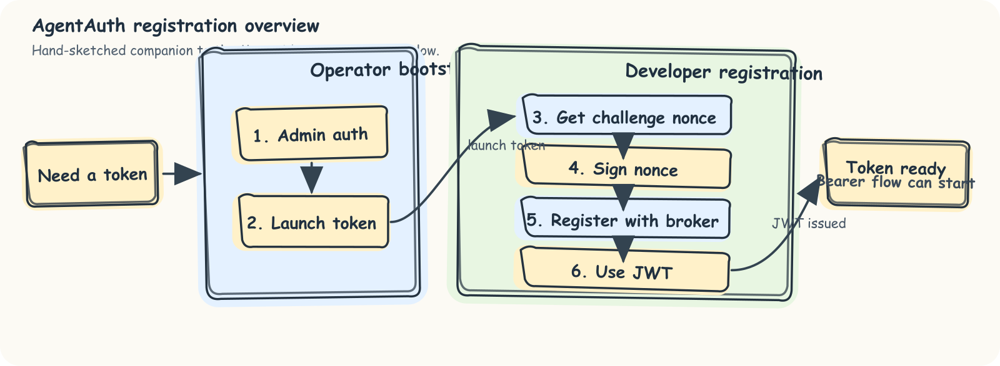
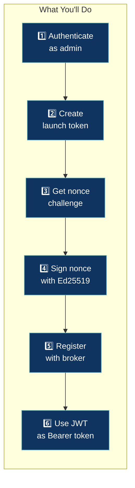

# Your First Five Minutes

Get a local AgentWrit broker running and issue your first agent token. By the end, you'll have walked through the full registration flow — admin authentication, launch token creation, challenge-response identity, and token issuance.

**Prerequisites:** Docker, curl, and basic terminal familiarity. About 15 minutes.

---

## What is AgentWrit?

**AgentWrit is a security service that issues short-lived, scoped identity tokens to autonomous agents.** Think of it like a hotel key card system: when you check in, you receive a key card that only works for your assigned room and automatically expires at checkout time. Similarly, AgentWrit issues agents temporary credentials that grant access only to the specific resources they need, and the credentials expire quickly to limit the damage if they're compromised. This design ensures agents can't accidentally (or maliciously) access resources beyond their authorization, and even if credentials leak, they expire within minutes.

---

## Choosing Your Path

AgentWrit serves three different personas. Which one are you?

| If you are... | Read this | Why |
|---------------|-----------|----|
| **Building or integrating an AI agent** in Python, TypeScript, Go, or another language | [Getting Started: Developer](getting-started-developer.md) | Developers focus on requesting tokens and using them in agent code. |
| **Deploying and operating AgentWrit** in production (setting up brokers, configuring scopes) | [Getting Started: Operator](getting-started-operator.md) | Operators manage the full deployment: broker security, launch token creation, and monitoring. |
| **Just trying AgentWrit locally** to understand how it works end-to-end | **This guide** | You'll run a local setup with Docker Compose, then walk through the agent registration flow to see how it works. |

---

## Prerequisites Check

Before you begin, verify you have the required tools. Run these commands in your terminal:

```bash
# Check Docker
docker --version
# Expected: Docker version 20.10+ (anything recent is fine)

# Check Docker Compose
docker-compose --version
# Expected: docker-compose version 1.29+

# Check curl
curl --version
# Expected: curl 7.x or later

# Check Go (optional, only needed for local builds)
go version
# Expected: go version 1.24+ (not required if using Docker)
```

If any of these are missing, install them:
- **Docker & Docker Compose:** https://docs.docker.com/get-docker/
- **curl:** Usually pre-installed on macOS and Linux. On Windows, use WSL2 or Git Bash.
- **Go:** https://go.dev/dl (optional, only needed if you want to build locally)

---

## Installation

### Option A: Docker Compose (Recommended)

Docker Compose is the easiest way to get started. It launches the broker in two commands.

```bash
# 1. Clone the repository
git clone https://github.com/devonartis/agentwrit.git
cd agentwrit

# 2. Set the admin secret (required -- broker exits without it)
export AA_ADMIN_SECRET="$(openssl rand -hex 32)"

# 3. Start the stack
./scripts/stack_up.sh
```

This starts the core service:
- **Broker** on port 8080 (the security service)

#### Verify it is running

```bash
curl http://localhost:8080/v1/health
```

Expected response:
```json
{"status":"ok","version":"2.0.0","uptime":5,"db_connected":true,"audit_events_count":0}
```

### Option B: Local Go Build

If you prefer to build and run locally without Docker:

```bash
# 1. Clone the repository
git clone https://github.com/devonartis/agentwrit.git
cd agentwrit

# 2. Build the Go binaries
go build ./...

# 3. Start the broker
export AA_ADMIN_SECRET="$(openssl rand -hex 32)"
go run ./cmd/broker
```

The broker will log to stdout. You should see a "broker started" message.

---

## Architecture Overview

AgentWrit provides a single registration flow to get tokens. Here's the big picture:



The flow has two phases: the **operator bootstrap** (steps 1–2) where the admin authenticates and creates a launch token, and the **agent registration** (steps 3–6) where the agent proves its identity and gets a scoped JWT. You'll walk through each step below.



For the full technical sequence diagram, see [Architecture → Data Flow Diagrams](architecture.md#data-flow-diagrams).

---

## Quick Start: Get a Token in 6 Steps

If you want to see the underlying mechanics and control your own Ed25519 keys, follow this path. It takes more steps, but every operation is explicit and transparent.

### Step 1: Admin Authentication

First, obtain an admin token using the shared admin secret:

```bash
curl -s -X POST http://localhost:8080/v1/admin/auth \
  -H "Content-Type: application/json" \
  -d "{\"secret\": \"$AA_ADMIN_SECRET\"}"
```

Response:
```json
{
  "access_token": "eyJhbGciOiJFZERTQSIs...",
  "expires_in": 300,
  "token_type": "Bearer"
}
```

Save the admin token:
```bash
ADMIN_TOKEN=$(curl -s -X POST http://localhost:8080/v1/admin/auth \
  -H "Content-Type: application/json" \
  -d "{\"secret\": \"$AA_ADMIN_SECRET\"}" \
  | python3 -c "import sys,json; print(json.load(sys.stdin)['access_token'])")

echo "Admin token saved: $ADMIN_TOKEN"
```

### Step 2: Launch Token Creation

A launch token is a one-time credential that authorizes your agent to register with the broker. It includes the scopes the agent is allowed to request.

```bash
curl -s -X POST http://localhost:8080/v1/admin/launch-tokens \
  -H "Content-Type: application/json" \
  -H "Authorization: Bearer $ADMIN_TOKEN" \
  -d '{
    "agent_name": "my-agent",
    "allowed_scope": ["read:data:*"],
    "max_ttl": 300,
    "single_use": true,
    "ttl": 30
  }'
```

Response:
```json
{
  "launch_token": "a1b2c3d4e5f6...64-hex-chars",
  "expires_at": "2026-02-15T12:00:30Z",
  "policy": {
    "allowed_scope": ["read:data:*"],
    "max_ttl": 300
  }
}
```

Save the launch token:
```bash
LAUNCH_TOKEN="a1b2c3d4e5f6...paste-your-value-here"
```

**Important:** This launch token expires in 30 seconds. Complete the next steps before it expires.

### Step 3: Nonce Challenge

The broker issues a random nonce (challenge) that your agent must sign. This proves your agent holds its private key.

```bash
curl -s http://localhost:8080/v1/challenge
```

Response:
```json
{
  "nonce": "7f3a9c1b4d2e8f0a5b6c7d8e9f0a1b2c3d4e5f6a7b8c9d0e1f2a3b4c5d6e7f8",
  "expires_in": 30
}
```

Save the nonce:
```bash
NONCE="7f3a9c1b4d2e8f0a5b6c7d8e9f0a1b2c3d4e5f6a7b8c9d0e1f2a3b4c5d6e7f8"
```

**Important:** This nonce also expires in 30 seconds. Keep moving!

### Step 4: Key Generation and Proof of Identity

Generate an Ed25519 key pair and sign the nonce bytes with your private key. This is the "proof of identity" step.

Using Python with the `cryptography` library:

```bash
python3 << 'EOF'
import base64, json
from cryptography.hazmat.primitives.asymmetric.ed25519 import Ed25519PrivateKey
from cryptography.hazmat.primitives.serialization import Encoding, PublicFormat

# Generate Ed25519 key pair
private_key = Ed25519PrivateKey.generate()
public_key = private_key.public_key()

# Export public key as raw 32 bytes, then base64 encode
pub_bytes = public_key.public_bytes(Encoding.Raw, PublicFormat.Raw)
pub_b64 = base64.b64encode(pub_bytes).decode()

# Sign the nonce (IMPORTANT: hex-decode the nonce first!)
nonce_hex = '7f3a9c1b4d2e8f0a5b6c7d8e9f0a1b2c3d4e5f6a7b8c9d0e1f2a3b4c5d6e7f8'
nonce_bytes = bytes.fromhex(nonce_hex)
signature = private_key.sign(nonce_bytes)
sig_b64 = base64.b64encode(signature).decode()

# Output the keys and signature
output = {
    'public_key': pub_b64,
    'signature': sig_b64,
    'nonce': nonce_hex
}
print(json.dumps(output, indent=2))

# Save for the next step
import os
print(f"\nExport these for step 5:", file=os.sys.stderr)
print(f"PUBLIC_KEY={pub_b64}", file=os.sys.stderr)
print(f"SIGNATURE={sig_b64}", file=os.sys.stderr)
EOF
```

Save the output values:
```bash
PUBLIC_KEY="<base64-encoded-public-key>"
SIGNATURE="<base64-encoded-signature>"
```

### Step 5: Agent Registration

Now register your agent with the broker. You're submitting:
- The launch token (authorizes registration)
- The public key (your agent's identity)
- The signature (proof you hold the private key)
- The nonce (the challenge you signed)

```bash
curl -s -X POST http://localhost:8080/v1/register \
  -H "Content-Type: application/json" \
  -d '{
    "launch_token": "'"$LAUNCH_TOKEN"'",
    "nonce": "'"$NONCE"'",
    "public_key": "'"$PUBLIC_KEY"'",
    "signature": "'"$SIGNATURE"'",
    "orch_id": "my-orchestrator",
    "task_id": "task-001",
    "requested_scope": ["read:data:*"]
  }'
```

Response:
```json
{
  "agent_id": "spiffe://agentwrit.local/agent/my-orchestrator/task-001/a1b2c3d4e5f6a7b8",
  "access_token": "eyJhbGciOiJFZERTQSIs...",
  "expires_in": 300
}
```

### Step 6: Token Usage

The `access_token` is your agent's credential. Use it in the `Authorization` header for authenticated requests:

```bash
AGENT_TOKEN="eyJhbGciOiJFZERTQSIs..."

# Example: Make an authenticated request to a downstream API
curl -s https://your-api.example.com/data \
  -H "Authorization: Bearer $AGENT_TOKEN"
```

---

## What You Just Did: Summary

You completed AgentWrit's **identity and authorization flow**. Here's what happened:

1. **Admin Authentication** → You authenticated as the admin using the shared secret
2. **Launch Token Creation** → The broker issued a single-use registration credential
3. **Challenge Issued** → The broker sent a random nonce for you to sign
4. **Proof of Identity** → You signed the nonce with an Ed25519 private key, proving you hold the key
5. **Agent Registration** → The broker verified your signature and issued a SPIFFE ID
6. **Token Exchange** → You received a short-lived JWT scoped to your requested permissions

**Key design decisions:**
- Tokens are **short-lived** (default 5 minutes) to limit the window if credentials leak
- Tokens are **scoped** (e.g., `read:data:*`) so agents can't access resources beyond their authorization
- Tokens are **revocable** if you suspect compromise
- **SPIFFE IDs** provide a standard, verifiable identity format

---

## What's Next?

You now understand how AgentWrit works. Here are your next steps:

### For Developers
If you're building an agent in Python, TypeScript, Go, or another language:
- **[Getting Started: Developer](getting-started-developer.md)** -- Learn how to integrate AgentWrit into your agent code
- **[Common Tasks](common-tasks.md)** -- Token renewal, delegation, revocation

### For Operators
If you're deploying AgentWrit in production:
- **[Getting Started: Operator](getting-started-operator.md)** -- Deploy the broker, manage scopes, configure persistence
- **[Architecture](architecture.md)** -- Understand the internals and security design

### See It In a Real App
Want to see AgentWrit in a full application instead of raw curl commands?
- **[MedAssist AI Demo](https://github.com/devonartis/agentauth-python/tree/main/demo)** -- Healthcare multi-agent pipeline with LLM tool-calling, delegation, and per-patient scoping
- **[Support Ticket Demo](https://github.com/devonartis/agentauth-python/tree/main/demo2)** -- Three agents processing support tickets with streaming execution and natural token expiry

### For Everyone
To deepen your understanding:
- **[Concepts](concepts.md)** -- The security model, SPIFFE IDs, scope matching, token lifecycle
- **[Troubleshooting](troubleshooting.md)** -- Common errors and how to fix them
- **[API Reference](api.md)** -- Complete endpoint documentation with all parameters
- **[Scenarios](scenarios.md)** -- End-to-end walkthroughs for common use cases

### Quick Reference

| Task | Guide |
|------|-------|
| Request a token in code | [Getting Started: Developer](getting-started-developer.md) |
| Renew tokens before expiry | [Common Tasks](common-tasks.md) |
| Validate tokens | [Getting Started: Developer](getting-started-developer.md#enforcing-scopes-in-your-resource-server) |
| Revoke credentials | [Common Tasks](common-tasks.md) |
| Query audit logs | [Common Tasks](common-tasks.md) |
| Deploy in production | [Getting Started: Operator](getting-started-operator.md) |
| Understand SPIFFE IDs | [Concepts](concepts.md) |

---

## Tearing Down

When you're done experimenting, clean up the Docker containers:

```bash
./scripts/stack_down.sh
```

This removes the broker container and its volumes.

---

## Common Mistakes

1. **Signing the hex string instead of bytes** -- The nonce is a 64-character hex string, but you must hex-decode it to 32 bytes before signing.
   ```python
   # WRONG
   signature = private_key.sign(nonce_hex.encode())

   # CORRECT
   signature = private_key.sign(bytes.fromhex(nonce_hex))
   ```

2. **Using DER-encoded keys** -- The broker expects raw 32-byte Ed25519 public keys, not PEM or DER.
   ```python
   # WRONG (DER is too long)
   pub_key = key.public_key().public_bytes(Encoding.DER, PublicFormat.SubjectPublicKeyInfo)

   # CORRECT (raw is exactly 32 bytes)
   pub_key = key.public_key().public_bytes(Encoding.Raw, PublicFormat.Raw)
   ```

3. **Expired nonce or launch token** -- Both expire in 30 seconds. If you get a "nonce not found" or "launch token invalid" error, get a fresh one and retry immediately.

4. **Wrong admin secret** -- Verify the `AA_ADMIN_SECRET` matches what you set when starting the broker.

---

## Troubleshooting

### Broker health check fails
**Problem:** `curl http://localhost:8080/v1/health` returns connection refused.

**Solution:**
- Is Docker running? Check `docker ps`.
- Did `./scripts/stack_up.sh` complete successfully? Check for errors in the output.
- Is port 8080 already in use? Run `lsof -i :8080` (macOS/Linux) or `netstat -ano | findstr :8080` (Windows).

### Admin authentication fails (401 Unauthorized)
**Problem:** Admin auth returns `{"error": "invalid credentials"}`.

**Solution:**
- Double-check `AA_ADMIN_SECRET` matches what you set in the `export` command.
- Is it exported in the same terminal? Run `echo $AA_ADMIN_SECRET` to verify.

### Nonce expires
**Problem:** Registration fails with "nonce not found" or "nonce expired".

**Solution:**
- Nonces expire in 30 seconds. Don't pause between steps 3 and 5. If you need to restart, just get a fresh nonce from step 3.

### Token validation fails at downstream API
**Problem:** Your agent uses the token but gets 401 or 403.

**Solution:**
- Is the token still valid? Check `curl http://localhost:8080/v1/token/validate` (see [API Reference](api.md)).
- Does the scope match what the API requires? The token includes a `scope` claim. Verify it covers the action.
- Is the Bearer token in the Authorization header? Use `Bearer $TOKEN`, not just the token.

For more detailed error messages and solutions, see [Troubleshooting](troubleshooting.md).

---

---

## What's Next?

You've seen the full registration flow. Pick your path:

**[Getting Started: Developer →](getting-started-developer.md)**
Integrate AgentWrit into your agent code — Python, TypeScript, or Go.

**[Getting Started: Operator →](getting-started-operator.md)**
Deploy the broker in production — TLS, persistence, monitoring.

Or go deeper on the concepts:

| If you want to... | Read this |
|-------------------|-----------|
| Understand what tokens are and how JWTs work | [Foundations](foundations.md) |
| See who holds which token and why | [The Three Actors](roles.md) |
| Learn the scope system | [Scopes and Permissions](scope-model.md) |
| Renew, delegate, or revoke tokens | [Common Tasks](common-tasks.md) |
| Look up a specific endpoint | [API Reference](api.md) |

---

*Previous: [What Is AgentWrit?](agentwrit-explained.md) · Next: [Getting Started: Developer](getting-started-developer.md)*
