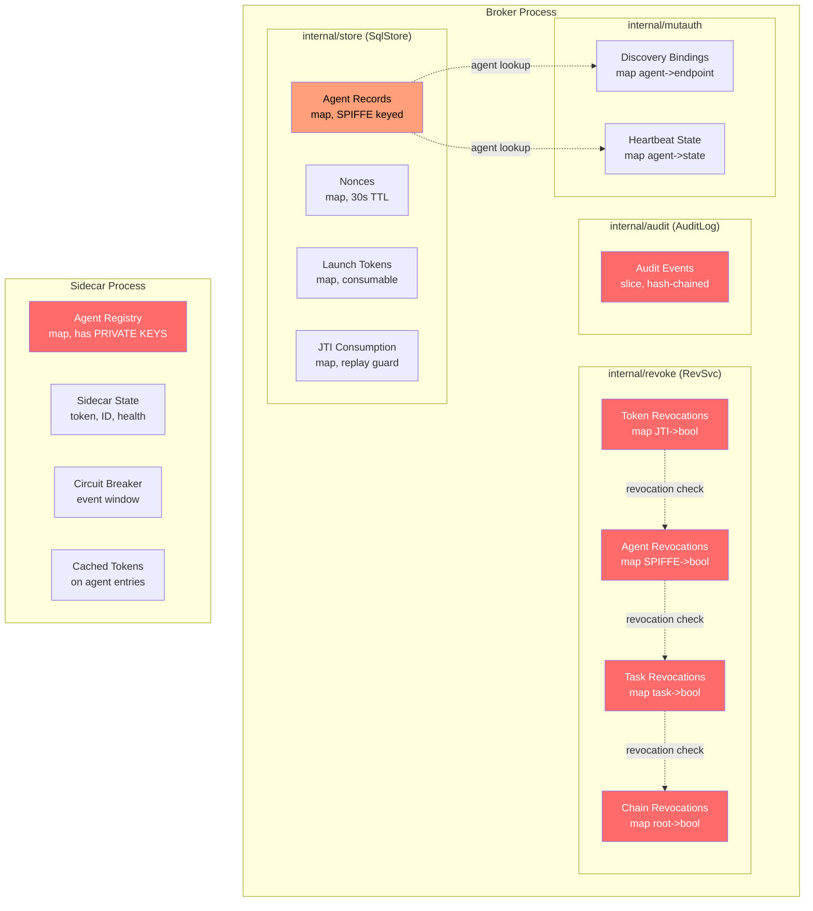
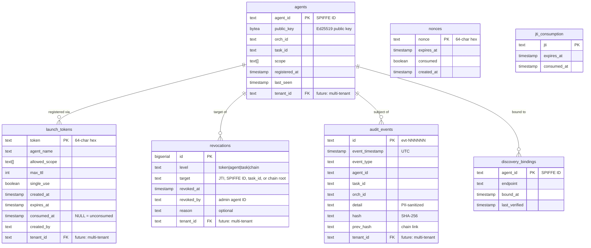
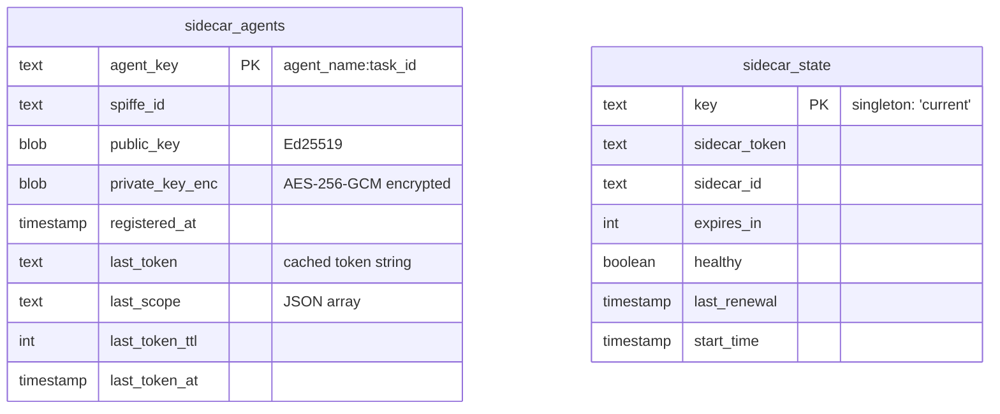
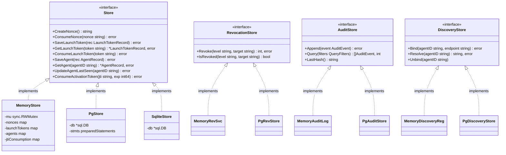
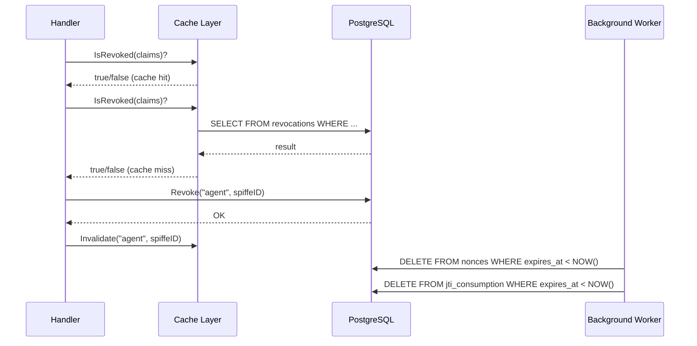
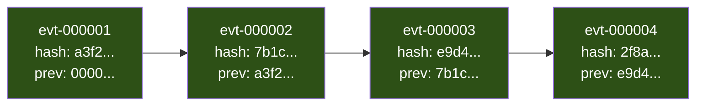
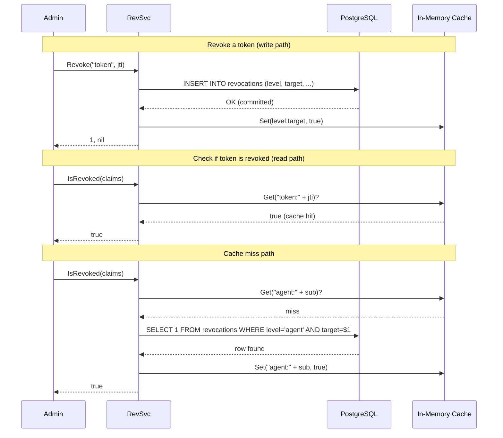
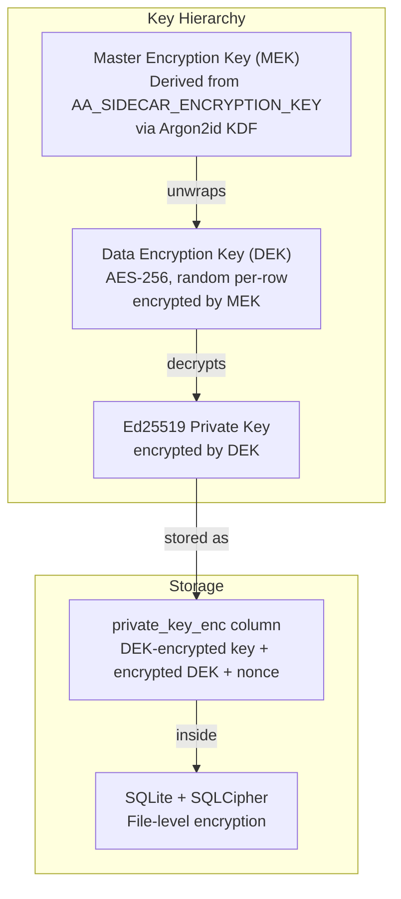
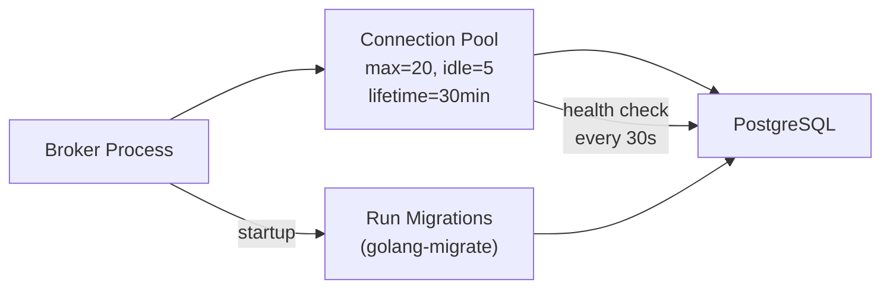
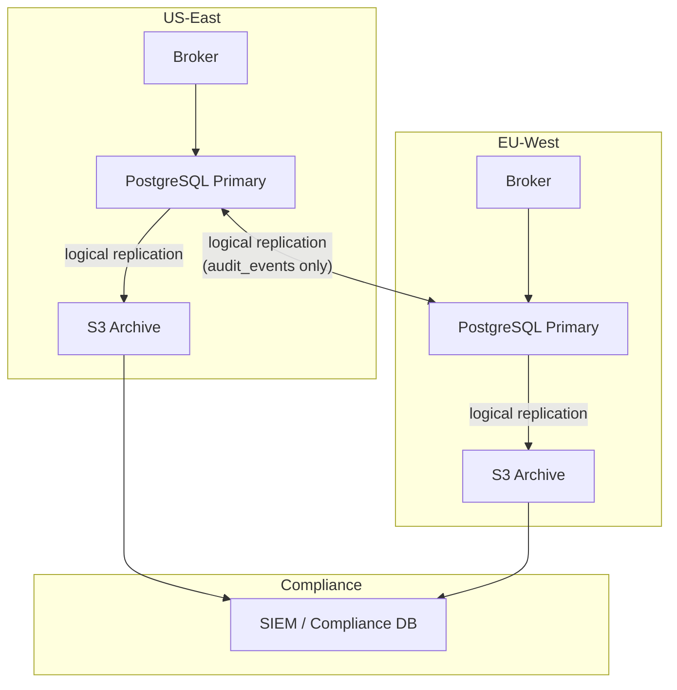

# Credential Storage Design: In-Memory to Durable Persistence

**Date:** 2026-02-15
**Status:** Draft
**Author:** Architecture Team
**Scope:** Broker (`internal/store`, `internal/revoke`, `internal/audit`, `internal/deleg`, `internal/mutauth`) and Sidecar (`cmd/sidecar`)

---

## 1. Problem Statement

AgentAuth currently stores **all state in memory** across both the broker and the sidecar. Every data structure -- nonces, agent records, launch tokens, revocation lists, audit events, delegation chains, discovery bindings, heartbeat state, and sidecar agent registries -- lives behind `sync.RWMutex`-guarded Go maps. When either process restarts, all state is irreversibly lost.

This creates three categories of failure:

| Category | Impact |
|----------|--------|
| **Security failure** | Revoked tokens become valid again after broker restart. An attacker who obtains a revoked token can wait for a restart and reuse it. |
| **Compliance failure** | The hash-chained audit trail is destroyed. Tamper-evidence is meaningless if the evidence itself can be erased by a process restart. |
| **Availability failure** | All active agent sessions break on broker restart. Every agent must re-register, re-authenticate, and re-obtain tokens. The sidecar loses its entire agent registry including cached Ed25519 private keys. |

The type name `SqlStore` was chosen deliberately (per the code comment in `internal/store/sql_store.go`) to ease a future migration. This document defines that migration.

---

## 2. Current State Inventory

### 2.1 Broker State (`internal/`)

The following table catalogs every in-memory data structure in the broker, its location, its persistence criticality, and its characteristics.

| Data Structure | Package | Go Type | Key | Criticality | Characteristics |
|---|---|---|---|---|---|
| Nonces | `store` | `map[string]*nonceRecord` | hex nonce string | Medium | 30-second TTL, single-use, high write throughput |
| Launch tokens | `store` | `map[string]*LaunchTokenRecord` | opaque hex token | High | Admin-created, single-use consumable, bounded TTL |
| Agent records | `store` | `map[string]*AgentRecord` | SPIFFE ID | Critical | Long-lived, contains Ed25519 public keys |
| JTI consumption set | `store` | `map[string]time.Time` | JTI string | High | Prevents activation token replay, needs GC |
| Revocation lists (4 levels) | `revoke` | 4x `map[string]bool` | JTI / SPIFFE ID / task ID / chain root | Critical | Security-critical, must survive restarts |
| Audit events | `audit` | `[]AuditEvent` | sequential ID | Critical | Append-only, hash-chained, tamper-evident |
| Discovery bindings | `mutauth` | `map[string]string` | agent SPIFFE ID | Medium | Agent-to-endpoint mappings |
| Heartbeat state | `mutauth` | `map[string]*heartbeatState` | agent SPIFFE ID | Low | Can be reconstructed from live heartbeats |
| Delegation chains | `deleg` / `token` | embedded in JWT claims | N/A (in-token) | N/A | Carried in tokens, not stored separately |

### 2.2 Sidecar State (`cmd/sidecar/`)

| Data Structure | File | Go Type | Key | Criticality | Characteristics |
|---|---|---|---|---|---|
| Agent registry | `registry.go` | `map[string]*agentEntry` | `agent_name:task_id` | High | Contains Ed25519 **private keys** |
| Per-agent locks | `registry.go` | `map[string]*sync.Mutex` | `agent_name:task_id` | Low | Coordination only, reconstructable |
| Sidecar bootstrap state | `bootstrap.go` | `*sidecarState` | singleton | High | Bearer token, sidecar ID, health flag |
| Circuit breaker state | `circuitbreaker.go` | `[]event` + state enum | singleton | Low | Reconstructable from live traffic |
| Cached tokens | `registry.go` | fields on `agentEntry` | per-agent | Medium | Fallback tokens for circuit breaker |

### 2.3 State Flow Diagram



**Legend:** Red = critical persistence requirement. Orange = high persistence requirement.

---

## 3. Persistence Tier Classification

Not all data needs the same storage treatment. This design classifies state into three tiers based on durability requirements, access patterns, and acceptable recovery time.

### 3.1 Tier Definitions

| Tier | Durability | Latency Budget | Recovery Strategy | Storage Backend |
|------|-----------|---------------|-------------------|-----------------|
| **Tier 1: Durable** | Must survive any restart, crash, or failover | 1-10ms read, 10-50ms write | Restore from database on startup | PostgreSQL (prod) / SQLite (dev) |
| **Tier 2: Hot Cache** | Should survive brief restarts; loss is recoverable | <1ms read, <1ms write | Rebuild from Tier 1 or re-derive | Redis (prod) / in-memory with Tier 1 fallback |
| **Tier 3: Ephemeral** | Loss is acceptable; state is reconstructable | <0.1ms | No recovery needed; reconstruct from live traffic | In-memory only |

### 3.2 Data Classification

| Data Structure | Tier | Rationale |
|---|---|---|
| Agent records | **Tier 1** | Long-lived identity anchors. Loss forces full re-registration of all agents. |
| Revocation lists | **Tier 1** | Security-critical. Loss re-enables revoked tokens. Must be durable. |
| Audit trail | **Tier 1** | Compliance-critical. Hash chain integrity depends on full history. |
| Launch tokens | **Tier 1** | Admin-created credentials with consumption tracking. Loss could allow replay. |
| JTI consumption set | **Tier 1** | Prevents activation token replay. Loss re-enables single-use tokens. |
| Discovery bindings | **Tier 1** | Agent endpoint mappings needed for mutual auth. Loss breaks active handshakes. |
| Sidecar agent registry | **Tier 1** | Contains private keys and session continuity data. |
| Nonces | **Tier 2** | 30-second TTL. Hot cache reduces DB writes. Loss only affects in-flight challenges. |
| Cached tokens (sidecar) | **Tier 2** | Fallback for circuit breaker. Re-obtainable from broker. |
| Sidecar bootstrap state | **Tier 2** | Can re-bootstrap but should survive brief restarts. |
| Heartbeat state | **Tier 3** | Reconstructed from live heartbeats within one interval (30s). |
| Circuit breaker state | **Tier 3** | Reconstructed from live traffic within one window. |
| Per-agent locks | **Tier 3** | Runtime coordination only; no persistence value. |

---

## 4. Database Schema Design

### 4.1 Broker Schema (PostgreSQL / SQLite)



### 4.2 Sidecar Schema (SQLite with encryption)

The sidecar runs as a local process alongside the agent workload. SQLite is the appropriate choice here -- no external database dependency, single-writer access pattern, and file-level encryption via SQLCipher.



### 4.3 Key Schema Decisions

**Revocations as a unified table, not four maps.** The current Go implementation uses four separate `map[string]bool` maps (tokens, agents, tasks, chains). The database schema consolidates these into a single `revocations` table with a `level` discriminator column and a composite index on `(level, target)`. This:
- Simplifies queries ("is this token/agent/task/chain revoked?")
- Enables audit metadata (who revoked, when, why)
- Supports future revocation expiry/cleanup

**Audit events as an append-only table with hash-chain verification.** The `audit_events` table is append-only at the application level. Database constraints enforce:
- `INSERT` only (no `UPDATE` or `DELETE` at the application layer)
- `prev_hash` of each row must equal `hash` of the preceding row
- Background verification job periodically validates chain integrity

**Sidecar private keys encrypted at rest.** The `sidecar_agents.private_key_enc` column stores Ed25519 private keys encrypted with AES-256-GCM. The encryption key is derived from a sidecar-specific secret (the sidecar activation token hash or a dedicated `AA_SIDECAR_KEY_ENCRYPTION_SECRET` env var).

---

## 5. Interface Design: Preserving the Existing Contract

The migration must not break existing call sites. The strategy is to introduce a `Store` interface that the current `SqlStore` struct already implicitly satisfies, then provide alternative implementations.

### 5.1 Proposed Interface Hierarchy



### 5.2 Migration Path

The migration follows a three-phase approach that allows incremental rollout:

**Phase 1: Extract interfaces (no behavioral change)**
- Define `Store`, `RevocationStore`, `AuditStore`, `DiscoveryStore` interfaces
- Change all service constructors to accept interfaces instead of concrete types
- The existing in-memory implementations satisfy the interfaces unchanged
- All tests continue to pass with no modification

**Phase 2: Implement database backends**
- `PgStore` implements `Store` against PostgreSQL
- `PgRevStore` implements `RevocationStore` against the `revocations` table
- `PgAuditStore` implements `AuditStore` against the `audit_events` table
- `SqliteStore` for sidecar-local persistence
- Selection via `AA_STORE_BACKEND` env var (`memory`, `postgres`, `sqlite`)

**Phase 3: Add caching layer**
- Wrap database backends with read-through caches for hot data (nonces, revocation checks)
- Redis or in-process LRU cache for Tier 2 data
- Write-through for Tier 1 data (writes go to DB first, then cache)



---

## 6. Database Selection Decision Matrix

### 6.1 Broker Database

| Criterion | PostgreSQL | SQLite | CockroachDB |
|-----------|-----------|--------|-------------|
| **Multi-tenant isolation** | Native: row-level security, schemas | Limited: single-file DB | Native: multi-region |
| **Concurrent writes** | Excellent: MVCC | Poor: single-writer lock | Excellent: distributed |
| **Audit append-only** | Enforced via triggers/policies | Manual enforcement only | Enforced via triggers |
| **Operational complexity** | Moderate: managed services available | Minimal: embedded | High: cluster management |
| **Replication** | Mature: streaming, logical | Limited: Litestream | Built-in |
| **TTL/expiry cleanup** | `pg_cron` or app-level | App-level only | App-level or changefeeds |
| **JSON support** | Native `jsonb` | `json_extract` functions | Native `JSONB` |
| **Cost at scale** | Moderate | Free (embedded) | High |
| **Development parity** | Docker or managed | File-based, zero config | Docker |

**Decision: PostgreSQL for production, SQLite for development/single-node.**

Rationale:
- PostgreSQL's row-level security maps directly to multi-tenant credential isolation
- Managed PostgreSQL (RDS, Cloud SQL, Supabase) eliminates operational burden
- SQLite provides zero-dependency development experience with the same interface
- CockroachDB is overkill for the current scale; revisit if cross-region becomes a hard requirement

### 6.2 Sidecar Database

| Criterion | SQLite + SQLCipher | BoltDB | File-based (JSON) |
|-----------|-------------------|--------|-------------------|
| **Encrypted at rest** | Native (SQLCipher) | Manual encryption | Manual encryption |
| **Private key safety** | Column-level encryption + file encryption | Byte-level only | Weakest |
| **Query capability** | Full SQL | Key-value only | None |
| **Concurrency** | Single-writer (adequate for sidecar) | Single-writer | Manual locking |
| **Dependency weight** | CGo required (SQLCipher) | Pure Go | None |
| **Recovery on corruption** | WAL journal | Bolt snapshots | Re-bootstrap |

**Decision: SQLite with SQLCipher for sidecar persistence.**

Rationale:
- The sidecar is single-process, single-writer -- SQLite's limitation is not relevant
- SQLCipher provides transparent encryption of the entire database file
- Column-level AES-256-GCM encryption on private keys provides defense-in-depth
- Re-bootstrap is always the fallback recovery path

### 6.3 Hot Cache (Tier 2)

| Criterion | Redis | In-process LRU | Memcached |
|-----------|-------|----------------|-----------|
| **Shared across instances** | Yes | No (per-process) | Yes |
| **TTL support** | Native | Manual expiry | Native |
| **Persistence** | Optional (AOF/RDB) | None | None |
| **Latency** | ~0.5ms network | ~0.01ms (no network) | ~0.5ms network |
| **Operational complexity** | Moderate | None | Moderate |

**Decision: In-process LRU cache initially; Redis when horizontal scaling requires shared cache.**

Rationale:
- The broker runs as a single process today; in-process cache avoids external dependency
- Redis becomes valuable only when multiple broker instances need cache coherency
- The caching layer interface is the same regardless of backend

---

## 7. Audit Trail: Special Persistence Requirements

The audit trail has unique requirements that go beyond standard CRUD persistence.

### 7.1 Immutability Guarantees



**Database-level protections:**

1. **No UPDATE/DELETE grants.** The application database user for audit operations has `INSERT` and `SELECT` privileges only. A separate admin user (not used by the application) has full privileges for emergency operations.

2. **Trigger-based chain validation.** A `BEFORE INSERT` trigger verifies that the incoming `prev_hash` matches the `hash` of the most recent row. If the chain is broken, the insert is rejected.

3. **Periodic integrity verification.** A background worker reads the full chain and recomputes hashes. Any discrepancy triggers an alert. This runs on a configurable interval (default: every 5 minutes).

4. **Write-ahead logging.** PostgreSQL's WAL ensures that committed audit events survive crashes. For SQLite, WAL mode is enabled explicitly.

### 7.2 Audit Schema Details

```sql
CREATE TABLE audit_events (
    id              TEXT PRIMARY KEY,           -- evt-NNNNNN
    event_timestamp TIMESTAMPTZ NOT NULL,
    event_type      TEXT NOT NULL,
    agent_id        TEXT,
    task_id         TEXT,
    orch_id         TEXT,
    detail          TEXT NOT NULL,              -- PII-sanitized
    hash            TEXT NOT NULL,              -- SHA-256 hex
    prev_hash       TEXT NOT NULL,              -- chain link
    tenant_id       TEXT,                       -- future multi-tenant

    CONSTRAINT audit_hash_not_empty CHECK (hash <> ''),
    CONSTRAINT audit_prev_hash_not_empty CHECK (prev_hash <> '')
);

-- Optimized for query filters
CREATE INDEX idx_audit_agent ON audit_events (agent_id) WHERE agent_id IS NOT NULL;
CREATE INDEX idx_audit_task ON audit_events (task_id) WHERE task_id IS NOT NULL;
CREATE INDEX idx_audit_type ON audit_events (event_type);
CREATE INDEX idx_audit_time ON audit_events (event_timestamp);
CREATE INDEX idx_audit_tenant ON audit_events (tenant_id) WHERE tenant_id IS NOT NULL;

-- Append-only enforcement: the application user cannot UPDATE or DELETE
-- REVOKE UPDATE, DELETE ON audit_events FROM agentauth_app;
```

### 7.3 GDPR vs Immutability Tension

The audit trail is designed to be immutable, but GDPR Article 17 (Right to Erasure) may require deletion of personal data. The resolution:

1. **Audit events do not store PII directly.** The `sanitizePII()` function already redacts sensitive values. Agent IDs are SPIFFE identifiers, not personal names.
2. **Pseudonymization at ingestion.** If agent names ever contain PII (e.g., user email in orchestration ID), they are hashed before audit recording.
3. **Tombstone records.** Instead of deleting, a GDPR erasure request inserts a tombstone event and marks the original event's detail as `***GDPR_ERASED***`. The hash chain remains intact because the tombstone's hash incorporates the erasure.
4. **Data retention policies.** Configurable per-tenant retention period. Expired events are archived to cold storage (S3/GCS) and deleted from the primary table, with a chain-break marker.

---

## 8. Revocation: Durability Requirements

Revocation state is the most security-critical data in the system. A crash that loses revocation entries silently re-enables attacker tokens.

### 8.1 Write-Through, Read-Cache Pattern



**Critical invariant: The database write MUST complete before the revocation is acknowledged.** The cache is purely an optimization. If the cache is lost, the system falls through to the database and remains correct. If the database write fails, the revocation is not acknowledged and the caller must retry.

### 8.2 Revocation Table Schema

```sql
CREATE TABLE revocations (
    id         BIGSERIAL PRIMARY KEY,
    level      TEXT NOT NULL CHECK (level IN ('token', 'agent', 'task', 'chain')),
    target     TEXT NOT NULL,
    revoked_at TIMESTAMPTZ NOT NULL DEFAULT NOW(),
    revoked_by TEXT,                        -- admin or system identifier
    reason     TEXT,                        -- human-readable justification
    tenant_id  TEXT,                        -- future multi-tenant

    CONSTRAINT unique_revocation UNIQUE (level, target)
);

CREATE INDEX idx_revocations_lookup ON revocations (level, target);
CREATE INDEX idx_revocations_tenant ON revocations (tenant_id) WHERE tenant_id IS NOT NULL;
```

### 8.3 Startup Recovery

On broker startup, the `PgRevStore` implementation loads the full revocation set into the in-memory cache:

```
SELECT level, target FROM revocations;
```

This is feasible because revocation lists are bounded: each entry is a short string (JTI ~32 chars, SPIFFE ID ~100 chars, task ID ~50 chars). Even with 100,000 revocation entries, the in-memory set is under 20 MB.

For very large deployments, a bloom filter front-end can be added (false positives trigger a DB lookup; false negatives are impossible).

---

## 9. Sidecar Private Key Protection

The sidecar's `agentRegistry` stores Ed25519 private keys in memory. Persisting these to disk requires encryption at rest.

### 9.1 Encryption Architecture



**Two layers of encryption:**

1. **File-level:** SQLCipher encrypts the entire SQLite database file. This protects against disk theft or container image inspection.

2. **Column-level:** Each private key is encrypted with a unique DEK (AES-256-GCM), and the DEK itself is encrypted with the MEK. This protects against SQL injection or application-level bugs that might dump the database.

### 9.2 Key Rotation

When `AA_SIDECAR_ENCRYPTION_KEY` is rotated:

1. Sidecar detects the change on next startup (hash of current key differs from stored key hash)
2. Derives old MEK from stored key hash (old key must be provided via `AA_SIDECAR_ENCRYPTION_KEY_OLD`)
3. Re-encrypts all DEKs with the new MEK
4. Updates stored key hash
5. Zeroes old MEK from memory

If the old key is lost, the sidecar re-bootstraps and re-registers all agents (private keys are regenerated).

---

## 10. TTL Management and Garbage Collection

Several data types have natural expiry times. The database needs efficient cleanup to prevent unbounded growth.

### 10.1 TTL-Bearing Records

| Record Type | TTL Source | Cleanup Strategy |
|---|---|---|
| Nonces | 30 seconds (hardcoded) | Aggressive: every 60 seconds |
| Launch tokens | `expires_at` field | Moderate: every 5 minutes |
| JTI consumption set | `expires_at` (token expiry) | Moderate: every 5 minutes |
| Active tokens | `exp` claim in JWT | No storage (stateless JWTs); revocations cleaned by token max-TTL |
| Revocations (token-level) | Token max-TTL + grace | Conservative: daily, only for token-level revocations older than max-TTL + 1 hour |

### 10.2 Cleanup Implementation

**PostgreSQL:** Use `pg_cron` or an application-level background goroutine:

```sql
-- Nonce cleanup (runs every 60 seconds)
DELETE FROM nonces WHERE expires_at < NOW();

-- Launch token cleanup (runs every 5 minutes)
DELETE FROM launch_tokens WHERE expires_at < NOW() AND consumed_at IS NOT NULL;

-- JTI cleanup (runs every 5 minutes)
DELETE FROM jti_consumption WHERE expires_at < NOW();
```

**SQLite (sidecar):** Application-level goroutine with `PRAGMA auto_vacuum = INCREMENTAL` to reclaim space.

### 10.3 Partitioning Strategy (at scale)

For the audit trail, which grows unboundedly, time-based partitioning is recommended:

```sql
CREATE TABLE audit_events (
    ...
) PARTITION BY RANGE (event_timestamp);

CREATE TABLE audit_events_2026_q1 PARTITION OF audit_events
    FOR VALUES FROM ('2026-01-01') TO ('2026-04-01');
```

Old partitions can be detached and archived to cold storage without affecting query performance on recent events.

---

## 11. Connection Management and Resilience

### 11.1 Broker Database Connection



**Configuration via environment variables:**

| Variable | Default | Description |
|----------|---------|-------------|
| `AA_STORE_BACKEND` | `memory` | `memory`, `postgres`, `sqlite` |
| `AA_DB_URL` | (required if postgres) | PostgreSQL connection string |
| `AA_DB_MAX_CONNS` | `20` | Maximum pool connections |
| `AA_DB_IDLE_CONNS` | `5` | Idle connections retained |
| `AA_DB_CONN_LIFETIME` | `30m` | Maximum connection age |
| `AA_SIDECAR_DB_PATH` | `/var/lib/agentauth/sidecar.db` | SQLite file path |
| `AA_SIDECAR_ENCRYPTION_KEY` | (required for persistence) | Base64-encoded 32-byte key |

### 11.2 Graceful Degradation

If the database becomes unavailable after startup:

1. **Reads** fall through to the in-memory cache (loaded at startup)
2. **Writes** are rejected with HTTP 503 and a `Retry-After` header
3. **Revocation writes** are queued in memory and flushed when the database recovers (bounded queue with backpressure)
4. **Audit writes** are buffered to a local WAL file and replayed on recovery (hash chain integrity is maintained because the application controls sequencing)

---

## 12. SaaS and Multi-Tenancy Considerations

### 12.1 Tenant Isolation Model

Every Tier 1 table includes a `tenant_id` column. In the initial implementation, this is always `NULL` (single-tenant). When SaaS mode is enabled (`AA_MULTI_TENANT=true`):

- **Row-level security (RLS)** policies filter all queries by `tenant_id`
- The `tenant_id` is extracted from the admin JWT's `tenant_id` claim
- Cross-tenant queries are impossible at the database level

```sql
ALTER TABLE agents ENABLE ROW LEVEL SECURITY;

CREATE POLICY tenant_isolation ON agents
    USING (tenant_id = current_setting('app.tenant_id')::TEXT);
```

### 12.2 Cross-Region Audit Replication

For global SaaS deployments, the audit trail must be replicated across regions for compliance:



**Key constraint:** Audit events are region-local for write (latency) but globally replicated for read (compliance). The hash chain is per-region; a global chain-of-chains links regional roots.

### 12.3 Credential Rotation Without Downtime

The broker's Ed25519 signing key must be rotatable without invalidating all active tokens:

1. **New key generation:** Generate new Ed25519 keypair, assign a `kid` (key ID)
2. **Dual verification:** `TknSvc.Verify()` tries the current key first, then falls back to a list of previous keys (bounded window)
3. **Cutover:** New tokens are signed with the new key; old tokens remain valid until their natural expiry
4. **Cleanup:** After max-TTL has elapsed, remove old keys from the verification list

The key registry is stored in Tier 1 (database) so that all broker instances share the same key set.

### 12.4 Data Retention Policies

| Data Type | Default Retention | GDPR Mode | SOC 2 Mode |
|-----------|------------------|-----------|------------|
| Audit events | 1 year | 1 year (pseudonymized) | 7 years |
| Revocations | Indefinite | Indefinite | Indefinite |
| Agent records | Until explicit deletion | Right-to-erasure honored | 1 year after last activity |
| Launch tokens (consumed) | 30 days | 30 days | 1 year |
| Nonces (expired) | Immediate deletion | Immediate deletion | Immediate deletion |

---

## 13. Migration Schema Management

Database migrations are managed with `golang-migrate` (file-based, versioned SQL migrations).

### 13.1 Migration File Structure

```
internal/store/migrations/
    000001_create_agents.up.sql
    000001_create_agents.down.sql
    000002_create_launch_tokens.up.sql
    000002_create_launch_tokens.down.sql
    000003_create_nonces.up.sql
    000003_create_nonces.down.sql
    000004_create_jti_consumption.up.sql
    000004_create_jti_consumption.down.sql
    000005_create_revocations.up.sql
    000005_create_revocations.down.sql
    000006_create_audit_events.up.sql
    000006_create_audit_events.down.sql
    000007_create_discovery_bindings.up.sql
    000007_create_discovery_bindings.down.sql
    000008_add_tenant_id.up.sql
    000008_add_tenant_id.down.sql
```

### 13.2 Migration Execution

Migrations run automatically on broker startup before any HTTP handlers are registered:

1. Acquire advisory lock (`pg_advisory_lock`) to prevent concurrent migration from multiple broker instances
2. Run pending migrations
3. Release lock
4. If migration fails, the broker exits with a non-zero status (do not serve traffic with a mismatched schema)

---

## 14. Testing Strategy

### 14.1 Interface-Based Testing

All existing tests use the in-memory implementation. No tests need to change when the interface is extracted (Phase 1). New tests are added for database backends:

| Test Category | Backend | Scope |
|---|---|---|
| Unit tests | In-memory (existing) | All packages, `go test -short` |
| Integration tests | SQLite | Store interface compliance |
| Integration tests | PostgreSQL (Docker) | Store interface compliance, concurrency |
| Chaos tests | PostgreSQL | Connection loss, restart recovery |

### 14.2 Interface Compliance Suite

A shared test suite validates any `Store` implementation:

```
internal/store/storetest/
    compliance_test.go    # Tests every Store method against any implementation
```

This suite is parameterized: it accepts a `Store` factory function and runs the full set of behavioral tests. Both `MemoryStore` and `PgStore` execute the same suite.

---

## 15. Implementation Roadmap

| Phase | Scope | Effort | Deliverables |
|-------|-------|--------|-------------|
| **Phase 1** | Extract interfaces | 1 sprint | `Store`, `RevocationStore`, `AuditStore`, `DiscoveryStore` interfaces; refactored constructors; zero behavioral change |
| **Phase 2a** | SQLite backend | 1 sprint | `SqliteStore` for broker dev mode and sidecar; migration files; encrypted sidecar DB |
| **Phase 2b** | PostgreSQL backend | 1 sprint | `PgStore`, `PgRevStore`, `PgAuditStore`, `PgDiscoveryStore`; Docker Compose with PostgreSQL; compliance tests |
| **Phase 3** | Caching layer | 1 sprint | Write-through revocation cache; nonce hot cache; startup preload |
| **Phase 4** | Multi-tenancy | 1 sprint | `tenant_id` migration; RLS policies; tenant-scoped queries |
| **Phase 5** | Audit archival | 1 sprint | Partition management; cold storage archival; chain-of-chains |

---

## 16. Risk Register

| Risk | Likelihood | Impact | Mitigation |
|------|-----------|--------|------------|
| Schema migration breaks existing data | Medium | High | Comprehensive down-migration files; staging environment testing |
| SQLCipher CGo dependency causes build issues | Medium | Medium | Provide pure-Go fallback with nacl/secretbox; CI tests both paths |
| Audit hash chain breaks during DB migration from memory | Low | Critical | Migration tool computes and verifies chain during initial data import |
| Connection pool exhaustion under load | Medium | High | Circuit breaker on DB layer; bounded queue for writes; connection monitoring |
| Private key encryption key loss | Low | High | Key escrow documentation; re-bootstrap as recovery path; no data loss (keys regenerated) |
| PostgreSQL replication lag causes stale revocation reads | Low | Critical | Synchronous replication for revocations table; async for others |

---

## 17. Open Questions

1. **Should the broker support both PostgreSQL and SQLite simultaneously?** The current design assumes one backend per deployment. A hybrid (SQLite for dev, Postgres for prod) is covered by the interface abstraction, but could both be active (e.g., SQLite as local cache, Postgres as durable store)?

2. **Token storage: stateless vs stateful.** Currently tokens are stateless JWTs -- the broker does not store issued tokens. Should we add a token registry for proactive expiry notification and session management? This increases write load but enables "revoke all tokens for agent X" without the revocation list.

3. **Sidecar persistence: mandatory or opt-in?** Should the sidecar persist by default, or should persistence be opt-in (`AA_SIDECAR_PERSIST=true`)? Opt-in preserves the current zero-dependency behavior for development.

4. **Audit event batching.** Should audit writes be batched (e.g., flush every 100ms or 50 events) to reduce write amplification? This trades latency for throughput but introduces a window where recent events could be lost on crash.

5. **Redis for horizontal scaling.** At what scale does the single-broker, in-process-cache model break down? Define the threshold (requests/sec, number of agents, number of tenants) that triggers the Redis addition.
