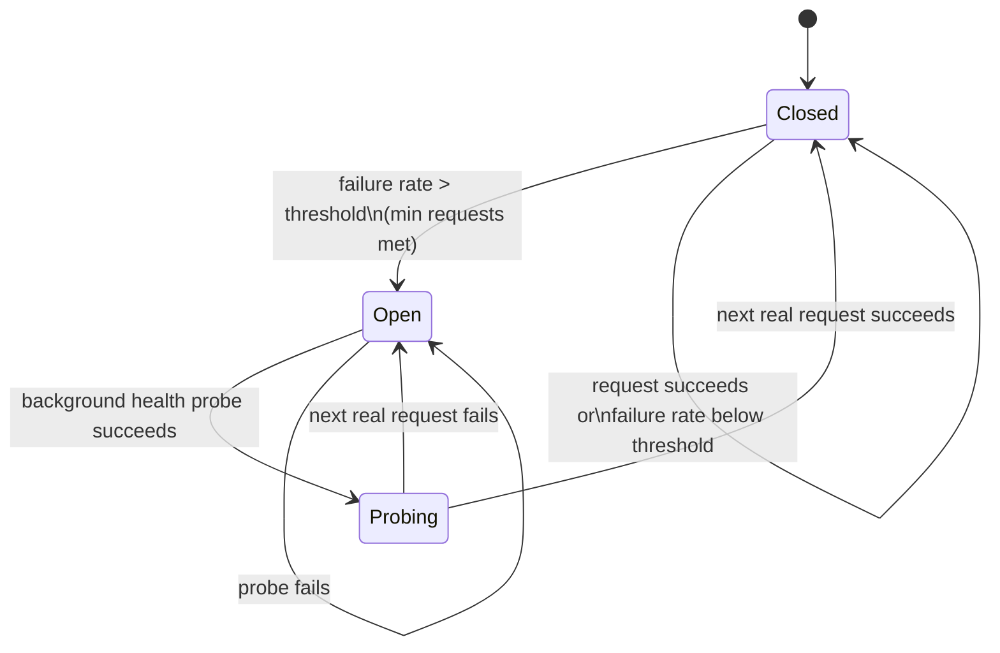
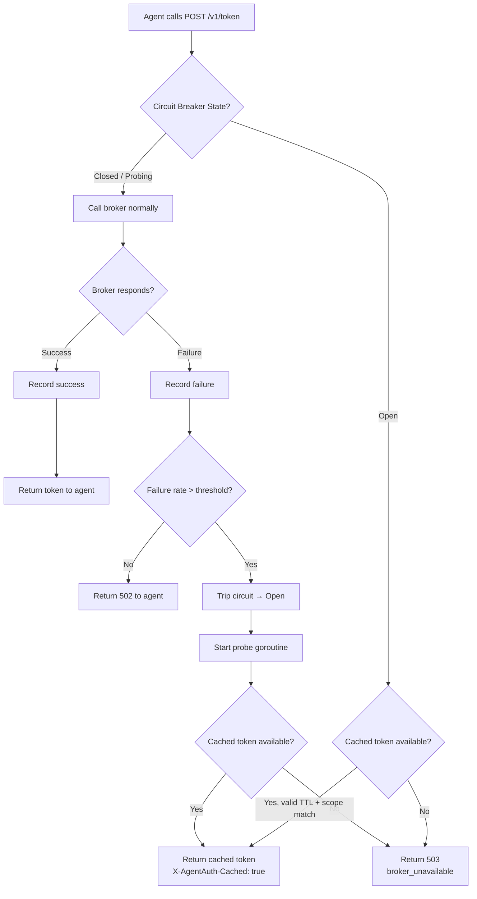
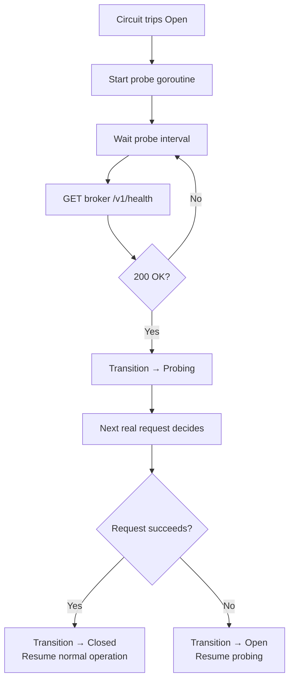
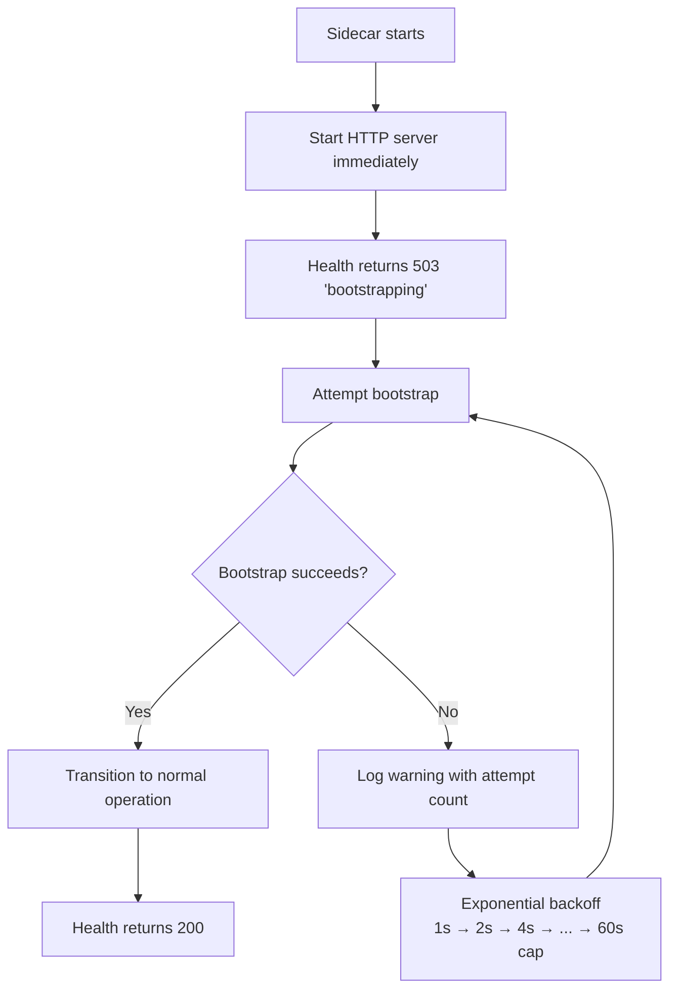

# Sidecar Phase 3: Failsafe Mode — Design Document

> **For Claude:** REQUIRED SUB-SKILL: Use superpowers:executing-plans to implement this plan task-by-task.

**Goal:** Add circuit breaker, cached token fallback, and bootstrap retry to the sidecar so it degrades gracefully when the broker is temporarily unreachable.

**Architecture:** Standalone circuit breaker module in `cmd/sidecar/circuitbreaker.go`. Tracks broker failure rate over a sliding time window, trips open when threshold is exceeded, serves cached tokens during outage, and recovers via background health probe.

**Tech Stack:** Go stdlib, Prometheus (`promauto`), existing `obs` logging

---

## ADR-001: Sidecar Failsafe Mode — Dev vs. Production Strategy

**Context:** The sidecar currently has no resilience when the broker becomes unreachable. Token exchange requests fail with 502 immediately. We need failsafe behavior, but must distinguish between what's appropriate for a single-broker dev environment vs. production.

**Decision:**

- **Dev (this implementation):** Circuit breaker with cached token fallback and bootstrap retry. Designed for single-broker setups where brief outages should not kill all agent workflows.
- **Production (future):** Broker HA via multiple broker instances behind a load balancer. The sidecar should be configured to talk to multiple broker endpoints. The circuit breaker becomes a secondary safety net, not the primary resilience mechanism.

**Consequences:**

- Cached token fallback is a dev convenience — production should rarely need it because broker HA prevents the outage scenario
- Bootstrap retry prevents restart loops in dev — production with broker HA makes startup failures unlikely
- The circuit breaker itself remains useful in production as a fast-fail mechanism (don't pile up requests to a known-down broker)
- Future work: `AA_BROKER_URL` should accept multiple comma-separated URLs with round-robin/failover

**Status:** Accepted (dev implementation). Production broker HA is a separate future milestone.

---

## Circuit Breaker State Machine

### States

| State | Behavior |
|-------|----------|
| **Closed** | Normal operation. All requests pass through to broker. Track success/failure in sliding window. |
| **Open** | Broker considered down. Serve cached tokens if available, otherwise 503. Background probe runs. |
| **Probing** | Probe got healthy response. Next real request goes through. Success → Closed, failure → Open. |

### State Diagram

### Sliding Window

- Fixed time window (default 30s)
- Track total requests and failures within window
- Trip when: `failures / total > threshold` AND `total >= min_requests`
- Default threshold: 50%
- Default min requests: 5 (avoids tripping on 1 failure out of 2 requests)

---

## Request Flow

### Token Exchange with Circuit Breaker

### Background Health Probe (Open State)

### Bootstrap Retry Flow

---

## Cached Token Rules

- Only serve a token previously issued for the **same agent + same or subset scope**
- Token must still be within its original TTL (not expired)
- Cached token response includes header `X-AgentAuth-Cached: true`
- `cached_tokens_served_total` metric increments on each cache hit
- Cache source: existing agent registry (tokens already stored from prior successful exchanges)

---

## Configuration

| Variable | Default | Description |
|----------|---------|-------------|
| `AA_SIDECAR_CB_WINDOW` | `30` | Sliding window duration in seconds |
| `AA_SIDECAR_CB_THRESHOLD` | `0.5` | Failure rate (0.0–1.0) to trip circuit |
| `AA_SIDECAR_CB_PROBE_INTERVAL` | `5` | Seconds between health probes when open |
| `AA_SIDECAR_CB_MIN_REQUESTS` | `5` | Min requests in window before tripping |

---

## New Prometheus Metrics

| Metric | Type | Description |
|--------|------|-------------|
| `agentauth_sidecar_circuit_state` | Gauge | Current state: 0=closed, 1=open, 2=probing |
| `agentauth_sidecar_circuit_trips_total` | Counter | Times circuit has tripped open |
| `agentauth_sidecar_cached_tokens_served_total` | Counter | Tokens served from cache during open circuit |

---

## File Changes

| File | Change |
|------|--------|
| `cmd/sidecar/circuitbreaker.go` | **New** — state machine, sliding window, probe goroutine |
| `cmd/sidecar/circuitbreaker_test.go` | **New** — unit tests for state transitions, window math, probe recovery |
| `cmd/sidecar/handler.go` | **Modify** — token exchange routes through circuit breaker |
| `cmd/sidecar/bootstrap.go` | **Modify** — replace os.Exit(1) with retry loop |
| `cmd/sidecar/main.go` | **Modify** — start HTTP server before bootstrap, wire circuit breaker |
| `cmd/sidecar/config.go` | **Modify** — add 4 new CB env vars |
| `cmd/sidecar/metrics.go` | **Modify** — add 3 new metrics |
| `cmd/sidecar/handler_test.go` | **Modify** — update tests for circuit breaker integration |

---

## Testing Strategy

- **Unit tests**: State transitions (closed→open→probing→closed), sliding window math, min request threshold, probe recovery, cached token serving (hit/miss/expired/scope mismatch)
- **Unit tests**: Bootstrap retry backoff progression, health endpoint during bootstrap phase
- **Integration**: Existing Docker E2E tests pass unchanged (circuit breaker transparent when broker healthy)
- **Manual validation**: Stop broker mid-test, verify sidecar serves cached token, restart broker, verify recovery

---

## Production Notes (Future Work)

- `AA_BROKER_URL` should accept multiple comma-separated URLs with round-robin/failover
- Broker HA via load balancer is the primary production resilience strategy
- Circuit breaker becomes a secondary fast-fail mechanism in production
- Cached token fallback should be configurable (disable in high-security environments)
- Investigate broker-side health broadcasting for faster failure detection
