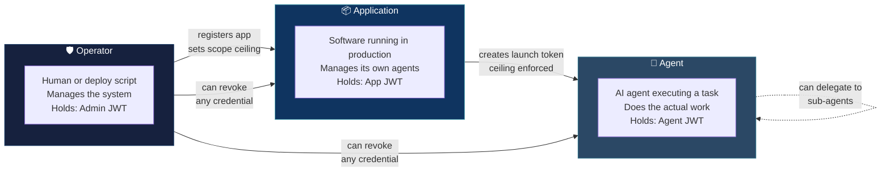
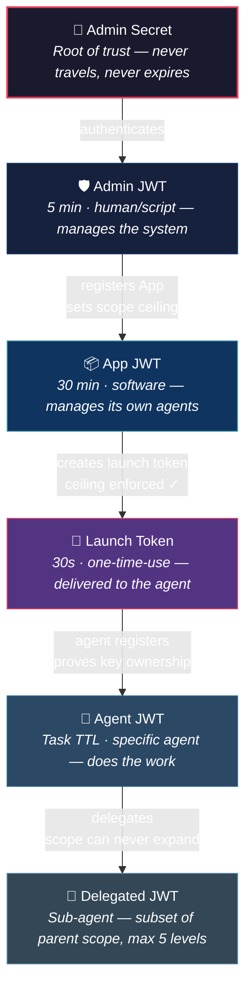

# The Three Actors — Who Holds What and Why

Every token in the system is held by one of three actors. Each has a different job, a different token, and different authority. Understanding who holds what is the key to understanding how AgentWrit's security model works.

---

## The Three Actors

The system has three actors. Each has a different job and holds a different token.

| Actor | What they are | Their token |
|---|---|---|
| **Operator** | The human or script that runs and manages the broker | Admin JWT |
| **Application** | Software your organization deploys that manages its own agents | App JWT |
| **Agent** | An AI agent executing a specific task | Agent JWT |

These three should never be confused. An operator is not an application. An application is not an agent. The token architecture enforces this separation.

---

## The Admin Token — Operator Authority

**How it's obtained:** `POST /v1/admin/auth` with the master admin secret.

**What it carries:**
```
admin:launch-tokens:*
admin:revoke:*
admin:audit:*
```

**What each scope actually unlocks** (from the route guards in the code):

| Scope | Routes it opens |
|---|---|
| `admin:launch-tokens:*` | `POST /v1/admin/launch-tokens` — create a launch token |
| `admin:launch-tokens:*` | `POST/GET/PUT/DELETE /v1/admin/apps/*` — register, list, update, deregister apps |
| `admin:revoke:*` | `POST /v1/revoke` — kill any token, agent, task, or chain |
| `admin:audit:*` | `GET /v1/audit/events` — read the full audit trail |

**What it cannot do:**
- Call `POST /v1/app/launch-tokens` — wrong scope, returns 403
- Call agent endpoints (`/v1/token/renew`, `/v1/delegate`) meaningfully — the admin JWT has no `task_id` or `orch_id`, it does not represent an agent identity
- It expires in **5 minutes** and is not renewable

The admin token is for a human or a deployment script. It's short-lived by design — the operator authenticates, does what they need to do, and the session expires.

---

## The App Token — Bounded Application Authority

**How it's obtained:** `POST /v1/app/auth` with a `client_id` and `client_secret` that were issued when the admin registered the app.

**What it carries:**
```
app:launch-tokens:*
app:agents:*
app:audit:read
```

**What each scope actually unlocks:**

| Scope | Routes it opens |
|---|---|
| `app:launch-tokens:*` | `POST /v1/app/launch-tokens` — create a launch token, **ceiling enforced** |
| `app:agents:*` | (reserved for future agent management) |
| `app:audit:read` | (reserved for scoped audit access) |

**What it cannot do:**
- Call `POST /v1/admin/launch-tokens` — wrong scope, returns 403
- Call `POST /v1/revoke` — no `admin:revoke:*` scope
- Call `GET /v1/audit/events` — no `admin:audit:*` scope
- Register or deregister other apps
- Create a launch token that exceeds its own scope ceiling — the broker enforces this

The app token is designed for software running autonomously in production. It lasts 30 minutes (configurable between 60 seconds and 24 hours). It authenticates with `client_id` + `client_secret` — a machine-to-machine credential shape, not a human one.

---

## The Agent Token — Task-Scoped Working Credential

**How it's obtained:** `POST /v1/register` — the agent presents a launch token and proves it controls its own cryptographic key.

**What it carries:** whatever task-specific scopes the launch token authorized. Examples:
```
read:data:customers
write:logs:agent-run-42
```

**What the agent can do with its token:**

| Endpoint | Purpose |
|---|---|
| `POST /v1/token/validate` | External services check this token to decide if the agent is authorized |
| `POST /v1/token/renew` | Extend the session — same scope, same original TTL, old token revoked first |
| `POST /v1/token/release` | Self-revoke when the task is done |
| `POST /v1/delegate` | Create a narrower-scoped token for another registered agent |

**What the agent cannot do:** call any admin or app endpoint. It has no `admin:*` or `app:*` scopes. The broker enforces this.

---

## The Central Question: Why Can the Admin Token Create Agents?

This is the architectural question the system actually raises. Here is what the code does and why.

Both `POST /v1/admin/launch-tokens` and `POST /v1/app/launch-tokens` call the **same handler** — `handleCreateLaunchToken`. Inside that handler, one check determines the difference:

```go
// If caller is an app, enforce scope ceiling.
if strings.HasPrefix(claims.Sub, "app:") {
    appRec, _ := h.store.GetAppByID(appID)
    if !authz.ScopeIsSubset(req.AllowedScope, appRec.ScopeCeiling) {
        // denied — 403
    }
}
// Admin callers: no ceiling check. Pass straight through.
```

**Admin callers have no scope ceiling check. App callers do.**

The reason is architectural: **the admin is the authority that defines ceilings. It doesn't make sense to check an admin against a ceiling the admin set.** The admin secret is the root of trust. Everything — every app ceiling, every agent credential — traces back to a decision the admin made. Checking the admin against a ceiling would be checking the ceiling-setter against their own ceiling.

The admin creating launch tokens directly is the **bootstrap and break-glass path**:
- Before any apps are registered, the admin is the only actor who can get the first agent credentialed
- In development and testing, registering an app for every test run is unnecessary overhead
- In an emergency, the admin can bypass the app layer entirely

The app creating launch tokens is the **production path**:
- The app holds its own credential — the admin secret is not embedded in production software
- The ceiling is enforced mechanically by the broker — not by developer convention or code review
- The app's blast radius is contained — if the app credential is compromised, it can only affect agents within its ceiling, not the broker itself

---

## Why the App Token Exists as a Separate Concept

This is the first principle the architecture is built around.

Without the app token, every agent is credentialed by the operator. The operator manually decides what each agent is allowed to do. If the operator's tooling is compromised, or the operator makes a mistake, there is no mechanical safety net.

With the app token, the operator makes **one decision at registration time**: what this application is allowed to delegate to its agents. After that, the application handles its own agents autonomously, and the broker enforces the ceiling on every single launch token the app creates.

The ceiling is not a suggestion. It is checked in code on every call to `POST /v1/app/launch-tokens`:

```go
if !authz.ScopeIsSubset(req.AllowedScope, appRec.ScopeCeiling) {
    // 403 — cannot exceed ceiling
}
```

---

## The Three Actors — How They Interact



---

## The Authority Chain in One Picture



At every step, authority can never expand. The admin defines what apps can do. Apps define what agents can do. Agents define what sub-agents can do. A delegate can receive its delegator's full scope or less — but never more. The admin, as root of trust, is the ceiling above everything.

---

## Quick Reference: Who Can Call What

| Endpoint | Admin JWT | App JWT | Agent JWT |
|---|---|---|---|
| `POST /v1/admin/auth` | — (produces it) | ✗ | ✗ |
| `POST /v1/app/auth` | ✗ | — (produces it) | ✗ |
| `POST /v1/admin/apps` | ✓ | ✗ | ✗ |
| `GET /v1/admin/apps` | ✓ | ✗ | ✗ |
| `PUT /v1/admin/apps/{id}` | ✓ | ✗ | ✗ |
| `DELETE /v1/admin/apps/{id}` | ✓ | ✗ | ✗ |
| `POST /v1/admin/launch-tokens` | ✓ (no ceiling) | ✗ | ✗ |
| `POST /v1/app/launch-tokens` | ✗ | ✓ (ceiling enforced) | ✗ |
| `POST /v1/register` | ✗ | ✗ | — (produces agent JWT) |
| `POST /v1/token/validate` | ✗ | ✗ | ✓ |
| `POST /v1/token/renew` | ✗ | ✗ | ✓ |
| `POST /v1/token/release` | ✗ | ✗ | ✓ |
| `POST /v1/delegate` | ✗ | ✗ | ✓ |
| `POST /v1/revoke` | ✓ | ✗ | ✗ |
| `GET /v1/audit/events` | ✓ | ✗ | ✗ |

---

---

## What's Next?

You know who holds which token. Next, understand what those tokens can actually *do*:

**[Scopes and Permissions →](scope-model.md)**
The `action:resource:identifier` format, coverage rules, and the four enforcement points.

Or explore related topics:

| If you want to... | Read this |
|-------------------|-----------|
| See every credential's claims and TTLs | [The Credential Lifecycle](credential-model.md) |
| Understand the full registration flow hands-on | [Your First Five Minutes](getting-started-user.md) |
| See the plain-language version for sales teams | [What Is AgentWrit?](agentwrit-explained.md) |

---

*Previous: [Foundations](foundations.md) · Next: [Scopes and Permissions](scope-model.md)*

