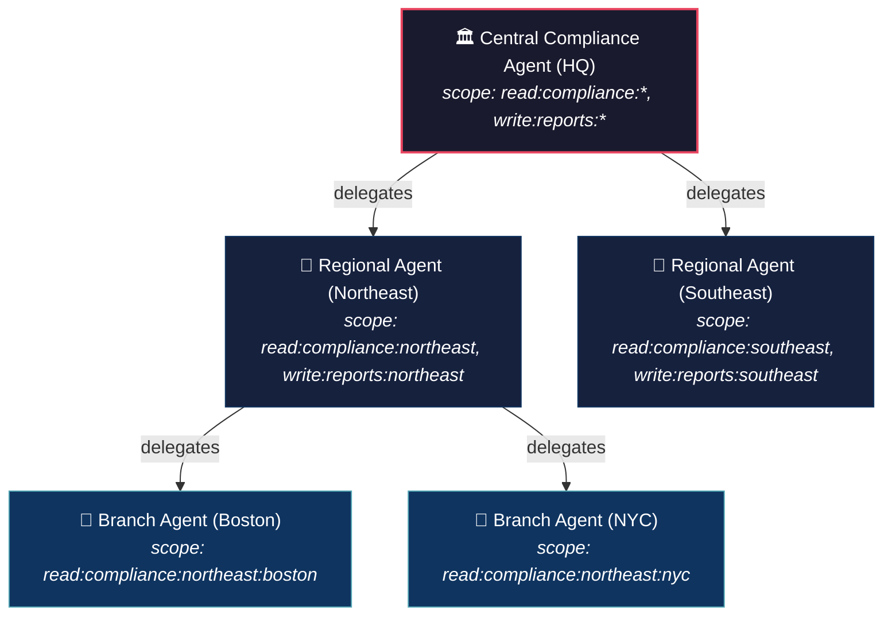

# Real-World Scenarios — The 8 Components in Production

These scenarios show how the Ephemeral Agent Credentialing components work together in production deployments with real API calls.

**Want to run a real demo?** The [Python SDK](python-sdk.md) includes two working demo applications that implement these patterns against a live broker:
- [MedAssist AI](demos.md) — healthcare multi-agent pipeline with scope isolation, delegation, and LLM tool-calling
- [Support Ticket Zero-Trust](demos.md) — three LLM-driven agents with streaming execution and natural token expiry

---

## Scenario 1: Financial Services — Loan Document Processing Pipeline

A bank runs an AI pipeline that reads loan applications, extracts data, scores risk, and writes decisions. Three agents, each with different permissions, process documents in sequence. No agent should be able to access more than its specific task requires.

### The Agents

| Agent | Job | Required Scope | Why Limited |
|-------|-----|---------------|-------------|
| Document Reader | Extract text from uploaded PDFs | `read:documents:loans` | Should never write or delete documents |
| Risk Scorer | Run credit model against extracted data | `read:data:credit`, `read:documents:loans` | Needs both data sources but should never write |
| Decision Writer | Write the final approval/denial | `write:decisions:loans` | Should never read raw credit data |

### How the 8 Components Protect This Pipeline

**Setup (one-time):**

```bash
# Operator registers the loan-processing app
awrit app register \
  --name loan-pipeline \
  --scopes "read:documents:loans,read:data:credit,write:decisions:loans"

# Returns: client_id=lp-a1b2c3, client_secret=... (save this)
```

**Runtime (every pipeline run):**

```python
import base64, binascii, requests
from cryptography.hazmat.primitives.asymmetric.ed25519 import Ed25519PrivateKey

BROKER = "https://broker.internal:8080"

class LoanPipeline:
    def __init__(self, client_id, client_secret):
        self.broker = BROKER
        self.client_id = client_id
        self.client_secret = client_secret

    def run(self, loan_application_id):
        # ━━━ Component 2: Short-Lived Token ━━━
        # App authenticates and gets a token (default 1800s TTL)
        app_token = self._app_auth()

        # ━━━ Component 1: Ephemeral Identity ━━━
        # Each agent gets its own SPIFFE identity and scoped token
        reader_token = self._spawn_agent(
            app_token, "doc-reader",
            scope=["read:documents:loans"],
            task_id=f"loan-{loan_application_id}",
        )

        scorer_token = self._spawn_agent(
            app_token, "risk-scorer",
            scope=["read:data:credit", "read:documents:loans"],
            task_id=f"loan-{loan_application_id}",
        )

        writer_token = self._spawn_agent(
            app_token, "decision-writer",
            scope=["write:decisions:loans"],
            task_id=f"loan-{loan_application_id}",
        )

        # ━━━ Component 3: Zero-Trust Enforcement ━━━
        # Each agent uses ONLY its token. The broker validates every request.
        # If the reader tries to write, the broker returns 403.
        doc_text = self._read_document(reader_token, loan_application_id)
        risk_score = self._score_risk(scorer_token, doc_text)
        self._write_decision(writer_token, loan_application_id, risk_score)

        # ━━━ Component 4: Automatic Expiration ━━━
        # Agents release their tokens when done (task completion signal)
        for token in [reader_token, scorer_token, writer_token]:
            requests.post(f"{self.broker}/v1/token/release",
                headers={"Authorization": f"Bearer {token}"})

        # ━━━ Component 5: Immutable Audit ━━━
        # Every action above was recorded:
        # - 3x agent_registered (one per agent)
        # - 3x token_issued
        # - 3x token_released
        # - All with task_id=loan-{id} for correlation

    def _app_auth(self):
        resp = requests.post(f"{self.broker}/v1/app/auth", json={
            "client_id": self.client_id,
            "client_secret": self.client_secret,
        })
        return resp.json()["access_token"]

    def _spawn_agent(self, app_token, agent_name, scope, task_id):
        """Create launch token (Component 2) + register agent (Component 1)."""
        # App creates a launch token via the app route
        lt_resp = requests.post(f"{self.broker}/v1/app/launch-tokens",
            headers={"Authorization": f"Bearer {app_token}"},
            json={
                "agent_name": agent_name,
                "allowed_scope": scope,
                "max_ttl": 300,  # 5 minutes max
                "ttl": 30,       # launch token expires in 30s
                "single_use": True,
            })
        launch_token = lt_resp.json()["launch_token"]

        # Agent generates Ed25519 keypair and registers
        private_key = Ed25519PrivateKey.generate()
        pub_b64 = base64.b64encode(
            private_key.public_key().public_bytes_raw()
        ).decode()

        challenge = requests.get(f"{self.broker}/v1/challenge")
        nonce = challenge.json()["nonce"]

        sig_b64 = base64.b64encode(
            private_key.sign(binascii.unhexlify(nonce))
        ).decode()

        reg = requests.post(f"{self.broker}/v1/register", json={
            "launch_token": launch_token,
            "nonce": nonce,
            "public_key": pub_b64,
            "signature": sig_b64,
            "orch_id": "loan-pipeline",
            "task_id": task_id,
            "requested_scope": scope,
        })
        return reg.json()["access_token"]
```

**What each component did:**

| Component | What happened | Where in code |
|-----------|--------------|---------------|
| 1. Ephemeral Identity | Each agent got `spiffe://agentwrit.local/agent/loan-pipeline/loan-12345/{unique}` | `identity/id_svc.go:Register()` |
| 2. Short-Lived Tokens | App token: 1800s. Agent tokens: 300s max. Launch tokens: 30s. | `token/tkn_svc.go:Issue()` |
| 3. Zero-Trust | Every API call validated by `ValMw`. Reader can't write. Writer can't read credit data. | `authz/val_mw.go:Wrap()` |
| 4. Expiration & Revocation | Agents released tokens on completion. If the pipeline crashes, tokens expire in 5 min. | `handler/release_hdl.go`, `token/tkn_claims.go:Validate()` |
| 5. Audit Trail | 9+ events recorded with `task_id=loan-12345` — full pipeline trace. | `audit/audit_log.go:Record()` |
| 6. Mutual Auth | Not used here (single pipeline, agents don't talk to each other). | — |
| 7. Delegation | Not used here (no agent-to-agent delegation needed). | — |
| 8. Observability | `agentwrit_tokens_issued_total{scope="read:documents:loans"}` incremented. Health check shows all events recorded. | `obs/obs.go` metrics |

---

## Scenario 2: DevOps — Production Deployment with Delegation

A deployment orchestrator spawns agents to deploy code. The lead agent has broad access but delegates narrow scopes to worker agents. If something goes wrong, the operator revokes the entire delegation chain.

### The Agents

| Agent | Job | Scope | Created By |
|-------|-----|-------|-----------|
| Deploy Orchestrator | Coordinates the deployment | `write:deploy:*`, `read:config:*` | App via launch token |
| Config Reader | Reads environment config | `read:config:production` | Delegated by Orchestrator |
| Deployer | Pushes code to production | `write:deploy:web-service` | Delegated by Orchestrator |

### How It Works

```python
# ━━━ Component 7: Delegation Chain ━━━
# The orchestrator delegates narrowed scope to workers

# Orchestrator has: write:deploy:*, read:config:*
# It delegates ONLY what each worker needs

# Config reader gets narrowed scope
config_reader = requests.post(f"{BROKER}/v1/delegate",
    headers={"Authorization": f"Bearer {orchestrator_token}"},
    json={
        "delegate_to": "spiffe://agentwrit.local/agent/deploy/task-42/config-reader",
        "scope": ["read:config:production"],  # narrowed from read:config:*
        "ttl": 120,
    })
config_reader_token = config_reader.json()["access_token"]
# delegation_chain now has 1 entry: the orchestrator

# Deployer gets narrowed scope
deployer = requests.post(f"{BROKER}/v1/delegate",
    headers={"Authorization": f"Bearer {orchestrator_token}"},
    json={
        "delegate_to": "spiffe://agentwrit.local/agent/deploy/task-42/deployer",
        "scope": ["write:deploy:web-service"],  # narrowed from write:deploy:*
        "ttl": 120,
    })
deployer_token = deployer.json()["access_token"]

# ━━━ Component 3: Zero-Trust ━━━
# Config reader can ONLY read production config.
# It cannot deploy. It cannot read staging config.
# Deployer can ONLY deploy web-service.
# It cannot read config. It cannot deploy other services.
```

**Emergency revocation (Component 4):**

```bash
# Something goes wrong — operator revokes the ENTIRE delegation chain
# This invalidates the orchestrator AND all delegated tokens

curl -X POST https://broker.internal:8080/v1/revoke \
  -H "Authorization: Bearer $ADMIN_TOKEN" \
  -H "Content-Type: application/json" \
  -d '{
    "level": "chain",
    "target": "spiffe://agentwrit.local/agent/deploy/task-42/orchestrator"
  }'

# All three agents (orchestrator, config reader, deployer) are now revoked.
# Their next API call returns 401 immediately.
```

**What each component did:**

| Component | What happened |
|-----------|--------------|
| 1. Ephemeral Identity | Orchestrator registered via challenge-response. Workers got identities via delegation. |
| 2. Short-Lived Tokens | Delegated tokens: 120s TTL. Orchestrator: 300s. |
| 3. Zero-Trust | Every request validated. Scope boundaries enforced. Config reader can't deploy. |
| 4. Revocation | Chain-level revocation killed all 3 agents in one call. |
| 5. Audit Trail | `delegation_created` events trace the full chain. `token_revoked` records the emergency. |
| 6. Mutual Auth | Not used (workers trust the broker, not each other). |
| 7. Delegation | Orchestrator → Config Reader (narrowed). Orchestrator → Deployer (narrowed). Max depth 5. |
| 8. Observability | `agentwrit_tokens_revoked_total{level="chain"}` incremented. Prometheus alert fires. |

---

## Scenario 3: Healthcare — Patient Record Access with Full Audit

A hospital runs AI agents that assist clinicians. Each agent accesses a specific patient's records for a specific consultation. The compliance team needs a complete audit trail of every access, and agents must be individually revocable if compromised.

### How the 8 Components Apply

```python
# ━━━ Component 1: Ephemeral Identity ━━━
# Each consultation gets its own agent with a unique SPIFFE ID
# spiffe://hospital.health/agent/ehr-system/consultation-789/agent-abc123

agent_token = spawn_agent(
    app_token,
    agent_name="clinical-assistant",
    scope=["read:patient:patient-456"],  # THIS patient only
    task_id="consultation-789",
    orch_id="ehr-system",
)

# ━━━ Component 3: Zero-Trust ━━━
# The agent can read patient-456's records.
# It CANNOT read patient-457. The scope is patient-specific.
# read:patient:patient-456 does NOT cover read:patient:patient-457

# ━━━ Component 2: Short-Lived Token ━━━
# Token expires in 300 seconds (5 minutes).
# A consultation that runs long must renew:
renewed = requests.post(f"{BROKER}/v1/token/renew",
    headers={"Authorization": f"Bearer {agent_token}"})
agent_token = renewed.json()["access_token"]
# New token preserves the original 300s TTL (clamped by MaxTTL)
# Old token is immediately revoked (Component 4)

# ━━━ Component 4: Revocation ━━━
# Consultation ends — agent releases its token
requests.post(f"{BROKER}/v1/token/release",
    headers={"Authorization": f"Bearer {agent_token}"})

# If the agent is compromised mid-consultation:
# Operator can revoke just THIS agent without affecting others
requests.post(f"{BROKER}/v1/revoke",
    headers={"Authorization": f"Bearer {admin_token}"},
    json={"level": "agent", "target": agent_spiffe_id})
# Or revoke all agents for this consultation:
requests.post(f"{BROKER}/v1/revoke",
    headers={"Authorization": f"Bearer {admin_token}"},
    json={"level": "task", "target": "consultation-789"})

# ━━━ Component 5: Audit Trail ━━━
# Compliance query: "who accessed patient-456's records?"
events = requests.get(f"{BROKER}/v1/audit/events",
    headers={"Authorization": f"Bearer {admin_token}"},
    params={
        "task_id": "consultation-789",
        "event_type": "resource_accessed",
    })
# Returns hash-chained, tamper-evident audit events
# Each event has: timestamp, agent_id, task_id, outcome, detail

# ━━━ Component 8: Observability ━━━
# Prometheus dashboard shows:
# - agentwrit_active_agents: 0 (consultation complete)
# - agentwrit_tokens_issued_total{scope="read:patient:patient-456"}: 1
# - agentwrit_audit_events_total: growing
# - agentwrit_request_duration_seconds: SLA compliance
```

### Compliance Summary

| Requirement | How AgentWrit Delivers |
|------------|----------------------|
| Patient-specific access control | Scope: `read:patient:patient-456` (Component 3) |
| Time-limited access | 300s token TTL, auto-expiry (Component 2) |
| Individual agent accountability | Unique SPIFFE ID per consultation (Component 1) |
| Revocability | Agent, task, or chain-level revocation (Component 4) |
| Complete audit trail | Hash-chained events with task_id correlation (Component 5) |
| Tamper evidence | SHA-256 hash chain — broken links detectable (Component 5) |
| Monitoring | Prometheus metrics + health endpoint (Component 8) |

---

## Scenario 4: Fintech — AI-Powered Payment Fraud Detection

A fintech company processes thousands of payment transactions per minute. AI agents analyze transactions in real time, flag suspicious activity, and in some cases freeze accounts. The stakes are high — a compromised agent with broad access could approve fraudulent transactions or freeze legitimate accounts.

### The Agents

| Agent | Job | Scope | Risk If Compromised |
|-------|-----|-------|-------------------|
| Transaction Analyzer | Read transaction stream, score risk | `read:transactions:stream` | Could leak transaction data |
| Fraud Flagger | Flag suspicious transactions for review | `write:flags:fraud`, `read:transactions:stream` | Could flag legitimate transactions |
| Account Freezer | Freeze accounts with confirmed fraud | `write:accounts:freeze` | Could freeze innocent accounts |
| Audit Reporter | Generate compliance reports | `read:audit:*`, `read:flags:fraud` | Could leak internal fraud patterns |

### Why AgentWrit Matters Here

Without AgentWrit, a typical fintech setup uses a shared API key for all agents:

```
# THE DANGEROUS PATH — shared credential
PAYMENT_API_KEY=sk_live_abc123...  # All agents share this
# Any compromised agent can: read ALL transactions, freeze ANY account,
# flag ANY transaction, read ALL audit data
# Blast radius: TOTAL
```

With AgentWrit, each agent gets exactly what it needs, for exactly as long as it needs it:

```python
import base64, binascii, requests
from cryptography.hazmat.primitives.asymmetric.ed25519 import Ed25519PrivateKey

BROKER = "https://broker.payments.internal:8080"

class FraudDetectionPipeline:
    """Process a batch of transactions through the fraud detection pipeline."""

    def __init__(self, client_id, client_secret):
        self.broker = BROKER
        self.client_id = client_id
        self.client_secret = client_secret

    def process_batch(self, batch_id):
        # ━━━ Component 2: App gets a short-lived token (1800s) ━━━
        app_token = self._app_auth()

        # ━━━ Component 1: Each agent gets a unique identity ━━━
        # SPIFFE IDs encode the batch context:
        # spiffe://payments.internal/agent/fraud-pipeline/batch-7291/analyzer-x9f2

        analyzer = self._spawn_agent(app_token,
            name="tx-analyzer",
            scope=["read:transactions:stream"],
            task_id=f"batch-{batch_id}",
            ttl=120,  # 2 minutes — enough to scan the batch
        )

        flagger = self._spawn_agent(app_token,
            name="fraud-flagger",
            scope=["write:flags:fraud", "read:transactions:stream"],
            task_id=f"batch-{batch_id}",
            ttl=120,
        )

        # ━━━ Component 3: Zero-Trust — every call validated ━━━
        # Analyzer reads transactions
        suspicious = self._analyze(analyzer, batch_id)

        # Flagger flags suspicious ones
        # Even though flagger has read:transactions:stream, it CANNOT
        # freeze accounts — it doesn't have write:accounts:freeze
        flagged = self._flag_suspicious(flagger, suspicious)

        # Only spawn the freezer if there are confirmed fraud cases
        if flagged:
            freezer = self._spawn_agent(app_token,
                name="account-freezer",
                scope=["write:accounts:freeze"],
                task_id=f"batch-{batch_id}",
                ttl=60,  # 1 minute — freeze is fast
            )
            self._freeze_accounts(freezer, flagged)

            # ━━━ Component 4: Freezer releases immediately ━━━
            # The account-freeze agent should not persist longer than needed
            requests.post(f"{self.broker}/v1/token/release",
                headers={"Authorization": f"Bearer {freezer}"})

        # ━━━ Component 4: All agents release on completion ━━━
        for token in [analyzer, flagger]:
            requests.post(f"{self.broker}/v1/token/release",
                headers={"Authorization": f"Bearer {token}"})

        # ━━━ Component 5: Audit trail for compliance ━━━
        # Regulators can query: "which agent froze account X, when, and why?"
        # GET /v1/audit/events?task_id=batch-7291&event_type=resource_accessed

    def _app_auth(self):
        resp = requests.post(f"{self.broker}/v1/app/auth", json={
            "client_id": self.client_id,
            "client_secret": self.client_secret,
        })
        return resp.json()["access_token"]

    def _spawn_agent(self, app_token, name, scope, task_id, ttl=300):
        # App creates launch token via the app route (Component 2)
        lt = requests.post(f"{self.broker}/v1/app/launch-tokens",
            headers={"Authorization": f"Bearer {app_token}"},
            json={
                "agent_name": name,
                "allowed_scope": scope,
                "max_ttl": ttl,
                "ttl": 30,
                "single_use": True,
            })
        launch_token = lt.json()["launch_token"]

        # Agent registers with Ed25519 challenge-response (Component 1)
        private_key = Ed25519PrivateKey.generate()
        pub_b64 = base64.b64encode(
            private_key.public_key().public_bytes_raw()
        ).decode()
        nonce = requests.get(f"{self.broker}/v1/challenge").json()["nonce"]
        sig_b64 = base64.b64encode(
            private_key.sign(binascii.unhexlify(nonce))
        ).decode()

        reg = requests.post(f"{self.broker}/v1/register", json={
            "launch_token": launch_token,
            "nonce": nonce,
            "public_key": pub_b64,
            "signature": sig_b64,
            "orch_id": "fraud-pipeline",
            "task_id": task_id,
            "requested_scope": scope,
        })
        return reg.json()["access_token"]
```

**What the regulator sees in the audit trail:**

```bash
# "Show me everything that happened in batch 7291"
curl -s "https://broker.payments.internal:8080/v1/audit/events?task_id=batch-7291" \
  -H "Authorization: Bearer $ADMIN_TOKEN" | python3 -m json.tool

# Returns (hash-chained, tamper-evident):
# evt-001: agent_registered  | tx-analyzer     | batch-7291 | success
# evt-002: token_issued      | tx-analyzer     | batch-7291 | success | ttl=120
# evt-003: agent_registered  | fraud-flagger   | batch-7291 | success
# evt-004: token_issued      | fraud-flagger   | batch-7291 | success | ttl=120
# evt-005: agent_registered  | account-freezer | batch-7291 | success
# evt-006: token_issued      | account-freezer | batch-7291 | success | ttl=60
# evt-007: token_released    | account-freezer | batch-7291 | success  ← freezer done first
# evt-008: token_released    | tx-analyzer     | batch-7291 | success
# evt-009: token_released    | fraud-flagger   | batch-7291 | success
```

### The Security Story in One Table

| Without AgentWrit | With AgentWrit |
|-------------------|---------------|
| Shared API key across all agents | Each agent has unique SPIFFE identity |
| Key lives forever until manually rotated | Tokens expire in 60-120 seconds |
| Compromised agent can freeze any account | Account freezer can ONLY freeze, and only for 60 seconds |
| No audit trail of which agent did what | Hash-chained audit with task_id, agent_id, timestamps |
| Revoking the shared key kills ALL agents | Revoke one agent, one task, or one chain — granular |
| Blast radius: total | Blast radius: one agent's scope for its remaining TTL |

---

## Scenario 5: Bank — Multi-Branch Agent Coordination with Delegation

A bank operates AI agents across multiple branches. A central compliance agent oversees regional agents. Regional agents delegate to local branch agents. The delegation chain provides cryptographic proof of who authorized what.

### The Delegation Hierarchy



### How Delegation Chains Work

```python
# ━━━ Step 1: Central agent registered by operator ━━━
# Central has broad scope: read:compliance:*, write:reports:*

# ━━━ Step 2: Central delegates to Regional (Component 7) ━━━
northeast = requests.post(f"{BROKER}/v1/delegate",
    headers={"Authorization": f"Bearer {central_token}"},
    json={
        "delegate_to": regional_northeast_id,
        "scope": ["read:compliance:northeast", "write:reports:northeast"],
        # Narrowed from read:compliance:* to read:compliance:northeast
        "ttl": 600,
    })
northeast_token = northeast.json()["access_token"]
northeast_chain = northeast.json()["delegation_chain"]
# Chain: [{"agent": central_id, "scope": [...], "signature": "..."}]

# ━━━ Step 3: Regional delegates to Branch (Component 7) ━━━
boston = requests.post(f"{BROKER}/v1/delegate",
    headers={"Authorization": f"Bearer {northeast_token}"},
    json={
        "delegate_to": branch_boston_id,
        "scope": ["read:compliance:northeast:boston"],
        # Further narrowed from read:compliance:northeast
        "ttl": 300,
    })
boston_token = boston.json()["access_token"]
boston_chain = boston.json()["delegation_chain"]
# Chain: [
#   {"agent": central_id, "scope": [...], "signature": "..."},
#   {"agent": regional_ne_id, "scope": [...], "signature": "..."}
# ]

# ━━━ The Boston agent can ONLY read Boston compliance data ━━━
# It cannot read NYC data, cannot read Southeast data, cannot write reports
# Each delegation narrowed the scope. The chain proves the authorization lineage.

# ━━━ Component 4: If central is compromised, revoke the chain ━━━
requests.post(f"{BROKER}/v1/revoke",
    headers={"Authorization": f"Bearer {admin_token}"},
    json={
        "level": "chain",
        "target": central_agent_id,
    })
# This revokes: central, northeast, southeast, boston, nyc — ALL agents
# in the delegation tree. One API call. Immediate effect.

# ━━━ Component 5: Audit proves the authorization path ━━━
# Auditor can trace: Boston agent → authorized by Northeast → authorized by Central
# Each step has a cryptographic signature in the delegation_chain JWT claim
# The chain_hash (SHA-256) prevents tampering with the chain
```

### What Each Component Delivers for the Bank

| Component | Bank Value |
|-----------|-----------|
| 1. Ephemeral Identity | Every branch agent has a unique SPIFFE ID: `spiffe://bank.internal/agent/compliance/q4-audit/boston-abc` |
| 2. Short-Lived Tokens | Branch tokens: 300s. Regional: 600s. If a branch laptop is stolen, tokens expire in minutes. |
| 3. Zero-Trust | Boston agent cannot read NYC compliance data. Period. The broker enforces this on every request. |
| 4. Revocation | Revoke one branch, one region, or the entire tree. Granular incident response. |
| 5. Audit Trail | Regulator asks "who authorized the Boston agent to access compliance data?" — the chain proves Central → Northeast → Boston with signatures. |
| 6. Mutual Auth | Branch agents can verify each other's identity before sharing data in a mesh topology. |
| 7. Delegation | Scope narrows at every level. Central: `read:compliance:*` → Regional: `read:compliance:northeast` → Branch: `read:compliance:northeast:boston`. Attenuation is enforced — no scope expansion possible. |
| 8. Observability | `agentwrit_active_agents` shows real-time agent count. Alerts fire if delegation depth exceeds threshold. |

---

## Component Coverage Across Scenarios

| Component | Scenario 1 (Loans) | Scenario 2 (DevOps) | Scenario 3 (Healthcare) | Scenario 4 (Fintech) | Scenario 5 (Bank) |
|-----------|-------------------|--------------------|-----------------------|---------------------|-------------------|
| 1. Ephemeral Identity | 3 agents, unique SPIFFE IDs | 1 registered + 2 delegated | 1 per consultation | 3-4 per batch | Hierarchical IDs |
| 2. Short-Lived Tokens | 300s agent, 30s launch | 120s delegated | 300s with renewal | 60-120s per agent | 300-600s tiered |
| 3. Zero-Trust | Reader can't write | Config reader can't deploy | Patient-specific scope | Freezer can't read | Branch can't read other branches |
| 4. Revocation | Token release | Chain-level emergency | Agent + task-level | Immediate release | Chain revokes entire tree |
| 5. Audit Trail | 9+ events/pipeline | Delegation + revocation | Compliance with task_id | Regulator-ready trail | Authorization lineage proof |
| 6. Mutual Auth | — | — | — | — | Branch-to-branch verification |
| 7. Delegation | — | Scope narrowing | — | — | 3-level: central→regional→branch |
| 8. Observability | Metrics per scope | Revocation alerts | SLA monitoring | Batch completion metrics | Agent count + depth alerts |

Component 6 (Mutual Auth) is implemented as a Go API and applies when agents need to verify each other's identity directly — for example, bank branch agents in a mesh topology exchanging compliance data (Scenario 5).

---

## Scenario 6: Go-Native Agent — Minimal Dependencies, Minimal Attack Surface

AgentWrit's core security path — Ed25519 signing, JWT creation/verification, SHA-256 hash chains, challenge-response, scope enforcement — is built entirely on the **Go standard library**. No JWT library. No auth framework. No middleware library.

This means a Go agent integrating with AgentWrit has **zero additional dependencies** for the security-critical path. Everything needed is in `crypto/ed25519`, `crypto/sha256`, `encoding/base64`, `encoding/json`, and `net/http`.

### Why This Matters

| Risk | Typical AI Agent Stack | AgentWrit Go Agent |
|------|----------------------|-------------------|
| Supply chain attack via compromised dependency | PyJWT, python-jose, requests, cryptography — each with transitive deps | Go stdlib only. No third-party code in the auth path. |
| CVE in JWT library | Common — CVE-2022-29217 (PyJWT), CVE-2024-33663 (python-jose) | No JWT library to patch. JWT is 50 lines of `base64` + `ed25519`. |
| Dependency confusion attack | pip/npm packages can be typosquatted | Zero `go get` needed for agent auth code |
| Binary size | Python: 50MB+ with dependencies | Go: single static binary, ~15MB total |
| Audit scope | Must audit every transitive dependency | Audit scope: Go stdlib (maintained by the Go team) |

### AgentWrit Broker Dependencies

Only 5 direct dependencies, and none are in the token signing/verification path:

| Dependency | Purpose | In Security Path? |
|-----------|---------|------------------|
| `golang.org/x/crypto` | bcrypt for admin secret hashing | Admin auth only — not token path |
| `modernc.org/sqlite` | Pure-Go SQLite (no CGO, no C) | Persistence only |
| `github.com/spiffe/go-spiffe/v2` | SPIFFE ID format validation | Identity format only |
| `github.com/prometheus/client_golang` | Metrics exposition | Observability only |
| `github.com/spf13/cobra` | CLI framework (awrit) | CLI only — not broker |

**The Ed25519 signing, JWT encoding, signature verification, scope checking, revocation checking, and hash-chain audit trail use zero third-party code.**

### Go Agent Example — Complete Registration with Stdlib Only

```go
package main

import (
	"bytes"
	"crypto/ed25519"
	"crypto/rand"
	"encoding/base64"
	"encoding/hex"
	"encoding/json"
	"fmt"
	"io"
	"net/http"
	"os"
)

// No third-party imports. Every package above ships with Go.

const broker = "http://localhost:8080"

func main() {
	launchToken := os.Getenv("LAUNCH_TOKEN")
	if launchToken == "" {
		fmt.Fprintln(os.Stderr, "LAUNCH_TOKEN not set")
		os.Exit(1)
	}

	// ━━━ Component 1: Generate Ed25519 keypair (Go stdlib) ━━━
	pubKey, privKey, err := ed25519.GenerateKey(rand.Reader)
	if err != nil {
		panic(err)
	}
	pubB64 := base64.StdEncoding.EncodeToString(pubKey)

	// ━━━ Component 1: Get challenge nonce ━━━
	nonce := mustGet(broker + "/v1/challenge")["nonce"].(string)

	// ━━━ Component 1: Sign nonce with Ed25519 (Go stdlib) ━━━
	nonceBytes, _ := hex.DecodeString(nonce)
	signature := ed25519.Sign(privKey, nonceBytes)
	sigB64 := base64.StdEncoding.EncodeToString(signature)

	// ━━━ Component 1+2: Register and get scoped token ━━━
	regResp := mustPost(broker+"/v1/register", map[string]interface{}{
		"launch_token":   launchToken,
		"nonce":          nonce,
		"public_key":     pubB64,
		"signature":      sigB64,
		"orch_id":        "go-pipeline",
		"task_id":        "task-001",
		"requested_scope": []string{"read:data:*"},
	})

	token := regResp["access_token"].(string)
	agentID := regResp["agent_id"].(string)
	expiresIn := regResp["expires_in"].(float64)

	fmt.Printf("Registered: %s\n", agentID)
	fmt.Printf("Token expires in: %.0fs\n", expiresIn)
	fmt.Printf("Token: %s...\n", token[:40])

	// ━━━ Component 3: Use token on authenticated endpoints ━━━
	// The broker validates this token on every request:
	// format → alg=EdDSA → kid check → Ed25519 signature → claims → revocation
	req, _ := http.NewRequest("POST", broker+"/v1/token/validate",
		jsonBody(map[string]string{"token": token}))
	req.Header.Set("Content-Type", "application/json")
	resp, err := http.DefaultClient.Do(req)
	if err != nil {
		panic(err)
	}
	defer resp.Body.Close()
	fmt.Printf("Token valid: %d\n", resp.StatusCode)

	// ━━━ Component 2: Renew before expiry ━━━
	renewReq, _ := http.NewRequest("POST", broker+"/v1/token/renew", nil)
	renewReq.Header.Set("Authorization", "Bearer "+token)
	renewResp, _ := http.DefaultClient.Do(renewReq)
	defer renewResp.Body.Close()
	if renewResp.StatusCode == 200 {
		var rr map[string]interface{}
		json.NewDecoder(renewResp.Body).Decode(&rr)
		token = rr["access_token"].(string)
		fmt.Println("Token renewed — old token is now revoked (Component 4)")
	}

	// ━━━ Component 4: Release token when done ━━━
	releaseReq, _ := http.NewRequest("POST", broker+"/v1/token/release", nil)
	releaseReq.Header.Set("Authorization", "Bearer "+token)
	http.DefaultClient.Do(releaseReq)
	fmt.Println("Token released — task complete (Component 5: audit event recorded)")
}

// Helpers — also stdlib only

func mustGet(url string) map[string]interface{} {
	resp, err := http.Get(url)
	if err != nil {
		panic(err)
	}
	defer resp.Body.Close()
	var result map[string]interface{}
	json.NewDecoder(resp.Body).Decode(&result)
	return result
}

func mustPost(url string, body interface{}) map[string]interface{} {
	resp, err := http.Post(url, "application/json", jsonBody(body))
	if err != nil {
		panic(err)
	}
	defer resp.Body.Close()
	var result map[string]interface{}
	json.NewDecoder(resp.Body).Decode(&result)
	return result
}

func jsonBody(v interface{}) io.Reader {
	b, _ := json.Marshal(v)
	return bytes.NewReader(b)
}
```

**What this demonstrates:**

- The entire agent auth flow — keygen, challenge, sign, register, use, renew, release — uses **zero `go get` dependencies**
- Every `import` is a Go stdlib package
- A security auditor reviewing this agent needs to audit exactly one thing: the Go standard library
- Compare to a Python agent that needs `pip install requests cryptography PyJWT` — each with its own CVE history and transitive dependency tree

### Components in the Go Agent

| Line | Component | Go Stdlib Used |
|------|-----------|---------------|
| `ed25519.GenerateKey(rand.Reader)` | 1. Ephemeral Identity | `crypto/ed25519`, `crypto/rand` |
| `hex.DecodeString(nonce)` | 1. Challenge-Response | `encoding/hex` |
| `ed25519.Sign(privKey, nonceBytes)` | 1. Cryptographic Proof | `crypto/ed25519` |
| `POST /v1/register` | 1+2. Identity + Token | `net/http`, `encoding/json` |
| `Authorization: Bearer` | 3. Zero-Trust | `net/http` |
| `POST /v1/token/renew` | 2+4. Renewal + Revocation | `net/http` |
| `POST /v1/token/release` | 4+5. Release + Audit | `net/http` |

**No JWT library needed.** The broker handles JWT creation and verification. The agent just sends HTTP requests and uses the token as an opaque bearer string.

---

## What's Next?

| If you want to... | Read this |
|-------------------|-----------|
| Debug common issues | [Troubleshooting](troubleshooting.md) |
| Look up endpoints | [API Reference](api.md) |
| See the internal architecture | [Architecture](architecture.md) |

---

*Previous: [Integration Patterns](integration-patterns.md) · Next: [Troubleshooting](troubleshooting.md)*
