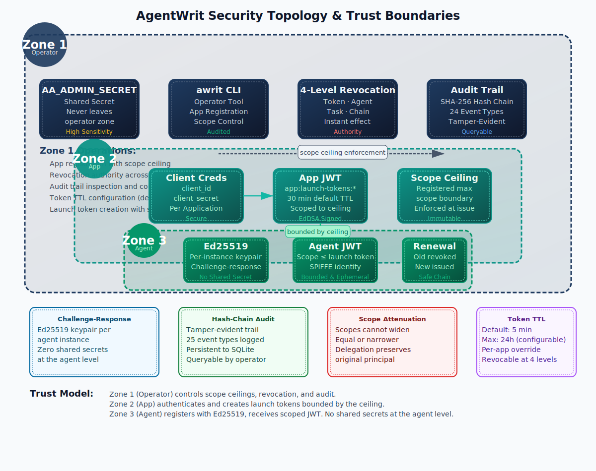

# Security Topology & Trust Boundaries

How AgentWrit's three trust zones — Operator, App, and Agent — enforce the principle of least privilege through nested scope boundaries.

  

## The three zones

| Zone | Actor | Trust level | What they control |
|------|-------|------------|-------------------|
| **Zone 1 — Operator** | Human operator using `awrit` CLI | Highest | Admin secret, app registration with scope ceilings, 4-level revocation, audit trail inspection, token TTL configuration |
| **Zone 2 — App** | Automated software (SDK or HTTP client) | Medium | Client credential auth, launch token creation bounded by scope ceiling, agent provisioning |
| **Zone 3 — Agent** | AI agent doing work | Lowest | Ed25519 keypair (no shared secret), scoped JWT bounded by launch token, renewal, delegation (narrower only), release |

## How scope narrows through the zones

1. **Operator** registers an app with a scope ceiling — the maximum permissions any agent under this app can ever hold.
2. **App** authenticates and creates a launch token. The launch token's `allowed_scope` must be a subset of the app's ceiling.
3. **Agent** registers with the launch token and requests a scope. The requested scope must be a subset of the launch token's `allowed_scope`.
4. **Delegation** narrows further — Agent A can delegate to Agent B, but only with the same or narrower scope. Never wider.

Scopes only move in one direction: down. Every boundary is enforced at issuance time, not at validation time.

## Security properties

- **Challenge-response** — Ed25519 keypair per agent instance. No shared secrets at the agent level.
- **Hash-chain audit** — tamper-evident trail with 24 event types. Each record hashes the previous.
- **Scope attenuation** — scopes cannot widen; equal or narrower is accepted. Delegation preserves the original principal.
- **Token TTL** — default 5 minutes, max 24 hours (configurable). Per-app override available. Revocable at 4 levels.

---

*Back to [Architecture](architecture.md) · [Concepts](concepts.md)*
