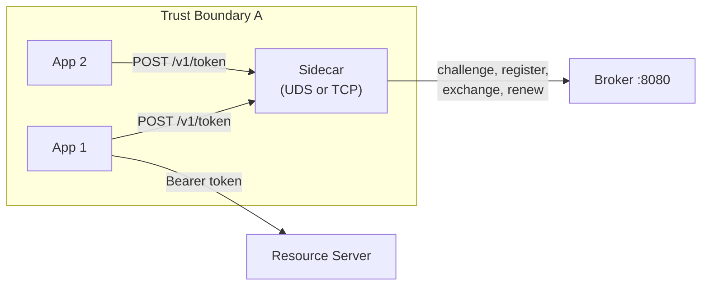
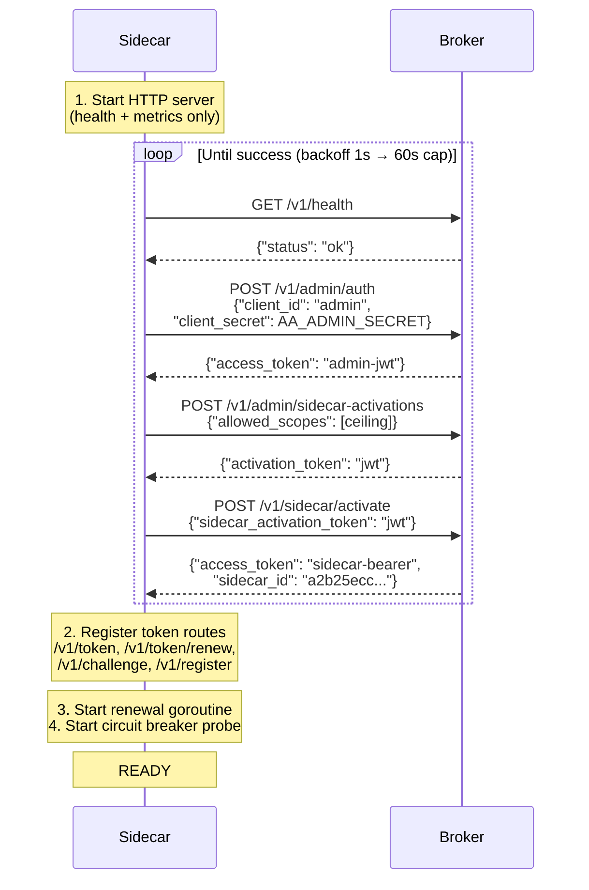
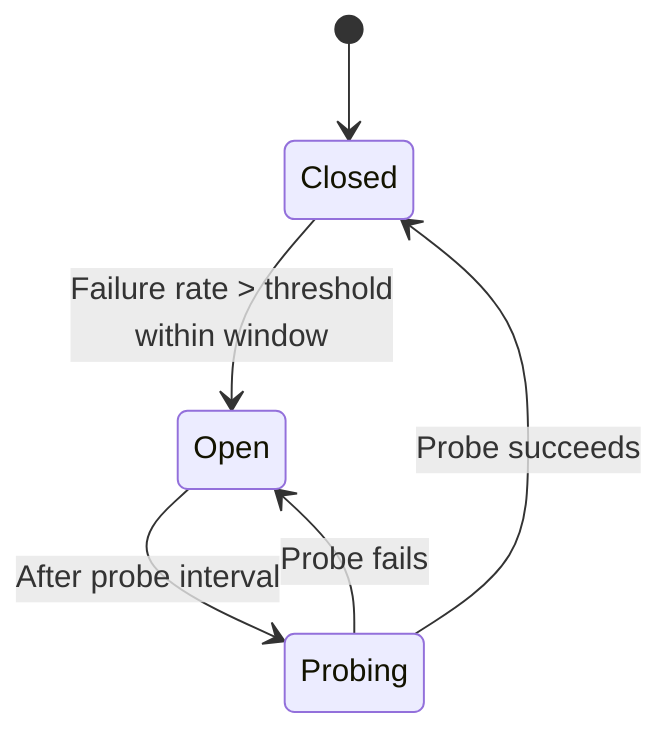

# Sidecar Deployment Guide

> **Document Version:** 1.0 | **Last Updated:** February 2026 | **Status:** Current
>
> **Audience:** Platform operators and DevOps engineers deploying AgentAuth sidecars.
>
> **Prerequisites:** [Concepts](concepts.md) for why sidecars exist, [Getting Started: Operator](getting-started-operator.md) for basic broker setup.
>
> **Next steps:** [Common Tasks](common-tasks.md) | [Troubleshooting](troubleshooting.md) | [Architecture](architecture.md)

This guide covers the full sidecar deployment lifecycle: when to create sidecars, how to size trust boundaries, configuration for development and production environments, and monitoring at scale.

---

## What Is a Sidecar?

The sidecar is a lightweight proxy that sits between your developer applications and the AgentAuth broker. It handles the cryptographic complexity — Ed25519 key generation, challenge-response registration, token exchange — so that developers can request scoped agent tokens with a single HTTP call.

Think of it like an AWS IAM instance profile: developers never see root credentials. The sidecar holds `AA_ADMIN_SECRET` and a scope ceiling; developers call `POST /v1/token` and get back a scoped, short-lived JWT.



---

## Trust Boundaries: The Scaling Unit

The fundamental question is not "how many sidecars do I need?" — it is "how many trust boundaries do I have?"

A **trust boundary** is a group of applications that share the same maximum permission set. All applications behind a single sidecar can request any scope within that sidecar's ceiling. If Application A should never have `write:billing:*` but Application B needs it, they belong in different trust boundaries and need separate sidecars.

### The Rule

**One sidecar per trust boundary. Not one per application. Not one per container.**

Applications within the same trust boundary share a sidecar and its scope ceiling. The sidecar enforces scope attenuation — each application can request only a subset of the ceiling — but any application _could_ request the full ceiling. If that is unacceptable, split into separate boundaries.

### How to Identify Trust Boundaries

Ask three questions about each group of applications:

1. **Do they share the same maximum permission set?** If App A needs `read:data:*` and App B needs `read:data:*,write:data:*`, they have different ceilings. Different boundary.

2. **Would a compromise of one affect the other?** If App A is compromised, can the attacker use the sidecar to get tokens that affect App B's resources? If yes, and that is unacceptable, split them.

3. **Are they deployed on the same host or in the same pod?** Applications that share a filesystem or network namespace are already in the same trust boundary whether you like it or not. Co-locate their sidecar.

### Real-World Examples

**Example 1: Single-Team Microservices**

A data team runs three services — ingestion, transformation, and reporting — all needing `read:data:*,write:data:*`. They run on the same Kubernetes node pool and the team trusts all three services equally.

**Deployment:** One sidecar with ceiling `read:data:*,write:data:*`. All three services call the same sidecar endpoint.

```
Trust Boundary: data-team
├── ingestion-svc     → requests read:data:*, write:data:*
├── transform-svc     → requests read:data:*, write:data:*
├── reporting-svc     → requests read:data:*
└── Sidecar (ceiling: read:data:*, write:data:*)
```

**Example 2: Multi-Team Platform**

A platform has a customer support team (needs `read:tickets:*,write:tickets:*`) and a billing team (needs `read:billing:*,write:billing:*`). A compromised support agent must never access billing data.

**Deployment:** Two sidecars with different ceilings, running on separate hosts or in separate namespaces.

```
Trust Boundary: support-team
├── support-bot       → requests read:tickets:*, write:tickets:*
├── escalation-agent  → requests read:tickets:*
└── Sidecar A (ceiling: read:tickets:*, write:tickets:*)

Trust Boundary: billing-team
├── invoice-agent     → requests read:billing:*, write:billing:*
├── audit-agent       → requests read:billing:*
└── Sidecar B (ceiling: read:billing:*, write:billing:*)
```

**Example 3: Development vs. Production**

Development environments use broad scopes for convenience (`*:*:*`). Production environments use narrow, per-team scopes.

**Deployment:** Separate sidecars per environment. The dev sidecar has a wide ceiling; the prod sidecar has a narrow one.

```
Trust Boundary: dev
└── Sidecar (ceiling: *:*:*)

Trust Boundary: prod-data
└── Sidecar (ceiling: read:data:project-42)
```

---

## Sidecar Configuration Reference

All sidecar configuration uses `AA_*` environment variables. No config files.

### Required Variables

| Variable | Description |
|----------|-------------|
| `AA_ADMIN_SECRET` | Shared secret for broker admin authentication. Must match the broker. |
| `AA_SIDECAR_SCOPE_CEILING` | Comma-separated maximum scopes (e.g., `read:data:*,write:data:*`). |

### Network & Transport

| Variable | Default | Description |
|----------|---------|-------------|
| `AA_BROKER_URL` | `http://localhost:8080` | Broker base URL. Use `https://` when broker has TLS enabled. |
| `AA_SIDECAR_PORT` | `8081` | TCP listen port (ignored when `AA_SOCKET_PATH` is set). |
| `AA_SOCKET_PATH` | _(empty)_ | Unix domain socket path. When set, sidecar listens on UDS instead of TCP. **Recommended for production.** |

### TLS Client (Sidecar → Broker)

| Variable | Default | Description |
|----------|---------|-------------|
| `AA_SIDECAR_CA_CERT` | _(empty)_ | CA certificate PEM for verifying broker TLS certificate. |
| `AA_SIDECAR_TLS_CERT` | _(empty)_ | Client certificate PEM for mTLS (sidecar presents to broker). |
| `AA_SIDECAR_TLS_KEY` | _(empty)_ | Client private key PEM for mTLS. |

### Circuit Breaker

| Variable | Default | Description |
|----------|---------|-------------|
| `AA_SIDECAR_CB_WINDOW` | `30` | Sliding window duration in seconds. |
| `AA_SIDECAR_CB_THRESHOLD` | `0.5` | Failure rate (0.0–1.0) that trips the circuit. |
| `AA_SIDECAR_CB_PROBE_INTERVAL` | `5` | Seconds between broker health probes when open. |
| `AA_SIDECAR_CB_MIN_REQUESTS` | `5` | Minimum requests in window before circuit can trip. |

### Other

| Variable | Default | Description |
|----------|---------|-------------|
| `AA_SIDECAR_LOG_LEVEL` | `standard` | Log verbosity: `quiet`, `standard`, `verbose`, `trace`. |
| `AA_SIDECAR_RENEWAL_BUFFER` | `0.8` | Fraction of TTL at which to renew the sidecar's own broker token (0.5–0.95). |

---

## Bootstrap Sequence

Understanding the bootstrap sequence helps with debugging deployment issues. When a sidecar starts, it executes a 4-step auto-activation before it can serve developer requests:



The health endpoint is available immediately (before bootstrap). Token endpoints are registered only after bootstrap succeeds. This means `curl /v1/health` works even while the sidecar is still waiting for the broker.

**Backoff schedule:** 1s, 2s, 4s, 8s, 16s, 32s, 60s (capped). The sidecar retries indefinitely — it does not crash on bootstrap failure.

---

## Deployment: Docker Compose

Docker Compose is recommended for development, staging, and small production deployments.

### Minimal Setup

```yaml
# docker-compose.yml
services:
  broker:
    build:
      context: .
      target: broker
    ports:
      - "8080:8080"
    environment:
      - AA_ADMIN_SECRET=${AA_ADMIN_SECRET}
      - AA_DB_PATH=/data/agentauth.db
    volumes:
      - broker-data:/data
    healthcheck:
      test: ["CMD", "wget", "--spider", "-q", "http://localhost:8080/v1/health"]
      interval: 2s
      timeout: 3s
      retries: 10
    networks:
      - agentauth-net

  sidecar:
    build:
      context: .
      target: sidecar
    ports:
      - "8081:8081"
    environment:
      - AA_BROKER_URL=http://broker:8080
      - AA_ADMIN_SECRET=${AA_ADMIN_SECRET}
      - AA_SIDECAR_SCOPE_CEILING=read:data:*,write:data:*
      - AA_SIDECAR_PORT=8081
    depends_on:
      broker:
        condition: service_healthy
    networks:
      - agentauth-net

volumes:
  broker-data:

networks:
  agentauth-net:
    driver: bridge
```

Start the stack:

```bash
export AA_ADMIN_SECRET="$(openssl rand -hex 32)"
docker compose up -d
```

### Multiple Sidecars (Multi-Team)

Add a second sidecar service with a different ceiling and port:

```yaml
  sidecar-billing:
    build:
      context: .
      target: sidecar
    ports:
      - "8082:8082"
    environment:
      - AA_BROKER_URL=http://broker:8080
      - AA_ADMIN_SECRET=${AA_ADMIN_SECRET}
      - AA_SIDECAR_SCOPE_CEILING=read:billing:*,write:billing:*
      - AA_SIDECAR_PORT=8082
    depends_on:
      broker:
        condition: service_healthy
    networks:
      - agentauth-net
```

### UDS Mode (Production Docker Compose)

For production, use Unix domain sockets instead of TCP. UDS restricts access to processes that share the socket file — no network exposure.

Use the UDS overlay:

```bash
docker compose -f docker-compose.yml -f docker-compose.uds.yml up -d
```

The `docker-compose.uds.yml` overlay converts the default sidecar to UDS mode and adds a second sidecar with a different scope ceiling. Both share a volume at `/var/run/agentauth/`:

```yaml
services:
  sidecar:
    environment:
      - AA_SOCKET_PATH=/var/run/agentauth/app1.sock
    volumes:
      - uds-sockets:/var/run/agentauth

  sidecar-app2:
    build:
      context: .
      target: sidecar
    environment:
      - AA_BROKER_URL=http://broker:8080
      - AA_ADMIN_SECRET=${AA_ADMIN_SECRET}
      - AA_SIDECAR_SCOPE_CEILING=read:logs:*
      - AA_SOCKET_PATH=/var/run/agentauth/app2.sock
    volumes:
      - uds-sockets:/var/run/agentauth
    depends_on:
      broker:
        condition: service_healthy
    networks:
      - agentauth-net

volumes:
  uds-sockets:
```

Application containers access the sidecar via the shared volume:

```bash
# From a container with the uds-sockets volume mounted
curl --unix-socket /var/run/agentauth/app1.sock \
  -X POST http://localhost/v1/token \
  -H "Content-Type: application/json" \
  -d '{"agent_name":"my-agent","scope":["read:data:*"]}'
```

### TLS Mode (Encrypted Broker Communication)

When the broker runs with `AA_TLS_MODE=tls` or `AA_TLS_MODE=mtls`, configure the sidecar's TLS client:

```yaml
  sidecar:
    environment:
      - AA_BROKER_URL=https://broker:8080       # Note: https
      - AA_SIDECAR_CA_CERT=/certs/ca.pem        # Verify broker cert
      - AA_SIDECAR_TLS_CERT=/certs/sidecar.pem  # mTLS only
      - AA_SIDECAR_TLS_KEY=/certs/sidecar-key.pem
    volumes:
      - ./certs:/certs:ro
```

Generate test certificates:

```bash
./scripts/gen_test_certs.sh
```

---

## Deployment: systemd (Bare-Metal)

For production environments without container orchestration, deploy the broker and sidecar as systemd services.

### Build the Binaries

```bash
CGO_ENABLED=0 GOOS=linux go build -o /usr/local/bin/agentauth-broker ./cmd/broker
CGO_ENABLED=0 GOOS=linux go build -o /usr/local/bin/agentauth-sidecar ./cmd/sidecar
```

### Create a System User

```bash
useradd --system --no-create-home --shell /usr/sbin/nologin agentauth
mkdir -p /var/lib/agentauth /var/run/agentauth /etc/agentauth
chown agentauth:agentauth /var/lib/agentauth /var/run/agentauth
```

### Broker Service

Create `/etc/systemd/system/agentauth-broker.service`:

```ini
[Unit]
Description=AgentAuth Broker
After=network.target
Documentation=https://github.com/divineartis/agentauth

[Service]
Type=simple
User=agentauth
Group=agentauth
ExecStart=/usr/local/bin/agentauth-broker

# Configuration
EnvironmentFile=/etc/agentauth/broker.env
Environment=AA_DB_PATH=/var/lib/agentauth/agentauth.db

# Security hardening
NoNewPrivileges=yes
ProtectSystem=strict
ProtectHome=yes
ReadWritePaths=/var/lib/agentauth
PrivateTmp=yes
ProtectKernelTunables=yes
ProtectControlGroups=yes

# Restart policy
Restart=on-failure
RestartSec=5

[Install]
WantedBy=multi-user.target
```

Create `/etc/agentauth/broker.env`:

```bash
AA_ADMIN_SECRET=your-64-char-hex-secret-here
AA_PORT=8080
AA_LOG_LEVEL=standard
AA_TRUST_DOMAIN=agentauth.local
AA_DEFAULT_TTL=300
```

Set restrictive permissions on the env file:

```bash
chmod 600 /etc/agentauth/broker.env
chown agentauth:agentauth /etc/agentauth/broker.env
```

### Sidecar Service

Create `/etc/systemd/system/agentauth-sidecar.service`:

```ini
[Unit]
Description=AgentAuth Sidecar
After=agentauth-broker.service
Requires=agentauth-broker.service
Documentation=https://github.com/divineartis/agentauth

[Service]
Type=simple
User=agentauth
Group=agentauth
ExecStart=/usr/local/bin/agentauth-sidecar

# Configuration
EnvironmentFile=/etc/agentauth/sidecar.env

# Security hardening
NoNewPrivileges=yes
ProtectSystem=strict
ProtectHome=yes
ReadWritePaths=/var/run/agentauth
PrivateTmp=yes
ProtectKernelTunables=yes
ProtectControlGroups=yes

# Restart policy
Restart=on-failure
RestartSec=5

[Install]
WantedBy=multi-user.target
```

Create `/etc/agentauth/sidecar.env`:

```bash
AA_BROKER_URL=http://127.0.0.1:8080
AA_ADMIN_SECRET=your-64-char-hex-secret-here
AA_SIDECAR_SCOPE_CEILING=read:data:*,write:data:*
AA_SOCKET_PATH=/var/run/agentauth/sidecar.sock
AA_SIDECAR_LOG_LEVEL=standard
```

### Multiple Sidecars on One Host

For multiple trust boundaries on the same host, create one service per sidecar using systemd template units.

Create `/etc/systemd/system/agentauth-sidecar@.service`:

```ini
[Unit]
Description=AgentAuth Sidecar (%i)
After=agentauth-broker.service
Requires=agentauth-broker.service

[Service]
Type=simple
User=agentauth
Group=agentauth
ExecStart=/usr/local/bin/agentauth-sidecar
EnvironmentFile=/etc/agentauth/sidecar-%i.env
NoNewPrivileges=yes
ProtectSystem=strict
ReadWritePaths=/var/run/agentauth
Restart=on-failure
RestartSec=5

[Install]
WantedBy=multi-user.target
```

Create per-boundary env files:

```bash
# /etc/agentauth/sidecar-support.env
AA_BROKER_URL=http://127.0.0.1:8080
AA_ADMIN_SECRET=your-secret
AA_SIDECAR_SCOPE_CEILING=read:tickets:*,write:tickets:*
AA_SOCKET_PATH=/var/run/agentauth/support.sock

# /etc/agentauth/sidecar-billing.env
AA_BROKER_URL=http://127.0.0.1:8080
AA_ADMIN_SECRET=your-secret
AA_SIDECAR_SCOPE_CEILING=read:billing:*,write:billing:*
AA_SOCKET_PATH=/var/run/agentauth/billing.sock
```

Enable and start:

```bash
systemctl daemon-reload
systemctl enable --now agentauth-broker
systemctl enable --now agentauth-sidecar@support
systemctl enable --now agentauth-sidecar@billing
```

### Application Access to UDS Sockets

Applications must share the `agentauth` group to read/write the socket (permissions `0660`):

```bash
# Add your application user to the agentauth group
usermod -aG agentauth myapp-user

# Verify socket permissions
ls -la /var/run/agentauth/
# srw-rw---- 1 agentauth agentauth 0 Feb 26 12:00 sidecar.sock
```

From the application:

```python
import requests_unixsocket

session = requests_unixsocket.Session()
resp = session.post(
    "http+unix://%2Fvar%2Frun%2Fagentauth%2Fsidecar.sock/v1/token",
    json={"agent_name": "my-agent", "scope": ["read:data:*"]}
)
token = resp.json()["access_token"]
```

---

## Health Checks & Monitoring

### Health Endpoint

Every sidecar exposes `GET /v1/health` with bootstrap-aware status:

```json
{
  "status": "ok",
  "broker_connected": true,
  "healthy": true,
  "sidecar_id": "a2b25ecc...",
  "scope_ceiling": ["read:data:*", "write:data:*"],
  "registered_agents": 3,
  "uptime_seconds": 3600,
  "last_renewal": "2026-02-26T12:00:00Z"
}
```

Before bootstrap completes, `broker_connected` is `false` and token fields are absent. Use this to distinguish "sidecar is starting" from "sidecar is ready."

### Prometheus Metrics

The sidecar exposes `GET /v1/metrics` with 9 Prometheus metrics:

| Metric | Type | Description |
|--------|------|-------------|
| `agentauth_sidecar_bootstrap_total` | counter | Bootstrap attempts by result (`success`/`failure`) |
| `agentauth_sidecar_token_requests_total` | counter | Token requests by result |
| `agentauth_sidecar_token_exchange_duration_seconds` | histogram | Broker exchange latency |
| `agentauth_sidecar_circuit_state` | gauge | Circuit breaker state (0=closed, 1=open, 2=probing) |
| `agentauth_sidecar_cached_tokens` | gauge | Number of cached tokens |
| `agentauth_sidecar_registered_agents` | gauge | Number of registered agents |
| `agentauth_sidecar_renewal_total` | counter | Token renewal attempts by result |
| `agentauth_sidecar_scope_violations_total` | counter | Scope ceiling violations |
| `agentauth_sidecar_broker_errors_total` | counter | Broker communication errors |

### Recommended Alerts

| Alert | Condition | Severity |
|-------|-----------|----------|
| Sidecar bootstrap failing | `agentauth_sidecar_bootstrap_total{result="failure"}` increasing | Critical |
| Circuit breaker open | `agentauth_sidecar_circuit_state == 1` for > 60s | Warning |
| High broker latency | `agentauth_sidecar_token_exchange_duration_seconds` p99 > 2s | Warning |
| Token renewal failing | `agentauth_sidecar_renewal_total{result="failure"}` increasing | Critical |
| Scope violations | `agentauth_sidecar_scope_violations_total` rate > 0 | Info |

### Logging

Sidecar logs are structured (tag-based) and written to stdout. Use `AA_SIDECAR_LOG_LEVEL` to control verbosity:

| Level | Output |
|-------|--------|
| `quiet` | Errors only |
| `standard` | Errors, warnings, and key lifecycle events (bootstrap, renewal, circuit state) |
| `verbose` | All of the above plus per-request logging |
| `trace` | Everything including internal state changes |

For systemd deployments, logs go to the journal:

```bash
journalctl -u agentauth-sidecar@support -f
```

---

## Circuit Breaker Behavior

The sidecar includes a sliding-window circuit breaker for broker connectivity resilience. Understanding the three states helps with operational debugging.



**Closed** (normal) — All requests go to the broker. Failures are tracked in a sliding window.

**Open** (broker unreachable) — No requests go to the broker. Cached tokens are served with `X-AgentAuth-Cached: true` header. If no cached token exists, the sidecar returns 503.

**Probing** — A single health probe is sent to the broker. If it succeeds, the circuit closes. If it fails, the circuit reopens.

Default tuning: 30-second window, 50% failure threshold, 5 requests minimum before tripping, 5-second probe interval. Adjust via `AA_SIDECAR_CB_*` environment variables.

---

## Operational Procedures

### Rotating the Admin Secret

The admin secret is used by every sidecar at bootstrap and during every agent registration. To rotate:

1. Update `AA_ADMIN_SECRET` on the broker.
2. Restart the broker.
3. Update `AA_ADMIN_SECRET` on all sidecars.
4. Restart all sidecars (they will re-bootstrap with the new secret).

There is no graceful rotation — all sidecars must restart. In-flight tokens remain valid until expiry (they are self-contained JWTs).

### Scaling Sidecars

Each sidecar is stateless after bootstrap. To scale horizontally within a trust boundary:

1. Run multiple sidecar instances with the same `AA_SIDECAR_SCOPE_CEILING`.
2. Each instance bootstraps independently (gets its own `sidecar_id`).
3. Load balance across instances.

**Caveat:** Each instance has its own agent registry (in-memory). An agent registered through sidecar-1 is unknown to sidecar-2. For sticky routing, use session affinity or accept that agents may re-register on different instances.

### Updating Scope Ceilings at Runtime

Use `aactl` to update a sidecar's scope ceiling without restarting:

```bash
# Get current ceiling
aactl sidecars ceiling get <sidecar-id>

# Update ceiling
aactl sidecars ceiling set <sidecar-id> --scopes read:data:*,write:data:*,read:logs:*
```

The change takes effect immediately. Existing tokens are not affected (they carry their own scopes). New token requests will be validated against the updated ceiling.

### Viewing Sidecar Status

```bash
# List all sidecars with their ceilings
aactl sidecars list

# JSON output for scripting
aactl sidecars list --json
```

---

## Known Issues

See [KNOWN-ISSUES.md](../KNOWN-ISSUES.md) for the full list. Issues relevant to sidecar deployment:

**KI-001 (High): Admin secret blast radius.** Every sidecar holds `AA_ADMIN_SECRET`, which grants full admin scope. A compromised sidecar has admin access to the broker. Mitigation: treat sidecar environments as having the same trust level as the broker. Use UDS mode to limit local access.

**KI-002 (Medium): TCP is the default.** Without `AA_SOCKET_PATH`, the sidecar listens on TCP with a WARN log. Any process on the host can call `POST /v1/token`. Set `AA_SOCKET_PATH` in all production deployments.

**KI-003 (Medium): Sidecars indistinguishable in audit trail.** All sidecars authenticate using the same admin secret, so audit events cannot distinguish which sidecar performed an action. Planned fix: per-sidecar credentials (blocked by KI-001).

**KI-004 (Low): Ephemeral agent registry.** The sidecar's in-memory agent registry is lost on restart. Agents re-register automatically on the next token request, but the first request after restart has higher latency (~100ms for full challenge-response).
