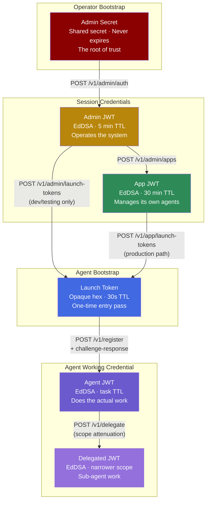
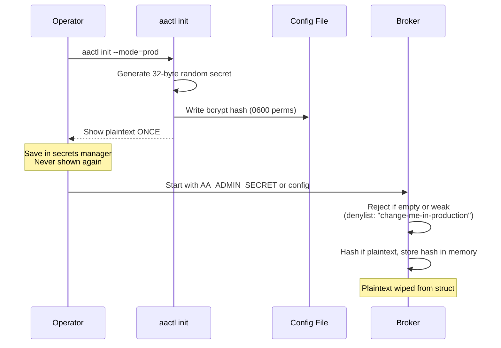
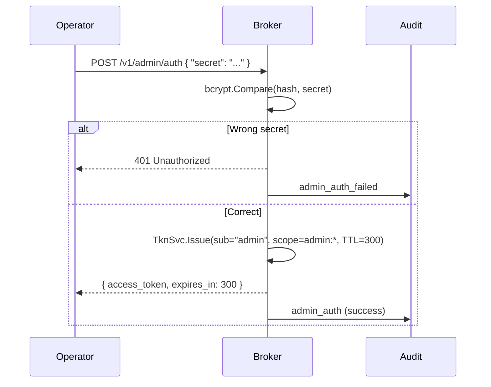
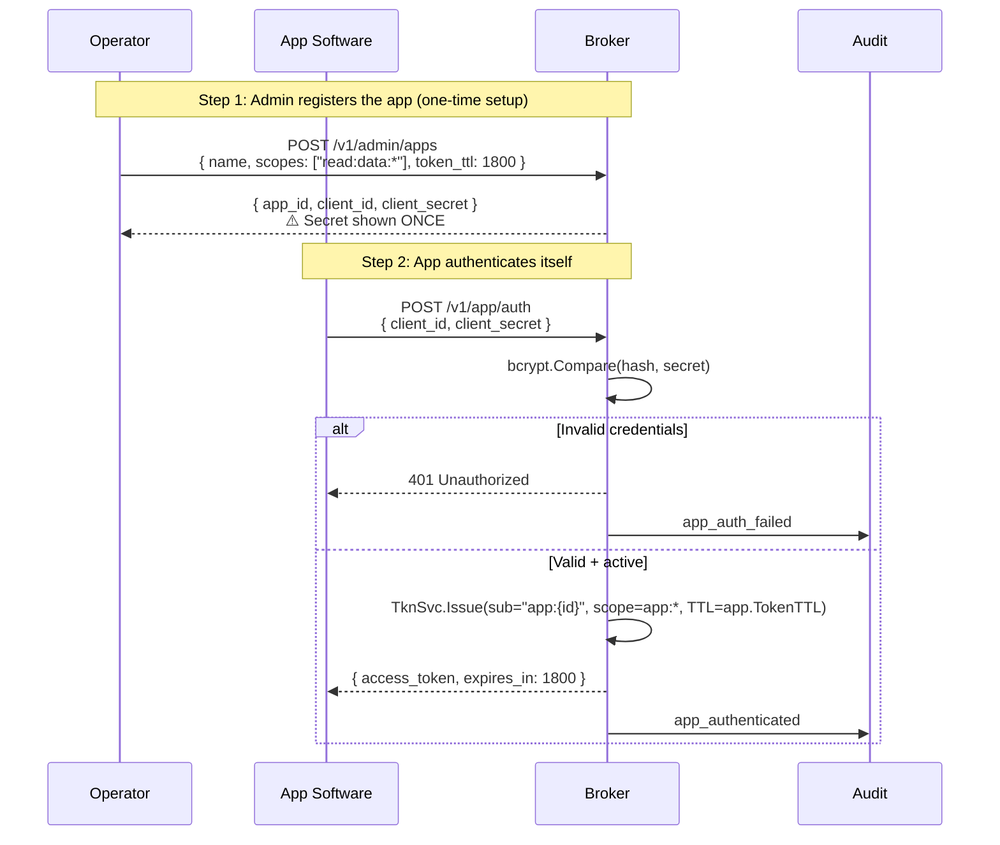
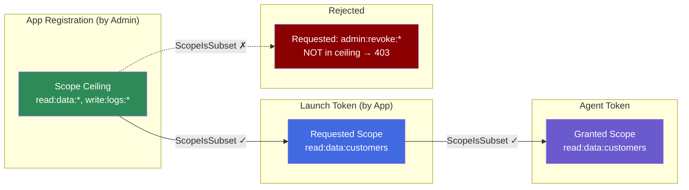
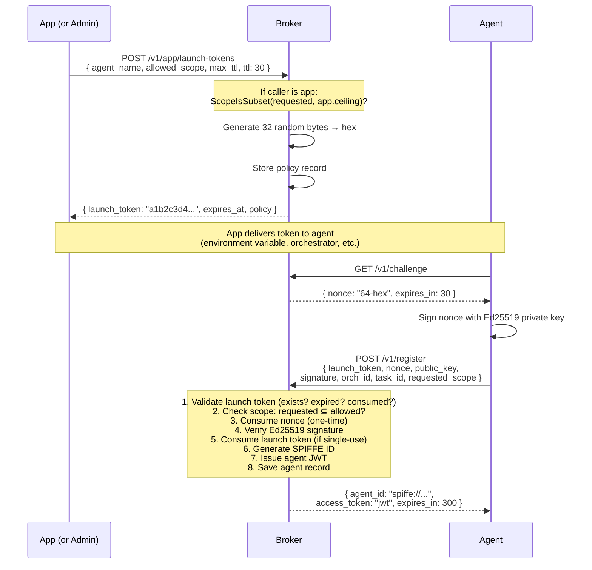
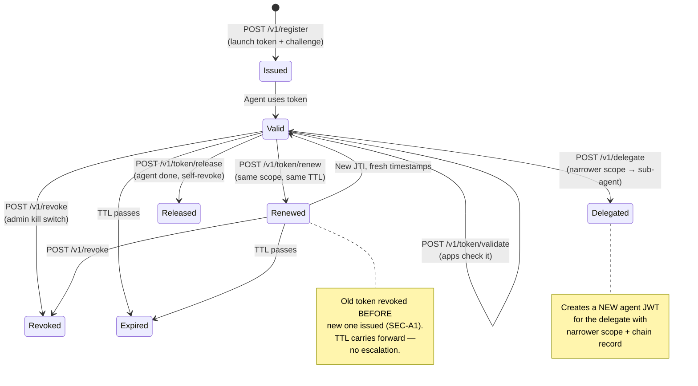
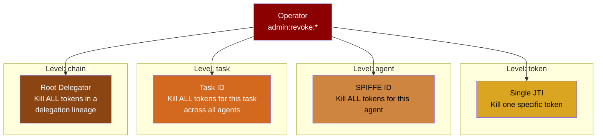
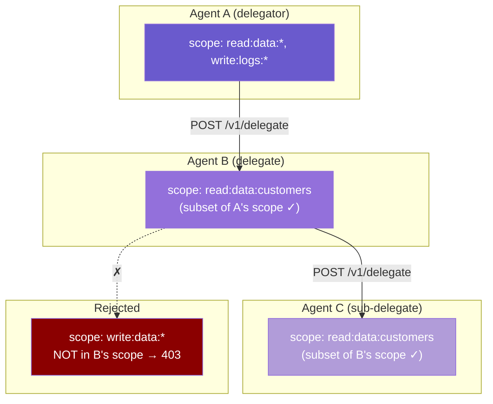
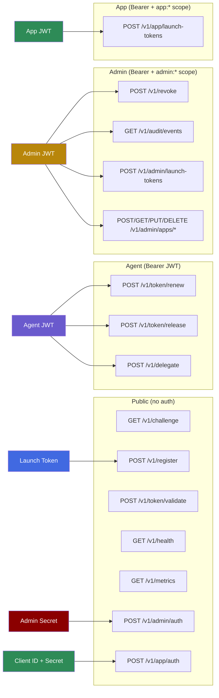

# AgentAuth Token Concept — From First Principles

> This document traces every credential in the system: what it is, why it exists, how it's born, how it's used, and how it dies. Written to understand the design intent, not just the implementation.

## The Problem

An AI agent needs to prove who it is and what it's allowed to do. But agents are ephemeral — they spin up, do a task, and disappear. Traditional credentials (API keys, service accounts) are long-lived and shared. That's the opposite of what we need.

AgentAuth solves this with **six distinct credentials**, each serving a different purpose in the system. They form a chain of trust from operator to agent.

---

## The Six Credentials



---

## Credential 1: Admin Secret

**What it is:** A shared secret (plaintext or bcrypt hash) configured at broker startup via `AA_ADMIN_SECRET` or config file.

**Why it exists:** Someone has to bootstrap the system. The operator — a human or automation — needs a way to prove they're authorized to manage the broker. This is the "secret zero" for the operator.

**Lifecycle:**



**What it can do:** Exactly one thing — exchange itself for an Admin JWT via `POST /v1/admin/auth`.

**How it dies:** It doesn't. It's the permanent root credential. Rotation requires restarting the broker with a new secret.

---

## Credential 2: Admin JWT

**What it is:** An EdDSA-signed JWT with `sub: "admin"` and fixed admin scopes.

**Why it exists:** The admin secret is too powerful to use directly for every operation. The Admin JWT is short-lived (5 minutes), scoped, and auditable. You authenticate once, then use the JWT for all admin operations during that session.

**Claims:**
```json
{
  "iss": "agentauth",
  "sub": "admin",
  "scope": ["admin:launch-tokens:*", "admin:revoke:*", "admin:audit:*"],
  "iat": 1711809900,
  "nbf": 1711809900,
  "exp": 1711810200,
  "jti": "a1b2c3d4e5f6..."
}
```

> TTL is not a JWT claim — it's derived from `exp - iat` (here: 300 seconds). The HTTP response returns `expires_in: 300` as a convenience, but the token itself only has `exp`.

**Lifecycle:**



**What it can do:**

| Scope | Grants access to | Purpose |
|-------|-----------------|---------|
| `admin:launch-tokens:*` | `POST /v1/admin/launch-tokens` | Create launch tokens (dev/testing) |
| `admin:launch-tokens:*` | `POST/GET/PUT/DELETE /v1/admin/apps/*` | Register, list, update, deregister apps |
| `admin:revoke:*` | `POST /v1/revoke` | Kill switch — revoke at 4 levels |
| `admin:audit:*` | `GET /v1/audit/events` | Query the tamper-evident audit trail |

**How it dies:** Expires after 5 minutes (`adminTTL = 300`). Not renewable — authenticate again. Can be revoked by another admin session via `POST /v1/revoke` (level: "token", target: JTI).

> **Design question (TD-013):** `admin:launch-tokens:*` currently grants both app management AND launch token creation. In production, apps should create launch tokens (with scope ceiling enforcement). Admin creating launch tokens bypasses the ceiling — useful for dev/testing, but a potential privilege gap. See TD-013 for fix options.

---

## Credential 3: App JWT

**What it is:** An EdDSA-signed JWT with `sub: "app:{appID}"` and app-specific scopes.

**Why it exists:** Apps are the production path for getting agents credentialed. An app is software — an orchestrator, a CI pipeline, a SaaS backend — that manages its own agents. It authenticates independently with its own credentials (client_id + client_secret), without needing the admin secret.

The critical design property: **the app has a scope ceiling**. When admin registers an app, they define the maximum permissions that app can ever delegate to its agents. The app can create launch tokens within that ceiling, but never exceed it.

**Claims:**
```json
{
  "iss": "agentauth",
  "sub": "app:app-weather-bot-a1b2c3",
  "scope": ["app:launch-tokens:*", "app:agents:*", "app:audit:read"],
  "exp": 1711811800,
  "ttl": 1800
}
```

**Lifecycle:**



**What it can do:**

| Scope | Grants access to | Purpose |
|-------|-----------------|---------|
| `app:launch-tokens:*` | `POST /v1/app/launch-tokens` | Create launch tokens for its agents |
| `app:agents:*` | (future: agent management) | Manage agents under this app |
| `app:audit:read` | (future: scoped audit) | Read audit events for its own agents |

**The scope ceiling constraint:**



**How it dies:** Expires after the per-app TTL (default 1800s / 30 min). Not renewable. If the app is deregistered, its credentials stop working immediately (auth returns 401).

---

## Credential 4: Launch Token

**What it is:** An opaque 64-character hex string. NOT a JWT — no signature, no claims. Just a random secret that maps to a policy record in the store.

**Why it exists:** This solves the "secret zero" problem for agents. The agent needs a credential to get its first credential. The launch token is that bootstrap mechanism — it's pre-authorized with a scope ceiling and max TTL, it's short-lived (default 30 seconds), and it's single-use by default.

**Policy record (stored in broker):**
```json
{
  "token": "a1b2c3d4...64 hex chars",
  "agent_name": "data-reader",
  "allowed_scope": ["read:data:*"],
  "max_ttl": 300,
  "single_use": true,
  "expires_at": "2026-03-30T16:00:30Z",
  "created_by": "app:app-weather-bot-a1b2c3",
  "app_id": "app-weather-bot-a1b2c3"
}
```

**Lifecycle:**



**What it can do:** Exactly one thing — be presented at `POST /v1/register` to get an agent JWT. It cannot be used for any other endpoint.

**How it dies:** Three ways:
1. **Consumed** — single-use token is marked consumed after successful registration
2. **Expired** — TTL passes (default 30 seconds)
3. **Never consumed** — if the agent never registers, it just expires

---

## Credential 5: Agent JWT

**What it is:** An EdDSA-signed JWT with a SPIFFE-format subject, task-specific scopes, and optional delegation chain.

**Why it exists:** This is the actual working credential. It proves the agent's identity, defines what it's allowed to do, and carries the full context of how it was authorized (which app, which task, which orchestrator).

**Claims:**
```json
{
  "iss": "agentauth",
  "sub": "spiffe://agentauth.local/agent/orch-456/task-789/a1b2c3d4",
  "scope": ["read:data:customers"],
  "task_id": "task-789",
  "orch_id": "orch-456",
  "exp": 1711810500,
  "jti": "unique-token-id",
  "delegation_chain": [],
  "chain_hash": ""
}
```

**Lifecycle:**



**What it can do:**

| Action | Endpoint | What happens |
|--------|----------|-------------|
| **Prove identity** | `Authorization: Bearer {token}` on any protected endpoint | ValMw extracts and verifies |
| **Be validated by apps** | `POST /v1/token/validate` | Apps check agent tokens before granting resource access |
| **Renew** | `POST /v1/token/renew` | Fresh timestamps, same scope, same original TTL. Old token revoked first |
| **Release** | `POST /v1/token/release` | Agent self-revokes when task is done. Good hygiene |
| **Delegate** | `POST /v1/delegate` | Create narrower-scope token for another registered agent |

**How it dies:** Four ways:
1. **Expired** — TTL passes (set by launch token's max_ttl, clamped by global MaxTTL)
2. **Released** — agent self-revokes via `POST /v1/token/release`
3. **Revoked by admin** — `POST /v1/revoke` at any of 4 levels
4. **Superseded** — on renewal, the old token is revoked before the new one is issued

---

## The Four Revocation Levels

Admin can kill credentials at four granularity levels via `POST /v1/revoke`:



| Level | Target | Use case |
|-------|--------|----------|
| `token` | JTI string | One compromised token |
| `agent` | SPIFFE ID | Agent gone rogue — kill everything it holds |
| `task` | task_id | Cancel a runaway task across all its agents |
| `chain` | Root delegator agent ID | Compromised delegation — kill the whole tree |

---

## Credential 6: Delegated JWT

**What it is:** An EdDSA-signed JWT issued to a different agent with narrower scope and a delegation chain recording the full provenance.

**Why it exists:** Multi-agent workflows need agents to hand off work to other agents. Agent A might need Agent B to read a specific customer record, but Agent A has `read:data:*`. Delegation lets A create a token for B with only `read:data:customers` — narrower scope, full traceability. The delegation chain in the token proves exactly who authorized what.

**How it differs from an Agent JWT:** Same JWT structure, but it carries a non-empty `delegation_chain` and `chain_hash`. It has its own JTI, its own subject (the delegate's SPIFFE ID), and its own expiry. It's a real, distinct credential — not just a state of the original.

---

## Delegation: Scope Can Only Narrow

When an agent delegates to another agent, the delegated token can only have **equal or narrower** scope. This is enforced by `authz.ScopeIsSubset`.



Each delegation adds a signed record to the chain:
```json
{
  "agent": "spiffe://agentauth.local/agent/orch/task/a1b2c3d4",
  "scope": ["read:data:*", "write:logs:*"],
  "delegated_at": "2026-03-30T16:00:00Z",
  "signature": "ed25519-sig-hex"
}
```

Maximum chain depth: **5 levels**. The complete chain is hashed (SHA-256) into the token's `chain_hash` claim for tamper detection.

---

## The Complete Route Map — Who Uses What



> **Note on validate:** `POST /v1/token/validate` is a public endpoint — no auth required. An external app submits an agent token in the request body to check if it's valid. The agent JWT is what gets validated, not the credential used to call the endpoint.

---

## Summary: The Trust Chain

Every credential in the system traces back to a single root of trust:

```
Admin Secret
  └─→ Admin JWT (5 min, admin:* scopes)
       ├─→ App Registration (one-time, sets scope ceiling)
       │    └─→ App JWT (30 min, app:* scopes)
       │         └─→ Launch Token (30s, single-use, scope ≤ ceiling)
       │              └─→ Agent JWT (task TTL, scope ≤ launch token)
       │                   └─→ Delegated JWT (scope ≤ delegator)
       └─→ Launch Token (dev/testing, NO ceiling — TD-013)
            └─→ Agent JWT (no app traceability)
```

Permissions can only narrow as you move down the chain. At no point can a credential grant more than what created it. That's the core security property.
