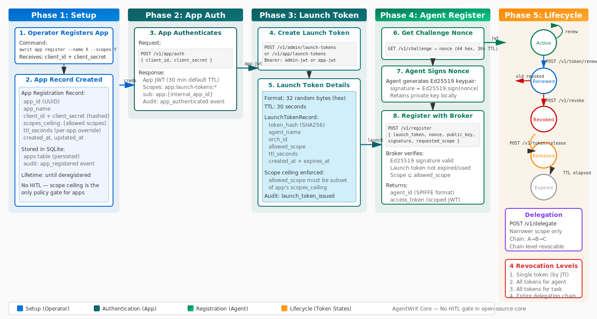

# Token Lifecycle

How an AgentWrit token moves from issuance through renewal, delegation, revocation, release, and expiration.

  

## The five phases

| Phase | What happens | API |
|-------|-------------|-----|
| **Setup** | Operator registers an app with a scope ceiling. App authenticates with client credentials. | `awrit app register`, `POST /v1/app/auth` |
| **Launch Token** | App (or admin) creates a launch token bounded by the scope ceiling. | `POST /v1/app/launch-tokens`, `POST /v1/admin/launch-tokens` |
| **Agent Registration** | Agent gets a challenge nonce, signs it with Ed25519, registers with the launch token. Receives a scoped JWT and SPIFFE identity. | `GET /v1/challenge`, `POST /v1/register` |
| **Lifecycle** | Active token can be renewed (old revoked, new issued), delegated (narrower scope only), released (voluntary teardown), or left to expire on TTL. | `POST /v1/token/renew`, `POST /v1/delegate`, `POST /v1/token/release` |
| **Revocation** | Operator or admin revokes at four levels: single token (JTI), all tokens for an agent, all tokens for a task, or an entire delegation chain. | `POST /v1/revoke` |

## Token states

- **Active** — issued, within TTL, not revoked
- **Renewed** — new token issued, old token immediately revoked
- **Revoked** — explicitly killed via `/v1/revoke` (4 levels)
- **Released** — agent voluntarily surrendered the token via `/v1/token/release`
- **Expired** — TTL elapsed, no longer valid

---

*Back to [Architecture](architecture.md) · [API Reference](api.md)*
