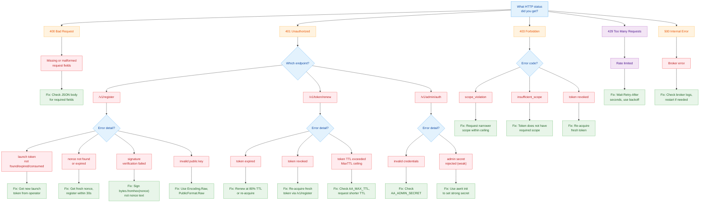

# Troubleshooting

> **Document Version:** 2.0 | **Last Updated:** February 2026 | **Status:** Current
>
> **Audience:** Developers and Operators encountering errors in AgentAuth.
>
> **Prerequisites:** [Getting Started: Developer](getting-started-developer.md) or [Getting Started: Operator](getting-started-operator.md).
>
> **Next steps:** [API Reference](api.md) for endpoint details | [Common Tasks](common-tasks.md) for working examples.
>
> This guide covers exact error messages, their causes, and fixes. Errors are organized by role: [Developer Errors](#developer-errors) and [Operator Errors](#operator-errors).

## Diagnostic Flowchart

Start here. Follow the branch that matches your HTTP status code.



---

## Developer Errors

> **Persona:** Developer integrating an AI agent. You interact with the broker directly through Python/TypeScript or via your orchestration platform's credential service.

### 401 at /v1/register: "nonce signature verification failed"

**Cause:** You signed the nonce as text instead of hex-decoding it to bytes first. The nonce from `GET /v1/challenge` is a 64-character hex string representing 32 bytes. The broker expects a signature over the decoded bytes, not the ASCII text.

**Fix:**

```python
# WRONG -- signs the ASCII hex string (64 bytes of text)
signature = private_key.sign(nonce_hex.encode("utf-8"))

# RIGHT -- signs the decoded 32 bytes
signature = private_key.sign(bytes.fromhex(nonce_hex))
```

**Other causes of this error:**
- You used a different private key than the one corresponding to the `public_key` you submitted.
- The nonce value was modified between obtaining it and submitting it.

---

### 401 at /v1/register: "invalid Ed25519 public key: wrong key size"

**Cause:** The `public_key` field decoded to something other than 32 bytes. This happens when you encode a DER/PEM-format key instead of the raw 32-byte Ed25519 public key.

**Fix:**

```python
from cryptography.hazmat.primitives.serialization import Encoding, PublicFormat

# WRONG -- DER encoding adds ASN.1 headers, producing 44 bytes
pub_der = key.public_key().public_bytes(Encoding.DER, PublicFormat.SubjectPublicKeyInfo)

# RIGHT -- raw encoding produces exactly 32 bytes
pub_raw = key.public_key().public_bytes(Encoding.Raw, PublicFormat.Raw)
pub_b64 = base64.b64encode(pub_raw).decode()
```

---

### 401 at /v1/register: "launch token not found"

**Cause:** The launch token string does not match any token in the broker's store.

**Possible reasons:**
- The launch token has expired. Default launch token TTL is 30 seconds.
- The launch token was already consumed (it is single-use by default).
- The launch token string was copied incorrectly.

**Fix:** Request a new launch token from your operator via the admin API:

```bash
# Operator authenticates
ADMIN_TOKEN=$(curl -s -X POST http://localhost:8080/v1/admin/auth \
  -H "Content-Type: application/json" \
  -d '{"secret":"'"$AA_ADMIN_SECRET"'"}' | jq -r '.access_token')

# Operator creates a launch token for your agent
LAUNCH_TOKEN=$(curl -s -X POST http://localhost:8080/v1/admin/launch-tokens \
  -H "Authorization: Bearer $ADMIN_TOKEN" \
  -H "Content-Type: application/json" \
  -d '{"agent_name":"my-agent","allowed_scope":["read:data:*"],"max_ttl":300,"ttl":30}' | jq -r '.launch_token')

# Agent receives the launch token and uses it to register
```

---

### 401 at /v1/register: "nonce not found or expired"

**Cause:** The nonce has a 30-second TTL. If more than 30 seconds pass between `GET /v1/challenge` and `POST /v1/register`, the nonce expires.

**Fix:** Get a fresh nonce and complete registration immediately:

```python
# Get nonce and register in one sequence -- no delay between them
challenge = requests.get(f"{BROKER}/v1/challenge")
nonce_hex = challenge.json()["nonce"]

nonce_bytes = bytes.fromhex(nonce_hex)
signature = private_key.sign(nonce_bytes)
sig_b64 = base64.b64encode(signature).decode()

reg = requests.post(f"{BROKER}/v1/register", json={
    "launch_token": launch_token,
    "orch_id": "orch-001",
    "task_id": "task-001",
    "public_key": pub_b64,
    "signature": sig_b64,
    "nonce": nonce_hex,
    "requested_scope": ["read:data:*"],
})
```

Each nonce is also single-use. A nonce consumed by one registration attempt cannot be reused.

---

### 403 at /v1/register: "requested scope exceeds allowed scope"

**Cause:** Your `requested_scope` includes permissions not covered by the launch token's `allowed_scope`. Scopes can only narrow (attenuate), never expand.

**Fix:** Request a scope that is a subset of the allowed scope:

```python
# If allowed_scope is ["read:data:*"], these work:
scope = ["read:data:*"]            # exact match
scope = ["read:data:users"]        # narrower identifier

# These FAIL:
scope = ["write:data:*"]           # different action
scope = ["read:orders:*"]          # different resource
scope = ["read:data:*", "admin:*"] # includes unauthorized scope
```

If you need broader permissions, ask your operator to create a launch token with a wider `allowed_scope`.

---

### 403 at /v1/token/renew: "token has been revoked"

**Cause:** Your token has been revoked by an administrator at one of four levels:
- **Token-level:** Your specific token's JTI was revoked.
- **Agent-level:** All tokens for your SPIFFE agent ID were revoked.
- **Task-level:** All tokens for your task were revoked.
- **Chain-level:** The delegation chain root was revoked (if your token was delegated).

**Fix:** You cannot unrevoke a token. Re-acquire a fresh token by re-registering:

```python
# Get a fresh nonce and launch token from your operator
challenge = requests.get(f"{BROKER}/v1/challenge")
nonce_hex = challenge.json()["nonce"]

nonce_bytes = bytes.fromhex(nonce_hex)
signature = private_key.sign(nonce_bytes)
sig_b64 = base64.b64encode(signature).decode()

reg = requests.post(f"{BROKER}/v1/register", json={
    "launch_token": new_launch_token,
    "orch_id": "orch-001",
    "task_id": "task-001",
    "public_key": pub_b64,
    "signature": sig_b64,
    "nonce": nonce_hex,
    "requested_scope": ["read:data:*"],
})
new_token = reg.json()["access_token"]
```

If the task or agent lineage was revoked, get a fresh launch token and choose the appropriate `orch_id` / `task_id` values for the new run.

---

### 403 at any endpoint: "insufficient_scope"

**Cause:** Your token does not include the scope required by the endpoint you are calling.

**Example:** Calling `POST /v1/revoke` with an agent token fails because revocation requires `admin:revoke:*` scope. Agent tokens only have resource scopes like `read:data:*`.

**Fix:** Verify your token's scope matches the endpoint's requirements. You can check your token's scope with the validation endpoint:

```python
resp = requests.post(f"{BROKER}/v1/token/validate", json={"token": your_token})
claims = resp.json().get("claims", {})
print(f"Your scope: {claims.get('scope')}")
```

If you need a different scope, request a new token with the correct scope via registration or delegation.

---

### 401 at /v1/token/renew: "token expired"

**Cause:** The token's `exp` claim has passed. Default token TTL is 300 seconds (5 minutes). The renew endpoint also rejects expired tokens.

**Fix:** Renew earlier. The recommended pattern is to renew at 80% of the TTL:

```python
import time

ttl = 300  # seconds
renewal_time = ttl * 0.8  # renew at 240 seconds

time.sleep(renewal_time)
# Renew here, before the token expires at 300s
```

If the token is already expired, re-acquire a fresh one via registration.

---

## RFC 7807 Error Format

All broker error responses use the [RFC 7807](https://www.rfc-editor.org/rfc/rfc7807) `application/problem+json` content type. This provides a standardized, machine-readable error structure.

### Structure

```json
{
  "type": "urn:agentauth:error:scope_violation",
  "title": "Forbidden",
  "status": 403,
  "detail": "requested scope exceeds allowed scope",
  "instance": "/v1/register",
  "error_code": "scope_violation",
  "request_id": "a1b2c3d4e5f67890",
  "hint": "requested scope must be a subset of allowed scope"
}
```

### Fields

| Field | Type | Always Present | Description |
|-------|------|----------------|-------------|
| `type` | string | Yes | URN identifying the error category: `urn:agentauth:error:{errType}` |
| `title` | string | Yes | HTTP status text (e.g., "Forbidden", "Unauthorized") |
| `status` | int | Yes | HTTP status code |
| `detail` | string | Yes | Human-readable description of what went wrong |
| `instance` | string | Yes | The request path that produced the error |
| `error_code` | string | Sometimes | Machine-readable error code for programmatic handling |
| `request_id` | string | Yes | Correlation ID for log tracing (also in `X-Request-ID` header) |
| `hint` | string | Sometimes | Actionable suggestion for fixing the error |

### Error Codes

| Error Code | HTTP Status | Description |
|-----------|-------------|-------------|
| `invalid_request` | 400 | Malformed JSON, missing required fields |
| `invalid_scope_format` | 400 | Scope not in `action:resource:identifier` format |
| `invalid_ttl` | 400 | TTL negative or exceeds maximum |
| `unauthorized` | 401 | Missing/invalid Bearer token, bad credentials, invalid launch token |
| `scope_violation` | 403 | Requested scope exceeds allowed scope |
| `insufficient_scope` | 403 | Token lacks required scope for this endpoint |
| `not_found` | 404 | Agent or resource not found |
| `rate_limited` | 429 | Rate limit exceeded |
| `internal_error` | 500 | Unexpected server failure |

### Using request_id for Debugging

Every response (success and error) includes a `request_id` in the JSON body and an `X-Request-ID` header. When reporting issues to your operator, include the `request_id` -- it correlates directly to the broker's server-side logs.

```python
resp = requests.post(f"{BROKER}/v1/register", json={...})
if not resp.ok:
    error = resp.json()
    request_id = error.get("request_id", resp.headers.get("X-Request-ID"))
    print(f"Failed: {error.get('detail')}")
    print(f"Request ID for operator: {request_id}")
```

---

## Operator Errors

> **Target persona:** Platform Operator
>
> These entries cover infrastructure and deployment errors that operators encounter when managing the broker.

---

### Broker Exits on Startup: AA_ADMIN_SECRET Not Set

**Symptom:**

```
FATAL: AA_ADMIN_SECRET must be set (non-empty)
```

The broker process exits immediately with exit code 1.

**Cause:** The `AA_ADMIN_SECRET` environment variable is not set or is empty. This is a required configuration value with no default -- the broker refuses to start without it.

**Fix:**

```bash
export AA_ADMIN_SECRET="$(openssl rand -hex 32)"
go run ./cmd/broker
```

For Docker Compose:

```bash
AA_ADMIN_SECRET="your-secret" docker compose up
```

Or add it to a `.env` file alongside your `docker-compose.yml`:

```
AA_ADMIN_SECRET=your-strong-random-secret
```

---


### 401 at /v1/admin/auth: Invalid Credentials or Weak Secret

**Symptom:**

```json
{
  "type": "urn:agentauth:error:unauthorized",
  "status": 401,
  "detail": "invalid credentials"
}
```

Or:

```json
{
  "type": "urn:agentauth:error:unauthorized",
  "status": 401,
  "detail": "admin secret does not meet security requirements"
}
```

**Cause:** Either:
1. The `secret` in the request body does not match the broker's `AA_ADMIN_SECRET` value. The broker uses bcrypt comparison to prevent timing attacks.
2. The admin secret is weak (less than 16 characters or in the denylist in `internal/cfg/cfg.go`).

**Fix:**

1. If the secret is weak, use `awrit init` to generate a strong secret with bcrypt hashing:

```bash
awrit init --mode dev
# or
awrit init --mode prod --config-path /path/to/config.yaml
```

This creates a configuration file with a bcrypt-hashed admin secret. Set `AA_CONFIG_PATH` to point to this file:

```bash
export AA_CONFIG_PATH="/path/to/config"
unset AA_ADMIN_SECRET  # Must be UNSET (not empty) to fall through to config file
go run ./cmd/broker
```

> **Warning:** Do not set `AA_ADMIN_SECRET=""` — an empty string is on the denylist and will cause the broker to exit. Leave the variable **unset** to let the config file provide the secret.

2. If the secret is correct but doesn't match, verify the `AA_ADMIN_SECRET` environment variable is set on the broker:

```bash
# Check if it's set (don't print the actual value)
env | grep AA_ADMIN_SECRET | wc -l
```

3. Ensure the `client_secret` in your curl command matches exactly:

```bash
curl -s -X POST http://localhost:8080/v1/admin/auth \
  -H "Content-Type: application/json" \
  -d "{\"secret\": \"$AA_ADMIN_SECRET\"}"
```

4. If using Docker Compose, check that the `AA_ADMIN_SECRET` in docker-compose.yml or your `.env` file matches what your admin scripts expect.

---

### 429 at /v1/admin/auth: Rate Limited

**Symptom:**

```json
{
  "type": "urn:agentauth:error:rate_limited",
  "status": 429,
  "detail": "rate limit exceeded, try again later"
}
```

Response includes header: `Retry-After: 1`

**Cause:** More than 5 requests per second (burst 10) to `POST /v1/admin/auth` from the same IP address.

**Fix:**

- Wait at least 1 second and retry.
- Cache admin tokens and reuse them within their 300-second TTL. Do not re-authenticate for every operation.
- If you have automated scripts hitting admin auth in a loop, add exponential backoff with jitter:

```bash
# Simple retry with backoff
for i in 1 2 4 8; do
  RESULT=$(curl -s -w "%{http_code}" -o /tmp/auth_resp.json \
    -X POST http://localhost:8080/v1/admin/auth \
    -H "Content-Type: application/json" \
    -d "{\"secret\": \"$AA_ADMIN_SECRET\"}")
  [ "$RESULT" = "200" ] && break
  sleep "$i"
done
```

---

### Broker Token TTL Clamped: "token TTL exceeds MaxTTL ceiling"

**Symptom:**

When registering an agent with a long TTL or requesting token renewal:

```json
{
  "type": "urn:agentauth:error:invalid_ttl",
  "status": 400,
  "detail": "token TTL exceeds MaxTTL ceiling"
}
```

Or token is issued but with a shorter `expires_in` than requested.

**Cause:** The broker is configured with a `AA_MAX_TTL` ceiling (default 86400 seconds = 24 hours). Any token TTL exceeding this ceiling is clamped to the maximum.

**Fix:**

1. **If you want longer-lived tokens, increase the ceiling:**

```bash
export AA_MAX_TTL=604800  # 7 days
go run ./cmd/broker
```

2. **If you want to disable the ceiling entirely:**

```bash
export AA_MAX_TTL=0  # 0 disables the ceiling
go run ./cmd/broker
```

3. **If you want shorter-lived tokens (recommended for security), request a TTL within the ceiling:**

```python
reg = requests.post(f"{BROKER}/v1/register", json={
    ...
    "requested_ttl": 300,  # 5 minutes, well within any ceiling
    ...
})
```

4. **For Docker Compose, add the env var to the broker service:**

```yaml
broker:
  environment:
    - AA_MAX_TTL=604800
```

---

### Broker Config File Issues: awrit init

**Symptom:**

Broker fails to start with one of these errors:

```
FATAL: config file not found at path: /etc/agentauth/config.yaml
```

```
FATAL: failed to read config file: permission denied
```

```
FATAL: admin secret rejected: does not meet security requirements
```

**Cause:** The broker is configured to use a config file via `AA_CONFIG_PATH`, but:
1. The file does not exist at the specified path.
2. The file is unreadable (permission issue).
3. The config file contains a weak admin secret.

**Fix:**

1. **Generate a config file using awrit init:**

```bash
# Development mode (shorter TTLs, simpler config)
awrit init --mode dev

# Production mode (longer TTLs, bcrypt-hashed admin secret, config file)
awrit init --mode prod --config-path /etc/agentauth/config.yaml
```

2. **For development, use environment variables instead of a config file:**

```bash
export AA_ADMIN_SECRET="test-secret-at-least-16-chars"
export AA_DEFAULT_TTL=300
export AA_MAX_TTL=3600
go run ./cmd/broker
```

3. **Ensure the config file is readable by the broker process:**

```bash
ls -la /etc/agentauth/config.yaml
# Should have read permissions for the broker user
```

4. **To use the config file with the broker:**

```bash
export AA_CONFIG_PATH=/etc/agentauth/config.yaml
# Leave AA_ADMIN_SECRET unset or it will override the config file
go run ./cmd/broker
```

5. **Env vars override config file values.** If both `AA_CONFIG_PATH` and individual env vars are set, env vars take precedence.

---

### Broker Restart: All Tokens Invalidated

**Symptom:**

After restarting the broker, all previously issued tokens fail validation:

```json
{
  "type": "urn:agentauth:error:unauthorized",
  "status": 401,
  "detail": "token verification failed: signature verification failed"
}
```

**Cause:** The broker normally persists its Ed25519 signing key at `AA_SIGNING_KEY_PATH` and reloads it on restart. Tokens only start failing after a restart if the key file is missing, the path points to ephemeral storage, or the broker starts with a different key path.

**Fix:**

This is not expected in a stable deployment. After a restart that changes the signing key:

1. **Agents must re-register.** Any agent holding a token from before the key change will get 401 errors and must go through the registration flow again.

2. **Verify `AA_SIGNING_KEY_PATH`.** Make sure it points to persistent storage and that the key file survives restarts.

3. **Preserve the key file.** Do not delete or rotate the signing key unless you intentionally want all existing tokens to become invalid.

4. **Audit events survive restarts** when `AA_DB_PATH` is configured. The broker reloads all audit events from SQLite on startup and rebuilds the in-memory hash chain. Verify with `curl http://localhost:8080/v1/health` — the `audit_events_count` field should reflect previously recorded events.

---

### SQLite Database Issues

**Symptom:** Broker starts but `db_connected` is `false` in the health response, or the broker logs `FAIL | STORE | InitDB` on startup.

**Cause:** The broker cannot create or open the SQLite database file at the path specified by `AA_DB_PATH`.

**Fix:**

1. **Check the directory exists and is writable** by the broker process. In Docker, ensure the volume mount target directory exists inside the container.

2. **Check disk space.** SQLite requires free disk to write audit events.

3. **Check file permissions.** The broker process must have read-write access to both the database file and its parent directory (SQLite creates WAL/journal files alongside the main database).

4. **Fallback:** If SQLite is unavailable, the broker still operates normally with in-memory-only audit events. Set `AA_DB_PATH=""` to explicitly disable persistence.

---

### TLS/mTLS Configuration for Broker

**Symptom:**

Agents fail to connect with TLS errors:

```json
{
  "type": "urn:agentauth:error:unauthorized",
  "status": 401,
  "detail": "TLS certificate verification failed"
}
```

Or:

```
tls: failed to verify certificate: x509: certificate signed by unknown authority
```

**Cause:** TLS certificate configuration is incorrect or certificates are invalid. Common issues:
- Client does not trust the broker's CA certificate
- Broker's certificate CN/SAN does not match the hostname
- Certificate has expired
- Broker is configured for TLS but clients are connecting via HTTP

**Fix:**

1. **Check broker TLS configuration:**

```bash
# Verify AA_TLS_MODE is set correctly
echo "TLS Mode: $AA_TLS_MODE"  # Should be "none", "tls", or "mtls"
```

2. **If using TLS, verify the broker certificate exists:**

```bash
ls -la $AA_TLS_CERT $AA_TLS_KEY
openssl x509 -in $AA_TLS_CERT -text -noout
```

3. **For mTLS, verify client CA is available:**

```bash
ls -la $AA_TLS_CLIENT_CA
openssl x509 -in $AA_TLS_CLIENT_CA -text -noout
```

4. **When connecting as a client, provide the CA certificate:**

```python
import requests

# For TLS
response = requests.get(
    "https://broker:8080/v1/health",
    verify="/path/to/ca.crt"  # Broker's CA certificate
)

# For mTLS
response = requests.get(
    "https://broker:8080/v1/health",
    verify="/path/to/ca.crt",
    cert=("/path/to/client.crt", "/path/to/client.key")
)
```

5. **In Docker Compose, mount certificates into the broker container:**

```yaml
broker:
  environment:
    - AA_TLS_MODE=tls
    - AA_TLS_CERT=/certs/broker.crt
    - AA_TLS_KEY=/certs/broker.key
    - AA_TLS_CLIENT_CA=/certs/ca.crt  # For mTLS
  volumes:
    - /etc/agentauth/certs:/certs:ro
```
