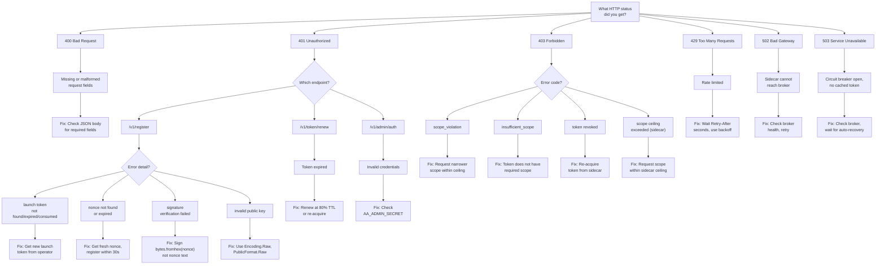

# Troubleshooting

> This guide covers exact error messages, their causes, and fixes.
> Errors are organized by role: [Developer Errors](#developer-errors) and [Operator Errors](#operator-errors).

## Diagnostic Flowchart

Start here. Follow the branch that matches your HTTP status code.



---

## Developer Errors

> **Persona:** Developer integrating an AI agent. You interact with the sidecar or broker through Python/TypeScript.

### 401 at /v1/register: "nonce signature verification failed"

**Cause:** You signed the nonce as text instead of hex-decoding it to bytes first. The nonce from `GET /v1/challenge` is a 64-character hex string representing 32 bytes. The broker expects a signature over the decoded bytes, not the ASCII text.

**Fix:**

```python
# WRONG -- signs the ASCII hex string (64 bytes of text)
signature = private_key.sign(nonce_hex.encode("utf-8"))

# RIGHT -- signs the decoded 32 bytes
signature = private_key.sign(bytes.fromhex(nonce_hex))
```

**Other causes of this error:**
- You used a different private key than the one corresponding to the `public_key` you submitted.
- The nonce value was modified between obtaining it and submitting it.

---

### 401 at /v1/register: "invalid Ed25519 public key: wrong key size"

**Cause:** The `public_key` field decoded to something other than 32 bytes. This happens when you encode a DER/PEM-format key instead of the raw 32-byte Ed25519 public key.

**Fix:**

```python
from cryptography.hazmat.primitives.serialization import Encoding, PublicFormat

# WRONG -- DER encoding adds ASN.1 headers, producing 44 bytes
pub_der = key.public_key().public_bytes(Encoding.DER, PublicFormat.SubjectPublicKeyInfo)

# RIGHT -- raw encoding produces exactly 32 bytes
pub_raw = key.public_key().public_bytes(Encoding.Raw, PublicFormat.Raw)
pub_b64 = base64.b64encode(pub_raw).decode()
```

---

### 401 at /v1/register: "launch token not found"

**Cause:** The launch token string does not match any token in the broker's store.

**Possible reasons:**
- The launch token has expired. Default launch token TTL is 30 seconds.
- The launch token was already consumed (it is single-use by default).
- The launch token string was copied incorrectly.

**Fix:** Request a new launch token from your operator. If you are using the sidecar (recommended), this is handled automatically -- the sidecar creates launch tokens on your behalf.

---

### 401 at /v1/register: "nonce not found or expired"

**Cause:** The nonce has a 30-second TTL. If more than 30 seconds pass between `GET /v1/challenge` and `POST /v1/register`, the nonce expires.

**Fix:** Get a fresh nonce and complete registration immediately:

```python
# Get nonce and register in one sequence -- no delay between them
challenge = requests.get(f"{SIDECAR}/v1/challenge")
nonce_hex = challenge.json()["nonce"]

nonce_bytes = bytes.fromhex(nonce_hex)
signature = private_key.sign(nonce_bytes)
sig_b64 = base64.b64encode(signature).decode()

reg = requests.post(f"{SIDECAR}/v1/register", json={
    "agent_name": "my-agent",
    "task_id": "task-001",
    "public_key": pub_b64,
    "signature": sig_b64,
    "nonce": nonce_hex,
})
```

Each nonce is also single-use. A nonce consumed by one registration attempt cannot be reused.

---

### 403 at /v1/register: "requested scope exceeds allowed scope"

**Cause:** Your `requested_scope` includes permissions not covered by the launch token's `allowed_scope`. Scopes can only narrow (attenuate), never expand.

**Fix:** Request a scope that is a subset of the allowed scope:

```python
# If allowed_scope is ["read:data:*"], these work:
scope = ["read:data:*"]            # exact match
scope = ["read:data:users"]        # narrower identifier

# These FAIL:
scope = ["write:data:*"]           # different action
scope = ["read:orders:*"]          # different resource
scope = ["read:data:*", "admin:*"] # includes unauthorized scope
```

If you need broader permissions, ask your operator to create a launch token with a wider `allowed_scope`.

---

### 403 at /v1/token/renew: "token has been revoked"

**Cause:** Your token has been revoked by an administrator at one of four levels:
- **Token-level:** Your specific token's JTI was revoked.
- **Agent-level:** All tokens for your SPIFFE agent ID were revoked.
- **Task-level:** All tokens for your task were revoked.
- **Chain-level:** The delegation chain root was revoked (if your token was delegated).

**Fix:** You cannot unrevoke a token. Re-acquire a fresh token from the sidecar:

```python
data = requests.post(f"{SIDECAR}/v1/token", json={
    "agent_name": "my-agent",
    "task_id": "task-001",
    "scope": ["read:data:*"],
}).json()
new_token = data["access_token"]
```

If the agent itself was revoked, you may need to re-register (the sidecar handles this automatically for new `agent_name`/`task_id` combinations).

---

### 403 at any endpoint: "insufficient_scope"

**Cause:** Your token does not include the scope required by the endpoint you are calling.

**Example:** Calling `POST /v1/revoke` with an agent token fails because revocation requires `admin:revoke:*` scope. Agent tokens only have resource scopes like `read:data:*`.

**Fix:** Verify your token's scope matches the endpoint's requirements. You can check your token's scope with the validation endpoint:

```python
resp = requests.post(f"{BROKER}/v1/token/validate", json={"token": your_token})
claims = resp.json().get("claims", {})
print(f"Your scope: {claims.get('scope')}")
```

If you need a different scope, request a new token with the correct scope from the sidecar.

---

### 401 at /v1/token/renew: "token expired"

**Cause:** The token's `exp` claim has passed. Default token TTL is 300 seconds (5 minutes). The renew endpoint also rejects expired tokens.

**Fix:** Renew earlier. The recommended pattern is to renew at 80% of the TTL:

```python
import time

ttl = 300  # seconds
renewal_time = ttl * 0.8  # renew at 240 seconds

time.sleep(renewal_time)
# Renew here, before the token expires at 300s
```

If the token is already expired, re-acquire a fresh one from the sidecar via `POST /v1/token`.

---

### 403 at sidecar /v1/token: "requested scope exceeds sidecar ceiling"

**Cause:** The scope you requested exceeds the sidecar's configured `AA_SIDECAR_SCOPE_CEILING`. The sidecar enforces its own scope ceiling before forwarding to the broker.

**Fix:** Request a scope within the sidecar's ceiling. Check what scopes are available:

```python
health = requests.get(f"{SIDECAR}/v1/health").json()
print(f"Scope ceiling: {health['scope_ceiling']}")
```

If you need scopes outside the ceiling, ask your operator to adjust the sidecar's `AA_SIDECAR_SCOPE_CEILING` configuration.

---

## RFC 7807 Error Format

All broker error responses use the [RFC 7807](https://www.rfc-editor.org/rfc/rfc7807) `application/problem+json` content type. This provides a standardized, machine-readable error structure.

### Structure

```json
{
  "type": "urn:agentauth:error:scope_violation",
  "title": "Forbidden",
  "status": 403,
  "detail": "requested scope exceeds allowed scope",
  "instance": "/v1/register",
  "error_code": "scope_violation",
  "request_id": "a1b2c3d4e5f67890",
  "hint": "requested scope must be a subset of allowed scope"
}
```

### Fields

| Field | Type | Always Present | Description |
|-------|------|----------------|-------------|
| `type` | string | Yes | URN identifying the error category: `urn:agentauth:error:{errType}` |
| `title` | string | Yes | HTTP status text (e.g., "Forbidden", "Unauthorized") |
| `status` | int | Yes | HTTP status code |
| `detail` | string | Yes | Human-readable description of what went wrong |
| `instance` | string | Yes | The request path that produced the error |
| `error_code` | string | Sometimes | Machine-readable error code for programmatic handling |
| `request_id` | string | Yes | Correlation ID for log tracing (also in `X-Request-ID` header) |
| `hint` | string | Sometimes | Actionable suggestion for fixing the error |

### Error Codes

| Error Code | HTTP Status | Description |
|-----------|-------------|-------------|
| `invalid_request` | 400 | Malformed JSON, missing required fields |
| `invalid_scope_format` | 400 | Scope not in `action:resource:identifier` format |
| `invalid_ttl` | 400 | TTL negative or exceeds maximum |
| `unauthorized` | 401 | Missing/invalid Bearer token, bad credentials, invalid launch token |
| `scope_violation` | 403 | Requested scope exceeds allowed scope |
| `insufficient_scope` | 403 | Token lacks required scope for this endpoint |
| `not_found` | 404 | Agent or resource not found |
| `rate_limited` | 429 | Rate limit exceeded |
| `internal_error` | 500 | Unexpected server failure |

### Using request_id for Debugging

Every response (success and error) includes a `request_id` in the JSON body and an `X-Request-ID` header. When reporting issues to your operator, include the `request_id` -- it correlates directly to the broker's server-side logs.

```python
resp = requests.post(f"{SIDECAR}/v1/register", json={...})
if not resp.ok:
    error = resp.json()
    request_id = error.get("request_id", resp.headers.get("X-Request-ID"))
    print(f"Failed: {error.get('detail')}")
    print(f"Request ID for operator: {request_id}")
```

### Sidecar Error Format

The sidecar uses a simpler error format (not RFC 7807):

```json
{
  "error": "Forbidden",
  "detail": "requested scope exceeds sidecar ceiling"
}
```

The sidecar does not include `type`, `error_code`, or `hint` fields. The `error` field contains the HTTP status text and `detail` describes the problem.

---

## Operator Errors

> **Target persona:** Platform Operator
>
> These entries cover infrastructure and deployment errors that operators encounter when managing the broker and sidecar.

---

### Broker Exits on Startup: AA_ADMIN_SECRET Not Set

**Symptom:**

```
FATAL: AA_ADMIN_SECRET must be set (non-empty)
```

The broker process exits immediately with exit code 1.

**Cause:** The `AA_ADMIN_SECRET` environment variable is not set or is empty. This is a required configuration value with no default -- the broker refuses to start without it.

**Fix:**

```bash
export AA_ADMIN_SECRET="$(openssl rand -hex 32)"
go run ./cmd/broker
```

For Docker Compose:

```bash
AA_ADMIN_SECRET="your-secret" docker compose up
```

Or add it to a `.env` file alongside your `docker-compose.yml`:

```
AA_ADMIN_SECRET=your-strong-random-secret
```

---

### Sidecar Exits on Startup: Missing Required Env Vars

**Symptom:**

The sidecar logs one of these messages and exits with code 1:

```
[AA:SIDECAR:FAIL] ... | MAIN | AA_ADMIN_SECRET must be set
```

```
[AA:SIDECAR:FAIL] ... | MAIN | AA_SIDECAR_SCOPE_CEILING must be set
```

**Cause:** The sidecar requires both `AA_ADMIN_SECRET` (must match the broker's value) and `AA_SIDECAR_SCOPE_CEILING` (comma-separated scope list). Neither has a default.

**Fix:**

```bash
export AA_ADMIN_SECRET="same-as-broker-secret"
export AA_SIDECAR_SCOPE_CEILING="read:data:*,write:data:*"
go run ./cmd/sidecar
```

For Docker Compose, ensure both are set in the `sidecar` service's `environment` block.

---

### 401 at /v1/admin/auth: Invalid Credentials

**Symptom:**

```json
{
  "type": "urn:agentauth:error:unauthorized",
  "status": 401,
  "detail": "invalid credentials"
}
```

**Cause:** The `client_secret` in the request body does not match the broker's `AA_ADMIN_SECRET` value. The broker uses constant-time comparison to prevent timing attacks.

**Fix:**

1. Verify the `AA_ADMIN_SECRET` environment variable is set on the broker:

```bash
# Check if it's set (don't print the actual value)
env | grep AA_ADMIN_SECRET | wc -l
```

2. Ensure the `client_secret` in your curl command matches exactly:

```bash
curl -s -X POST http://localhost:8080/v1/admin/auth \
  -H "Content-Type: application/json" \
  -d "{\"client_id\": \"admin\", \"client_secret\": \"$AA_ADMIN_SECRET\"}"
```

3. If using Docker Compose, check that the `AA_ADMIN_SECRET` in docker-compose.yml or your `.env` file matches what the sidecar and your admin scripts expect.

---

### 429 at /v1/admin/auth: Rate Limited

**Symptom:**

```json
{
  "type": "urn:agentauth:error:rate_limited",
  "status": 429,
  "detail": "rate limit exceeded, try again later"
}
```

Response includes header: `Retry-After: 1`

**Cause:** More than 5 requests per second (burst 10) to `POST /v1/admin/auth` from the same IP address. The same rate limit applies to `POST /v1/sidecar/activate`.

**Fix:**

- Wait at least 1 second and retry.
- Cache admin tokens and reuse them within their 300-second TTL. Do not re-authenticate for every operation.
- If you have automated scripts hitting admin auth in a loop, add exponential backoff with jitter:

```bash
# Simple retry with backoff
for i in 1 2 4 8; do
  RESULT=$(curl -s -w "%{http_code}" -o /tmp/auth_resp.json \
    -X POST http://localhost:8080/v1/admin/auth \
    -H "Content-Type: application/json" \
    -d "{\"client_id\": \"admin\", \"client_secret\": \"$AA_ADMIN_SECRET\"}")
  [ "$RESULT" = "200" ] && break
  sleep "$i"
done
```

---

### Sidecar Health: broker_connected=false

**Symptom:**

```bash
curl -s http://localhost:8081/v1/health
```

Returns:

```json
{
  "status": "degraded",
  "broker_connected": false,
  "healthy": false
}
```

Or during initial startup:

```json
{
  "status": "bootstrapping",
  "healthy": false
}
```

**Cause:** The sidecar cannot reach the broker. Possible reasons:
- Broker is not running.
- `AA_BROKER_URL` points to the wrong address.
- In Docker, the sidecar should use `http://broker:8080` (the service name), not `http://localhost:8080`.
- Network connectivity issue between containers (wrong Docker network).
- `AA_ADMIN_SECRET` mismatch between broker and sidecar (bootstrap fails at admin auth step).

**Fix:**

1. Check broker health:

```bash
curl http://localhost:8080/v1/health
```

2. If using Docker Compose, verify the sidecar's environment has `AA_BROKER_URL=http://broker:8080`.

3. Verify both services are on the same Docker network:

```bash
docker network inspect agentauth-net
```

4. Check that `AA_ADMIN_SECRET` is identical for both broker and sidecar.

5. The sidecar retries bootstrap with exponential backoff (1 second to 60 second cap). Once the broker becomes reachable, the sidecar will bootstrap automatically.

---

### Circuit Breaker: X-AgentAuth-Cached Header

**Symptom:**

Token responses from the sidecar include the header `X-AgentAuth-Cached: true` and may have a shorter `expires_in` than expected.

Or, if no cached token is available:

```json
{
  "error": "Service Unavailable",
  "detail": "broker unavailable and no cached token"
}
```

**Cause:** The sidecar's circuit breaker has tripped open because the broker failure rate exceeded the threshold (default: 50% of requests failing within a 30-second window, with at least 5 requests). The sidecar serves cached tokens as a failsafe when the circuit is open.

**Circuit breaker states:**
- **Closed** (0): Normal operation, requests pass to broker.
- **Open** (1): Broker requests blocked, cached tokens served.
- **Probing** (2): Single health probe sent to check broker recovery.

**Fix:**

1. Check broker health:

```bash
curl http://localhost:8080/v1/health
```

2. Monitor the circuit breaker state via Prometheus:

```
agentauth_sidecar_circuit_state  # 0=closed, 1=open, 2=probing
agentauth_sidecar_circuit_trips_total  # total trips
agentauth_sidecar_cached_tokens_served_total  # cached tokens served
```

3. The circuit breaker auto-recovers. The sidecar sends health probes to the broker every `AA_SIDECAR_CB_PROBE_INTERVAL` seconds (default 5) when the circuit is open. When a probe succeeds, the circuit transitions to probing, then closes on the next successful request.

4. To tune circuit breaker sensitivity:

| Variable | Default | Effect of increasing |
|----------|---------|---------------------|
| `AA_SIDECAR_CB_WINDOW` | 30s | Longer evaluation window, slower to trip |
| `AA_SIDECAR_CB_THRESHOLD` | 0.5 | Higher failure rate required to trip |
| `AA_SIDECAR_CB_MIN_REQUESTS` | 5 | More requests needed before tripping |
| `AA_SIDECAR_CB_PROBE_INTERVAL` | 5s | Slower recovery probing |

---

### Fresh Keys on Restart: All Tokens Invalidated

**Symptom:**

After restarting the broker, all previously issued tokens fail validation:

```json
{
  "type": "urn:agentauth:error:unauthorized",
  "status": 401,
  "detail": "token verification failed: signature verification failed"
}
```

Sidecars enter bootstrap retry after a broker restart.

**Cause:** The broker generates a fresh Ed25519 signing key pair on every startup. This is by design -- there is no persistent key material. All tokens signed with the old key become invalid immediately.

**Fix:**

This is expected behavior. After a broker restart:

1. **Sidecars recover automatically.** The sidecar detects the broker restart (its own token fails renewal), enters the bootstrap retry loop, and re-activates with new credentials.

2. **Agents must re-register.** Any agent holding a token from before the restart will get 401 errors and must go through the registration flow again (via sidecar or directly).

3. **Plan restarts during low-traffic windows** if possible, to minimize disruption.

4. **In production**, consider running the broker behind a process manager that restarts it automatically but infrequently. Do not restart the broker as part of routine operations.

5. **Audit events survive restarts** when `AA_DB_PATH` is configured. The broker reloads all audit events from SQLite on startup and rebuilds the in-memory hash chain. Verify with `curl http://localhost:8080/v1/health` — the `audit_events_count` field should reflect previously recorded events.

---

### SQLite Database Issues

**Symptom:** Broker starts but `db_connected` is `false` in the health response, or the broker logs `FAIL | STORE | InitDB` on startup.

**Cause:** The broker cannot create or open the SQLite database file at the path specified by `AA_DB_PATH`.

**Fix:**

1. **Check the directory exists and is writable** by the broker process. In Docker, ensure the volume mount target directory exists inside the container.

2. **Check disk space.** SQLite requires free disk to write audit events.

3. **Check file permissions.** The broker process must have read-write access to both the database file and its parent directory (SQLite creates WAL/journal files alongside the main database).

4. **Fallback:** If SQLite is unavailable, the broker still operates normally with in-memory-only audit events. Set `AA_DB_PATH=""` to explicitly disable persistence.
